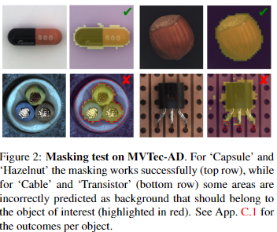
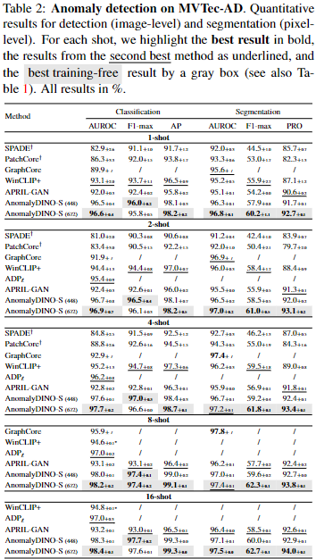
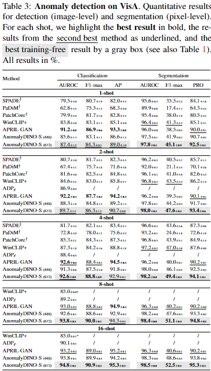
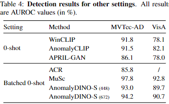

# AnomalyDINO Boosting Patch-based Few-shot Anomaly Detection with DINOv2
[paper](https://arxiv.org/abs/2405.14529)

AnomalyDINO: Boosting Patch-based Few-shot Anomaly Detection with DINOv2

## Abstract

最近のマルチモーダル基盤モデルの進歩は、few-shot異常検出における新たな基準を打ち立てた。  
本稿では、高品質の視覚的特徴だけで、既存の最先端の視覚言語モデルに匹敵するのに十分かどうかを検討する。  
DINOv2をone-shotおよびfew-shotの異常検知に適応させことで、産業アプリケーションに焦点を当て、これを肯定する。  
我々は、本アプローチが既存の手法に匹敵するだけでなく、多くの設定においてそれらを凌駕することさえできることを示す。  
提案する視覚特徴量のみのアプローチであるAnomaly-DINOは、パッチの類似性に基づき、画像レベルの異常予測とピクセルレベルの異常セグメンテーションの両方を可能にする。  
このアプローチは方法論的にシンプルで訓練不要であるため、fine-tuningやメタ学習のための追加データを必要としない。  
AnomalyDINOは、そのシンプルさにもかかわらず、1ショットおよび数ショットの異常検知において最先端の結果を達成している(例えば、MVTec-ADのone-shot検知のパフォーマンスを93.1%のAUROCから96.6%に押し上げた)。  
AnomalyDINOは、オーバーヘッドの削減と、その卓越した数ショットのパフォーマンスにより、産業用コンテキストなどでの迅速な展開のための強力な候補となる。

## 1 Introduction

機械学習における異常検出(AD)は、公称データ分布 $p_{norm}(x)$ から大きく逸脱するインスタンスを識別しようとするものである。  
そのため、異常は「別のメカニズムで発生した」疑いが生じ[15]、  多くの場合、重大であったり、まれであったり、または予期せぬ出来事を示す。  
正常なサンプルと異常を確実に区別する能力は、セキュリティ[38]、ヘルスケア[13, 39]、工業検査など、様々な領域で高い価値を持つ。  
本論文では後者に焦点を当てる。  
完全に自動化されたシステムでは、不良品や部品の欠落を検出して下流製品の誤作動を防いだり、潜在的な危険に対して警告を発したり、あるいはそれらを分析して生産ラインを最適化したりする能力が必要となる。  
この文脈における異常サンプルについては、Figure 1の右側を参照のこと。  

Figure 1: 単一の名目上の参照サンプルに基づくAnomalyDINOによる異常検出（ここではMVTec-ADのカテゴリ「Screw」）。
数少ないパッチ表現を(潜在的に拡張された)参照サンプルから、メモリバンク $\mathcal{M}$ に集める。
テスト時には、(該当する場合は)マスキングによって関連するパッチ表現を選択する。  
$\mathcal{M}$ 中の名目上の表現との距離から、アノマリーマップと、集約統計量 $q$(←アノマリーマップの値の合計とかだと思われる) を用いた対応するアノマリースコア $s(x_{test})$ が得られる。  
マスキングと特徴抽出の両方にDINOv2を利用した。他のカテゴリの例は右図(およびAppendix. AのFigure.4とFigure.5)に示す。

産業用画像のADは、ここ2、3年で大きな関心を集めている。  
ベンチマークデータにおける最適に近い結果は、異常検出の問題が本質的に解決されたかのように思わせる。  
例えば、Mousakhanら[27]は、一般的なベンチマークであるMVTec-AD [2]とVisA [48]において、それぞれ99.8%と98.9%のAUROCを報告している。  
最も一般的なAD技術は、訓練データを使用しｔ異常分類器[36]を訓練するか、再構成ベース[40, 25, 27]、または尤度ベース[34, 9]の異常スコアリングと組み合わせた生成モデルを使用する。  
しかし、これらのアプローチはfull-shotな設定で動作するため、十分な量のトレーニングデータへのアクセスに依存している。  
データセット取得に関連する課題や、高速で展開が容易な手法の魅力、公称データ分布の共変量シフトに迅速に適応する必要性[21]を考慮すると、few-shotやzero-shotの異常検出への関心が高まっている。  
しかし、few-shotのテクニックは、意味のある特徴に大きく依存している。つまり、[32]が言うように、「異常検出にはより良い表現が必要」なのである。  
このようなより良い表現は、教師なし/自己教師ありの方法で膨大なデータセットに対して学習された大規模なモデル、すなわち基盤モデルの利用可能性と能力の向上により、現在利用可能になっている[30, 5, 29]。  
few-shot異常検知技術の性能は、基盤モデルの使用によって、主に言語と視覚を組み込んだマルチモーダルアプローチによって、すでに向上している[18, 4, 47, 20]。  
ここでは、そのようなマルチモーダル技術とは対照的に、視覚のみのアプローチに焦点を当てることを提案する。  
この視点は、few-shot異常検出は、人間の注釈者が視覚的特徴のみに基づいて実行可能であり、与えられたオブジェクトや予想される異常の種類(一般的に先験的に知られていない)の追加のテキスト記述を必要としないという観察によって動機づけられている。  

AnomalyDINOと呼ぶ我々のアプローチは、メモリバンクベースであり、バックボーンとしてDINOv2 [29]を活用している(ただし、パッチレベルの特徴抽出が強力な他のアーキテクチャにも適応可能である)。  
DINOv2のセグメンテーション能力(別のモデルの追加オーバーヘッドを軽減する)を使用して、one-shot シナリオに適した前処理パイプラインを慎重に設計する。  
テスト時には、パッチ表現と公称メモリバンク内の最も近い対応物との間の距離が大きいことに基づいて、異常なサンプルが検出される。  

AnomalyDINOはシンプルであるため、[7]や[20]のような複雑なアプローチとは対照的に、非常に簡単に産業界に導入することができる。  

しかし、提案手法は、MVTec-AD [2]において、few-shot領域での異常検出において最新の性能を達成し、VisA [48]では、1つを除き競合するすべての手法を凌駕している。  

論文の構成は以下の通り：  
Section 2では、関連する先行研究をレビューし、zero-shotとfew-shot、およびバッチ化zero-shot技法が扱う設定の違いを明確にする。  

Section 3では、提案手法であるAnomalyDINOを紹介する。  
この手法のバッチ化zero-shotシナリオへの拡張はAppendix Dで詳述する。

Section 4では実験結果を示す。  
その他の結果とablation studyは、それぞれAppendix AとCに記載されている。  

Appendix Bでは、AnomalyDINOで確認された失敗事例を取り上げる。
実験を再現するコードはhttps://github.com/dammsi/AnomalyDINO にて公開されている。  

**Contributions(貢献)**  

- AnomalyDINOを提案する。AnomalyDINOは、視覚的異常検出のための、シンプルで訓練不要でありながら非常に効果的なパッチベースの手法である。提案手法はDINOv2によって抽出された高品質な特徴表現に基づいている。

- 広範な分析により、提案アプローチの効率性と有効性が実証され、性能と推論速度の点で他のマルチモーダルfew-shot技術を凌駕している。具体的には、AnomalyDINOはMVTec-ADにおけるfew-shotの異常検知において最先端の結果を達成し、例えば、one-shot検知のAUROCを93.1%から96.6%に押し上げた(これにより、few-shotとfull-shot設定間のギャップを半減させた)。さらに、Visaにおけるの結果は、他のfew-shot手法に匹敵するだけでなく、全ての訓練不要few-shot異常検出に対して新たな最先端を確立した。また,全ての手法にを見ても最高のローカライズ性能を達成している。  

## 2 Related Work

**Foundation Models for Vision**  
マルチモーダル基盤モデルは、さまざまなタスクのための強力なツールとして浮上してきた。例えば[3, 22, 6, 16, 30, 24, 28]を参照して欲しい。  
画像に夜ADに最も関連するのは、CLIP [30] や最近のLLM [28] に基づくマルチモーダルアプローチだが、DINO [5, 29] のような視覚特徴のみのアプローチもある。  
CLIP[30]は、テキスト注釈と対になった画像のデータセットで学習することで、自然言語記述から視覚的概念を学習する。  
このモデルは、画像エンコーダとテキストエンコーダからの埋め込みを整列させ、対応する画像とテキストのペア間の類似度を最適化する対照的学習目的を使用する。  
視覚と言語に共通するこの特徴空間は、クラス固有のプロンプト集合との類似性を評価することで、zero-shot画像の分類など、いくつかの下流タスクに利用することができる。  
dino[5,29]は、vision transformers[12]に基づく自己教師型stutend-teacherフレームワークを活用している。  
マルチビュー戦略を採用し、ソフト化(soft-labelingの事だと思う)された教師出力を予測するモデルを学習することで、下流タスクのためのロバストで高品質な特徴を学習する。  
DINOv2[29]はDINOのアイデアとパッチレベルの再構成技術[46]を組み合わせたもので、より大規模なアーキテクチャとデータセットに対応する。  
DINOによって抽出された特徴量は、ローカル情報とグローバル情報の両方を取り込み、複数のビューやクロップに対してロバストであり、大規模な事前学習が有効であるため、異常検出に適している。  
GroundingDINO [24]は、DINOフレームワークを基礎とし、テキスト情報と視覚情報の整合を改善することに重点を置き、詳細なオブジェクトの位置特定とマルチモーダル理解を必要とするタスクにおけるモデルのパフォーマンスを向上させる。  

**Anomaly Detection**  
事前に定義された正規性の概念が与えられた場合、異常検出タスクはこの概念から逸脱したテストサンプルを検出することである [43, 35]。  
つまり、意味的な異常ではなく、工業製品の画像の傷のような低レベルの特徴の検出をターゲットとしている(例えば、Figure. 1参照)。  
いくつかの研究は、異常分類器[36]、あるいは再構成ベースまたは尤度ベースのADを可能にする生成モデル[40, 25, 45, 9, 27]を訓練することによって、このタスクに取り組んでいる。  
一方、本研究はfew-shot ADに商店を当てて居る。これは利用可能な学習サンプル数に強い制約がある中での異常検知に取り組んでいる。
最近の様々な手法では、事前に訓練済みビジョンモデルがfew-shot ADに有効であることが認識されている。  
これらのアプローチの基本的な考え方は、事前に訓練されたResNets [17]、Wide ResNets [44]、Vision Transformers (ViT)[11]に由来する特徴表現を活用することである。  
これらのモデルは、パッチやピクセルレベルでの表現を抽出することができ、トレーニングセットから提供されたパッチやピクセルの特徴を集約したメモリバンクと比較することができる。  
メモリーバンクとの比較は、一般的に最近傍アプローチを用いて行われる[1, 8, 10, 33, 41, 23]。  
大雑把に言えば、アノマリーに対応するパッチやピクセルは、メモリバンク内の最近傍との距離が高いと予想される。  
もう一つの研究は、zero-shot分類における、事前に訓練された言語ビジョンモデルの成果に基づいている。  
基本的な考え方は2つのステップからなる。  
第一に、これらのアプローチは、名目的なサンプルと異常を記述するプロンプトのセットを定義する。  
次に、対応するテキスト埋め込みを画像埋め込み [18, 7, 20, 47] と比較する。  
視覚的埋め込み特徴量が、異常に関連するプロンプトのテキスト埋め込み特徴量に近い画像は、異常として分類される。  
しかし、これらの手法では、プロンプトのエンジニアリング(例えば、[7]では、通常のサンプルを記述するために合計35×7種類のプロンプトを使用している)、またはプロンプト(や、プロンプトの埋め込み)の微調整が必要である。  
最後に、マルチモーダル・チャットボットの成功の上に、もう一つのタイプのfew-shot異常検知を構築する。  
これらの方法は、より精巧なプロンプトと、テキスト出力を解釈するテクニックを必要とする [42]。  
これらの方法はメモリバンクを必要としないため、zero-shot異常検出が可能である。  

**Categorization of Few-/Zero-Shot Anomaly Detectors**  
これまでの研究は、異なるADの設定をを考慮しているため、評価や比較が複雑になっている。  
これを改善するために、特定の「shot」設定、トレーニング要件、および基礎となるモデルがカバーするモードに基づく、最近のfew-shotおよびzero-shot ADの分類法を提供する。  
「shot」の設定を次の3つにカテゴライズする : zero-shot, few-shot, バッチ化zero-shot。
zero-shotとfew-shotの設定は、テストサンプルの予測を行う前に、その手法が処理できる公称学習サンプルの数によって特徴付けられる。  
バッチ化zero-shotでは、推論はサンプル単位ではなく、テストサンプルのバッチ全体(通常はテストセット全体)に基づいて行われる。  
例えば、[23]で提案された方法は、ピクセルの大部分が正常なピクセルに対応するという事実から利益を得ており、これが画像のバッチ全体でパッチをマッチングさせる戦略の動機となっている。  
この設定を考慮した別の研究[21]では、バッチ正規化の効果に基づくパラメータフリーの異常検出器を導入している。  
トレーニングの必要性についえ「トレーニング不要」、「Fine-Tuning」、「メタトレーニング」のカテゴリーに分けた。  

トレーニング不要」アプローチはトレーニングを必要としないが、「Fine-Tuning」手法は、基本モデルを修正するためにアクセス可能な少数のサンプルを使用する。  
それとは対照的に、「メタトレーニング」は、テストデータに関連するデータセットでモデルをトレーニングすることに関連する。  
例えば、[21]は、テストするクラス以外のすべてのクラスを含むMVTec-ADでモデルを訓練する。  
[47]と[7]は、MVTec-ADでテスト性能を評価する際にVisAでモデルを訓練しており、その逆も同様である。  

最後に、視覚モデル(学習済みViTなど)または言語視覚モデル(CLIPなど)である活用モデルを区別する。  
Table 1に詳細をまとめた。  

Table 1: 最近のfew-shotとzero-shotの異常検知手法の分類法。  
$\dagger$ は、フルショット検出器として導入されたが、その後の研究で少数ショット検出器として考慮されたアプローチを示す。(例えば [33] )  

  

## 3 Matching Patch Representations for Visual Anomaly Detection

このセクションでは、DINOv2を活用して意味のあるパッチレベルの特徴を抽出するAnomalyDINOを紹介する。  
利用したバックボーンの強力な特徴抽出能力により、画像データに対して数ショットでトレーニング不要のADを実行するシンプルなパッチベースのマッチング戦略に戻ることができる。  
私たちはまず、名目的なサンプルの関連するパッチ表現をメモリバンク $\mathcal{M}$ に集めます。  
次に、各テストパッチについて、$\mathcal{M}$ の中で最も近い公称パッチまでの距離を計算する。  
パッチベースの距離を適切に集約することで、画像レベルでの異常スコアが得られる。  
PatchCore[33]に触発された我々の手法は、DINOv2をバックボーンとして選択することでメモリバンクフレームワークを簡素化し、これにより、どの表現またはレイヤーを使用し、それらをどのように集約するかを決定することで、特徴量エンジニアリング段系の複雑さを軽減することができる。  
また、改良された集約統計量と、zero-shot masking とオーグメンテーションを組み込んだ新しい前処理パイプラインを導入することで、メモリーバンクの概念を few-shot 学習体制に合わせた。  
提案された方法は、以下のサブセクションで詳しく説明する。  

### 3.1 Anomaly Detection via Patch (Dis-) Similarities

メモリーバンク・アプローチの考え方を簡単におさらいしておこう。  
適切な特徴抽出器 $f: \mathcal{X} \rightarrow \mathcal{F^n}$ を仮定する。  
この $f$ は画像　$x \in \mathcal{X}$ をパッチ特徴量のタプル $f(x) = (p_1, ..., p_n)$ にマッピングする。  
ここで、$\mathcal{X}$ は画像空間を表し、$\mathcal{F}$ は特徴空間を表す。  
$n$ は画像解像度とパッチサイズに依存する。  
$ k \geq 1 $ の名目的な参照サンプル $X_{ref} := \{x^{(i)} | i \in [k]\}$ が与えられた場合、名目的なパッチ特徴を収集し、メモリバンクに格納する( $[k] := {1, \dots , k}$ の省略形 )  

$$
M := \bigcup_{x^{(i)} \in X_{ref}} \{p^{(i)}_j | f(x^{(i)}) = (p^{(i)}_1, ..., p^{(i)}_n), j \in [n]\} . \tag{1}
$$

テストサンプル $x_{test}$ をスコアリングするために、抽出されたパッチ表現 $f(x_{test}) = (p_1,...,p_n)$ を集め、それらがどの程度 $\mathcal{M}$ に適合しているかをチェックする。  
そのために、与えられたテストパッチ $p \in \mathcal{F}$ に対して最も近い参照パッチまでの距離を求める最近傍アプローチを利用する。

$$
d_{NN}(p; \mathcal{M}) := \min_{p_{ref} \in \mathcal{M}} d(p, p_{ref}) \tag{2}
$$

$d$ は何らかの距離の指標である。我々の実験では、$d$ はコサイン距離として設定した。すなわち、

$$
d(x, y) := 1 - \frac{\langle x, y \rangle}{\|x\| \|y\|} . \tag{3}
$$

画像レベルのスコア $s(x_{test})$ は、適切な統計量 $q$ を用いてパッチ距離を集約することで与えられる。

$$
s(x_{test}) := q(\{d_{NN}(p_1; \mathcal{M}), ..., d_{NN}(p_n; \mathcal{M})\}) . \tag{4}
$$

本論文を通して、$q$ は最も異常なパッチの1%の平均距離として定義する。すなわち、$q(D) := mean(H_{0.01}(\mathcal{D}))$ であり、$H_{0.01}(\mathcal{D})$ は $\mathcal{D}$ の中で最も高い1%の値を含む。

この統計量 $q$ は、$99%$ 分位数のリスクの尾部の経験的推定値として理解することができ、広範な設定に適していることがわかる。なぜなら、2つの望ましい特性をバランスよく保つからである:  

まず、$s(x_{test})$ が最も高いパッチ距離に依存するようにしたい。なぜなら、それが最も強い異常信号を提供する可能性があるからである。  
同様に、 (特に $\mathcal{M}$ が疎に配置されているfew-shotシナリオで) 特定の高いパッチ距離に対する一定の程度のロバスト性を望む。  
しかし、特殊なケースに対応するために、$q$ を別の統計量に置き換えることもできる。  
例えば、異常が画像の大部分をカバーすると予想される場合、パッチ距離の高いパーセンタイルが適切な選択となるかもしれない。  
反対に、異常がローカルにのみ発生し、ごくわずかなパッチ/または単一のパッチのみが影響を受ける可能性がある場合、スコア $q$ は最も大きいパッチ距離に対して感度が高くなければならない。
しばしば、最大のピクセル単位の異常スコアが考慮される。このようなピクセルレベルの異常スコアは、通常、完全な画像解像度にアップサンプリングして、いくつかのスムージング操作を適用することで得られる。
[33] にしたがって、パッチ距離をピクセルレベルの異常スコアに変換し、潜在的な欠陥のローカライズを行うために、バイリニアアップサンプリングとガウス平滑化 $(\sigma = 4.0)$ を利用する。

得られた異常マップの例は、Figure 1とAppendix A(Figure 4と5)で視覚化されている。  
我々は、AnomalyDINOをバッチ化zero-shotシナリオにも拡張している。Appendix D (Figure 15)を参照。

### 3.2 Enriching the Memory Bank & Filtering Relevant Patches

few-shot異常検出の設定では、限られた名目サンプルから正規性の概念を効果的に捉えることが主な課題である。  
有効な戦略は、回転などのシンプルなオーグメンテーションを適用することで、名目パッチ特徴の変動性を高めることである。  
テスト時の変動性が、参照データ $X_{ref}$ よりもかなり大きいと予想されるため、これは重要である。  
テスト画像の無関係な領域が誤って高い異常スコアにつながることを避けるために、我々は関心のあるオブジェクトをマスクすることを提案する。  
このアプローチは、Figure 8、Appendix Cに例示されているように、特に限られた参照試料ではバックグラウンドの自然変動を十分に捕捉できない可能性のあるfew-shotの体制において、偽陽性のリスクを軽減する。
適切な前処理技術 - masking や augmentation(場合によっては両方の)適用 - は、関心のあるオブジェクトの特定の特性に依存するべきであることに注意することが重要である。
効果的な前処理パイプラインを設計する際の課題と考慮点についてのより詳細な議論については、Appendix C.1 を参照のこと。

**Masking**  
Masking、つまり画像内の主要な物体をその背景から区別することは、偽陽性予測を減らすのに役立つ。  
提案パイプラインのオーバーヘッドを最小限に抑えるために、マスキングにもDINOv2を利用している。  
これは、PCAの第1主成分を用いてパッチ特徴のマスクを作成することで達成される[29]。  
経験的に、これは時々誤ったマスクを生成することがわかっている。  
近影に対するこのような失敗事例は、興味のあるオブジェクトがパッチの50%以上を占める場合に発生することがよくある。  
この問題に対処するために、PCAベースのマスクが最初の参照サンプルのオブジェクトを正確に捉えているかどうかを確認し、それに応じてマスクを適用する。  
これにより、Figure 2の「masking test」が生まれる。  
このテストは、各オブジェクトに対して1回だけ実行され、非常に一貫した出力を生成するための手順である。

  
Figure 2: **MVTec-AD での masking test**  
'Capsule'と'Hazelnut'(上段)ではマスキングは成功しているが、'Cable'と'Transistor'(下段)では、いくつかの領域で、本来は対象物に属するべきところを、背景として誤って予測された(赤でハイライト)。  
物体毎の結果は、Appendix C.1を参照。  

それに加えて、予測されたマスク内の小さな穴や隙間をなくすために、膨張(dilation)とモルフォロジのクロージング処理(膨張&収縮)を利用する。
Figure 12 と 13 は、このマスキング手順の例を示しており、Table 8 はオブジェクトごとのマスキングテストの結果を示している。  
Figure 8 は、背景ノイズの存在下でのマスキングの利点を視覚化している(全体は Appendix C)。  
一般に、テクスチャ(例えば、MVTec-ADの「Wood」や「Tile」)をマスクしない。  

**Rotation**  

参照サンプルを回転させることで、$\mathcal{M}$ で捉えられた正規性の概念内の変動をよりよく模倣することができ、検出性能が向上する可能性がある。
例えば、Figure 1に描かれているようなようなMVTec-ADの「スクリュー」のような回転不変特徴量が望ましいケースを考えてみる。  
一方で、回転は、興味のあるオブジェクト(またはその一部)の回転が異常と見なされる場合には、有害である可能性がある(例えば、Figure 11を参照)。

2つの異なる設定を考慮する。  
'agnostic'(不可知論的) なケース(認識における回転の影響については認知できないという考え)では、これは本論文の主焦点であるが、常に参照サンプルを回転させる。  
また、サンプルの潜在的な回転について知っている場合('informed')も考える。  
'informed'なケースは、産業／医療環境においてデータ収集プロセスが通常制御可能であり(あるいはテスト画像の位置合わせが可能であり)、推論時間の短縮につながる可能性があるため、賢明である。  
maskingとrotationの効果、および'informed'と'agnostic'の比較については、Appendix C.1を参照。  

## 4 Experiments

**AnomalyDINO – Defaults**  
Using DINOv21 as backbone allows us to choose from different distillation sizes, which range from small (ViT-S, 21×106 parameters) to giant (ViT-G, 1×109 parameters).  
To prioritize low latency, we take the smallest model as our default (and denote our default pipeline AnomalyDINO-S, accordingly) and evaluate two input resolutions, 448 and 672 pixels (smaller edge).  
As discussed above, we utilize the ‘agnostic’ preprocessing by default (see Appendix C).  

**Datasets**  
For the experiments, we consider MVTec-AD2 and VisA,3 two datasets with high-resolution images for industrial anomaly detection.  
MVTec-AD consists of fifteen categories, depicting single objects or textures, and up to eight anomaly types per category.  
VisA has twelve categories and comes with diverse types of anomalies condensed into one anomaly class ‘bad’.  
Some categories in VisA can be considered more challenging as multiple objects and complex structures are present.  

**Evaluation Metrics**  
We assess the image-level detection and the pixel-level segmentation performance with three metrics each, following [18, 7, 23].  
For evaluating the detection performance, we measure the area under the receiver-operator curve (AUROC), the F1-score at the optimal threshold (F1-max), and the average precision (AP) using the respective image-level anomaly scores.  
We quantify the anomaly segmentation performance using the AUROC, F1-max, and the per-region overlap (PRO, [2]) of the segmentation using the pixel-wise anomaly scores.  
Note that due to a high imbalance of nominal and anomalous pixels— for MVTec-AD we have 97.26% nominal pixel, for VisA even 99.45% [23]—it is not recommended to assess performance solely on segmentation AUROC [31].  
We repeat each experiment three times and report mean and standard deviation.  

**Baselines**  
We compare AnomalyDINO with a range of modern zero- and few-shot AD models, e.g., SPADE [8], PaDiM [10], PatchCore [33], WinCLIP+ [18], and APRIL-GAN [7].  
It is important to note that ACR [21] and MuSc [23] consider the batched zero-shot setting (see Ta- ble 1), thus, covering a different setting than Anomaly-DINO.  
We adapt AnomalyDINO to this setting in Appendix D.  
Moreover, APRIL-GAN and AnomalyCLIP, require training on a related dataset, which is in contrast to our proposed training-free method.  
In Tables 2 and 3, results reported by [18] are indicated by †, the result of the WinCLIP re-implementation by [20] (where J. Jeong is also coauthor) by ∗.  
All other results are taken from the original publication. For ADP [20] we report the (usually slightly better) variant ADPℓ (with access to the class label).  
For GraphCore no standard deviations are reported [41].  

### 4.1 Few-Shot Anomaly Detection and Anomaly Segmentation

Results We summarize the results for few-shot anomaly detection on MVTec-AD and VisA in Table 2 and Table 3, respectively.  
Regarding MVTec-AD, our method achieves state-of-the-art k-shot detection performance across all k ∈ 1,2,4,8,16 for every reported metric, outperforming approaches that require additional training data sets (such as ADP and APRIL-GAN).  
The method also demonstrates superior anomaly localization, with results showing that while detection performance remains comparable across different resolutions (448 vs. 672), a higher resolution enhances localization performance.  
Furthermore, we observe clear improvements as the number of samples increases.  
In terms of anomaly detection in the VisA benchmark (Table 3), APRIL-GAN demonstrates the strongest performance for k ∈{1,2}.  
Nonetheless, AnomalyDINO consistently achieves second-best results for k ∈{1,2}, comparable results in the 4-shot setting, and sets new state-of-the-art for k ∈ {8,16}.  
This can be attributed to Anomaly-DINO’s ability to benefit more from a richer memory bank M than APRIL-GAN.  
We hypothesize that meta-learning exerts a greater influence on APRIL-GAN (i.e., training on MVTec-AD, when testing on VisA, and vice-versa) compared to learning from the nominal features of the given reference samples.  
Note also that AnomalyDINO outperforms all other training-free approaches.  

Table 2: **Anomaly detection on MVTec-AD.**  
Quantitative results for detection (image-level) and segmentation (pixel-level).  
For each shot, we highlight the best result in bold, the results from the second best method as underlined, and the best training-free result by a gray box (see also Table 1).  
All results in %.
  

Table 3: Anomaly detection on VisA. Quantitative results for detection (image-level) and segmentation (pixel-level).  
For each shot, we highlight the best result in bold, the results from the second best method as underlined, and the best training-free result by a gray box (see also Table 1).  
All results in %.  
  

Comparing the segmentation performance on VisA, Table 3 reveals a clear picture: AnomalyDINO consistently shows the strongest localization performance in all metrics considered.  
While AnomalyDINO-S (448) already demonstrates strong performance, the advantages of using a higher resolution (672) become more evident on the VisA dataset.  
We attribute this fact to smaller anomalous regions (for which smaller effective patch sizes are beneficial) and more complex scenes (compared to MVTec-AD).  
We have further adapted AnomalyDINO to the batched zero-shot setting (see Appendix D). This adaptation is straightforward and relatively simple, especially compared to MuSc.  
Notably, we did not employ additional techniques such as ‘Re-scoring with Constrained Image-level Neighborhood’ or ‘Local Neighborhood Aggregation with Multiple Degrees’ [23].  
The results obtained, as detailed in Table 4, are therefore quite satisfactory.  

We conclude that AnomalyDINO—despite its simplicity—rivals other methods in all settings and even comes out ahead in most of the settings (e.g., significantly reducing the gap between few-shot and full-shot methods for MVTec-AD).  
Within the class of training-free models, it is the clear winner essentially across the board.
These results do not only demonstrate the virtues of AnomalyDINO itself but, more generally, highlight the merits of strong visual features as compared to highly engineered architectures.  
We provide further qualitative results in Appendix A, and discuss the limitations (such as detecting semantic anomalies) and specific failure cases of our approach in Appendix B.  

Table 4: **Detection results for other settings.** All results are AUROC values (in %).  
  

### 4.2 Ablation Study

We conduct additional experiments to assess the effect of specific design choices in our pipeline.  
The full ablation study is provided in Appendix C, here we briefly summarize the main insights.  
Figure 3 supports the ablation study by highlighting the two key aspects: performance and runtime.  
Inference time Comparing the inference times of AnomalyDINO with the other approaches in the 1-shot setting (see Figure 3), we observe that AnomalyDINO achieves significantly faster inference times than SOTA few-shot competitors (note the logarithmic scale).  
For example, AnomalyDINO-S takes roughly 60ms to process an image at a resolution of 448.  
The only approaches with lower inference time are PatchCore and AnomalyDINO with ViT-backbones trained on ImageNet, which however sacrifice performance. Notably, while augmentations increase the memory bank, and thus, the potential runtime of the nearest neighborhood search, we find that the effect is negligible in practice.5 A more detailed runtime analysis is included in Appendix C, Table 9.  

