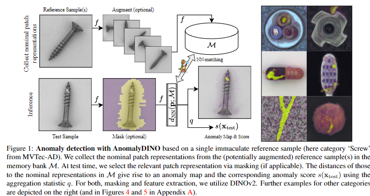
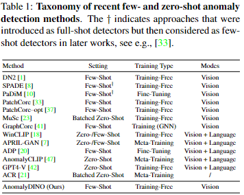

# AnomalyDINO Boosting Patch-based Few-shot Anomaly Detection with DINOv2
[paper](https://arxiv.org/abs/2405.14529)

AnomalyDINO: Boosting Patch-based Few-shot Anomaly Detection with DINOv2

## Abstract

最近のマルチモーダル基盤モデルの進歩は、few-shot異常検出における新たな基準を打ち立てた。  
本稿では、高品質の視覚的特徴だけで、既存の最先端の視覚言語モデルに匹敵するのに十分かどうかを検討する。  
DINOv2をone-shotおよびfew-shotの異常検知に適応させことで、産業アプリケーションに焦点を当て、これを肯定する。  
我々は、本アプローチが既存の手法に匹敵するだけでなく、多くの設定においてそれらを凌駕することさえできることを示す。  
提案する視覚特徴量のみのアプローチであるAnomaly-DINOは、パッチの類似性に基づき、画像レベルの異常予測とピクセルレベルの異常セグメンテーションの両方を可能にする。  
このアプローチは方法論的にシンプルで訓練不要であるため、fine-tuningやメタ学習のための追加データを必要としない。  
AnomalyDINOは、そのシンプルさにもかかわらず、1ショットおよび数ショットの異常検知において最先端の結果を達成している(例えば、MVTec-ADのone-shot検知のパフォーマンスを93.1%のAUROCから96.6%に押し上げた)。  
AnomalyDINOは、オーバーヘッドの削減と、その卓越した数ショットのパフォーマンスにより、産業用コンテキストなどでの迅速な展開のための強力な候補となる。

## 1 Introduction

機械学習における異常検出(AD)は、公称データ分布 $p_{norm}(x)$ から大きく逸脱するインスタンスを識別しようとするものである。  
そのため、異常は「別のメカニズムで発生した」疑いが生じ[15]、  多くの場合、重大であったり、まれであったり、または予期せぬ出来事を示す。  
正常なサンプルと異常を確実に区別する能力は、セキュリティ[38]、ヘルスケア[13, 39]、工業検査など、様々な領域で高い価値を持つ。  
本論文では後者に焦点を当てる。  
完全に自動化されたシステムでは、不良品や部品の欠落を検出して下流製品の誤作動を防いだり、潜在的な危険に対して警告を発したり、あるいはそれらを分析して生産ラインを最適化したりする能力が必要となる。  
この文脈における異常サンプルについては、Figure 1の右側を参照のこと。  

Figure 1: 単一の名目上の参照サンプルに基づくAnomalyDINOによる異常検出（ここではMVTec-ADのカテゴリ「Screw」）。
数少ないパッチ表現を(潜在的に拡張された)参照サンプルから、メモリバンク $\mathcal{M}$ に集める。
テスト時には、(該当する場合は)マスキングによって関連するパッチ表現を選択する。  
$\mathcal{M}$ 中の名目上の表現との距離から、アノマリーマップと、集約統計量 $q$(←アノマリーマップの値の合計とかだと思われる) を用いた対応するアノマリースコア $s(x_{test})$ が得られる。  
マスキングと特徴抽出の両方にDINOv2を利用した。他のカテゴリの例は右図(およびAppendix. AのFigure.4とFigure.5)に示す。

産業用画像のADは、ここ2、3年で大きな関心を集めている。  
ベンチマークデータにおける最適に近い結果は、異常検出の問題が本質的に解決されたかのように思わせる。  
例えば、Mousakhanら[27]は、一般的なベンチマークであるMVTec-AD [2]とVisA [48]において、それぞれ99.8%と98.9%のAUROCを報告している。  
最も一般的なAD技術は、訓練データを使用しｔ異常分類器[36]を訓練するか、再構成ベース[40, 25, 27]、または尤度ベース[34, 9]の異常スコアリングと組み合わせた生成モデルを使用する。  
しかし、これらのアプローチはfull-shotな設定で動作するため、十分な量のトレーニングデータへのアクセスに依存している。  
データセット取得に関連する課題や、高速で展開が容易な手法の魅力、公称データ分布の共変量シフトに迅速に適応する必要性[21]を考慮すると、few-shotやzero-shotの異常検出への関心が高まっている。  
しかし、few-shotのテクニックは、意味のある特徴に大きく依存している。つまり、[32]が言うように、「異常検出にはより良い表現が必要」なのである。  
このようなより良い表現は、教師なし/自己教師ありの方法で膨大なデータセットに対して学習された大規模なモデル、すなわち基盤モデルの利用可能性と能力の向上により、現在利用可能になっている[30, 5, 29]。  
few-shot異常検知技術の性能は、基盤モデルの使用によって、主に言語と視覚を組み込んだマルチモーダルアプローチによって、すでに向上している[18, 4, 47, 20]。  
ここでは、そのようなマルチモーダル技術とは対照的に、視覚のみのアプローチに焦点を当てることを提案する。  
この視点は、few-shot異常検出は、人間の注釈者が視覚的特徴のみに基づいて実行可能であり、与えられたオブジェクトや予想される異常の種類(一般的に先験的に知られていない)の追加のテキスト記述を必要としないという観察によって動機づけられている。  

AnomalyDINOと呼ぶ我々のアプローチは、メモリバンクベースであり、バックボーンとしてDINOv2 [29]を活用している(ただし、パッチレベルの特徴抽出が強力な他のアーキテクチャにも適応可能である)。  
DINOv2のセグメンテーション能力(別のモデルの追加オーバーヘッドを軽減する)を使用して、one-shot シナリオに適した前処理パイプラインを慎重に設計する。  
テスト時には、パッチ表現と公称メモリバンク内の最も近い対応物との間の距離が大きいことに基づいて、異常なサンプルが検出される。  

AnomalyDINOはシンプルであるため、[7]や[20]のような複雑なアプローチとは対照的に、非常に簡単に産業界に導入することができる。  

しかし、提案手法は、MVTec-AD [2]において、few-shot領域での異常検出において最新の性能を達成し、VisA [48]では、1つを除き競合するすべての手法を凌駕している。  

論文の構成は以下の通り：  
Section 2では、関連する先行研究をレビューし、zero-shotとfew-shot、およびバッチ化zero-shot技法が扱う設定の違いを明確にする。  

Section 3では、提案手法であるAnomalyDINOを紹介する。  
この手法のバッチ化zero-shotシナリオへの拡張はAppendix Dで詳述する。

Section 4では実験結果を示す。  
その他の結果とablation studyは、それぞれAppendix AとCに記載されている。  

Appendix Bでは、AnomalyDINOで確認された失敗事例を取り上げる。
実験を再現するコードはhttps://github.com/dammsi/AnomalyDINO にて公開されている。  

**Contributions(貢献)**  

- AnomalyDINOを提案する。AnomalyDINOは、視覚的異常検出のための、シンプルで訓練不要でありながら非常に効果的なパッチベースの手法である。提案手法はDINOv2によって抽出された高品質な特徴表現に基づいている。

- 広範な分析により、提案アプローチの効率性と有効性が実証され、性能と推論速度の点で他のマルチモーダルfew-shot技術を凌駕している。具体的には、AnomalyDINOはMVTec-ADにおけるfew-shotの異常検知において最先端の結果を達成し、例えば、one-shot検知のAUROCを93.1%から96.6%に押し上げた(これにより、few-shotとfull-shot設定間のギャップを半減させた)。さらに、Visaにおけるの結果は、他のfew-shot手法に匹敵するだけでなく、全ての訓練不要few-shot異常検出に対して新たな最先端を確立した。また,全ての手法にを見ても最高のローカライズ性能を達成している。  

## 2 Related Work

**Foundation Models for Vision**  
マルチモーダル基盤モデルは、さまざまなタスクのための強力なツールとして浮上してきた。例えば[3, 22, 6, 16, 30, 24, 28]を参照して欲しい。  
画像に夜ADに最も関連するのは、CLIP [30] や最近のLLM [28] に基づくマルチモーダルアプローチだが、DINO [5, 29] のような視覚特徴のみのアプローチもある。  
CLIP[30]は、テキスト注釈と対になった画像のデータセットで学習することで、自然言語記述から視覚的概念を学習する。  
このモデルは、画像エンコーダとテキストエンコーダからの埋め込みを整列させ、対応する画像とテキストのペア間の類似度を最適化する対照的学習目的を使用する。  
視覚と言語に共通するこの特徴空間は、クラス固有のプロンプト集合との類似性を評価することで、zero-shot画像の分類など、いくつかの下流タスクに利用することができる。  
dino[5,29]は、vision transformers[12]に基づく自己教師型stutend-teacherフレームワークを活用している。  
マルチビュー戦略を採用し、ソフト化(soft-labelingの事だと思う)された教師出力を予測するモデルを学習することで、下流タスクのためのロバストで高品質な特徴を学習する。  
DINOv2[29]はDINOのアイデアとパッチレベルの再構成技術[46]を組み合わせたもので、より大規模なアーキテクチャとデータセットに対応する。  
DINOによって抽出された特徴量は、ローカル情報とグローバル情報の両方を取り込み、複数のビューやクロップに対してロバストであり、大規模な事前学習が有効であるため、異常検出に適している。  
GroundingDINO [24]は、DINOフレームワークを基礎とし、テキスト情報と視覚情報の整合を改善することに重点を置き、詳細なオブジェクトの位置特定とマルチモーダル理解を必要とするタスクにおけるモデルのパフォーマンスを向上させる。  

**Anomaly Detection**  
事前に定義された正規性の概念が与えられた場合、異常検出タスクはこの概念から逸脱したテストサンプルを検出することである [43, 35]。  
つまり、意味的な異常ではなく、工業製品の画像の傷のような低レベルの特徴の検出をターゲットとしている(例えば、Figure. 1参照)。  
いくつかの研究は、異常分類器[36]、あるいは再構成ベースまたは尤度ベースのADを可能にする生成モデル[40, 25, 45, 9, 27]を訓練することによって、このタスクに取り組んでいる。  
一方、本研究はfew-shot ADに商店を当てて居る。これは利用可能な学習サンプル数に強い制約がある中での異常検知に取り組んでいる。
最近の様々な手法では、事前に訓練済みビジョンモデルがfew-shot ADに有効であることが認識されている。  
これらのアプローチの基本的な考え方は、事前に訓練されたResNets [17]、Wide ResNets [44]、Vision Transformers (ViT)[11]に由来する特徴表現を活用することである。  
これらのモデルは、パッチやピクセルレベルでの表現を抽出することができ、トレーニングセットから提供されたパッチやピクセルの特徴を集約したメモリバンクと比較することができる。  
メモリーバンクとの比較は、一般的に最近傍アプローチを用いて行われる[1, 8, 10, 33, 41, 23]。  
大雑把に言えば、アノマリーに対応するパッチやピクセルは、メモリバンク内の最近傍との距離が高いと予想される。  
もう一つの研究は、zero-shot分類における、事前に訓練された言語ビジョンモデルの成果に基づいている。  
基本的な考え方は2つのステップからなる。  
第一に、これらのアプローチは、名目的なサンプルと異常を記述するプロンプトのセットを定義する。  
次に、対応するテキスト埋め込みを画像埋め込み [18, 7, 20, 47] と比較する。  
視覚的埋め込み特徴量が、異常に関連するプロンプトのテキスト埋め込み特徴量に近い画像は、異常として分類される。  
しかし、これらの手法では、プロンプトのエンジニアリング(例えば、[7]では、通常のサンプルを記述するために合計35×7種類のプロンプトを使用している)、またはプロンプト(や、プロンプトの埋め込み)の微調整が必要である。  
最後に、マルチモーダル・チャットボットの成功の上に、もう一つのタイプのfew-shot異常検知を構築する。  
これらの方法は、より精巧なプロンプトと、テキスト出力を解釈するテクニックを必要とする [42]。  
これらの方法はメモリバンクを必要としないため、zero-shot異常検出が可能である。  

**Categorization of Few-/Zero-Shot Anomaly Detectors**  
これまでの研究は、異なるADの設定をを考慮しているため、評価や比較が複雑になっている。  
これを改善するために、特定の「shot」設定、トレーニング要件、および基礎となるモデルがカバーするモードに基づく、最近のfew-shotおよびzero-shot ADの分類法を提供する。  
「shot」の設定を次の3つにカテゴライズする : zero-shot, few-shot, バッチ化zero-shot。
zero-shotとfew-shotの設定は、テストサンプルの予測を行う前に、その手法が処理できる公称学習サンプルの数によって特徴付けられる。  
バッチ化zero-shotでは、推論はサンプル単位ではなく、テストサンプルのバッチ全体(通常はテストセット全体)に基づいて行われる。  
例えば、[23]で提案された方法は、ピクセルの大部分が正常なピクセルに対応するという事実から利益を得ており、これが画像のバッチ全体でパッチをマッチングさせる戦略の動機となっている。  
この設定を考慮した別の研究[21]では、バッチ正規化の効果に基づくパラメータフリーの異常検出器を導入している。  
トレーニングの必要性についえ「トレーニング不要」、「Fine-Tuning」、「メタトレーニング」のカテゴリーに分けた。  

トレーニング不要」アプローチはトレーニングを必要としないが、「Fine-Tuning」手法は、基本モデルを修正するためにアクセス可能な少数のサンプルを使用する。  
それとは対照的に、「メタトレーニング」は、テストデータに関連するデータセットでモデルをトレーニングすることに関連する。  
例えば、[21]は、テストするクラス以外のすべてのクラスを含むMVTec-ADでモデルを訓練する。  
[47]と[7]は、MVTec-ADでテスト性能を評価する際にVisAでモデルを訓練しており、その逆も同様である。  

最後に、視覚モデル(学習済みViTなど)または言語視覚モデル(CLIPなど)である活用モデルを区別する。  
Table 1に詳細をまとめた。  

Table 1: 最近のfew-shotとzero-shotの異常検知手法の分類法。  
$\dagger$ は、フルショット検出器として導入されたが、その後の研究で少数ショット検出器として考慮されたアプローチを示す。(例えば [33] )  

  

## 3 Matching Patch Representations for Visual Anomaly Detection

このセクションでは、DINOv2を活用して意味のあるパッチレベルの特徴を抽出するAnomalyDINOを紹介する。  
利用したバックボーンの強力な特徴抽出能力により、画像データに対して数ショットでトレーニング不要のADを実行するシンプルなパッチベースのマッチング戦略に戻ることができる。  
私たちはまず、名目的なサンプルの関連するパッチ表現をメモリバンク $\mathcal{M}$ に集めます。  
次に、各テストパッチについて、$\mathcal{M}$ の中で最も近い公称パッチまでの距離を計算する。  
パッチベースの距離を適切に集約することで、画像レベルでの異常スコアが得られる。  
PatchCore[33]に触発された我々の手法は、DINOv2をバックボーンとして選択することでメモリバンクフレームワークを簡素化し、これにより、どの表現またはレイヤーを使用し、それらをどのように集約するかを決定することで、特徴量エンジニアリング段系の複雑さを軽減することができる。  
また、改良された集約統計量と、zero-shot masking とオーグメンテーションを組み込んだ新しい前処理パイプラインを導入することで、メモリーバンクの概念を few-shot 学習体制に合わせた。  
提案された方法は、以下のサブセクションで詳しく説明する。  

### 3.1 Anomaly Detection via Patch (Dis-) Similarities

メモリーバンク・アプローチの考え方を簡単におさらいしておこう。  
適切な特徴抽出器 $f: \mathcal{X} \rightarrow \mathcal{F^n}$ を仮定する。  
この $f$ は画像　$x \in \mathcal{X}$ をパッチ特徴量のタプル $f(x) = (p_1, ..., p_n)$ にマッピングする。  
ここで、$\mathcal{X}$ は画像空間を表し、$\mathcal{F}$ は特徴空間を表す。  
$n$ は画像解像度とパッチサイズに依存する。  
$ k \geq 1 $ の名目的な参照サンプル $X_{ref} := \{x^{(i)} | i \in [k]\}$ が与えられた場合、名目的なパッチ特徴を収集し、メモリバンクに格納する( $[k] := {1, \dots , k}$ の省略形 )  

$$
M := \bigcup_{x^{(i)} \in X_{ref}} \{p^{(i)}_j | f(x^{(i)}) = (p^{(i)}_1, ..., p^{(i)}_n), j \in [n]\} . \tag{1}
$$

テストサンプル $x_{test}$ をスコアリングするために、抽出されたパッチ表現 $f(x_{test}) = (p_1,...,p_n)$ を集め、それらがどの程度 $\mathcal{M}$ に適合しているかをチェックする。  
そのために、与えられたテストパッチ $p \in \mathcal{F}$ に対して最も近い参照パッチまでの距離を求める最近傍アプローチを利用する。

$$
d_{NN}(p; \mathcal{M}) := \min_{p_{ref} \in \mathcal{M}} d(p, p_{ref}) \tag{2}
$$

$d$ は何らかの距離の指標である。我々の実験では、$d$ はコサイン距離として設定した。すなわち、

$$
d(x, y) := 1 - \frac{\langle x, y \rangle}{\|x\| \|y\|} . \tag{3}
$$

画像レベルのスコア $s(x_{test})$ は、適切な統計量 $q$ を用いてパッチ距離を集約することで与えられる。

$$
s(x_{test}) := q(\{d_{NN}(p_1; \mathcal{M}), ..., d_{NN}(p_n; \mathcal{M})\}) . \tag{4}
$$

本論文を通して、$q$ は最も異常なパッチの1%の平均距離として定義する。すなわち、$q(D) := mean(H_{0.01}(\mathcal{D}))$ であり、$H_{0.01}(\mathcal{D})$ は $\mathcal{D}$ の中で最も高い1%の値を含む。

この統計量 $q$ は、$99%$ 分位数のリスクの尾部の経験的推定値として理解することができ、広範な設定に適していることがわかる。なぜなら、2つの望ましい特性をバランスよく保つからである:  

まず、$s(x_{test})$ が最も高いパッチ距離に依存するようにしたい。なぜなら、それが最も強い異常信号を提供する可能性があるからである。  
同様に、 (特に $\mathcal{M}$ が疎に配置されているfew-shotシナリオで) 特定の高いパッチ距離に対する一定の程度のロバスト性を望む。  
しかし、特殊なケースに対応するために、$q$ を別の統計量に置き換えることもできる。  
例えば、異常が画像の大部分をカバーすると予想される場合、パッチ距離の高いパーセンタイルが適切な選択となるかもしれない。  
反対に、異常がローカルにのみ発生し、ごくわずかなパッチ/または単一のパッチのみが影響を受ける可能性がある場合、スコア $q$ は最も大きいパッチ距離に対して感度が高くなければならない。
しばしば、最大のピクセル単位の異常スコアが考慮される。このようなピクセルレベルの異常スコアは、通常、完全な画像解像度にアップサンプリングして、いくつかのスムージング操作を適用することで得られる。
[33] にしたがって、パッチ距離をピクセルレベルの異常スコアに変換し、潜在的な欠陥のローカライズを行うために、バイリニアアップサンプリングとガウス平滑化 $(\sigma = 4.0)$ を利用する。

得られた異常マップの例は、Figure 1とAppendix A(Figure 4と5)で視覚化されている。  
我々は、AnomalyDINOをバッチ化zero-shotシナリオにも拡張している。Appendix D (Figure 15)を参照。
