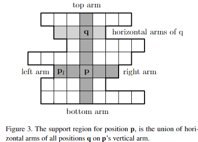

# Computing the Stereo Matching Cost with a Convolutional Neural Network
[paper](https://arxiv.org/abs/1409.4326)
[code](https://github.com/leduoyang/depth_estimation_MCCNN)

## Abstruct
平行化された画像ペアから奥行き情報を抽出する方法を提案する。
畳み込みニューラルネットワークを学習し、2つの画像パッチの一致度を予測し、それを用いてステレオマッチングコストを計算する。
このコストは、交差ベースのコスト集計とセミグローバルマッチングによって精緻化され、その後、左右の整合性チェックが行われ、オクルージョン領域の誤差が除去される。
提案ステレオ手法は、KITTIステレオデータセットにおいて2.61 %のエラー率を達成し、現在(2014年8月)、このデータセットにおいてトップの性能を持つ手法である。

## 1. Introduction
異なる水平位置のカメラから撮影された2つの画像が与えられたとき、左の画像の各画素の視差$d$を計算することを目的とする。 
視差とは、左右の画像における物体の水平方向の位置の差のことで、左の画像の位置 $(x,y)$ にある物体は、右の画像の位置 $(x - d, y)$に見えることになる。
ある物体の視差 $d$ がわかれば、次式を用いて、その物体の奥行き $z$(つまり、物体からカメラまでの距離)を計算することができる:

$$
z=\frac{fB}{d}, \tag{1}
$$

ここで$f$はカメラの焦点距離、$B$はカメラ中心間の距離である。
この問題はステレオ再構成の下位問題であり、1つ以上の画像から3次元形状を抽出することが目的である。
Scharstein and Szeliski [14]の分類法によれば、典型的なステレオアルゴリズムは4つのステップから構成される： 
(1) マッチング・コスト計算 
(2) コスト集約、
(3) 最適化 
(4) 視差の精緻化
Hirschmuller and Scharstein [5]に従い、(1)と(2)のステップをマッチングコスト計算、(3)と(4)のステップをステレオ手法と呼ぶ。
我々は、真の視差が既知である(例えばLIDARによって得られた)小さな画像パッチのペアで畳み込みニューラルネットワーク[9]を訓練することを提案する。
ネットワークの出力は、一対のパッチ間のマッチングコストを初期化するために使用される。
マッチング・コストは、クロス・ベースのコスト集約を用いて、画像輝度が類似する隣接ピクセル間で結合される。
滑らかさの制約はセミグローバルマッチングによって強制され、左右の一貫性チェックはオクルージョン領域のエラーを検出して除去するために用いられる。
サブピクセル強調を行い、メディアンフィルターとバイラテラルフィルターを適用して、最終的な視差マップを得る。
Figure 1は我々の手法の入力と出力を示している。

本稿の貢献は以下の2点である：
- 畳み込みニューラルネットワークを用いてステレオ・マッチング・コストを計算する方法を説明
- KITTIステレオデータセットにおいて、誤差2.61 %を達成し、従来の最高結果2.83 %より改善。

Figure 1. 入力は左右のカメラからの一対の画像である。
2つの入力画像は、主に物体の水平方向の位置が異なる。
カメラに近い物体は、遠い物体よりも視差が大きいことに注意。
出力は、右図に示すdenseなの視差マップである。
暖かい色は、視差の大きな値(深度としては小さな値)を表す。

## 2. Related work
大規模なステレオデータセット[2, 13]が導入される以前は、モデルのパラメータを学習するためにground-truth情報を使用するステレオ・アルゴリズム は比較的少なかった。
ステレオ・アルゴリズムの一般的な概要については[14]を参照。
KongとTao[6]は、距離の二乗和を使用して初期マッチング・コストを計算した。
彼らは、初期視差が正しい、前景オブジェクトが大きくなったため初期視差が正しくない、その他の理由で初期視差が正しくない、という3つのクラスの確率分布を予測するモデルを学習した。
予測された確率は、初期マッチング・コストの調整に用いられた。
KongとTao [7]は後に、異なるサイズと中心を持つウィンドウで正規化相互相関を計算することで得られた予測を組み合わせることで、彼らの研究を拡張している。
Perisら[12]は、AD-Census[11]を用いてマッチング・コストを初期化し、多クラス線形判別分析を用いて、計算されたマッチング・コストから最終的な視差へのマッピングを学習した。
ground truth データはまた、グラフィカル・モデルのパラメータを学習するためにも使用された。
ZhangとSeitz[22]は、マルコフランダム・フィールドのハイパーパラメータの最適値を推定するために、別の最適化アルゴリズムを使用した。
ScharsteinとPal[13]は、30組のステレオ・ペアからなる新しいデータセットを構築し、条件付きランダム・フィールドのパラメータ学習に利用した。
LiとHuttenlocher[10]は、ノンパラメトリックなコスト関数を持つ条件付きランダムフィールドモデルを提示し、構造化サポートベクターマシンを用いてモデルパラメータを学習した。 
最近の研究[3, 15]は、計算されたマッチング・コストの信頼度を推定することに焦点を当てている。
Haeuslerら[3]は、ランダムフォレスト分類器を用いて、複数の信頼度尺度を組み合わせている。
同様に、Spyropoulosら[15]は、マッチング・コストの信頼度を予測するためにランダム・フォレスト分類器を学習し、ステレオ法の誤差を減少させるために、マルコフ・ランダム・フィールドのソフト制約として予測値を使用した。

## 3. Computing the matching cost
典型的なステレオ・アルゴリズムでは、まず、すべての視差 $\mathbf{d}$ について、各位置 $\mathbf{p}$ でのマッチング・コスト $C( \mathbf{p},\mathbf{d})$ を計算する。
簡単な例として、差の絶対値の和がある：

$$
C_{AD}(\mathbf{p}, d) = \sum_{\mathbf{q}\in \mathit{N}_{\mathbf{p}}} | I^L(\mathbf{q}) - I^R(\mathbf{qd})|, \tag{2}
$$

ここで、$I^L(\mathbf{p})$ と $I^R(\mathbf{p})$ は左右の画像の位置 $\mathbf{p}$ における画像の輝度であり、$\mathit{N}_{\mathbf{p}}$ は $\mathbf{p}$ を中心とする固定矩形窓内の位置の集合である。 
太字の小文字 $(\mathbf{p, q, r})$ で実数の組を表す。
小文字の $\mathbf{d}$ の付加は以下の意味を持つ：$\mathbf{p} = (x,y)$ ならば、$\mathbf{pd} = (x - d, y)$ 。
式(2)は、位置 $\mathbf{p}$ を中心とする左画像からのパッチと、位置 $\mathbf{pd}$ を中心とする右画像からのパッチのマッチングに関連するコストを測定すると解釈できる。
良いマッチングと悪いマッチングの例は、KITTI [2]やMiddlebury [14]などの一般に利用可能なデータセットから得られるので、教師あり学習アプローチによってマッチング問題を解くことができる。
視覚問題への畳み込みニューラルネットワークの応用の成功[8]に触発され、我々は2つの小さな画像パッチがどの程度一致するかを評価するために畳み込みニューラルネットワークを用いた。

### 3.1. Creating the dataset
訓練例は2つのパッチから構成される。1つは左の画像から、もう1つは右の画像から：
$$
\left< \mathit{P}^L_{9\times9}(\mathbf{p}), \mathit{P}^R_{9\times9}(\mathbf{q})\right>, \tag{3}
$$

ここで、 $\mathit{P}^L_{9\times9}(\mathbf{p})$ は左画像からの $9\times9$ のパッチを表し、 $\mathbf{p} = (x,y)$ を中心とする。
真の視差 $d$ が既知の各位置について、負と正の例を1つずつ抽出する。
負の例は、右のパッチの中心 $\mathbf{q}$ を次式の様にする

$$
\mathbf{q} = (x - d + o_{neg}, y), \tag{4}
$$

ここで、 $o_{neg}$ はマッチを破壊するオフセットで、集合 ${-N_{hi},\dots,N_{lo},N_{lo},\dots, N_{hi}}$ からランダムに選ばれる。
同様に、正例は次のように設定することで導かれる。

$$
\mathbf{q} = (x - d + o_{pos}, y), \tag{5}
$$

ここで、 $o_{pos}$ は集合 $\{-P_{hi},\dots,P_{hi}\}$ からランダムに選ばれる。
ここで、 $o_{pos}$ を0にせず、 $o_{pos}$ に含める理由は、後で用いるステレオ法と関係がある。
特に、ネットワークが良いマッチングだけでなく近いマッチングにも低いマッチング・コストを割り当てるとき、クロス・ベースのコスト集約がより良く機能することがわかった。
$N_{lo},N_{hi},P_{hi}$ と画像パッチのサイズ $n$ はこの手法のハイパーパラメータである。

### 3.2. Network architecture
使用したアーキテクチャを図2に示す。
ネットワークはL1からL8までの8層で構成されている。
第1層は畳み込み型で、他の全ての層は全結合型である。
ネットワークへの入力は2つの $9 \times9$ のグレースケール画像パッチである。
最初の畳み込み層は、サイズ $5 \times 5 \times 1$ の32個のカーネルで構成される。
層L2とL3はそれぞれ200個のニューロンで完全接続される。
L3 の後、2 つの 200 次元ベクトルは 400 次元ベクトルに連結され、300 個のニューロンを持つ 4 つの全結合層、L4 から L7 を通過する。
最後の層であるL8は、出力を2つの実数に投影し、それをソフトマックス関数に通して、(良い一致と悪い一致の)2クラス分布分布を生成する。
左右の画像パッチのネットワークのL1、L2、L3の重みは同値である。
L8を除く各層にはReLUが続く。
我々のアーキテクチャではプーリングは使っていない。
ネットワークには60万近いパラメータが含まれる。
このアーキテクチャーはグレイ画像に適しているが、L1で $5 \times 5 \times 1$ のフィルタを学習する代わりに $5 \times 5 \times 3$ のフィルタを学習することで、RGB画像を扱うように簡単に拡張できる。
ネットワークの最適なハイパーパラメータ(層数、各層のニューロン数、入力パッチのサイズなど)は、データセットによって異なる。
我々がこのアーキテクチャを選んだのは、KITTIステレオデータセットで良好な結果が得られたからである。

Figure 2. 提案するCNNのアーキテクチャ

## 3.3. Matching cost
マッチングコスト $C_{CNN}( \mathbf{p},d)$ はネットワークの出力から直接計算される：

$$
C_{CNN}(\mathbf{p},d) = f_{neg}(\left< P^L_{9\times9}(\mathbf{p}),P^R_{9\times9}(\mathbf{pd}) \right>), \tag{ 6 }
$$

ここで、$f_{neg}( \left< P^L,P^R \right>)$ は、入力パッチ $P^L$ と $P^R$ に対して実行したときのnetativeクラスのネットワークの出力である。
素直に考えれば、各画像位置 $\mathbf{p}$ と各視差 $d$ に対してフォワードパスを実行しなければならない。
以下の3つの実装により、実行時間を管理可能とした：

1. 層L1、L2、L3の出力は、位置 $\mathbf{p}$ ごとに1回だけ計算すればよく、視差 $d$ ごとに再計算する必要はない。
2. L3 の出力は、$9 \times 9$ の画像パッチではなく、全解像度の画像をネットワークに供給することで、1回のフォワードパスで全ての位置について計算することができる。
そのため、L2層とL3層を畳み込みをもちいて演算する。
L2層は $5 \times 5 \times 32$のフィルタ、L3層は $1\times1\times200$ のフィルタを用い、ともに200個の特徴マップを出力する。
3. 同様に、L4～L8 をサイズ $1 \times 1$ の畳み込みフィルタに置き換えることで、1回のフォワードパスで全ての位置の出力を計算することができる。
残念ながら、各視差に対してフォワードパスを行う必要がある。

## 4. Stereo method
マッチング・コストを有意義に評価するためには、ステレオ手法と組み合わせる必要がある。 
我々が用いたステレオ手法は、Meiら[11]の影響を受けている。

### 4.1. Cross-based cost aggregation
隣接する画素からの情報は、一定のウィンドウ上でマッチングコストを平均化することで結合することができる。
この方法は、ウィンドウ内の深度が一定であるという仮定に反する深度の不連続面付近では失敗する。
我々は、サポートが類似した視差を持つピクセルからのみ収集されるように、各ピクセルの近傍を適応的に選択する方法が好ましいと思っている。
クロスベース・コスト・アグリゲーション[21]では、類似した画像強度値を持つ画素からなる、各位置の周りの局所近傍を構築する。
cross-baseコスト集約は、各位置に直立十字を構築することから始まる。
位置 $\mathbf{p}$ における左腕 $\mathbf{p}_l$ は、以下の2つの条件が成立する限り左に伸びる：

- $|I( \mathbf{p}) - I(\mathbf{p}_l) | < \tau$. 位置 $\mathbf{p}$ と $\mathbf{p}_l$ における画像輝度の差の絶対値は $\tau$ より小さい。 
- $\| \mathbf{p} - \mathbf{p}_l \| < \eta$. $\mathbf{p}$と $\mathbf{p}_l$ の水平距離(上下の腕の場合は垂直距離)が $\eta$ より小さい。 

右腕、下腕、上腕も同様に作る。4本の腕が分かれば、サポート領域 $U(\mathbf{p})$ は、$\mathbf{p}$ の垂直腕上にあるすべての位置 $\mathbf{q}$ の水平腕の和と定義できる(Figure3参照)。

Figure 3. 位置 $\mathbf{p}$ のサポート領域。$\mathbf{q}$ の垂直アーム上にある全ポジション $\mathbf{q}$ の水平アームの統合。

Zhangら[21]は、ステレオペアの両画像のサポート領域を考慮した集計を提案する。
$U^L$ と $U^R$は、左右の画像のサポート領域を表すとする。
我々は決獄したサポート領域 $U_d$ を次の様に定義する:

$$
U_d(\mathbf{p}) = {\mathbf{q}|\mathbf{q} \in U^L(\mathbf{p}), \mathbf{qd} \in U^R(\mathbf{pd})}. \tag{7}
$$

マッチングコストは結合されたサポート領域上で平均を取る:

$$
\begin{align}
C^0_{CBCA}(\mathbf{p},d) &=& C_{CNN}(\mathbf{p},d), \tag{8} \\
C^i_{CBCA}(\mathbf{p},d) &=& \frac{1}{U_d(\mathbf{p})} \sum_{\mathbf{q} \in U_d(\mathbf{p})} C^{i-1}_{CBCA}(\mathbf{q},d), \tag{9}
\end{align}
$$

ここで$i$はイテレーション番号である。
我々は4回の平均処理を繰り返す。すなわち、cross-baseのコスト集計の出力は $C^4_{CBCA}$ である。

### 4.2. Semiglobal matching
我々は、視差画像に滑らかさ制約を課すことで、マッチングコストを精緻化する。
Hirschmuller [4]に従い、視差画像 $D$ に依存するエネルギー関数 $E(D)$ を定義する：

$$
\begin{aligned}
E(D) &= \sum_{\mathbf{p}} \left(C^4_{CBCA}(\mathbf{p}, D(\mathbf{p})) \right. \\
& + \sum_{\mathbf{q} \in \mathit{N}_{\mathbf{p}}} P_1 \times \{ | D(\mathbf{p}) - D(\mathbf{q})| = 1\} \\
& \left. + \sum_{\mathbf{q} \in \mathit{N}_{\mathbf{p}}} P_2 \times \{ | D(\mathbf{p}) - D(\mathbf{q})| > 1\}  \right), \tag{10}
\end{aligned}
$$

$1\{\cdot\}$ は指示関数関数(条件を満たしたら1そうでなければ0を返す)とする。
第1項は、マッチングコストが高い視差 $D(p)$ にペナルティを与える。 
第2項は、近傍画素の視差が1つ異なる場合にペナルティ $P_1$ を加える。 
第3項は、隣接する視差が1より多く異なる場合に、より大きなペナルティ$P_2$ を加える。
$E(D)$を2次元で最小化するのではなく、動的計画法を用いて単一方向で最小化を行う。 
この解決策では、最適化していない方向の視差画像を滑らかにするインセンティブがないため、望ましくないストリーキング効果が発生する。
セミグローバルマッチングでは、多くの方向でエネルギー$E(D)$を最小化し、平均して最終結果を得る。 
Hirschmuller[4]は16方向を選択することを提案しているが、我々は水平2方向と垂直2方向のみを最適化し、対角線方向を追加してもシステムの精度は向上しなかった。 
$E(D)$を方向$mathbf{r}$で最小化するために、マッチングコスト$C_r( \mathbf{p},d)$ を以下の再帰関係で定義する：

$$
\begin{aligned}
C_r(\mathbf{p},d) &= C^4_{CBCA}(\mathbf{p},d) − \min_k C_r(\mathbf{p} − \mathbf{r},k) \\
    &+ \min\left\{ C_r(\mathbf{p} − \mathbf{r}, d), C_r(\mathbf{p} − \mathbf{r}, d - 1) + P_1, \right. \\
    &\left. C_r(\mathbf{p} − \mathbf{r}, d + 1) + P_1, \min_k C_r(\mathbf{p} − \mathbf{r},k) + P_2 \right\}
\end{aligned} \tag{ 11 }
$$

第2項は $C_r(\mathbf{p},d)$ の値が大きくなりすぎるのを防ぐために含まれており、最適視差マップには影響しない。
パラメータ $P_1$ と $P_2$ は、視差のジャンプが画像のエッジと一致するように、画像の勾配に従って設定される。 
$D_1 = |I^L(\mathbf{p}) −I^L(\mathbf{p} − \mathbf{r})|$ そして $D_2 = |I^R(\mathbf{pd}) −I^R(\mathbf{pd −r})|$ とする。
規則に従って $P_1$ と $P_2$ を設定する：

$$
\begin{aligned}
&P_1 = \prod_1, &P_2 = \prod_2 &if D_1 < \tau_{SO}, D_2 < \tau_{SO}, \\
&P_1 = \prod_1/4, &P_2 = \prod_2/4 &if D_1 \ge \tau{SO},D_2 < \tau_{SO},\\
&P_1 = \prod_1/4, &P_2 = \prod_2/4 &if D_1 < \tau_{SO},D_2 \ge \tau_{SO},\\
&P_1 = \prod_1/10, &P_2 = \prod_2/10 &if D_1 \ge \tau_{SO},D_2 \ge\tau_{SO};\\
\end{aligned}
$$

ここで、$|prod_1, \prod_2$, $\tau_{SO}$ はハイパーパラメータである。 
最終的なコスト $C_{SGM}({\mathbf{p},d})$ は4方向全ての平均を取ることで計算される：

$$
C_{SGM}(\mathbf{p},d) = \frac{1}{4} \sum_r C_r(\mathbf{p}, d) \tag{12}
$$

セミグローバルマッチングの後、前節で説明したように、クロスベースのコスト集計を繰り返す。

### 4.3. Computing the disparity image
視差画像 $D$ は winner-take-all 戦略で計算される。すなわち、$C(\mathbf{p}, d)$ を最小化する視差　$d$ を見つける。

$$
D(\mathbf{p}) = \argmin_d C(\mathbf{p}, d). \tag{13}
$$

#### 4.3.1. Interpolation
$D^L$ は左画像を参照画像とした視差マップ、つまり$D^L(\mathbf{p}) = D(\mathbf{p})$を表し、$D^R$は右画像を参照画像とした視差マップを表す。
$D^L$ , $D^R$ ともにオクルージョン領域では誤差を持つ。
左右の一貫性チェックを行うことで、これらのエラーを検出しようとする。 
各位置 $\mathbf{p}$ を以下のようにラベル付けする。

$$
\begin{aligned}
&correct &if |d-D^R(\mathbf{pd})| \le 1,& for d = D^L(\mathbf{p}), \\
&mismatch &if |d-D^R(\mathbf{pd})| \le 1,& for\ any\ other\ d, \\
&occlusion &otherwise
\end{aligned}
$$

オクルージョンとマークされた位置については、新しい視差値を背景から得たい。 
正しいとラベル付けされた位置が見つかるまで左へ移動して補間し、その値を使用する。 
ミスマッチとマークされた位置については、16の異なる方向から最も近い正しいピクセルを見つけ、それらの視差の中央値を用いて補間する。 
補間された視差マップを$D_{INT}$と呼ぶ。

#### 4.3.2. Subpixel enhancement
