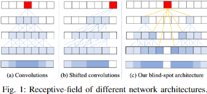
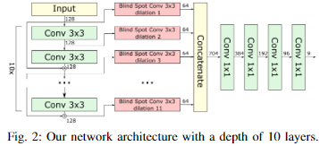
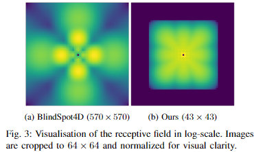
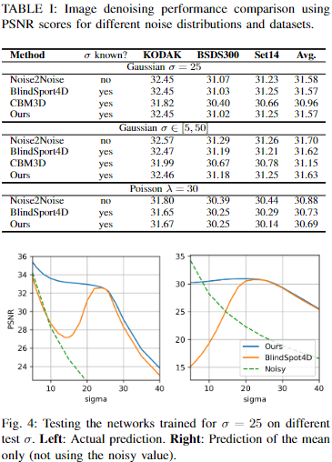
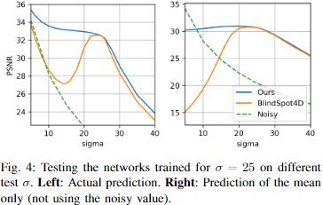

## Efficient Blind-Spot Neural Network Architecture for Image Denoising
[arXiv](https://arxiv.org/abs/2008.11010)
[Github](https://github.com/DawyD/Blind-spot-CNNs)  

## Abstract
画像のノイズ除去は、計算写真において不可欠なツールである。 
ディープニューラルネットワークを核とする標準的なノイズ除去技術では、その学習にクリーン画像とノイズ画像のペアを必要とする。 
クリーンなサンプルがない場合は、ブラインドスポット・ニューラルネットワーク・アーキテクチャを使用することができます。
ブラインドスポット・ニューラルネットワークは、近傍のピクセルのみに基づいてピクセル値を推定します。 
ブラインドスポット・ニューラルネットワークは、ノイズの多い画像に対しても直接学習が可能であり、設計上些細な解を避けることができる。 
現在、ブラインドスポットはシフト畳み込みや直列化を用いて実現されることがほとんどである。
我々は、ブラインドスポットの特性を実現するために、拡張を用いた新しい完全畳み込みネットワークアーキテクチャを提案する。 
我々のネットワークは先行研究よりも性能が向上し、確立されたデータセットにおいて最先端の結果を達成している。

Index Terms — Denoising, Blind-spot network, Prior modelling, Image restoration

## 1. Introduction
画像のノイズ除去は、computational photographyにおける基本的な課題である。 
最近のディープニューラルネットワークの進歩により、再構成の品質が大幅に向上している[1]。 
しかし、これらの結果は、訓練時にノイズのある画像とクリーンな画像のペアが利用可能であることを条件としている。
Lehtinenら[2]は、同じシーンの2つのノイズ画像間のマッピングとして問題を定式化することで、クリーン画像の必要性を取り除いたNoise2Noiseアプローチを提案した。 
ゼロ平均ノイズを仮定すると、ネットワークは、クリーン画像であるピクセルの期待値を出力するように強制される。
Krullら[4]は、無相関ノイズを仮定し、1シーンにつき1つのノイズ画像のみでネットワークを学習できる学習スキームNoise2Voidを作成した。 
これはブラインド・スポット・ネットワークの概念を利用したもので、ネットワークは予測するノイズのあるピクセルを読み取ることができない、つまり受容野に中心ピクセルを含まない。 
こうすることで、モデルは実際のノイズ値とは無関係に画素を予測することを学習する。 
ブラインドスポットの特性は、入力をマスクし、出力ピクセルを注意深く選択することで達成される。 
しかし、損失関数に寄与する画素が大幅に減少するため、学習が非効率的になる。 Laineら[5]は、シフト畳み込み[6]を用いることで、この非効率性を解決した。 
彼らのネットワーク（ここではBlindSpot4Dと呼ぶ）は、受容野が一方向にのみ成長するように特徴マップをシフトする。
ブラインドスポットの特性は、画像の90°回転をすべてネットワークに与え、複数の1x1畳み込み層を使って出力を結合することで達成される。 
限定的な要因としては、構造上、カーネルの回転不変性を仮定しているため、シーンの自然な配置に関して非現実的な事前学習からネットワークを学習させることである。 
さらに、個々のパスの受容野が重複しているため、入力画素が2回処理され、計算量が多くなる。 
我々は、1回のパスで設計上死角特性を保証し、前述の欠点である回転不変性と冗長な計算に取り組む代替ネットワークアーキテクチャを提案する。 
以下では、我々のアーキテクチャを紹介し、最先端の結果を示す。

## 2. BLIND-SPOT ARCHITECTURE
このネットワークの本質的な構成要素は、カーネルにブラインドスポットを持つ拡張畳み込みである。 
この拡張により、Figure 1に示すように、ネットワークのブラインド・スポットの特性を維持したまま、任意の数の先行畳み込み層を接続することができる。 
順方向ストリームは従来の畳み込み層で構成され、学習の安定性を向上させるために2層毎に残差接続を使用する。 
各畳み込み層の結果は、それぞれの入力層の受容野の大きさの半分に1を足した大きさで拡張されたブラインドスポット畳み込み層に送られる。 
最後に、これらの拡張された畳み込みの出力は連結され、結果を予測するためにいくつかの1×1畳み込みに通される。

Fig. 1: 各ネットワークアーキテクチャの受容野の違い

Fig. 2: 10層バージョンの提案アーキテクチャ

異なる拡張を持つブラインドスポット畳み込みにより、ネットワークは各出力ピクセルの近傍に集中し続けることができる。
また、画像の境界に近い画素の受容野の完全性を保証する。 
Figure 3は我々のネットワークの受容野をBlindSpot4Dアーキテクチャと比較したものである。 
これらはディラック関数に対するネットワークの応答で、結果を推測する前にネットワークが各画素に対して行った訪問回数を示している。
BlindSpot4Dの受容野は、中心画素の近傍のカバー率が低く、対角線方向に偏在している。 
逆に、我々のネットワークは中心画素の近傍により集中し、全ての方向を均等にカバーする。 
これは画像のノイズ除去に不可欠な特徴であり、通常、画像のより遠くの領域はあまり関連性がない。

Fig. 3: 対数スケールでの受容野の視覚化. 見やすいように画像は64x64でクロップし正規化している。

## 3. EXPERIMENTS
Laineら[5]によって考案されたフレームワークに従って、いくつかの画像データセットとノイズ分布で我々のアーキテクチャをテストする。 
公正な比較のために、同じ予測スキーム、目的関数、データセットを用いてネットワークを訓練した。 
ネットワークの出力は多変量ガウス分布の平均と共分散行列である。 
最終的な予測値は、ノイズの多い入力値を中心とした出力とノイズ分布の積として推定される。 
Table 1 の結果は、我々のモデルがピーク信号対雑音比（PSNR）の点で最先端の結果を達成していることを示している。 
これらの結果は、すべてのデータセットとノイズ分布で一貫している。
受容野の効果を分析するために、テスト時のノイズ分散のレベルを変えて、両方のブラインドスポットアーキテクチャをテストした。なお、両手法とも標準偏差 $\sigma = 25$ に対してのみ訓練した。
これらの結果をFigure4に示し、我々のモデルをBlindSpot4Dと比較する。 
より良く評価するために、対応するノイズの多い入力値から独立した出力分布の推定平均値も比較する。
これらの結果は、我々の方法が、より低いノイズレベルにおいて、著しく良好な再構成スコア（最大6PSNR）を達成できることを示している。 
これは受容野の形状によって説明でき、より近い画素ほど結果に寄与する。 
より高いノイズ分散の場合、予測はより大きな近傍領域に基づいて行われる必要があるため、この特性はあまり重要ではなくなります。

Table 1: 異なるノイズ分布とデータセットに対するPSNRスコアを用いた画像ノイズ除去性能の比較。

Fig. 4: $\sigma = 25$ でトレーニングしたネットワークを別の $\sigma$ でテストした結果。  
Left: 実際の推定. Right: 平均値飲みの推定 (ノイズの多い値を使用しない).

### 4. CONCLUSIONS
我々は、従来の学習戦略を用いた新しいブラインドスポットネットワークアーキテクチャを提案する。 
最新の手法と比較して、逐次的な推論や方向の独立した処理を必要としない。
異なるノイズ分布の画像ノイズ除去において、最先端の手法と同等の結果を得る。 
我々の手法は、入力ノイズの分散がより現実的な値に近い場合、特にこれらの手法に大きなマージンをもって勝る。