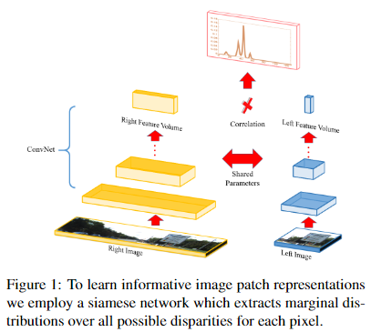
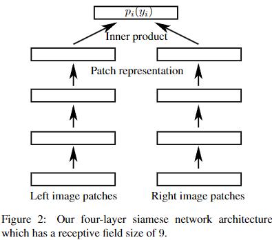

# Efficient deep learning for stereo matching
[paper](https://www.cs.toronto.edu/~urtasun/publications/luo_etal_cvpr16.pdf)
[code1](http://www.cs.toronto.edu/ deepLowLevelVision)
[code2](https://github.com/tonyjo/edlsm_pytorch)

## Abstract
In the past year, convolutional neural networks have been shown to perform extremely well for stereo estimation. 
However, current architectures rely on siamese networks which exploit concatenation followed by further processing layers, requiring a minute of GPU computation per image pair. 
In contrast, in this paper we propose a matching network which is able to produce very accurate results in less than a second of GPU computation. 
Towards this goal, we exploit a product layer which simply computes the inner product between the two representations of a siamese architecture. We train our network by treating the problem as multi-class classification, where the classes are all possible disparities. 
This allows us to get calibrated scores, which result in much better matching performance when compared to existing approaches.

## 1. Introduction
Reconstructing the scene in 3D is key in many applications such as robotics and self-driving cars. 
To ease this process, 3D sensors such as LIDAR are commonly employed. 
Utilizing cameras is an attractive alternative, as it is typically a more cost-effective solution. 
However, despite decades of research, estimating depth from a stereo pair is still an open problem. Dealing with cclusions, large saturated areas and repetitive patterns are some of the remaining challenges.
Many approaches have been developed that try to aggregate information from local matches. 
Cost aggregation, for example, averages disparity estimates in a local neighborhood. 
Similarly, semi-global block matching and Markov random field based methods combine pixelwise predictions and local smoothness into an energy function. 
However all these approaches employ cost functions that are hand crafted, or where only a linear combination of features is learned from data.
In the past few years we have witnessed a revolution in high-level vision, where deep representations are learned directly from pixels to solve many scene understanding tasks with unprecedented performance. 
These approaches currently are the state-of-the-art in tasks such as detection, segmentation and classification.
Very recently, convolutional networks have also been exploited to learn how to match for the task of stereo estimation [31, 29]. 
Current approaches learn the parameters of the matching network by treating the problem as binary classification; Given a patch in the left image, the task is to predict if a patch in the right image is the correct match.
While [30] showed great performance in challenging benchmarks such as KITTI [12], it is computationally very expensive, requiring a minute of computation in the GPU. 
This is due to the fact that they exploited a siamese architecture followed by concatenation and further processing via a few more layers to compute the final score.  
In contrast, in this paper we propose a matching network which is able to produce very accurate results in less than a second of GPU computation. 
Towards this goal, we exploit a product layer which simply computes the inner product between the two representations of a siamese architecture.
We train our network by treating the problem as multi-class classification, where the classes are all possible disparities.  
This allows us to get calibrated scores, which result in much better matching performance when compared to [30]. 
We refer the reader to Fig. 1 for an illustration of our approach.
We demonstrate the effectiveness of our approach on the challenging KITTI benchmark and show competitive results when exploiting smoothing techniques. 
Our code and data can be fond online at: http://www.cs.toronto.edu/deepLowLevelVision.

Figure.1 : To learn informative image patch representations we employ a siamese network which extracts marginal distributions over all possible disparities for each pixel.

## 2. Related Work
Early learning based approaches focused on correcting an initially computed matching cost [17, 18]. 
Learning has been also utilized to tune the hyper-parameters of the energy-minimization task. 
Among the first to train these hyper-parameters were [32, 22, 20], which investigated different forms of probabilistic graphical models.
Slanted plane models model groups of pixels with slanted 3D planes. 
They are very competitive in autonomous driving scenarios, where robustness is key. 
They have a long history, dating back to [2] and were shown to be very successful on the 
Middleburry benchmark [23, 16, 3, 25] as well as on KITTI [26, 27, 28].
Holistic models which solve jointly many tasks have also been explored. 
The advantage being that many tasks in low-level and high level-vision are related, and thus one can benefit from solving them together. 
For example [5, 6, 4, 19, 14] jointly solved for stereo and semantic segmentation. 
Guney and Geiger [13] investigated the utility of high-level vision tasks such as object recognition and semantic segmentation for stereo matching.
Estimating the confidence of each match is key when employing stereo estimates as a part of a pipeline. 
Learning methods were successfully applied to this task, e.g., by combining several confidence measures via a random forest classifier [15], or by incorporating random forest predictions into a Markov random field [24].
Convolutional neural networks(CNN) have been shown to perform very well on high-level vision tasks such as image classification, object detection and semantic segmentation. 
More recently, CNNs have been applied to low-level vision tasks such as optical flow prediction [11]. 
In the context of stereo estimation, [30] utilize CNN to compute the matching cost between two image patches. 
In particular, they used a siamese network which takes the same sized left and right image patches with a few fully-connected layers on top to predict the matching cost. 
They trained the model to minimize a binary cross-entropy loss. 
In similar spirit to [30], [29] investigated different CNN based architectures for comparing image patches. 
They found con-catenating left and right image patches as different channels
works best, at the cost of being very slow.
Our work is most similar to [30, 29] with two main differences. 
First, we propose to learn a probability distribution over all disparity values using a smooth target distribution. 
As a consequence we are able to capture correlations between the different disparities implicitly. 
This contrasts a [30] which performs independent binary predictions on image patches. 
Second, on top of the convolution layers we use a simple dot-product layer to join the two branches of the network. 
This allows us to do a orders of magnitude faster computation. 
We note that in concurrent work unpublished at the time of submission of our paper [31, 8]
also introduced a dot-product layer.

## 3. Deep Learning for Stereo Matching
We are interested in computing a disparity image given a stereo pair. 
Throughout this paper we assume that the image pairs are rectified, thus the epipolar lines are aligned with the horizontal image axis. 
Let yi ∈ Yi represent the disparity associated with the i-th pixel, and let |Yi| be the cardinality of the set (typically 128 or 256). 
Stereo algorithms estimate a 3-dimensional cost volume by computing for each pixel in the left image a score for each possible disparity value. 
This is typically done by exploiting a small patch around the given pixel and a simple hand-crafted representation of each patch. 
In contrast, in this paper we exploit convolutional neural networks to learn how to match.
Towards this goal, we utilize a siamese architecture, where each branch processes the left or right image respectively. 
In particular, each branch takes an image as input, and passes it through a set of layers, each consisting of a spatial convolution with a small filter-size (e.g., $5 \times 5$ or $3 \times 3$), followed by a spatial batch normalization and a rectified linear unit (ReLU). 
Note that we remove the ReLU from the last layer in order to not loose the information encoded in the negative values. In our experiments we exploit different number of filters per layer, either 32 or 64 and share the parameters between the two branches.
In contrast to existing approaches which exploit concatenation followed by further processing, we use a product layer which simply computes the inner product between the two representations to compute the matching score. 
This simple operation speeds up the computation significantly.  
We refer the reader to Fig. 2 which depicts an example of a 4-layer network with filter-size $3 \times 3$, which results in a receptive field of size $9 \times 9$.

Figure 2: Our four-layer siamese network architecture which has a receptive field size of 9.

**Training**: 
We use small left image patches extracted at random from the set of pixels for which ground truth is available to train the network. 
This strategy provides us with a diverse set of examples and is memory efficient. 
In particular, each left image patch is of size equivalent to the size of our network’s receptive field. Let $(x_i, y_i)$ be the image coordinates of the center of the patch extracted at random from the left image, and let $d_{x_i,y_i}$ be the corresponding ground truth disparity. 
We use a larger patch for the right image which expands both the size of the receptive field as well as all possible disparities (i.e., displacements). 
The output of the two branches of the siamese network is hence a single 64-dimensional representation for the left branch, and $|Y_i| \times 64$ for the right branch. 
These two vectors are then passed as input to an inner-product layer which computes a score for each of the $|Y_i|$ disparities. 
This allow us to compute a softmax for each pixel over all possible disparities.
During training we minimize cross-entropy loss with respect to the weights wthat parameterize the network 

$$
\min_{\mathbf{w}} \sum p_{gt}(y_i) \log p_i(y_i, \mathbf{w})
$$

Since we are interested in a 3-pixel error metric we use a smooth target distribution $p_{gt}(y_i)$ , centered around the ground-truth yGTi , i.e., 

$$
p_{gt}(y_i) = \left\{
\begin{aligned}
\lambda_1\ {if}\ y_i = y^{GT}_i \\
\lambda_2\ if |y_i −y^{GT}_i | = 1 \\
\lambda_3\ if |y_i −y^{GT}_i | = 2 \\
0\ otherwise
\end{aligned}
\right.
$$

For this paper we set $\lambda_1 = 0.5, \lambda_2 = 0.2, \lambda_3 = 0.05$.
Note that this contrasts cross entropy for classification, where $p_{gt}(y_i)$ is a delta function placing all its mass on the annotated groundtruth configuration.
We train our network using stochastic gradient descent back propagation with AdaGrad [9]. 
Similar to moment-based stochastic gradient descent, AdaGrad adapts the gradient based on historical information. 
Contrasting moment based methods it emphasizes rare but informative features.
We adapt the learning rates every few thousand iterations as detailed in the experimental section.
**Testing** : Contrasting the training procedure where we compose a mini-batch by randomly sampling locations from different training images, we can improve the speed performance during testing. 
Our siamese network computes a 64-dimensional feature representation for every pixel $i$.
To efficiently obtain the cost volume, we compute the 64-dimensional representation only once for every pixel $i$, and during computation of the cost volume we re-use its values for all disparities that involve this location.

## 4. Smoothing Deep Net Outputs
Given the unaries obtained with a CNN, we compute predictions for all disparities at each image location. 
Note that simply outputting the most likely configuration for every pixel is not competitive with modern stereo algorithms, which exploit different forms of cost aggregation, post processing and smoothing. 
This is particularly important to deal with complex regions with occlusions, saturation or repetitive patterns.
Over the past decade many different MRFs have been proposed to solve the stereo estimation problem. 
Most approaches define each random variable to be the disparity of a pixel, and encode smoothness between consecutive or nearby pixels. 
An alternative approach is to segment the image into regions and estimate a slanted 3D plane for each region. 
In this paper we investigate the effect of different smoothing techniques. 
Towards this goal, we formulate stereo matching as inference in several different Markov random fields (MRFs), with the goal of smoothing the matching results produced by our convolutional neural network. 
In particular, we look into cost aggregation, semi-global block matching as well as the slanted plane approach of [28] as means of smoothing. 
In the following we briefly review these techniques.

**Cost aggregation** : We exploited a very simple cost aggregation approach, which simply performs average pooling over a window of size $5 \times 5$.

**Semi global block matching**: Semi-global block matching augments the unary energy term obtained from convolutional neural nets by introducing additional pairwise potentials which encourage smooth disparities. Specifically,

$$
E(y) = \sum_{i=1}^N E_i(y_i) + \sum_{(i, j) \in \epsilon} E_{i, j}(y_i, y_j).
$$

where $\epsilon$ refers to 4-connected grid and the unary energy $E_i(y_i)$ is the output of the neural net.
We define the pairwise energy as

$$
E_{i,j}(y_i, y_j) = \left\{
\begin{aligned}
0\ \ if\ y_i = y_j \\
c_1\ \ if\ |y_i - y_j| = 1 \\
c_2\ \ otherwise
\end{aligned}\right.
$$

with variable constants $c_1 < c_2$. 
We follow the approach of [30], where c1 and c2 is decreased if there is strong evidence for edges at the corresponding locations in either the left or the right image. 
We refer the reader to their paper for more details.

**Slanted plane**: To construct a depth-map, this approach performs block-coordinate descent on an energy involving appearance, location, disparity, smoothness and boundary energies. 
More specifically, we first over-segment the image using an extension of the SLIC energy [1]. 
For each super-pixel we then compute slanted plane estimates [28] which should adhere to the depth-map evidence obtained from the convolutional neural network. 
We then iterate these two steps to minimize an energy function which takes into account appearance, location, disparity, smoothness and boundary energies. We refer the interested reader to [28] for details.
**Sophisticated post-processing**: In [31] a three-step postprocessing is designed to perform interpolation, subpixel enhancement and a refinement. 
The interpolation step resolves conflicts between the disparity maps computed for the left and right images by performing a left-right consistency check. 
Subpixel enhancement fits a quadratic function to neighboring points to obtain an enhanced depth-map. 
To smooth the disparity map without blurring edges, the final refinement step applies a median filter and a bilateral filter.
We only use the interpolation step as we found the other two don’t always further improve performance in our case.

### 5.1. KITTI 2012 Results
The KITTI 2012 dataset contains 194 training and 195 test images. 
To compare the different network architectures described below, we use as training set 160 image pairs randomly selected, and the remaining 34 image pairs as our validation set.
Comparison of Matching Networks: We first show our network’s matching ability and compare it to existing matching networks [30, 31]. 
In this experiment we do not employ smoothing or post processing, but just utilize the raw output of the network. Following KITTI, we employ the percentage of pixels with disparity errors larger than a fixed threshold as well as end-point error as metrics. 
We refer to our architecture as ‘Ours(19).’ 
It consists of 9 layers of 3 ×3 convolutions resulting in a receptive field size of 19 ×19 pixels. 
As shown in Table 1, our 9-layer network achieves a 3-pixel non-occluded stereo error of 8.61% after only 0.14 seconds of computation. 
In contrast, [30] obtains 12.99% after a significantly longer time of 20.13 seconds.