# Exploring Simple Siamese Representation Learning
[paper](https://arxiv.org/abs/2011.10566)
[code](https://github.com/facebookresearch/simsiam)

## Abstract
siamese networkは、教師なし視覚表現学習のための最近の様々なモデルにおいて一般的な構造となっている。
これらのモデルは、解の崩壊を回避するためのある条件に従って、1つの画像の2つの拡張間の類似度を最大化する。
本論文では、単純なsiamese networkが、以下のいずれを用いなくても、意味のある表現を学習できるという驚くべき実証結果を報告する： (i)負のサンプルペア、(ii)大きなバッチ、(iii)momentum encoder
我々の実験によれば、損失と構造には破綻解が存在するが、破綻を防ぐためにはstop-gradient(勾配停止)演算が重要な役割を果たす。
我々はstop-gradientの重要性に関する仮説を提供し、さらにそれを検証する概念実証実験を示す。
提案手法 "SimSiam"は、ImageNetや下流タスクにおいて競争力のある結果を達成した。
このシンプルなベースラインが、教師なし表現学習におけるシャムアーキテクチャの役割を再考する動機付けとなることを期待している。
コードは公開予定。

## 1. Introduction
近年、教師なし／自己教師ありの表現学習は着実に進歩しており、複数の視覚タスクで有望な結果が得られている（例えば[2, 17, 8, 15, 7]）。 
様々な当初の動機にもかかわらず、これらの方法は一般的にある種のsiamese network[4]を含んでいる。 
siamese networkは、2つ以上の入力に適用される重み共有ニューラル・ネットワークである。 
siamese networkは、実体を比較する(「対照」を含むが、これに限定されない)ための自然なツールである。 
最近の手法は、入力を1つの画像の2つの拡張として定義し、異なる条件下で類似度を最大化する。
siamese networkの望ましくない些細な解は、すべての出力が定数に"崩壊"することである。 
siamese networkの崩壊を防ぐための一般的な戦略はいくつかある。 
例えばSimCLR[8]でインスタンス化された対照学習[16]は、同じ画像の2つのビュー(正のペア)を引き寄せる一方で、異なる画像（負のペア)を反発させる。 負のペアは、解空間から定数出力を排除する。 
クラスタリング[5]も一定の出力を避ける方法のひとつであり、SwAV[7]はオンライン・クラスタリングをsiamese networkに組み込んでいる。
対比学習やクラスタリング以外にも、BYOL [15]は正例のペアにのみ依存しているが、momentum encoderを使用した場合には破綻しない。  
本論文では、単純なsiamese networkが、崩壊を防ぐための上記の戦略のどれを用いなくても、驚くほどうまく機能することを報告する。
我々のモデルは、不例ペアもmomentum encoderも使わず、1つの画像の2つのビューの類似度を直接最大化する。 
一般的なバッチサイズで動作し、大規模なバッチ訓練に依存しない。 
この"SimSiam"手法をFigure 1に示す。  
概念が単純なため、SimSiamはいくつかの既存の手法を関連付けるハブの役割を果たすことができる。 
一言で言えば、我々の手法は「momentum encoderのないBYOL」と考えることができる。 
BYOLとは異なるが、SimCLRやSwAVのように、我々の手法は2つのブランチ間で重みを直接共有するため、「不例ペアのないSimCLR」、「オンラインクラスタリングのないSwAV」とも考えることができる。
興味深いことに、SimSiamは各手法の核となるコンポーネントを1つ取り除くことで、各手法と関連している。 
それでも、SimSiamは崩壊を起こさず、競争力のある結果を出すことができる。 
崩壊解が存在することを経験的に示すが、そのような解を防ぐには、stop-gradient(勾配停止)操作(Figure 1)が重要である。 
stop-gradientの重要性は、解こうとしている最適化問題の根底に別の問題があることを示唆している。 
我々は、暗黙のうちに2つの変数セットが存在し、SimSiamはそれぞれのセットを交互に最適化するような振る舞いをするという仮説を立てた。 
この仮説を検証するための概念実証実験を行う。
我々の単純なベースラインは、siamese型アーキテクチャが、関連する手法に共通する成功の本質的な理由になり得ることを示唆している。 
siamese networkは、"不変性"をモデル化するための帰納的バイアスを自然に導入することができる。 
translation-invarianceをモデル化するための重み共有による帰納的バイアスに成功した畳み込み[25]に類似して、重み共有siamese networkは、より複雑な変換(例えばaugmentation)に対する不変性をモデル化することができる。 
我々の研究が、教師なし表現学習におけるsiameseアーキテクチャの基本的な役割を再考する動機付けになれば幸いである。

## 2. Related Work
**Siamese networks** 
シャムネットワーク[4]は、実体を比較するための一般的なモデルである。 
その応用例としては、署名[4]や顔[34]の検証、追跡[3]、ワンショット学習[23]などがある。 
従来の使用例では、シャムネットワークへの入力は異なる画像からであり、比較可能性は監視によって決定される。

**Contrastive learning** 
対照学習[16]の核となる考え方は、正のサンプル・ペアを引き付け、負のサンプル・ペアを斥けることである。 
この方法論は近年、教師なし/自己教師ありの表現学習[36, 30, 20, 37, 21, 2, 35, 17, 29, 8, 9]のために広まっている。 
siameseを用いた、単純で効果的な対比学習法が開発されている[37, 2, 17, 8, 9]。 
実際には、対照学習法は多数の不例サンプルから利益を得ることができる[36, 35, 17, 8]。 
これらのサンプルはメモリーバンクに保持することができる[36]。 
siamese networkでは、MoCo [17]は負サンプルのキューを維持し、キューの一貫性を向上させるために、1つのブランチをmomentum encoderに変える。
SimCLR[8]は、現在のバッチに共存する負サンプルを直接使用する。そして、大きなバッチサイズで有効に動作する。

**Clustering** 
教師なし表現学習のもう一つのカテゴリーは、クラスタリングに基づくものである[5, 6, 1, 7]。  
これらは表現をクラスタリングすることと、クラスタ割り当てを予測する学習を交互に行う。 
SwAV [7]はクラスタリングをsiamese netwworkに組み込み、あるビューから割り当てを計算し、別のビューからそれを予測する。 
SwAVは各バッチに対して、Sinkhorn-Knopp変換[10]によって解かれる均衡分割制約の下でオンラインクラスタリングを実行する。 
クラスタリングベースの手法は不例サンプル抽出器を定義しないが、クラスタ中心は不例の原型として機能することができる。 
対比学習と同様に、クラスタリングに基づく手法は、クラスタリングに十分なサンプルを提供するために、memory bank[5, 6, 1]、大規模バッチ[7]、またはキュー[7]のいずれかを必要とする。

**BYOL** 
BYOL[15]は、あるビューの出力を別のビューから直接予測する。 
これは、siamese networkの片方のブランチがmomentum encoder(*1)になっているものである。
[15]では、BYOLが破綻しないためにはmomentum encoderが重要であるという仮説が立てられており、momentum encoderを取り除くと破綻するという結果が報告されている(0.3%の精度、[15]の表5)
(*2) 我々の実証研究では、破綻を防ぐためのmomentum encoderの必要性に挑戦している。 
我々は、stop-gradient操作が重要であることを発見した。
この発見は、stop-gradient(パラメータの勾配によって更新されないため)を常に伴う運動量エンコーダの使用によって不明瞭になる可能性があります。 
移動平均のふるまいは、適切なmomentum係数があれば精度を向上させる可能性があるが、我々の実験によれば、それは崩壊の防止とは直接関係がない。

(*1) MoCo[17]とBYOL[15]は、理論的にはmomentum encoderは学習可能エンコーダと同じ状態に収束するはずであるが、2つのブランチ間で直接重みを共有していない。 
我々はこれらのモデルを「間接的な」重み共有のsiamese networkとみなす。

(*2)BYOLのarXiv v3アップデートでは、momentum encoderを除去し、予測器の学習率を10倍増加させた場合、300エポックの事前学習で66.9%の精度を報告している。 
我々の研究は、このarXivの更新と同時に行われた。我々の研究は、異なる観点からこのトピックを研究し、より良い結果を達成している。

## 3. Method(手法)
我々のアーキテクチャ(Figure 1)は、画像$x$から2つのランダムなビュー $x_1, x_2$ を拡張子入力とする。

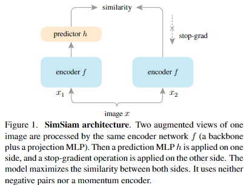
Figure 1. **SimSiam architecture** 
1つの画像を拡張した2つのビューが、同一のencoder network $f$(バックボーン＋射影MLP)によって処理される。
次に、一方に予測MLP $h$が適用され、もう一方にstop-gradient 演算が適用される。
本モデルは両者の類似度を最大化します。 
negative pairもmomentum encoderも使わない。

この2つのビューは、バックボーン(例えばResNet[19])と射影MLPヘッド[8]から構成されるエンコーダネットワーク$f$によって処理される。
エンコーダ$f$は2つのビュー間で重みを共有する。 
*h*と表記される予測MLPヘッド[15]は、一方のビューの出力を変換し、もう一方のビューにマッチさせる。
2つの出力ベクトルを $p_1 \triangleq h(f(x_1))$ 、 $z_2 \triangleq f(x_2)$ と定義すると、それらのcos類似度の-1倍を最小化する：

$$
\mathcal{D}(p_1, z_2) = -\frac{p_1}{\|p_1\|_2}\cdot \frac{z_2}{\|z_2\|_2} \tag{1}
$$

ここで $\|\cdot\|_2$ は $\mathcal{l}_2$-normである。 
これは$l_2$正規化されたベクトルのMSE[15]に等しく、最大で2のスケールまでとなる。
参考文献[15]に従い, 対称lossを次のように定義する:

$$
\mathcal{L} = \frac{1}{2}\mathcal{D}(p_1, z_2) + \frac{1}{2}\mathcal{D}(p_2, z_1) \tag{2}
$$

これは画像ごとに定義され、全損失は全画像の平均となる。 最小値は-1である。
この方法が機能するための重要な要素は、stop-gradient($stopgrad$)演算である(Figure 1)。
(1)を次のように修正して実装する：

$$
\mathcal{D}(p_1, stapgrad(z_2)) \tag{3}
$$

これは、$z_2$を定数項として扱うという意味である。
同様に、(2)式をこの方式で次の様に実装する:

$$
\mathcal{L} = \frac{1}{2}\mathcal{D}(p_1, stopgrad(z_2)) + \frac{1}{2}\mathcal{D}(p_2, stopgrad(z_1)) \tag{4}
$$

ここで、$x_2$ のエンコーダは、第1項では$z_2$から勾配を受け取らないが、第2項では$p_2$から勾配を受け取る（$x_1$はその逆）。
SimSiamの擬似コードはAlgorithm1にある。

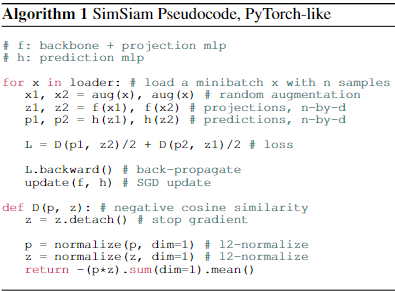

**Baseline settings** 
特に指定しない限り、我々の探索では教師なし事前学習に以下の設定を使用する：

- *Optimizer(最適化器)* 
事前学習にはSGD(確率的勾配降下法)を利用する。
提案手法ではLARS[38]のような大きなバッチサイズの最適化器を必要としない([8, 15, 7]とはことなる)。
学習率には $lr \times BatchSize / 256$を使用する(線形スケーリング[14])。基本となる$lr$は$lr= 0.05$とする。
学習率にはcos減衰スケージュール[27, 8]を使用する。
係数の減衰は0.0001でSGDのモメンタムは0.9とする。
バッチサイズは基本的には512を使用する、これは典型的な8-GPUでの実装に合っている。
ほかのバッチサイズでも同様に機能する(Sec. 4.3). 
デバイス間で同期させたbatch normalization(BN)を使用する[22]([8, 15, 7]のように)。

- *Projection MLP(射影MLP)* 
($f$中の)射影MLPは、出力fcを含む全結合層(fc)にBNを適用している。
出力fcにはReLUがない．隠れfcは2048次元とする。 このMLPは3層である。

- *Prediction MLP(推論MLP)* 
推論MLP($h$)の隠れ層のfc層はBNを有する。
出力の全結合層にはBN(Sec 4.4のablationにて)やReLUは無い。
このMLPは2層である。
$h$ の入力と出力($z$と$p$)の次元は $d = 2048$ であり、 $h$ の隠れ層の次元は $512$ であるため、 $h$ はボトルネック構造である(付録のアブレーション)。 
本論文ではデフォルトのバックボーンとしてResNet-50[19]を用いる。
その他の実装の詳細は補足にある。 
アブレーション実験では $100$ epochの事前学習を行う。

**Experimental setup** 
ImageNet-1K[11]に対して、ラベルを使用せずに教師なし事前学習を行う。 
事前学習された表現の品質は、学習セットに対して固定された表現に対して教師あり線形分類器を訓練し、Validationセットでそれをテストすることで評価する。 
線形分類の実装の詳細は補足にある。

## 4. Empirical Study
このセクションでは、SimSiamの動作を実証的に研究する。 
特に、このモデルの崩壊しない解の原因となるものに注目する。

### 4.1. Stop-gradient
Figure 2 presents a comparison on “with vs. without stop-gradient”. 
The architectures and all hyper-parameters are kept unchanged, and stop-gradient is the only difference.
Figure 2 (left) shows the training loss. Without stop-gradient, the optimizer quickly finds a degenerated solution and reaches the minimum possible loss of −1. 
To show that the degeneration is caused by collapsing, we study the standard deviation (std) of the $l_2$-normalized output $z/\|z\|_2$ . 
If the outputs collapse to a constant vector, their std over all samples should be zero for each channel. 
This can be observed from the red curve in Figure 2 (middle).  
As a comparison, if the output $z$ has a zero-mean isotropic Gaussian distribution, we can show that the std of $z/\|z\|_2$ is $\frac{1}{\sqrt{d}}$ (*3).

(*3)  Here is an informal derivation: denote $z/\|z\|_2$ as $z'$, that is, $z'_i = z_i/(\sum^d_{j=1} z^2_j)^{\frac{1}{2}}$ for the $i$-th channel. 
If $z_j$ is subject to an i.i.d Gaussian distribution: $z_j \approx \mathcal{N}(0,1), \forall j$, then $z'_i \approx z_i/d^{\frac{1}{2}}$ and $std[z'_i]\approx 1/d^{\frac{1}{2}}$.

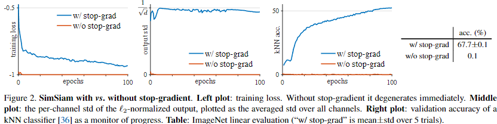
Figure 2. SimSiam with vs. without stop-gradient. Left plot: training loss. Without stop-gradient it degenerates immediately. Middle
plot: the per-channel std of the `2-normalized output, plotted as the averaged std over all channels. Right plot: validation accuracy of a
kNN classifier [36] as a monitor of progress. Table: ImageNet linear evaluation (“w/ stop-grad” is mean±std over 5 trials).

The blue curve in Figure 2 (middle) shows that with stop-gradient, the std value is near 1√d. This indicates that the outputs do not collapse, and they are scattered on the unit hypersphere.
Figure 2 (right) plots the validation accuracy of a k-nearest-neighbor (kNN) classifier [36]. 
This kNN classifier can serve as a monitor of the progress. 
With stop-gradient, the kNN monitor shows a steadily improving accuracy.
The linear evaluation result is in the table in Figure 2.  
SimSiam achieves a nontrivial accuracy of 67.7%. 
This result is reasonably stable as shown by the std of 5 trials.  
Solely removing stop-gradient, the accuracy becomes 0.1%, which is the chance-level guess in ImageNet.

**Discussion**
Our experiments show that there exist collapsing solutions. 
The collapse can be observed by the minimum possible loss and the constant outputs.(*4) 

(*4) We note that a chance-level accuracy (0.1%) is not sufficient to indicate collapsing. 
A model with a diverging loss, which is another pattern of failure, may also exhibit a chance-level accuracy.

The existence of the collapsing solutions implies that it is insufficient for
our method to prevent collapsing solely by the architecture designs (e.g., predictor, BN, `2-norm). 
In our comparison, all these architecture designs are kept unchanged, but they do not prevent collapsing if stop-gradient is removed.
The introduction of stop-gradient implies that there should be another optimization problem that is being solved underlying. 
We propose a hypothesis in Sec. 5.

### 4.2. Predictor
In Table 1 we study the predictor MLP’s effect.
The model does not work if removing $h$ (Table 1a), i.e., $h$ is the identity mapping. 
Actually, this observation can be expected if the symmetric loss (4) is used. 
Now the loss is $\frac{1}{2}\mathcal{D}(z_1,stopgrad(z_2)) + \frac{1}{2}\mathcal{D}(z_2,stopgrad(z_1))$. 
Its gradient has the same direction as the gradient of $\mathcal{D}(z1,z2)$, with the magnitude scaled by 1/2. 
In this case, using stopgradient is equivalent to removing stop-gradient and scaling the loss by 1/2. 
Collapsing is observed (Table 1a).
We note that this derivation on the gradient direction is valid only for the symmetrized loss. 
But we have observed that the asymmetric variant (3) also fails if removing $h$, while it can work if $h$ is kept (Sec. 4.6). 
These experiments suggest that h is helpful for our model.
If $h$ is fixed as random initialization, our model does not work either (Table 1b). 
However, this failure is not about collapsing. 
The training does not converge, and the loss remains high. 
The predictor $h$ should be trained to adapt to the representations.
We also find that $h$ with a constant $lr$ (without decay) can work well and produce even better results than the baseline (Table 1c). 
A possible explanation is that h should adapt to the latest representations, so it is not necessary to force it converge (by reducing lr) before the representations are sufficiently trained. 
In many variants of our model, we have observed that $h$ with a constant $lr$ provides slightly better results. 
We use this form in the following subsections.

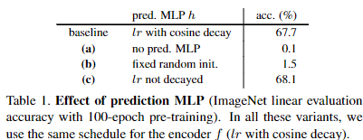
Table 1. **Effect of prediction MLP** (ImageNet linear evaluation accuracy with 100-epoch pre-training). 
In all these variants, we use the same schedule for the encoder $f$ (lr with cosine decay).

### 4.3. Batch Size
Table 2 reports the results with a batch size from 64 to 4096. 
When the batch size changes, we use the same linear scaling rule (lr×BatchSize/256) [14] with base $lr = 0.05$.
We use 10 epochs of warm-up [14] for batch sizes $\ge 1024$.  
Note that we keep using the same SGD optimizer (rather than LARS [38]) for all batch sizes studied.
Our method works reasonably well over this wide range of batch sizes. 
Even a batch size of 128 or 64 performs decently, with a drop of 0.8% or 2.0% in accuracy. 
The results are similarly good when the batch size is from 256 to 2048, and the differences are at the level of random variations.
This behavior of SimSiam is noticeably different from SimCLR [8] and SwAV [7]. All three methods are Siamese networks with direct weight-sharing, but SimCLR and SwAV both require a large batch (e.g., 4096) to work well.
We also note that the standard SGD optimizer does not work well when the batch is too large (even in supervised learning [14, 38]), and our result is lower with a 4096 batch.
We expect a specialized optimizer (e.g., LARS [38]) will help in this case. 
However, our results show that a specialized optimizer is not necessary for preventing collapsing.

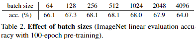
Table 2. **Effect of batch sizes** (ImageNet linear evaluation accuracy with 100-epoch pre-training).

### 4.4. Batch Normalization
Table 3 compares the configurations of BN on the MLP heads. 
In Table 3a we remove all BN layers in the MLP heads (10-epoch warmup [14] is used specifically for this entry). 
This variant does not cause collapse, although the accuracy is low (34.6%). 
The low accuracy is likely because of optimization difficulty. Adding BN to the hidden layers (Table 3b) increases accuracy to 67.4%.
Further adding BN to the output of the projection MLP (i.e., the output of $f$) boosts accuracy to 68.1% (Table 3c), which is our default configuration. 
In this entry, we also find that the learnable affine transformation (scale and offset [22]) in f’s output BN is not necessary, and disabling it leads to a comparable accuracy of 68.2%.
Adding BN to the output of the prediction MLP $h$ does not work well (Table 3d). 
We find that this is not about collapsing. 
The training is unstable and the loss oscillates.
In summary, we observe that BN is helpful for optimization when used appropriately, which is similar to BN’s behavior in other supervised learning scenarios. 
But we have seen no evidence that BN helps to prevent collapsing: actually, the comparison in Sec. 4.1 (Figure 2) has exactly the same BN configuration for both entries, but the model collapses if stop-gradient is not used.

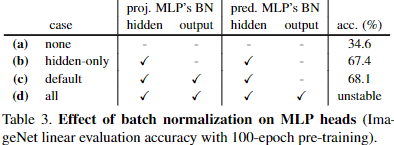
Table 3. **Effect of batch normalization on MLP heads** (ImageNet linear evaluation accuracy with 100-epoch pre-training).

### 4.5. Similarity Function
Besides the cosine similarity function (1), our method also works with cross-entropy similarity. 
$We modify $\mathcal{D} as:
$\mathcal{D}(p1,z2) = −softmax(z2)\cdot log softmax(p1)$. 
Here the softmax function is along the channel dimension. 
The output of softmax can be thought of as the probabilities of belonging to each of d pseudo-categories.
We simply replace the cosine similarity with the cross-entropy similarity, and symmetrize it using (4). 
All hyper-parameters and architectures are unchanged, though they
may be suboptimal for this variant. Here is the comparison:
.png)
The cross-entropy variant can converge to a reasonable result without collapsing. 
This suggests that the collapsing prevention behavior is not just about the cosine similarity.  
This variant helps to set up a connection to SwAV [7], which we discuss in Sec. 6.2.

### 4.6. Symmetrization
Thus far our experiments have been based on the symmetrized loss (4). 
We observe that SimSiam’s behavior of preventing collapsing does not depend on symmetrization.
We compare with the asymmetric variant (3) as follows:
.png)
The asymmetric variant achieves reasonable results. 
Symmetrization is helpful for boosting accuracy, but it is not related to collapse prevention. 
Symmetrization makes one more prediction for each image, and we may roughly compensate for this by sampling two pairs for each image in the asymmetric version ("2×"). 
It makes the gap smaller.

### 4.7. Summary
We have empirically shown that in a variety of settings, SimSiam can produce meaningful results without collapsing. 
The optimizer (batch size), batch normalization, similarity function, and symmetrization may affect accuracy, but we have seen no evidence that they are related to collapse prevention. 
It is mainly the stop-gradient operation that plays an essential role.

## 5. Hypothesis
We discuss a hypothesis on what is implicitly optimized by SimSiam, with proof-of-concept experiments provided.
### 5.1. Formulation
Our hypothesis is that SimSiam is an implementation of an Expectation-Maximization (EM) like algorithm. 
It implicitly involves two sets of variables, and solves two underlying sub-problems. 
The presence of stop-gradient is the consequence of introducing the extra set of variables.
We consider a loss function of the following form:

$$
\mathcal{L}(\theta, \eta) = E_{x, \tau}\left[ \|\mathcal{F}_\theta(\Tau(x)) - \eth_x\|^2_2\right] \tau{5}
$$

$F$ is a network parameterized by $\theta$. 
$\Tau$ is the augmentation.
$x$ is an image. 
The expectation $E[\cdot]$ is over the distribution
of images and augmentations. 
For the ease of analysis, here we use the mean squared error ‖·‖22, which is equivalent to the cosine similarity if the vectors are $l^2$-normalized. 
We do not consider the predictor yet and will discuss it later.
In (5), we have introduced another set of variables which we denote as $\eta$. 
The size of $\eta$ is proportional to the number of images. 
Intuitively, $\eta_x$ is the representation of the image $x$, and the subscript $x$ means using the image index to access a sub-vector of $\eta$. 
$\eta$ is not necessarily the output of a network; it is the argument of an optimization problem.
With this formulation, we consider solving:

$$
\min_{\theta, \eta}\mathcal{L}(\theta, \eta) \tag{6}
$$

Here the problem is w.r.t. both $\theta$ and $\eta$. 
This formulation is analogous to k-means clustering [28]. 
The variable $\theta$ is analogous to the clustering centers: it is the learnable parameters of an encoder. 
The variable $\eta_x$ is analogous to the assignment vector of the sample $x$ (a one-hot vector in k-means): it is the representation of $x$.
Also analogous to k-means, the problem in (6) can be solved by an alternating algorithm, fixing one set of variables and solving for the other set. 
Formally, we can alternate between solving these two subproblems:

$$
\begin{align}
\theta^t &\leftarrow& arg \min_\theta \mathcal{L}(\theta, \eta^{t-1}) \tag{7}\\
\eta^t &\leftarrow& arg \min_\eta \mathcal{L}(\theta, \eta) \tag{8}
\end{align}
$$
Here $t$ is the index of alternation and "$\leftarrow$" means assigning.

**Solving for $\theta$** 
One can use SGD to solve the sub-problem (7). 
The stop-gradient operation is a natural consequence, because the gradient does not back-propagate to $\eta^{t-1}$ which is a constant in this subproblem.

**Solving for $\eta$** 
The sub-problem (8) can be solved independently for each $\eta_x$. 
Now the problem is to minimize: $E_\Tau\left[ \|F_{θ^t}(\Tau(x)) − \eta_x‖^2_2 \right]$ for each image $x$, noting that the expectation is over the distribution of augmentation $\Tau$. 
Due to the mean squared error,(*5) it is easy to solve it by:

$$
\eta^t_x \leftarrow E_\Tau\left[ \mathcal{F}_{\theta^t}(\Tau(x))\right] \tag{9}
$$

(*5) If we use the cosine similarity, we can approximately solve it by $l_2$-
normalizing $\mathcal{F}$’s output and $\eta_x$.

This indicates that $\eta_x$ is assigned with the average representation of $x$ over the distribution of augmentation.

**One-step alternation** 
SimSiam can be approximated by one-step alternation between (7) and (8). 
First, we approximate (9) by sampling the augmentation only once, denoted as $\Tau'$, and ignoring $ET[\cdot]$.

$$
\eta^t_x \leftarrow \mathcal{F}_{\theta^t}(\Tau'(x)) \tag{10}
$$

Inserting it into the sub-problem (7), we have:

$$
\theta^{t+1} \leftarrow \min_\theta E_{x, \Tau}\left[ \|\mathcal{F}_\theta(\Tau(x))\| - \mathcal{F}_{\theta^t}(\Tau'(x))\|^2_2\right] \tag{11}
$$

Now $\theta^t$ is a constant in this sub-problem, and $\Tau′$ implies another view due to its random nature. 
This formulation exhibits the Siamese architecture. 
Second, if we implement (11) by reducing the loss with one SGD step, then we can approach the SimSiam algorithm: a Siamese network naturally with stop-gradient applied.

**Predictor** 
Our above analysis does not involve the predictor $h$. 
We further assume that $h$ is helpful in our method because of the approximation due to (10).
By definition, the predictor $h$ is expected to minimize: $E_z\left[\|h(z_1) -z_2\|^2_2\right]$.
The optimal solution to h should satisfy: $h(z_1)=E_z[z_2]=E_\Tau[f(\Tau(x))]$ for any image $x$. 
This term is similar to the one in (9). 
In our approximation in (10), the expectation $ET[\cdot]$ is ignored. 
The usage of $h$ may fill this gap. 
In practice, it would be unrealistic to actually compute the expectation $E_\Tau$. 
But it may be possible for a neural network (e.g., the preditor $h$) to learn to predict the expectation, while the sampling of $\Tau$ is implicitly distributed across multiple epochs.

**Symmetrization** 
Our hypothesis does not involve symmetrization. 
Symmetrization is like denser sampling $\Tau$ in (11). 
Actually, the SGD optimizer computes the empirical expectation of $E_{x,\Tau}[\cdot]$ by sampling a batch of images and one pair of augmentations $(\Tau_1, \Tau_2)$. 
In principle, the empirical expectation should be more precise with denser sampling. 
Symmetrization supplies an extra pair $(\Tau_2, \Tau_1)$.
This explains that symmetrization is not necessary for our method to work, yet it is able to improve accuracy, as we have observed in Sec. 4.6.

### 5.2. Proof of concept
We design a series of proof-of-concept experiments that stem from our hypothesis. 
They are methods different with SimSiam, and they are designed to verify our hypothesis.
Multi-step alternation. 
We have hypothesized that the SimSiam algorithm is like alternating between (7) and (8), with an interval of one step of SGD update. 
Under this hypothesis, it is likely for our formulation to work if the interval has multiple steps of SGD.
In this variant, we treat $t$ in (7) and (8) as the index of an outer loop; and the sub-problem in (7) is updated by an inner loop of $k$ SGD steps. 
In each alternation, we pre-compute the $\eta_x$ required for all $k$ SGD steps using (10) and cache them in memory. 
Then we perform $k$ SGD steps to update $\theta$. 
We use the same architecture and hyper-parameters as SimSiam. 
The comparison is as follows:
.png)
Here, "1-step" is equivalent to SimSiam, and “1-epoch” denotes the $k$ steps required for one epoch. 
All multi-step variants work well. 
The 10-/100-step variants even achieve better results than SimSiam, though at the cost of extra pre-computation. 
This experiment suggests that the alternating optimization is a valid formulation, and SimSiam is a special case of it.

**Expectation over augmentations** 
The usage of the predictor $h$ is presumably because the expectation $E_\Tau[\cdot]$ in (9) is ignored. 
We consider another way to approximate this expectation, in which we find $h$ is not needed.
In this variant, we do not update $\eta_x$ directly by the assignment (10); instead, we maintain a moving-average: $\eta^t_x \leftarrow m * \eta^{t−1}_x + (1 −m) * F_{\theta^t}(\Tau'(x))$, where m is a momentum coefficient (0.8 here). 
This computation is similar to maintaining the memory bank as in [36]. 
This moving-average provides an approximated expectation of multiple views. 
This variant has 55.0% accuracy without the predictor $h$. 
As a comparison, it fails completely if we remove $h$ but do not maintain the moving average (as shown in Table 1a). 
This proof-of-concept experiment supports that the usage of predictor $h$ is related to approximating $E_\Tau[\cdot]$.

### 5.3. Discussion
Our hypothesis is about what the optimization problem can be. 
It does not explain why collapsing is prevented.  
We point out that SimSiam and its variants’ non-collapsing behavior still remains as an empirical observation.
Here we briefly discuss our understanding on this open question. 
The alternating optimization provides a different trajectory, and the trajectory depends on the initialization.
It is unlikely that the initialized $\eta$, which is the output of a randomly initialized network, would be a constant. 
Starting from this initialization, it may be difficult for the alternating optimizer to approach a constant $\eta_x$ for all $x$, because the method does not compute the gradients w.r.t. $\eta$ jointly for all $x$. 
The optimizer seeks another trajectory (Figure 2 left), in which the outputs are scattered (Figure 2 middle).

## 6. Comparisons
### 6.1. Result Comparisons
**ImageNet**. 
We compare with the state-of-the-art frameworks in Table 4 on ImageNet linear evaluation. 
For fair comparisons, all competitors are based on our reproduction, and "+" denotes improved reproduction vs. the original papers (see supplement). 
For each individual method, we follow the hyper-parameter and augmentation recipes in its original paper.(*6) 
All entries are based on a standard ResNet-50, with two 224×224 views used during pre-training.
Table 4 shows the results and the main properties of the methods. 
SimSiam is trained with a batch size of 256, using neither negative samples nor a momentum encoder. 
Despite it simplicity, SimSiam achieves competitive results. 
It has the highest accuracy among all methods under 100-epoch pre-training, though its gain of training longer is smaller. 
It has better results than SimCLR in all cases.

(*6) In our BYOL reproduction, the 100, 200(400), 800-epoch recipes follow the 100, 300, 1000-epoch recipes in [15]: $lr$ is {0.45, 0.3, 0.2}, $wd$ is
{1e-6, 1e-6, 1.5e-6}, and momentum coefficient is {0.99, 0.99, 0.996}.

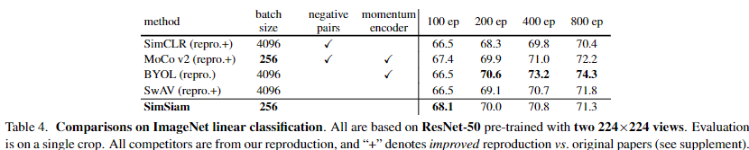
Table 4. **Comparisons on ImageNet linear classification.** 
All are based on **ResNet-50*** pre-trained with **two 224×224 views**. 
Evaluation is on a single crop. 
All competitors are from our reproduction, and "+" denotes improved reproduction vs. original papers (see supplement).

**Transfer Learning**. 
In Table 5 we compare the representation quality by transferring them to other tasks, including VOC [12] object detection and COCO [26] object detection and instance segmentation. 
We fine-tune the pre-trained models end-to-end in the target datasets. 
We use the public codebase from MoCo [17] for all entries, and search the fine-tuning learning rate for each individual method. 
All methods are based on 200-epoch pre-training in ImageNet
using our reproduction.
Table 5 shows that SimSiam’s representations are transferable beyond the ImageNet task. 
It is competitive among these leading methods. The “base” SimSiam in Table 5 uses the baseline pre-training recipe as in our ImageNet experiments. 
We find that another recipe of $lr=0.5$ and $wd=1e-5$ (with similar ImageNet accuracy) can produce better results in all tasks (Table 5, "SimSiam, optimal").
We emphasize that all these methods are highly successful for transfer learning—in Table 5, they can surpass or be on par with the ImageNet supervised pre-training counterparts in all tasks. 
Despite many design differences, a common structure of these methods is the Siamese network.
This comparison suggests that the Siamese structure is a core factor for their general success.

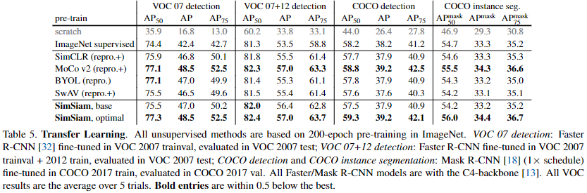
Table 5. **Transfer Learning**. All unsupervised methods are based on 200-epoch pre-training in ImageNet. VOC 07 detection: Faster R-CNN [32] fine-tuned in VOC 2007 trainval, evaluated in VOC 2007 test; VOC 07+12 detection: Faster R-CNN fine-tuned in VOC 2007 trainval + 2012 train, evaluated in VOC 2007 test; COCO detection and COCO instance segmentation: Mask R-CNN [18] (1×schedule) fine-tuned in COCO 2017 train, evaluated in COCO 2017 val. 
All Faster/Mask R-CNN models are with the C4-backbone [13]. 
All VOC results are the average over 5 trials. **Bold entries** are within 0.5 below the best.

## 6.2. Methodology Comparisons
Beyond accuracy, we also compare the methodologies of these Siamese architectures. 
Our method plays as a hub to connect these methods. 
Figure 3 abstracts these methods.  
The “encoder” subsumes all layers that can be shared between both branches (e.g., backbone, projection MLP [8], prototypes [7]). The components in red are those missing in SimSiam. 
We discuss the relations next.
**Relation to SimCLR [8]**. SimCLR relies on negative samples (“dissimilarity”) to prevent collapsing. 
SimSiam can be thought of as “SimCLR without negatives”.
To have a more thorough comparison, we append the prediction MLP $h$ and stop-gradient to SimCLR.(*7) Here is the ablation on our SimCLR reproduction:
.png)
Neither the stop-gradient nor the extra predictor is necessary or helpful for SimCLR. 
As we have analyzed in Sec. 5, the introduction of the stop-gradient and extra predictor is presumably a consequence of another underlying optimization problem. 
It is different from the contrastive learning problem, so these extra components may not be helpful.

(*7) We append the extra predictor to one branch and stop-gradient to the
other branch, and symmetrize this by swapping.

**Relation to SwAV [7]**. 
SimSiam is conceptually analogous to “SwAV without online clustering”. We build up this connection by recasting a few components in SwAV. 
(i) The shared prototype layer in SwAV can be absorbed into the Siamese encoder. 
(ii) The prototypes were weight-normalized outside of gradient propagation in [7];
we instead implement by full gradient computation [33].(*8)
(iii) The similarity function in SwAV is cross-entropy. 
With these abstractions, a highly simplified SwAV illustration is shown in Figure 3.

(*8) This modification produces similar results as original SwAV, but it can enable end-to-end propagation in our ablation.

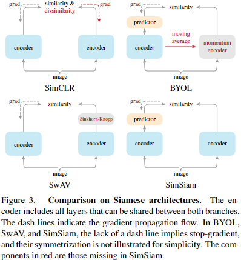
Figure 3. **Comparison on Siamese architectures**. 
The encoder includes all layers that can be shared between both branches.
The dash lines indicate the gradient propagation flow. 
In BYOL, SwAV, and SimSiam, the lack of a dash line implies stop-gradient, and their symmetrization is not illustrated for simplicity. 
The components in red are those missing in SimSiam.

SwAV applies the Sinkhorn-Knopp (SK) transform [10] on the target branch (which is also symmetrized [7]). 
The SK transform is derived from online clustering [7]: it is the outcome of clustering the current batch subject to a balanced partition constraint. 
The balanced partition can avoid collapsing. Our method does not involve this transform.
We study the effect of the prediction MLP h and stop-gradient on SwAV. 
Note that SwAV applies stop-gradient on the SK transform, so we ablate by removing it. 
Here is the comparison on our SwAV reproduction:
.png)
Adding the predictor does not help either. Removing stop-gradient (so the model is trained end-to-end) leads to divergence. 
As a clustering-based method, SwAV is inherently an alternating formulation [7]. 
This may explain why stop-gradient should not be removed from SwAV.

**Relation to BYOL [15]**. 
Our method can be thought of as "BYOL without the momentum encoder", subject to many implementation differences. 
The momentum encoder may be beneficial for accuracy (Table 4), but it is not necessary for preventing collapsing. Given our hypothesis in Sec. 5, the $\eta$ sub-problem (8) can be solved by other optimizers, e.g., a gradient-based one. 
This may lead to a temporally smoother update on η. Although not directly related, the momentum encoder also produces a smoother version of $\eta$. 
We believe that other optimizers for solving (8) are also plausible, which can be a future research problem.

##  Conclusion
We have explored Siamese networks with simple designs. 
The competitiveness of our minimalist method suggests that the Siamese shape of the recent methods can be a core reason for their effectiveness. 
Siamese networks are natural and effective tools for modeling invariance, which is a focus of representation learning. 
We hope our study will attract the community’s attention to the fundamental role of Siamese networks in representation learning.

## A. Implementation Details
**Unsupervised pre-training**. 
Our implementation follows the practice of existing works [36, 17, 8, 9, 15].

*Data augmentation*. 
We describe data augmentation using the PyTorch [31] notations. 
Geometric augmentation is $RandomResizedCrop$ with scale in [0.2,1.0] [36] and $RandomHorizontalFlip$. 
Color augmentation is $ColorJitter$ with {brightness, contrast, saturation, hue}strength of {0.4, 0.4, 0.4, 0.1}with an applying probability of 0.8, and $RandomGrayscale$ with an applying probability of 0.2. 
Blurring augmentation [8] has a Gaussian kernel with std in [0.1,2.0].

*Initialization*. 
The convolution and fc layers follow the default PyTorch initializers. Note that by default PyTorch initializes fc layers' weight and bias by a uniform distribution $\mu(−\sqrt{k}, \sqrt{k})$ where $k= \frac{1*}{in_ channels}$. 
Models with substantially different fc initializers (e.g., a fixed std of 0.01) may not converge. 
Moreover, similar to the implementation of [8], we initialize the scale parameters as 0 [14] in the last BN layer for every residual block.

*Weight decay*. 
We use a weight decay of 0.0001 for all parameter layers, including the BN scales and biases, in the SGD optimizer. 
This is in contrast to the implementation of [8, 15] that excludes BN scales and biases from weight decay in their LARS optimizer.

**Linear evaluation**. 
Given the pre-trained network, we train a supervised linear classifier on frozen features, which are from ResNet’s global average pooling layer (pool5).
The linear classifier training uses base $lr = 0.02$ with a cosine decay schedule for 90 epochs, weight decay = 0, momentum=0.9, batch size=4096 with a LARS optimizer [38]. 
We have also tried the SGD optimizer following [17] with base $lr = 30.0$, weight decay = 0, momentum = 0.9, and batch size=256, which gives ∼1% lower accuracy. 
After training the linear classifier, we evaluate it on the center 224×224 crop in the validation set.

## B. Additional Ablations on ImageNet
The following table reports the SimSiam results vs. the output dimension $d$:
.png)
It benefits from a larger $d$ and gets saturated at $d = 2048$.
This is unlike existing methods [36, 17, 8, 15] whose accuracy is saturated when d is 256 or 512.
In this table, the prediction MLP’s hidden layer dimension is always 1/4 of the output dimension. 
We find that this bottleneck structure is more robust. 
If we set the hidden dimension to be equal to the output dimension, the training can be less stable or fail in some variants of our exploration. 
We hypothesize that this bottleneck structure, which behaves like an auto-encoder, can force the predictor to digest the information. 
We recommend to use this bottleneck structure for our method.

## C. Reproducing Related Methods
Our comparison in Table 4 is based on our reproduction of the related methods. 
We re-implement the related methods as faithfully as possible following each individual paper.
In addition, we are able to improve SimCLR, MoCo v2, and SwAV by small and straightforward modifications: specifically, we use 3 layers in the projection MLP in SimCLR and SwAV (vs. originally 2), and use symmetrized loss for MoCo v2 (vs. originally asymmetric). 
Table C.1 compares our reproduction of these methods with the original papers' results (if available). 
Our reproduction has better results for SimCLR, MoCo v2, and SwAV (denoted as "+" in Table 4), and has at least comparable results for BYOL.

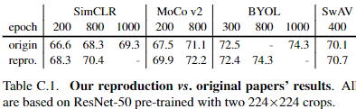
Table C.1. **Our reproduction vs. original papers’ results**. 
All are based on ResNet-50 pre-trained with two 224×224 crops.

## D. CIFAR Experiments
We have observed similar behaviors of SimSiam in the CIFAR-10 dataset [24]. 
The implementation is similar to that in ImageNet. 
We use SGD with base $lr = 0.03$ and a cosine decay schedule for 800 epochs, weight decay = 0.0005, momentum = 0.9, and batch size = 512. 
The input image size is 32×32. We do not use blur augmentation. 
The backbone is the CIFAR variant of ResNet-18 [19], followed by a 2-layer projection MLP. 
The outputs are 2048-d.  
Figure D.1 shows the kNN classification accuracy (left) and the linear evaluation (right). 
Similar to the ImageNet observations, SimSiam achieves a reasonable result and does not collapse. 
We compare with SimCLR [8] trained with the same setting. 
Interestingly, the training curves are similar between SimSiam and SimCLR. SimSiam is slightly better by 0.7% under this setting.

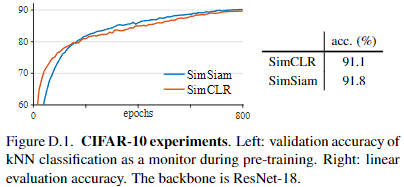
Figure D.1. CIFAR-10 experiments. Left: validation accuracy of
kNN classification as a monitor during pre-training. Right: linear
evaluation accuracy. The backbone is ResNet-18.
