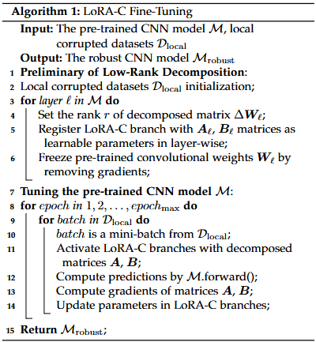

# LoRA-C: Parameter-Efficient Fine-Tuning of Robust CNN for IoT Devices

## Abstract

ユビキタスでリソースの限られたIoTデバイスを使用するユーザーに高品質のサービスを提供するためには、ローカルデータを使用して事前に訓練された畳み込みニューラルネットワーク（CNN）モデルを効率的に微調整することが不可欠である。  
Low-Rank Adaptation(LoRA)によるfine-tuningは、簡素かつ率的であり、推論の負担を増やさないため、産業界や学術界から広く注目されている。  
しかし、既存の先進的な手法の多くはTransformerのfine-tuningにLoRAを用いており、CNNのfine-tuningにLoRAを用いた研究は少ない。  
CNNモデルは、包括的なリソース占有率と性能における優位性により、アプリケーションのためにIoTデバイスに広く展開されている。  
さらに、IoTデバイスは屋外に広く配備されており、環境(霧、雪、雨など)の影響を受けたデータを処理することが多い。  
本論文の目的は、LoRA技術を用いてCNNモデルのロバスト性を効率的に向上させることである。  
この目的のために、本論文ではまず、IoTデバイスに対する強力でロバストなCNNfine-tuning法、LoRA-Cを提案する。  
LoRA-Cは、CNNのカーネル単位ではなく畳み込み層で低ランク分解を実行することで、fine-tuningパラメータの数を削減する。  
次に、本論文は2つの異なるランク設定を詳細に分析し、標準的なデータおよび破損したデータのいずれにおいても、$\alpha/r$ が特定の値である場合に通常最高の性能が達成されることを観察する。  
この発見は、LoRA-Cを広く応用するための経験となる。  
最後に、本論文では訓練済みモデルに基づいて多くの実験を行った。  
CIFAR-10、CIFAR-100、CIFAR-10-C、Icons50データセットでの実験結果は、提案するLoRA-Cが標準的なResNetsを凌駕することを示している。  
具体的には、CIFAR-10-Cデータセットにおいて、LoRA-C-ResNet-101の精度は83.44%を達成し、標準的なResNet-101の結果を+9.5%上回った。  
Icons-50データセットでは、LoRA-C-ResNet-34の精度は96.9%を達成し、標準的なResNet-34の結果を+8.48%上回った。  
さらに、LoRA-Cは、フルパラメータのfine-tuningと比較して、パラメータの更新量を99%以上削減することができる。  

## 1 INTRODUCTION

大規模モデルの訓練には時間と費用がかかる。  
例えば、メタ社のLLaMA-65Bモデルをトレーニングするには、2,048個のNVIDIA A100 GPUが必要で、約21日かかり、費用は240万ドル以上に上る。  
OpenAIのGPT-3のようなさらに規模なモデル(1750億のパラメータを含む)ではトレーニングに400万ドル以上かかる。  
さらに、これらの大規模なモデル[1]、[2]は、通常、広範な汎用的能力を持つが、特定のタスクに対する性能は、実用的なニーズを満たすには不十分である。  
タスク固有のデータを使用して、特定のタスクのニーズを満たすようにこれらの大規模モデルを微調整することは、広く注目されており、多くの効果的なfine-tuning方法[3]～[12]を生み出している。  
これらのfine-tuning手法 の中で、LoRA (Low-Rank Adaptation) [9]、[13]～[18]は、その単純さ、有効性、追加の推論負担がないことから、Transformerアーキテクチャで広く使用されている。  
一方、ABIリサーチは、人工知能(AI)チップを使用したスマートカメラの世界台数は2025年に3億5000万台に達すると報告している。  
また、IoT機器は屋外に広く配備されており、通常は環境(霧、雪、雨など)の影響を受けたデータを処理する。  
Transformer[19]-[21]と比較して、畳み込みニューラルネットワーク(CNN) [22]-[25]は、視覚タスクにおけるリソース消費と性能のバランスにおいてより多くの利点を有しており、リソースに制約のあるIoTデバイスに広く導入されている。  
そのため、AIチップを搭載したユビキタススマートカメラで高性能を実現するために、クラウドから送信される事前学習済みCNNモデルを微調整するためにローカルデータを使用することが主流となっている。  

  
Fig. 1: システムアーキテクチャの概要

Fig.1 に示すように、学習済みモデルをIoT機器のローカルデータを用いて微調整することで、環境の影響を受ける画像の処理性能を向上させ、高品質なサービスを提供する。  
しかし、LoRAを用いたCNNのファインチューニングに関する研究は少ない。  
本論文の目的は、LoRAを用いてIoTデバイス上のCNNモデルを微調整し、そのロバスト性を向上させ、高品質なサービスを提供することである。  
この目的のため、本論文ではまずCNNのfine-tuningのためのlayer-wize LoRAであるLoRA-Cを提案する。  
Transformer構造におけるLoRAの応用に触発された自然なアプローチは、各畳み込みカーネルの低ランク分解を新たに追加される重みとして用いることである。  
しかし、CNNのカーネル・パラメータ共有特性により、畳み込みカーネルに基づく低ランク分解では、更新されるパラメータが多くなりすぎ、リソースに制約のあるIoTデバイスへの導入が難しくなる。  
そこで本論文では、カーネル単位の低ランク分解を追加する代わりに、畳み込みレイヤー単位で低ランク分解を追加し、CNNモジュールのfine-tuningを効率的に行うLoRA-Cを提案する。  
本論文では、LoRA-Cが数個のパラメータを更新するだけで大幅な性能向上を達成することも実験的に検証している。  
そして、新たに追加されるパラメータの重みを制御する $\alpha$ と、行列の $r$ のランクとの関係を詳細に論じる。  
広範な実験により、提案するLoRA-Cは通常、$\alpha/r$ がある定数のときに最も良い性能を発揮することが示された。  
この発見は、IoTデバイス上でCNNモデルを効率的にfine-tuningするための経験を提供する。  
また、本論文では、行列のランク $r$ の2つの設定を研究し、多くの実験を通して、異なるモデルに適したランク $r$ の設定を与える。  
最後に、本論文はCIFAR-10、CIFAR-100、CIAFR-10-C、Icons-50データセットで広範な実験を行い、実験結果は我々の提案するLoRA-Cが強力な性能を達成することを示す。  
例えば、CIFAR-100データセットにおいて、我々の提案するLoRA-C-ResNet-50は82.98%の精度を達成し、標準的なResNet-50の結果を+5.29%上回った。  
CIFAR-10-CデータセットとIcons-50データセットにおいて、我々の提案するLoRA-C-ResNet-34はそれぞれ78.45%と96.9%の平均精度を達成し、標準的なResNet-34の結果よりも+5.9%と+8.48%高い。  
さらに、LoRA-Cは更新パラメータ数において優位であり、リソースに制約のあるIoTデバイスへの展開に適していることも示す。

まとめると、我々の主な貢献は以下の通りである：

- 我々の知る限り、本研究はLoRAを取り入れることでCNNの頑健性を向上させようとする最初の研究である。  
具体的に本論文では、CNNモデルの特徴に従って、効果的にfinetuningするための畳み込み層ごとの低ランク分解法であるLoRA-Cを提案する。
- 本論文では、$\alpha/r$ がある定数であるとき、提案されたLoRA-Cが一般的に最高の性能を発揮することを観察し、IoTデバイス上でCNNモデルを効率的にファインチューニングするための経験を提供する。
- 本論文では、ランク設定がモデルのロバスト性に与える影響を比較し、モデル容量との関係を詳細に分析する。
- CIFAR-10、CIFAR-100、CIFAR-10-C、Icons-50データセットでの広範な実験により、我々の提案するLoRA-Cがより高い精度を達成することを実証する。  

本稿の残りの部分は以下のように構成されている。  
Section 2では、畳み込みニューラルネットワーク、クラウドとデバイスの連携、パラメータ効率に優れた微調整技術に関する研究をレビューする。  
Section 3では、提案するLoRA-Cを詳細に説明する。  
Section 4で評価結果を示し、Section 5で本論文の結論を述べる。  

## 2 RELATED WORK

このセクションでは、畳み込みニューラルネットワーク(CNN)、クラウドとデバイスの連携、およびパラメータ効率微調整(PEFT)技術について簡単に紹介する。  

### 2.1 Convolutional Neural Networks

視覚タスクにおける畳み込み演算の大きな成功は、AlexNet [26]、VGG [22]、Inceptionとその亜種[27]～[30]、ResNetとその亜種[25]、[31]、Xception [32]、DenseNet [24]、SENet [33]など、近年多くの古典的な畳み込みニューラルネットワーク（CNN）モデルを生み出した。  
その中でもResNet[25]は、残差モジュールを導入することで、CNNモデルをdeepなCNNに変えている。  
SENet [33]は、チャンネル次元における注意のアイデアを導入することで、CNNモデルの性能をさらに向上させる。  
軽量CNNモデルには、空間次元とチャンネル次元を分離するMobileNetsシリーズ[34]-[36]、グループ畳み込みを用いるShuffleNetシリーズ[23]、[37]、いくつかの特徴マップに基づいて他の特徴マップを生成する線形変換を用いるGhostNetシリーズ[38]、[39]などがある。  
最近では、RepVGG [40]がCNNモデルの推論を高速化するために再パラメータ化を導入している。  
MonoCNN[41]、[42]やSineFM[43]は、CNNモデルの頑健性を向上させるために提案されている。  
一方では、CNNモデルの学習パラメーターの数を減らし、パラメーターの更新が学習データに完全に依存するのを緩和する。  
一方では、CNNモデルのロバスト性を向上させるために、非線形変換ルールを使ってモデルを正則化する。  
本研究では、上記の方法とは異なる、CNNモデルのロバスト性を向上させるためのLoRAの利用を模索することで、CNNがIoTデバイス上で高品質なサービスを提供できるようにすることを目的とした、別のアイデアを提供する。  

### 2.2 Cloud-Device Collaboration

IoTデバイスのリソースが限られているため、クラウドとデバイスが協調してCNNモデルをトレーニングし、展開することが主流になっている。  
例えばKangら[44]は、CNNをデバイス上で動作するヘッドとクラウド上で動作するテールに分割し、デバイスの負荷とクラウドからデバイスへのパラメータ送信量に基づいて分割ポイントを決定することを提案している。  
Zhangら[45]は、クラウド-エッジ連携によってCNNモデルを訓練し、クラウド上でCNNを刈り込み、モデルの性能を維持しながらモデル送信パラメータ数を最小化する。  
Stefanosら[46]は、デバイスとクラウドコンピューティングの協調のための漸進的推論手法を提案し、デバイスとクラウド間のパラメータ交換の量を減らすために圧縮[47]を使用した。  
しかし、上記の方法はネットワーク条件に大きく依存する。  
ネットワークの状態が不安定だったり、利用できなかったりすると、サービス品質が低下したり、利用できなくなったりする。  
サービス品質をネットワークの状態から切り離すために、多くの研究が、まずクラウドサーバーがモデルを訓練し、次に訓練されたモデルをIoTデバイスに送信することを提案している[41]～[43]、[48]、[49]。  
例えば、Dingら[41]は、少数の学習パラメータを含むCNNモデル、すなわちMonoCNNをクラウド上で訓練し、訓練されたMonoCNNモデルをIoTデバイスに送信することを提案している。  
本稿では、まずCNNモデルのクラウド学習について研究し、次に学習したCNNモデルをIoTデバイスに送信する。  
IoTデバイスは、これらのCNNモデルを直接使用してサービスを提供するのではなく、自身のデータに基づいてクラウドから送信されたCNNモデルを効率的にファインチューニングするという点で異なる。  

### 2.3 Parameter-Efficient Fine-Tuning Techniques

近年、多くの優れたパラメータ効率的なfine-tuning技術[3], [4], [50]が提案されており、fine-tuningパラメータの数と計算量を最小化することにより、新しいタスクに対するモデルの学習コストを削減し、新しいタスクに対する事前学習済みモデルの性能を向上させることを目的としている。  
既存の手法は3つのカテゴリに分類できる。  
最初のカテゴリーはAdapter [4]-[7]と呼ばれるもので、各下流タスクの事前学習済みモデルに少数のパラメータを持つモジュールを挿入するもので、挿入された少数のパラメータを持つモジュールをAdapterモジュールと呼ぶ。  
このカテゴリでは、下流タスクの学習時にAdapterモジュールのパラメータのみを更新することで、下流タスクにおけるモデルの性能を確保しつつ、強力な基礎モデルの能力を多くの下流タスクに効率的に移行させることができる。  
しかし、事前に学習されたモデルの深さが増すため、モデルの推論の待ち時間が長くなります。  

第2のカテゴリーはP-tuning [8]、[51]、[52]と呼ばれ、トークンを入力する前に、タスクに関連する仮想トークンをプレフィックスとして構築する。  
これは、トークンを入力する前に、タスクに関連する仮想的なトークンをプレフィックスとして構築し、学習中はプレフィックス部分のパラメータのみを更新し、Transformerの他のパラメータは固定する。  
しかし、P-tuning法は学習が困難であり、モデルの利用可能なシーケンス長が短くなる。  

第3のカテゴリーは、LoRAとその亜種[9]、[14]～[18]と呼ばれるものである。LoRAの正式名称はlow-rank adaptationであり、Huらによって最初に提案された[9]。  
その核となるアイデアは、モデルが新しいタスクに適応する際のモデルパラメータの変化を低ランク分解によってシミュレートし、極めて少ないパラメータ数で大規模モデルの間接的な学習を実現することである。  

LoRAは、訓練済み基礎モデルは過剰にパラメータ化されており、実は小さな「固有次元」[53]、[54]を持つ、つまり、極めて低次元であることを前提としている。  
極端に低い次元のパラメータを微調整することで、完全なパラメータ空間での微調整と同じ効果を得ることができます。  
LoRAは事前に訓練されたモデルの深さを変更せず、推論中に新しいタスクのために追加されたパラメータをマージすることができるため、追加の推論遅延を発生させない。  
LoRAの上記の利点から、LoRAとその変種は多くのアプリケーションで広く研究されている。  
例えば、Zhangら[17]はLoRAとプルーニングを組み合わせ、LoRAPruneを提案している。Dettmersら[14]とLiら[16]はLoRAと量子化を組み合わせ、それぞれQLoRAとLoftQを提案している。  
Liuら[18]はLoRAに基づくDoRAを提案している。  
まず学習済みの重みを振幅成分と方向成分に分解し、その2つを微調整することで、LoRAの学習能力と学習の安定性を高めている。  
また、CNNモデルを用いたLoRAの微調整に関する研究は現在ほとんど行われていない[55]-[58]。  
前者の2つの研究[55]、[56]は、LoRAと畳み込みを組み合わせることを試みたが、それ以上深く分析しなかった。  
Zhongら[57]は、LoRAを改善するために、エキスパートネットワークの混合に軽量畳み込みを組み合わせたが、畳み込み自体のfine-tuningは行っていない。  
Yehら[58]は、次元ダウン($k\times k$ 畳み込み)と次元アップ($1\times 1$ 畳み込み)の2つの畳み込みで行列分解をシミュレートするLoConを提案し、fine-tuningパラメータの数を減らした。  

我々の研究は3番目のカテゴリーに属する。  
我々はLoRAを使ってCNNモデルのロバスト性を向上させることを目指している。  
本論文では、LoRAをCNNに適用し、ごく少数のパラメータを更新するだけで、CNNモデルの性能を効果的に向上させる方法を詳細に研究する。  

## 3 DESIGN OF THE PROPOSED APPROACH

### 3.1 Overview

  
Fig. 2: 提案フレームワークの概要

Fig. 2は、提案アプローチの概要を示している。  
IoTデバイスは通常、屋外に設置され、環境(霧、雨、雪など)の影響を受ける多くのデータを収集する。  
このようなデータを処理する際のCNNモデルの性能を、モデルの頑健性と呼ぶ。  
標準的なCNNモデルは、この種のデータを処理する際にロバスト性が低い。  
我々は、ローカルデータを用いて、リソースに制約のあるIoTデバイス上で事前に訓練されたモデルを効率的にfine-tuneすることで、モデルの頑健性を向上させ、IoTデバイスによって収集される環境の影響を受けたデータを扱うことを目指す。  
この目的のために、ロバストCNN手法のパラメータ効率的なfine-tuning法、LoRA-Cを提案する。  
まずクラウドを利用して、事前学習済みモデルとして知られる複雑なCNNモデルを学習し、次に事前学習済みモデルをIoTデバイスに送信する。  
IoTデバイス上で、学習済みモデルの第1層と最終層を除く全ての畳み込みを凍結し、凍結された各畳み込み層にLoRA-C分岐を追加する。  

その後、IoTデバイスは少量のローカルデータを使って、LoRA-Cに基づいて事前に訓練されたモデルを微調整する。  
CNNを利用したIoTスマートサービスを提供する場合、LoRA-Cブランチのパラメータは、事前に訓練された畳み込み重みに融合させることができ、推論レイテンシを追加することはない。  
次に、LoRA-Cの動機と設計からきめ細かい分析を行う。  

### 3.2 Motivation

このセクションでは、LoRAと畳み込み層という2つの最も関連性の高い技術を分析することで、我々の動機を説明する。  

**低ランク適応[9]**： 低ランク適応(LoRA)は、モデルが新しいタスクに適応する際のモデルパラメータの変化をシミュレートするために低ランク分解を使用し、それによって非常に少数のパラメータを更新することで大規模モデルの間接的な学習を実現する。  
正式には、モデルをチューニングするために新たに追加された重み行列 $W_0 \in \mathbb{R}^{d \times k}$ に対して、$\Delta W$ のパラメータのみを更新し、$W_0$ のパラメータは凍結する。  
$W_0$ と$\Delta W$を同じ入力と乗算し、それぞれの出力ベクトルを座標毎に加算する。  
入力xが与えられると、フォワード・パスが得られる：  

$$
h = W_{0} x + \alpha\Delta W x , \tag{1}
$$

ここで $\alpha$ は定数である。  
LoRA の設定は、$A$ をランダムなガウス分布で初期化し、$B$ をすべてゼロにする。  
$r << \min(d,k)$ なので、$W_0$ に比べて $\Delta W$ のパラメータ数は非常に少ない。  
加えて、推論中、$\Delta W$ はモデルアーキテクチャーを変更することなく、追加の推論オーバーヘッドを発生させることなく、$W_0$ に完全に追加することができる。  

**畳み込み層[26]、[59]、[60]** :  

畳み込みはスライディングカーネルを用いて特徴を抽出する。  
入力特徴マップを $x \in \mathbf{R}^{c_{in} \times w \times h}$ とし、$w, h, c_{in}$ はそれぞれ入力幅、入力高さ、入力チャンネルである。  
そして、$\mathbf{W} \in \mathbb{R}^{c_{out} \times c_{in} \times k \times k}$ は畳み込み重みであり、カーネルサイズは $k \times k$ である。  
そして、生成された出力特徴マップは $y \in \mathbf{R}^{c_{out} \times w' \times h'}$ となる。  
ここで $w', h', c_{out}$ はそれぞれ出力幅、出力高さ、出力チャンネルである。  
畳み込み層の順伝播は以下のように表される：  

$$
y = \mathbf{W} \otimes x , \tag{2}
$$

ここで、$\otimes$ は畳み込み演算を表す。  
畳み込みカーネル $\mathbf{W}^{(n)} \in \mathbb{R}^{c_{in} \times k \times k}$ に対して、出力チャンネル $n$ における出力特徴マップ $y^{(n)}$ は以下のようになる：  

$$
y^{(n)} = \mathbf{W}^{(n)} \otimes x , \tag{3}
$$

ここで、位置 $(i,j)$ における特徴マップ $y^{(n)}$ の値は以下のように計算できる：

$$
y^{(n)}_{i,j} = \sum_{m=1}^{c_{in}} \sum_{u=1}^{k} \sum_{v=1}^{k} W^{(n)}_{m,u,v} \cdot x_{m,i-u+1,j-v+1} . \tag{4}
$$

既存の研究のほとんどは、Transformerアーキテクチャに基づくモデルのfine-tuningにLoRAを使用しており、CNNを対象としたLoRAの研究はほとんどない。  
IoTデバイスにおけるCNNの幅広い応用を考慮し、本稿ではCNNモデルのfine-tuningにLoRAを使用することを研究する。  
Transformerベースのアーキテクチャをfine-tuningする際、LoRAの$\mathbf{BA}$は $\mathbf{Q, K, V}$ 行列として機能する。  
では、LoRAはどのように効率的にCNNと組み合わせられるのだろうか?  

### 3.3 Design of LoRA-C

  
Fig. 3: 手案手法 LoRA-C

このセクションでは、まずLoRA-Cを紹介し、次にこの設計の理由を説明する。  
**LoRA-C**:  
Fig. 3は、CNNのfine-tuningのための畳み込み層ごとの低ランク分解法である、提案手法LoRA-Cを示す。  
入力チャンネル $c_{in}$ と出力チャンネル $c_{out}$ を持つ畳み込み層に対して、事前学習済み畳み込み重み $\mathbf{W}_0 \in \mathbb{R}^{c_{out} \times c_{in} \times k \times k}$ は、fine-tuning中に更新されない勾配を除去することで凍結される。  
すなわち、重みの更新増分 $\Delta W$ を $\mathbf{A}$ と $\mathbf{B}$ の2つの行列に分解する。  
ここで、$\mathbf{A}$ は $\mathbb{R}^{r \times c_{in} \times k}$、$\mathbf{B}$ は $\mathbb{R}^{c_{out} \times k \times r}$ である。  
LoRAと同様に、LoRA-Cでも新たに追加されたパラメータの重みを調整するために定数 $\alpha$ を導入しており、fine-tuningの更新はEq. 5で記述できる：  

$$
\mathbf{W} = \mathbf{W}_0 + \alpha\Delta \mathbf{W} = \mathbf{W}_0 + \alpha\mathbf{B}\mathbf{A} . \tag{5}
$$

ここで、fine-tuningによってもたらされる事前学習済み重み $\mathbf{W}_0$ の増分は $\mathbf{B}\mathbf{A}$ と等価である。  
ここで、$\mathbf{BA}\in \mathbb{R}^{c_{out} \times k \times c_{in} \times k}$ である。
行列 $\mathbf{Reshape(BA)}$ は、訓練前の重み $\mathbf{W}_0$ に等しい次元を持つテンソルに再形成することができる。
すなわち、$\mathbf{Reshape(BA)} \in \mathbb{R}^{c_{out} \times c_{in} \times k \times k}$ となる。  
行列 $\mathbf{A}$ と $\mathbf{B}$ の初期化については、LoRAの設定に従い、行列 $\mathbf{B}$ ゼロ行列 $Z$ を設定し、行列$\mathbf{A}$ をKaiming一様分布 $\Mu(-b,b)$ で初期化する。[61]  
$T$ をランダムな初期テンソルとすると、$\mathbf{A}$ と $\mathbf{B}$ の初期化は以下のようになる：  

$$
\begin{aligned}
\mathbb{A} &= U(T ), T ∈R^{r\times c_{in}\times k} \\
\mathbb{B} &= Z(T ), T ∈R^{c_{out}\times k\times r} . \tag{6}
\end{aligned}
$$

LoRA-Cの畳み込み演算の順伝播は以下の通りである :  

$$
\begin{aligned}
y &= \left(\mathbf{W}_0 + \alpha \mathbf{BA}\right) \otimes x . \tag{7}
\end{aligned}
$$

$\Delta \mathbf{W}$ (または $\mathbf{BA}$ )のランクについては、$r$ と $r ∗ k$ の2つの設定を提供し、2つの異なるランクの影響はセクション3.3.2で分析する。

#### 3.3.1 Decomposed Matrices Granularity

LoRAのfine-tuningのメカニズムをCNNモデルに適用するため、畳み込み層の構造に適応するようにlayer-wiseの粒度を修正した。  
ではなぜ、より細かいカーネル単位ではなく、レイヤー単位の分解行列を選んだのだろうか?  
パラメトリック効率の観点から、レイヤー単位の分解行列の粒度の選択について分析する。  
完全なfine-tuningの場合、事前学習済みの重み $\mathbf{W}_0$ に対して更新されるパラメータの数は次のようになる:  

$$
P_{full\_ft} = c_{out} \cdot c_{in}\cdot k^2. \tag{8}
$$  

LoRA技術を利用することで、畳み込み重みの更新パラメータ数を減らすことを目指す。  
既存のattenntion での LoRAの経験に基づき、まず、LoRA-Cでは、各畳み込みカーネルに行列 $\mathbf{BA}$ を割り当ててfine-tuningすること、つまりカーネルごとに分解行列を割り当てることを考える。  
$\mathbf{W}^{(i)} \in \mathbb{R}^{c_{in} \times k \times k}$ を出力チャンネル $i$ における $i$ 番目の畳み込みカーネルとし、$0 < i < c_{out}$ とする。  
すると、各 $\mathbf{W}^{(i)}$ に対して、ランク $r$ の低ランク行列 $\mathbf{A}^{(i)}$ と $\mathbf{B}^{(i)}$ の組を導入することができる。ここで、$\mathbf{A}^{(i)} \in \mathbb{R}^{r \times c_{in} \times k}$、$\mathbf{B}^{(i)} \in \mathbb{R}^{k \times r}$ である。

すなわち、1つのカーネルの更新はEq .9で与えられる:

$$
\mathbf{W}^{(i)} = \mathbf{W}^{(i)}_0 + \alpha\Delta\mathbf{W}^{(i)} = \mathbf{W}^{(i)}_0 + \alpha\mathbf{B}^{(i)}\mathbf{A}^{(i)} , \tag{9}
$$

kernel-wiseにおける畳み込みの順伝播は以下の通りである:  

$$
y^{(i)} = ( \mathbf{W}^{(i)}_0 + \alpha \mathbf{B}^{(i)} \mathbf{A}^{(i)}) \otimes x . \tag{10}
$$

カーネル単位の分解の場合、$\mathbf{A}^{(i)}$ と $\mathbf{B}^{(i)}$ のパラメータ数は $c_{in} \cdot r \cdot k + r \cdot k$ となり、1つの畳み込み層には $c_{out}$ 個のカーネルが存在する。  
よって、カーネル単位の分解行列に対する更新パラメータの数は次のようになる:  

$$
P_{kernel-wise} = c_{out} \cdot (c_{in} \cdot r \cdot k + r \cdot k). \tag{11}
$$

*Layer-Wise Decomposed Matrices*:  
畳み込み層の畳み込み重みをfine-tuningするために、ランク $r$ の分解行列のペアを使用するlayer-wize分解の場合、対応する更新されたパラメータの数は Eq .12で記述することができる：

$$
P_{layer-wise} = (c_{out} + c_{in}) \cdot r \cdot k . \tag{12}
$$

*Updated Parameters Reduction*:  
低ランク分解の2つの異なるLoRA-Cの粒度(カーネル単位とレイヤー単位)について、それぞれ完全なfine-tuningと比較して更新されたパラメータの数を分析する。  
直感的な比較のために、LoRA-Cの2つの粒度のパラメータに対して、完全なfine-tuninguの更新パラメータ量に対する比率を選択する。  
カーネル分解でのこの比率はEq .13で計算できる。

$$
\begin{array}{rcl}
R_{kernel\_wise} &=& \frac{P_{kernel\_wise}}{P_{full\_ft}} = \frac{c_{out} \cdot (c_{in} \cdot r \cdot k + r \cdot k)}{c_{out} \cdot c_{in} \cdot k^2} \\
 &=& \frac{c_{in} \cdot r + r}{c_{in} \cdot k}
\end{array}
.  \tag{13}
$$

$R_{kernel\_wise} \ge \frac{c_{in}\cdot k+k}{c_{in}\cdot k} > 1$ として、$r\ge k$ のとき、kerner_wiseにおけるパラメータ数は完全なfine-tuningのものより大きくなることがわかる。  
例えば、代表的なCNNであるResNetの場合、カーネルサイズ $k$ は通常 $1$ か $3$ の値をとるので、正の利得を得るためには $r$ は $3$ より大きくならないはずである。  
しかし、Section 4.6のablation studiesにあるように、$r$ が小さすぎる場合、このモデルは通常うまく機能しない。  
したがって、カーネル単位のLoRA-Cの設計は、性能とパラメトリック効率のバランスをとるのが難しい。
レイヤーワイズ分解のでのこの比率は以下の通りである：

$$
\begin{array}{rcl}
R_{layer\_wise} &=& \frac{P_{layer\_wise}}{P_{full\_ft}} = \frac{(c_{out} + c_{in}) \cdot r \cdot k}{c_{out} \cdot c_{in} \cdot k^2}\\
&=& \frac{(c_{out} + c_{in}) \cdot r}{c_{out} \cdot c_{in} \cdot k}
\end{array}
. \tag{14}
$$

レイヤーごとの粒度では、パラメータ数は主に $c_{out},c_{in},r,k$ に依存する。  
コンピュータ・ビジョンで典型的に用いられるCNNでは、$c_{out}$ と $c_{in}$ は一般に3より大きい(あるいはもっと大きい、例えば $64, 128, 256, \ldots$ ので、$c_{out} + c_{in}$ は通常 $c_{out} \cdot c_{in}$ より小さい。  
例えば、$c_{in} = 256, c_{out} = 512$、ランク $r = 128, k = 1$ の畳み込みでは、$R_{layer\_wise} = \frac{(512+256) \cdot 128 }{ (512 \cdot 256 \cdot 1)} = 0.75 < 1$ となり、 より高いランク$r$（$r = 128 \gg k = 1$）で更新されたパラメータ削減の正の利得を維持する。

パラメータのインフレを引き起こすkernel-wiseの分解に比べ、layer-wiseの分解は更新のためのfine-tuningパラメータが少ない。  
そこで、LoRA-Cではlayer-wize分解行列を選択する。  

#### 3.3.2 Impact of Decomposed Matrices Rank

また、LoRAを使ってCNNモデルをfine-tuningする場合、$\Delta \mathbf{W}$ のランクには2つの設定がある。  
一つ目は、ランクを畳み込みカーネルのサイズに関連付け、つまり、ランクを $r * k$ とすることである。  
もう一つは、ランクを直接 $r$ に設定することである。  
後者は前者と比べると、更新されるパラメータ数が $1/k$ 倍になる。  
この2つの設定をどのように選択すればよいだろうか?  
この結論を得るために、CIFAR-10/-100データセットでResNet-18/-34/-50を使用した場合、$r$ を $\{1,2,4,8,16,32,64\}$ に、$\alpha$ を $\{1,2,4,8,16,32,64,128\}$ に設定して走査した。  

Fig. 4: 更新されたパラメータ、性能、ロバスト性の比較。(a) 2つの設定における更新パラメータ数の比較。(b)ResNet-18を用いた場合の2つの設定の性能比較。(c)ResNet-34を用いた場合の性能比較。(d)ResNet-50を用いた場合の性能比較。モデルパラメータがResNet-50以上のモデルには2番目の設定が、モデルパラメータがResNet-50未満のモデルには1番目の設定が使用されると結論づけられる。

異なる設定における各モデルの平均更新パラメータ量、各設定における各モデルの各データセットにおける平均性能、およびCIFAR- 10-Cデータセットにおける頑健性をFig .4に示す。  

Fig .4aに示すように、1つ目の設定におけるパラメータの更新量は、2つ目の設定におけるパラメータの更新量の2倍以上である。  
これに対応して、Fig .4bとFig .4cに示すように、第1の設定でのモデル精度は、第2の設定でのモデル精度よりも高い。  
しかし、ResNet-50の場合、Fig .4dに示すように、2つの設定でのモデル精度はほぼ同等であり、CIFAR-10-Cでも、2つ目の設定でのモデルの方がよりロバストである。  
この2つの設定は選択不可能に思える。  
しかし、Fig .4より、ResNet-18からResNet-34、そしてResNet-50へと進むにつれて、2つの設定間の精度の差が縮まっていることがわかる。  
例えば、CIFAR-10データセットにおいて、ResNet-18を使用した場合、最初の設定のモデル精度は2番目の設定よりも2.33%高い。  
ResNet-34を使用した場合、最初の設定のモデル精度は2番目の設定よりも1.55%高い。  
ResNet-50を使用した場合、2つの設定の精度はほぼ同等である。  
興味深いことに、CIFAR-10-Cにおいて、モデルが大きくなるにつれて、2番目の設定は1番目の設定よりもモデルのロバスト性を向上させる点で優れている。  
例えば、ResNet-18を使用した場合、最初の設定のモデル精度は2.51%高い。  
ResNet-34を使用した場合、最初の設定のモデル精度は2.33%高い。  
ResNet-50を使用した場合、2つの設定の精度はほぼ同等である。  
結論として、更新されたパラメータ数とモデル精度を総合的に考慮し、ResNet-50以上のモデルパラメータを持つモデルには2番目の設定が使用され、ResNet-50未満のモデルパラメータを持つモデルには1番目の設定が使用されると結論づけた。  
本論文の実験はこの設定に従う。  

### 3.4 Procedures of LoRA-C on IoT Devices

#### 3.4.1 LoRA-C Fine-Tuning

LoRA-CのCNN fine-tuning手順は、Algorithm 1に描かれているように、低ランク分解の前段階と、事前に訓練されたCNNモデルの調整という2つの段階からなる。  

  

  
Fig. 5: CIFAR-10-Cデータセットによく見られる破損の可視化例。  

  
Fig. 6: Icons-50データセットの視覚化例。各カテゴリーについて、左上の画像はテスト・セットのもので、他の3つはトレーニング・セットのものである。このように、訓練データとテストデータのスタイルは大きく異なる。  

*低ランク分解の予備知識* :  
チューニングの前に、クラウドサーバーから送られてくる事前学習済みCNNモデルの設定を準備しなければならない。  
LoRA-C分岐と呼ばれる各畳み込み層に新しい分岐を追加する必要がある。  
LoRA-C分岐は各層 $\ell$ の行列 $\mathbf{A}_\ell$ と $\mathbf{B}_\ell$ を初期化する。  
同時に、fine-tuningのパラメータ負担を軽減するために、事前に訓練された各畳み込み重みに対して勾配を除去し、LoRA-C分岐に対してのみ勾配を保持する必要がある。  

*事前学習済みCNNモデルのtuning*:  
デバイス上でのfine-tuningプロセスは、モデルのトレーニングと似ているが、通常はより少ないエポックを使用する。  
違いは、行列 $\mathbf{A}$ と $\mathbf{B}$ だけが勾配を計算し、チューニングの反復中にパラメータを更新することである。  
したがって、パラメトリック効率による計算オーバーヘッドの少なさにより、LoRA-CのCNN fine-tuningはIoTデバイスの計算リソースに適応できる。  

#### 3.4.2 LoRA-C CNN Inference

ローカルデータセットでfine-tuningした後、IoTデバイスはロバストなCNNモデルを得ることができる。  
ストレージリソースが不足する場合は、事前に訓練されたモデルを削除し、更新されたLoRA-Cブランチのみを保存することができる。  
これは、事前に学習したモデルはクラウドアシストから送信でき、LoRA-Cは事前に学習した重みを変更しないからである。  
IoT デバイスは、増分更新の部分のみを維持すればよい。  

デバイス上のCNNモデル推論では、Algorithm 2に示すように、LoRA-C分岐の分解行列 $\mathbf{A}_\ell、\mathbf{B}_\ell$を各層 $\ell$ の増分 $\Delta \mathbf{W}_\ell$に再合成し、座標和で事前学習した重みに融合して分岐を除去するだけでよい。  

最後に、他のいくつかの再パラメータ化技術[40]、例えばバッチ正規化融合によって、モデルをさらに合理化することができる。  
この場合、推論用のLoRA-C CNNモデルのニューラル・アーキテクチャは、事前に訓練されたものと全く同じである。  
そのため、推論レイテンシの面でIoTのサービス品質が低下することはない。  

## 4 EXPERIMENTS

Then, we conduct experimental comparisons and present analyses.  
このSectionでは、データセット、ベースライン、実装の詳細など、我々の実験セットアップを紹介する。  
次に、実験的な比較を行い、分析を示す。  

### 4.1 Experimental Setup

**Datasets**.  
CIFAR-10、CIFAR-100、CIFAR-10-C、Icons-50の4つのベンチマークデータセットで実験を行った。  
CIFAR-10とCIFAR-100は2つの標準データセットであり、CIFAR-10-CとIcons-50は破損データセットとして使用した。  
このうち、CIFAR-10-Cの検証セットにはノイズが混入しており(ノイズ見え方についてはFig. 5を参照)、Icons-50のトレーニングデータとテストデータのスタイルはかなり異なっている(見え方ににいてはFig .6を参照)。  
の学習データとテストデータのスタイルがかなり異なっている（可視化は図6を参照）。  

- CIFAR-10とCIFAR-100 [62]は、画像分類のためのマルチクラス自然画像データセットである。  
これらは、10/100カテゴリに分類された50,000枚の学習画像と10,000枚のテスト画像から構成される。  
各画像の解像度は32×32ピクセルである。
- CIFAR-10-C [63]は、CIFAR-10テストセットに合成共通摂動とノイズ破損を使用した後のテストデータセットです。  
これは、4つのカテゴリーに分類された19種類の損傷からなる10,000枚のテスト画像で構成されている。  
各画像の解像度は32×32ピクセルである。
- Icons-50 [63]は、様々な企業から収集された50のカテゴリーに分類された10,000の画像から構成されています。  
すべての画像の解像度を32×32ピクセルに設定しました。  
トレーニング用には、1社のデータをテストデータとして保持し、残りの企業のデータをトレーニングデータとして使用します。

CIFAR-10-CデータセットとIcons-50データセットの詳細については[41]を参照。

**Baselines**.  
ResNet-18/-34/-50/-101[25]を含むRestNetシリーズをベースラインとしている。  

**Implementation Details**.  
我々は、Python 3.8とPyTorch 2.2、CUDA 12.1で本手法を実装した。すべての実験はNVIDIA RTX 4090 GPUで実行されています。  
PyTorchが提供するImageNet-1KのResNetシリーズ（ResNet-18/-34/-50/-101）の学習済みの重みを使用し、ResNetの最初の7×7畳み込みを3×3畳み込みに置き換え、32×32の画像データを処理する。  
さらに、出力ヘッドはデータセットごとに変更される。  
モデルを微調整する際、更新されるパラメータには、置き換えられた第1層の $3\times 3$ 畳み込み、最後の全結合層、追加された行列 $\mathbf{A, B}$が含まれ、その他のパラメータは勾配を除去することで凍結される。  
$r$ を $\{ 1,2,4,8,16,32,64 \}$ に、$\alpha$ を $\{1,2,4,8,16,32,64,128\}$ に設定して走査する。  
すべてのデータセットにSGDオプティマイザを使用し、重み減衰を5e-4、初期学習率を0.1に設定する。  

### 4.2 Experimental Results

#### 4.3 The amount of Fine-Tuning Parameters

提案手法LoRA-Cは、フルモデルパラメータを微調整するのに比べ、モデル更新パラメータ数を1桁削減する。  
Fig .7に示すように、フルパラメータfine-tuning ResNet-18と比較して、LoRA-C-ResNet-18のパラメータfine-tuningは最大約99.35%削減される。  
LoRA-C-ResNet-101のパラメータfine-tuningは、フルパラメータfine-tuning ResNet-101と比較して、最大約99.21%削減される。  
LoRA-Cベースのfine-tuningは、バックボーンモデルのパラメータを凍結し、新たに追加されたパラメータのみを微調整する。  
新たに追加されたパラメータの数は少なく、LoRA-Cが畳み込み層単位で低ランク分解を行うため、モデルの微調整パラメータ数を効果的に削減する。  

  
Fig. 7: 各種LoRA-Cの更新パラメータと標準モデルの比較。 

### 4.4 Results on Standard Benchmarks

TABLE 1: Comparison between training from scratch (SCR), full fine-tuning (FT), and LoRA-C on CIFAR-10/-100 datasets.  
Our results are highlighted with shading. #P and #P (LoRA-C.) refer to the number of parameters that need to be updated when training models and when using our proposed method, respectively.  
Our method achieves better performance with less number of updated parameters.
  

The proposed LoRA-C achieves improved model performance with only a few parameters fine-tuned.  
As shown in Table 1, on the CIFAR-10 dataset, based on ResNet-18, our proposed LoRA-C achieves 95.69% accuracy, surpassing the training from scratch (SCR) result by +0.24%.  
On the CIFAR-100 dataset, our proposed LoRA-C achieves 79.93% accuracy, surpassing the SCR result by +3.05%.  
This is mainly because LoRA-C relies on the existing knowledge learned by the model on ImageNet.  
When the main model is frozen, and only the newly added parameters are updated, it is equivalent to allowing the new branches to learn specific features based on the knowledge learned by the model on ImageNet.  
Therefore, the LoRA-C can achieve higher accuracy than training the model from scratch.  
The proposed LoRA-C can improve the model performance when the model accuracy is relatively low.  
As shown in Table 1, our proposed LoRA-C significantly outperforms SCR. On the CIFAR-100 dataset, based on ResNet-34, our proposed LoRA-C surpasses the SRC by +4.11%.  
Based on ResNet-50, our proposed LoRA-C surpasses the SCR by +5.29%.  
The low performance of the model indicates that it is difficult for the model to extract effective features from the current dataset.  
LoRA-C can achieve high accuracy because it uses a pre-trained model, that is, it extracts effective features based on the existing knowledge of the pre-trained model.  
It can also be understood that based on the pre-trained model, the newly added network branch is easier to update parameters through gradient descent.  
As the model capacity increases, the model accuracy improves more significantly.  
As shown in Table 1, on the CIFAR-10 dataset, based on ResNet-18, LoRA-C improves accuracy by 0.24% compared to SCR.  
Based on ResNet-34, LoRA-C improves accuracy by 0.98% compared to SCR.  
Based on ResNet-101, LoRA-C improves accuracy by 1.33% compared to SCR. Compared with simple-structured models processing complex data, complex-structured models can achieve higher performance when processing complex data.  
Complex models are more likely to fall into the gradient vanishing problem, which makes it impossible to effectively update model parameters.  
However, once the parameters can be effectively updated through gradient descent, their performance often exceeds that of simple models.  
LoRA-C uses the pre-trained model to update parameters so that the newly added branches can effectively use gradient descent to update their parameters, thereby significantly improving the performance of large-capacity CNN models.  
The full fine-tuning (FT) and SCR have similar accuracy.  
In some cases, the accuracy of FT is even lower than that of SCR. For example, based on ResNet-18, on CIFAR-10 dataset, The accuracy of SCR is higher than that of FT.  
Based on ResNet-34, the accuracy of SCR is lower than that of FT.  
This may be due to the overfitting problem of FT.  

### 4.5 Results on Robustness

#### 4.5.1 Limited Training data

  
Fig. 8: Robustness to limited training data.  

LoRA-C outperforms standard CNN with limited training data, as shown in Fig. 8. The backbone network is learned on the ImageNet dataset.  
According to the characteristics of the CNN model, learning on this basis is conducive to the gradient transfer of the model.  
It is more conducive to obtaining parameters enabling the model to perform well.  

#### 4.5.2 Corrupted Data

The proposed LoRA-C significantly improves the performance of handling corrupted data.  
As shown in Table 2, based on ResNet-34, compared to the accuracy of SCR, LoRA-C has an accuracy improvement of 5.9%.  
Based on ResNet-50, compared to the accuracy of SCR, LoRA-C has an accuracy improvement of 7.81%.  
It is worth mentioning that the LoRA-C-based fine-tuning method achieves better performance in all categories, as shown in Table 2.  
In LoRA-C, the backbone network parameters are frozen and will not be updated with local data.  
The parameters of the backbone network are obtained based on ImageNet training, which means that the backbone network retains the knowledge learned on ImageNet.  
On the one hand, based on the backbone network, the knowledge learned by the backbone network on ImageNet can improve performance by using local data to fine-tune the newly added model parameters.  
On the other hand, the parameters of the backbone model are frozen, which can play a regularization role.  
Therefore, the proposed LoRA-C can achieve better results on the corrupted dataset that is, LoRA-C has strong robustness.

#### 4.5.3 Data Under Different Styles

The proposed LoRA-C achieves high performance when dealing with different training and test data styles.  
As shown in Table 3, based on ResNet-18, compared to the accuracy of SCR, LoRA-C has an accuracy improvement of 6.57%.  
Based on ResNet-34, compared to the accuracy of SCR, LoRA-C has an accuracy improvement 8.48%.  
In addition, similar to those obtained with corrupted data, the LoRA-C-based fine-tuning method achieves better performance in all categories.  
The reasons for this are the same as in Section 4.5.2: (i) Learning is performed based on the existing knowledge of the backbone network. (ii) The parameters of the backbone model are frozen, regularizing the model with the newly added parameters. The above results prove that the proposed LoRA-C is highly robust.

### 4.6 Hyperparameter Study

Two hyperparameters have a great impact on the LoRA-C, namely α and r.  
The α measures the proportion of newly added branches compared to the backbone network.  
The larger the α, the greater the proportion of newly added branches, and vice versa.  
The r represents the rank of ∆W.  
The larger r is, the more parameters are fine-tuned, and vice versa.  
Figs. 9 and 10 illustrate the relationship between model accuracy and α for a given r.  
We observe that the performance of the LoRA-C does not always improve with the increase of α.  
For example, when r = 2, LoRA-C achieves the highest accuracy when α = 4.  
When r = 4, LoRA-C achieves the highest accuracy when α = 8.  
When r = 64, LoRA-C achieves the highest accuracy when α = 128.  
We also observe that the best performance is usually obtained when α r = 2, as shown in Figs. 9 and 10.  
We also illustrate the relationship between model accuracy and r for a given α, as shown in Fig. 11 and Fig. 12.  
We observe that (i) the best performance is usually obtained when α r = 2. (ii) When fine-tuning, it is not the case that the more parameters updated, the better.
In addition, We also illustrate the relationship between model accuracy and r for a given α on CIFAR-10-C dataset, as shown in Fig. 13.  
The best performance is usually obtained when α r = 2.  
This discovery provides experience for the widespread application of LoRA-C.  

## 5 CONCLUSION AND FUTURE WORK

This paper proposes a fine-tuning method for robust CNNs for IoT devices, LoRA-C, which performs low-rank decomposition in convolutional layers to reduce the number of fine-tuning parameters.  
By setting the ratio of α, which controls the proportion of newly added branches, to the rank of the weight matrix to a constant, the accuracy of the fine-tuned model significantly exceeds that of the fully trained model.  
Experimental results on CIAFR-10, CIFAR-100, CIFAR-10-C, and Icons50 datasets demonstrate the effectiveness of the proposed LoRA-C.  
Given that LoRA-C effectively improves the robustness of the CNN model, this motivates our future work to start from the following two points: (i) Set α to be learnable, and it will learn the optimal value according to the value of r during model training. (ii) Apply LoRA to MonoCNN or SineFM to explore how to use LoRA to fine-tune the CNN model based on nonlinear mapping.  
