# MODE: Multi-view Omnidirectional Depth Estimation with 360◦ Cameras

# Abstruct 
本論文では多視点360◦カメラによる2段階の全方位奥行き推定フレームワークを提案する。  
このフレームワークは、まず全方位ステレオマッチングにより異なるカメラペアから深度マップを推定、次に深度マップを融合する。  
これにより、カメラレンズ上の汚れ、水滴、強い光によるグレアに対してに頑健となる。  

球面での特徴量学習を用いることでパノラマ映像の歪みに対応している。  
また、1万2千シーンの道路風景のパノラマ画像合成データと、3千の360◦の正解深度マップによるデータセットを提示し、それにより360°の深度マップの学習及び評価を行っている。  
360◦奥行き推定アルゴリズムの学習と評価のために提示する。  
我々のデータセットは、汚れたカメラレンズとグレアを考慮しており、現実の環境と強く一致する。  
実験結果提案するフレームワークは、合成環境と実環境の両方において、信頼性の高い結果を生成することを示す。  

実験結果により提案手法は画像合成による環境と、実環境の両方で信頼の高い結果を出力している。  
また、その他のデータセットにおいてもstate-of-the-artな性能を達成している。  
コードとデータセットは以下のサイトで公開されています。  
https://github.com/nju-ee/MODE-2022

# 1. Introduction
画像に基づく深度推定は、コンピュータビジョンにおける長年の基本的課題である。  
近年、自動運転やロボットナビゲーション等の多くの分野で効率的に360°環境を認識するために、全方位奥行き推定が注目されている。  
360◦の深度推定アルゴリズムは、単眼映像の物や[28,14]や二眼映像のもの[29,18]など数多く提案されている。  
既存手法では、従来の平面畳み込みで球面上の特徴量を抽出するが[28,14,29]、球面エピポーラ拘束をを単純化しない[18]手法である。  
また、単眼や二眼の手法では、車載カメラの様に泥や水滴でカメラが汚れたり、強い光で眩んだりすると、信頼性の高い深度マップが得られない（Fig.8参照）。

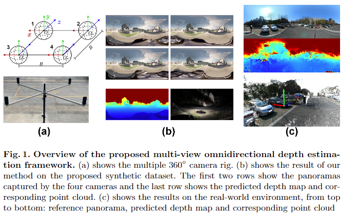  
**Fig.1 提案する複数視点全周深度推定フレームワークの概要**  
(a) 複数の360°カメラの取付器具。  
(b) 提案する合成データセットに置ける我々の手法の結果。  
最初の2行は4つのカメラによって撮影されたパノラマ映像。  
最後の行は推定した深度マップと、それに対応するpoint cloud。  
(c) 実世界環境での結果。上から順に「参照しているパノラマ画像」、「推定した深度マップ」、「深度マップに対応したpoint cloud」  

Wonらは4台の魚眼カメラから360˚の深度マップを推定する多視点法 SweepNet[30] と OmniMVS[31,32] を提案している。  
しかし、これらの手法も球面特徴量を抽出するために平面畳み込みを利用しており、魚眼カメラの死角が球面cost volumeに不連続性をもたらしている。  

本論文では、多視点全方位奥行き推定を2つのステージに分割する。  
第1段階では、全方位ステレオマッチングのため、異なる視点から複数のカメラペアを選択し、複数の視差マップを得る。  
第2段階では、視差マップを位置合わせされた深度マップに変換し、それらを融合して最終的な深度マップを推定する。  
異なるステレオペアの情報を融合させることで、最終的な深度マップの精度とロバスト性を向上させることができる。  
加えてフレームワークにおけるこの2つの要素は、それぞれ独立して学習およびfine-tuningを行うことができ、ハードウェアへの要求スペックを低くできる。  
全方位ステレオマッチングのエピポーラ拘束を単純化するためにカッシーニ投影 [2] を用いている。  
また、パノラマの歪みを克服するために球面特徴抽出モジュールを提案する。  

さらに本研究では、大規模な屋外全方位合成画像データセットであるDeep360を提案している。  
カメラレンズが泥、水滴、まぶしさなどで汚れた場合などに、様々な360◦奥行き推定手法の性能を評価するため、汚れたバージョンのデータセットも提供する。  

図1は提案する多視点全方位奥行き推定（MODE）フレームワークの概要を示しています。  
MODEは4台の360°カメラから正確な深度マップを推定します。  
本手法が様々なシーンで信頼性の高い深度マップを生成し、様々なデータセット(特に汚れたパノラマを含むデータセット)でSOTAを達成していることが、実験結果により示されました。  

これは提案フレームワークが堅牢であることを検証しており、フレームワークを任意の360◦マルチカメラのセットアップに拡張できることを示している。  

要約すると本研究の主な貢献は以下の通りである。  
- 柔軟な360◦奥行き推定フレームワーク MODE を提案し、汚れたカメラレンズやグレアに対して信頼性の高い奥行きマップを得ることができる。MODE はまたSOTAなパフォーマンスを達成している。  
- 360◦ステレオマッチングにおけるパノラマ歪みに対処するため、球面畳み込みを導入する。適切な投影法を用いることで、エピポーラ拘束を簡略化できることを証明する。  
この問題においてエピポーラ拘束を単純化するための適切な投影法の使用が不可欠であることを証明し、カッシーニ投影を導入する。  
360度ステレオマッチングのために、画像クロップを用いない詳細学習方法を採用している。  
- 高品質なパノラマ画像と汚れたパノラマ画像の両方を含む大規模な合成屋外画像データセット、Deep360を提示する。

# 2. Related Work

## 2.1. Deep Learning-based Stereo Matching Methods
ディープラーニングの手法は、ステレオマッチングにおける性能を大幅に向上させている。  
Zbontar and Lecunの提案手法であるMCCNN[36]は、CNNによって特徴を抽出し、マッチングコスト集計によって視差を計算している。  
GCNet [15]は特徴量マップによりcost volumeを構築し、3次元CNNブロックにより視差マップを求めている。  
PSMNet [4]は、特徴抽出に空間ピラミッドプーリングを採用し、回帰に階層的hourglassアーキテクチャを用いることで性能を向上させている。  
GA-Net [37]は、local-guided と semi-globalna aggrigation層を用いることで 局所的依存関係と、画像全体に渡る依存関係をそれぞれ捉える手法を提案している。  
AANet [33]は適応的な集計アルゴリズムを採用し、コストのかかる3D-CNNを置き換えることで効率的なアーキテクチャを実現している。  
Lipson らはRAFT-Stereo[19]を提案。multi-level GRU モジュールを採用し、正確な視差マップを推定している．
CFNet[25]はcascade および融合された cost volume をベースとしてネットワークを提案、ステレオマッチングにおけるロバスト性を向上させている。  
DispNet [20]とCRL [22]は左右視野の特徴相関を計算した上で、視差マップを推定する。  

近年ではmulti-view stereo（MVS）も急速に発展している。  
Yao らは、異なるビューの特徴マップを変形し、参照カメラの前方の平行平面に落とし込むことでcost volumeを構築し、奥行きマップを得る end-to-end MVSNet[35] を提案している。  
Point-MVSNet [5]は、特徴拡張された点群を採用し深度マップを反復的に改良している。  
Cascade-MVS[10]とCVP-MVS[34]は、マルチスケール粗微分アーキテクチャにより、性能を向上させる。  
これらのステレオマッチング手法は，通常の視野（FoV）を持つ透視カメラ用に設計されており，パノラマ画像の特性は考慮されていない。  

## 2.2 Omnidirectional Depth Estimation
最近，全方位奥行き推定のための学習ベースのアルゴリズムがいくつか提案されている．  
Zioulisらは，教師あり学習を用いた2つの単眼ネットワークを提案し[39]，正距円筒図法（ERP:Equirectangular Projection）領域におけるコンテキスト学習のために，CoordNet[38]にて追加の座標特徴を採用している。  
Wangら[28]は、パノラマの歪みを克服するために、ERPとCubeMap投影を組み合わせた単眼奥行き推定のためのBiFuseを提案している。  
JiangらはBiFuseを発展させ、より効率的な融合スキームによってより良い性能を達成するUniFuse[14]を提案している。  
Cheng ら[6]は全方位奥行き推定を部分的な奥行きマップの拡張とみなしている．  
Wangらは上下のステレオペアに対して，ERP領域で全方位奥行きを推定する360SD-Net[29]を提案している．  
また，CSDNet[18]は左右のステレオに着目し，球面歪みを解決するためにMesh CNNs[13]を用いている．  
しかし，これらの手法は，平面畳み込みで球面特徴を抽出するか[39,28,14,29]，球面エピポーラ拘束を簡略化しない[18]．  

多視点魚眼カメラに基づく全方位深度マップを得るための手法もある．  
Wonらは球面を走査したコストボリュームを構築し、コスト集計により球面深度を推定する SweepNet [30]を提案している。  
彼らはこのアルゴリズムを改良し、より良いパフォーマンスを達成する、End-to-EndのOmniMVS [31,32] アーキテクチャを提案している。  
しかし、これらの手法も球面特徴量の抽出に平面畳み込みを利用しており、魚眼カメラの死角が球面cost volumeに不連続性をもたらしている。

## 2.3 Omnidirectional Depth Datasets
学習アルゴリズムの学習・評価には、多様性富んだ大規模なデータセットが不可欠である。  
最近公開された全方位奥行きデータセットは、入力画像によって、パノラマ画像と魚眼画像の2つに分類される。  
これらのデータセットは、主に一般に公開されている実世界の3Dデータセットや合成3Dデータセットをレンダリングにより全方位データとして再利用して収集されたものである。  
パノラマを用いたデータセットとしては、Wang ら[27]が PanoSUNCG という屋内単眼 360◦ 映像データセットを[26]から収集し ている。  
De La Garanderieら[16]は、CARLA自律走行シミュレータ[8]から生成された200枚の画像による屋外単眼360◦ベンチマークを提供しています。  
MP3DとSF3D [29]は、[3,1]から収集した屋内2眼式360◦データセットである。  
Zioulisらによる3D60[38]は、[3,1,26,11]から収集した屋内3眼（中央、右、上）360◦データセットである。  
魚眼画像を用いたデータセットについては、Wonら[30,31,32]が3つのデータセットを提示している。  
Urban，OmniHouse，OmniThingsの3つのデータセットである．3つのデータセットとも、4つの魚眼カメラを用いてBlenderで仮想的に収集されたものです。  
魚眼画像は全方向の深度マップを推定するために補完的な情報を必要とし、それは不連続性とカメラの方向に対する要求を意味します。  
これに対しパノラマ画像は360◦すべての情報を死角なく連続的に記録する。  
しかし、上記のように、ステレオパノラマを用いたデータセット[29,38]は、屋内シーンのみで構成されている。  
全方位奥行きデータセットの詳細な概要は、表 2 に示すとおりである。  

# 3 Multi-view Omnidirectional Depth Estimation(複数視点全周深度推定)
## 3.1 Multi-view Omnidirectional Camera System(複数視点全周カメラシステム)

**カメラシステムの設定**  
本論文では、提案フレームワーク実装のために、Fig.1.（a）に示すようなカメラリグを使用する。  
4台の360◦カメラが同一水平面上に辺の長さBの正方形となるように配置されている。  
カメラには1～4の番号が振られており、 任意の2台のカメラで1組のステレオペアを構成し、 その組は全部で6組($C_4^2$)あります。  
各ステレオペアを次の様にカメラの番号で表現する。  
1-2、1-3、1-4、2-3、2-4、3-4（1-2はカメラ1と2の画像ペアを表します）  

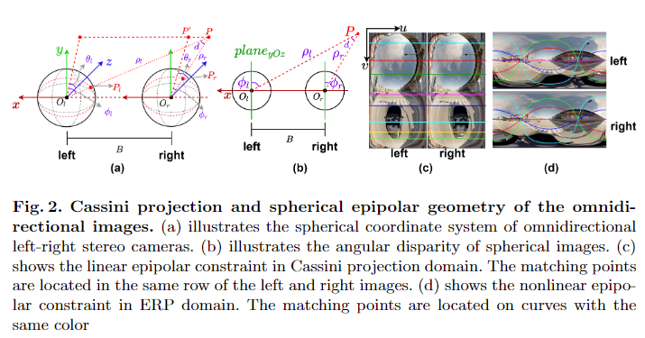  
**Fig.2. カッシーニ投影と全方位画像の球面エピポーラ幾何**  
(a) 全方位の左右組みステレオカメラの球面座標系  
(b) 球面画像上の角度視差  
(c) カッシーニ投影空間上の線形エピポーラ拘束。左右の画像の対応店は同一水平線上に配置される。  
(d) 正距離円筒座標の非線形エピポーラ拘束。マッチングする点は同色の曲線上に配置される。  

**球面投影とエピポーラ拘束**  
Fig.2 (a) に示す球面座標系 $(\rho, \phi, \theta )$ を次のように定義する。  
$\rho$ : カメラの光学中心 $O$ から点 $P$ までの距離  
$\phi$ : $OP$と$yOz$平面(右手系)とのなす角  
$\theta$ : 点 $P$ を $yOz$ 平面に射影した点を$P'$としたとき、$OP'$と$z$軸の正方向のなす角。  

これにより直行座標系(デカルト座標系)とカッシーニ球面座標系との変換は以下の様になる。  

$$
\left\{
  \begin{array}{l}
  x = \rho \sin(\phi) \\
  y = \rho \cos(\phi)\sin(\theta) \\
  z = \rho \cos(\phi)\cos(\theta)
  \end{array}
\right.
,
\left\{
  \begin{array}{l}
  \rho = \sqrt{(x^2 + y^2 + z^2)} \\
  \phi = \arcsin(\frac{x}{\rho}) \\
  \theta = \arctan(\frac{y}{z}) \\
  \end{array}
\right.\tag{1}
$$

ただし$\phi \in [-\frac{\pi}{2},-\frac{\pi}{2}], \theta\in[-\pi, \pi] $。  
[18]で説明されているとおり、広く使われているERP(正距円筒図法)の画像においては、球面上のエピポーラ線は正弦曲線として射影される(Fig. 2 (d))。  
そのため、ERP領域でのステレオマッチングは困難である。  
一方でカッシーニ投影領域においては[2]、エピポーラ線は次のマッピング関数により水平線として投影される。  

$$
\left\{
  \begin{array}{l}
  u = (\phi + \frac{\pi}{2})\cdot\frac{W}{\pi} \\
  v = (\theta + \pi)\cdot\frac{H}{2\pi}
  \end{array}
\right.\tag{2}
$$

ただし $(u, v)$ はカッシーニ投影した画像上のpixel座標を表し、$H, W$ は投影画像の幅と高さを表す(Fig. 2(c))。  
本論文では全方位ステレオマッチングのための線形エピポーラ拘束を達成するためにカッシーニ投影を採用する。  
Fig.2 (b) は球面ステレオにおける角度視差を説明している。  
球面上の対応点は同一の$\theta$を持つため、 角度視差 $d$ は$\phi$ の差分 $\phi : d = \phi_l - \phi_r$ として定義される。  
点 $P$ の左側カメラに対する深度は次式で算出される。  

$$
\rho_l = B\cdot\frac{\sin(\phi_r + \frac{\pi}{2})}{\sin(d)} = B\cdot[\frac{\sin(\phi_l + \frac{\pi}{2})}{tan(d)} - \cos(\phi_l + \frac{\pi}{2})]
$$

## 3.2 Network Architecture
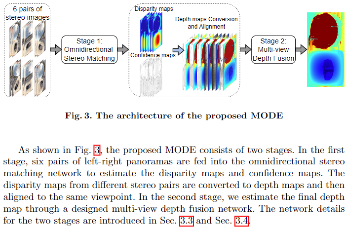  
**Fig.3 提案手法MODEのアーキテクチャ** 

Fig.3 に示すように、提案手法MODEは2つのステージから構成される。  
第1ステージでは、左右6組のパノラマ画像を全方位ステレオマッチングネットワークに入力し、視差マップと信頼度マップを推定する。  
異なるステレオペアの視差マップは深度マップに変換された後、同じ視点毎に整列される。  
第2ステージでは、設計された多視点深度融合ネットワークを通して、最終的な深度マップを推定する。  
この2ステージのネットワークの詳細は、Sec.3.3とSec.3.4で紹介する。  

## 3.3 Omnidirectional Stereo Matching with Spherical Convolution(球面コンボリューションによる全方位ステレオマッチング)

前述の様に整形した左右のパノラマ映像は、カッシーニ投影において線形エピポーラ拘束に従うが、パノラマの歪みは以前としてステレオマッチングに影響をもたらします。  
通常の畳み込みカーネルは、極付近の360◦画像の歪みに悩まされる。  
そこで、我々は球面畳み込みを用いた全方位ステレオマッチングネットワークを提案する。  

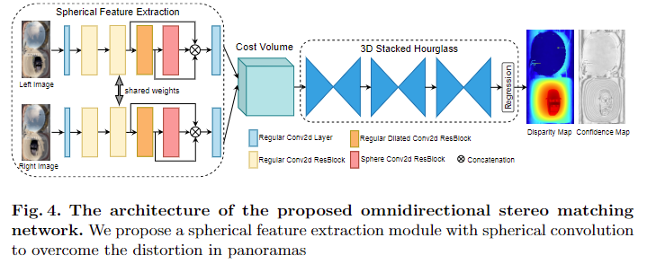  
**Fig. 4**. 提案する全方位ステレオマッチングネットワークのアーキテクチャ。  
球面コンボリューションを有する球面特徴量抽出モジュールによってパノラマ画像における歪みを克服する。  
Fig.4 に示すように、歪みを克服するために、球面畳み込みによる球面特徴抽出モジュールを構築する。  
球面畳み込み演算子は[7]に従って実装しCUDAで高速化した。  
Fig.5に球面畳み込みのカーネルサンプリングパターンと、通常の畳み込みとの比較を示す。

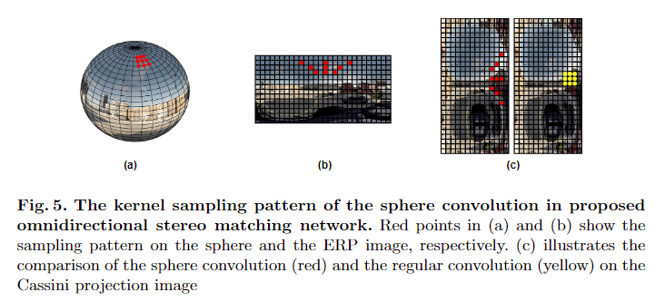  
**Fig.5** 提案する全方位ステレオマッチングネットワークにおける球体畳み込みのカーネルサンプリングパターン。  
(a) と (b) の赤い点は、それぞれ球面と ERP 画像上のサンプリングパターンを示している。  
(c)はカッシーニ投影上での球面畳み込み（赤）と通常の畳み込み（黄）の比較。

提案する球面特徴量抽出モジュールには4つのresidual blockが含まれる[12]。  
パラメータの詳細はTable 1を参照。  

**Table 1. 球面特徴量抽出モジュールのパラメータ**  
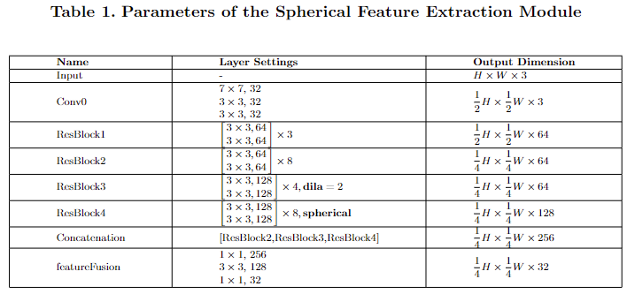  

ResBlock3では、より大きな受容野のために、拡張畳み込みを適用している。最後の残差ブロックでは球面畳み込みを適用し、球面画像に対する高次の意味・文脈特徴を学習する。
ResBlock2、ResBlock3、ResBlock4の出力を連結し、特徴融合層を介して異なる種類の畳み込みによって抽出されたこれらの特徴マップを融合させる。  
球面特徴抽出後、ステレオパノラマの特徴マップをシフトして連結し、cost volumeを構築する。
次に，[4]と同様に，全方位視差マップを3次元stacked hourglassで回帰させる．  
このときネットワークの学習には、Smooth L1 Lossを適用する。  
さらに，多くのステレオマッチングアルゴリズム[4,33]は，ネットワーク入力として画像のランダムクロップ（random crop）を用いている．  
しかし，球面投影画像上の切り出し領域が異なると，画像の歪みにより高次の特徴空間において異なる分布となる。  
そこで，より良い性能を得るために，提案ネットワークの入力としては切り抜きなしの全方位画像を用いる。

## 3.4 Multi-view Depth Map Fusion(複数視点の深度マップの融合)
提案フレームワークの第二ステージは、信頼度マップと参照パノラマを組み込んだ深度マップの融合ある。  
信頼度マップは多くの最近の研究において、視差マップの信頼度を推定するために使用されている。  
[23]ではステレオマッチングのための信頼度推定の分野での発展をレビューし，既存の信頼度指標を評価している。  
まず式2および式3に従って全方位視差マップを深度マップに変換する．  
次に、外部パラメータ行列と視認性に基づいて、すべての深度マップを同じ視点に揃える。
ステレオマッチングネットワークは各視差値をすべての視差仮説にわたる確率加重和で計算するため，仮説に沿った確率分布は視差推定の品質を反映する[35]．  
3つの最も近い視差仮説の確率和(推定された視差が1ピクセル誤差の要件を満たす確率に相当)を取ることによって、各推定視差値の信頼度を計算する。  
MODEの第2ステージにこの信頼度マップを追加することで、信頼度が高いほど融合時の重みが増すという追加の情報を与える。  

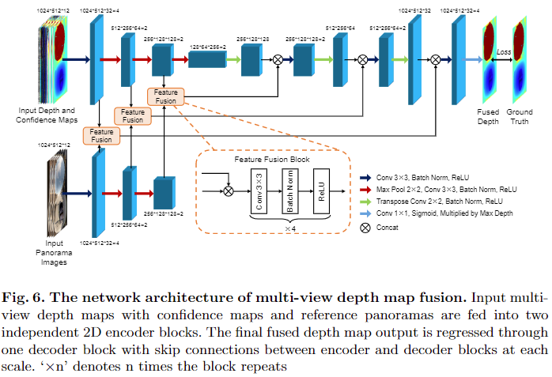  
**Fig.6 多視点深度マップ融合のネットワークアーキテクチャ**  
入力の信頼度マップつきの多視点深度マップと参照パノラマ画像は2つの独立したエンコーダーブロックに入力される。  
最終的な融合深度マップの出力は、各スケールにてエンコーダーブロックとデコーダブロック間をskip connectionしながら1つのデコーダーブロックに回帰される。  
図中の$'\times n'$はブロックの繰り返し回数を表す。  

To extract boundary features from panoramas independently, we separate the encoder block for panoramas from that for depth and confidence maps (shown at the bottom left of Fig. 6). 
Then, these two kinds of feature maps are fused through a designed feature fusion block at multi-scale to form a more informative feature map. 
The final fused depth is computed as

提案する深度マップ融合ネットワークのアーキテクチャを図 6 に示す。  
全体的にはネットワーク設計は[24]のアーキテクチャを踏襲しており、グローバルコンテキスト抽出のためのエンコーダ・デコーダパスと、正確な深度値の伝送とローカライズのための2ブロック間のskip connectoinで構成されている。  
深度マップとそれに対応する信頼度マップに加え、参照パノラマ画像を追加して、融合深度マップに正確な境界情報を提供する。  
パノラマから独立して境界の特徴を抽出するために、パノラマ用のエンコーダブロックと深度マップ・信頼度マップ用のエンコーダブロックを分離します(Fig. 6左下)。  
そして、この2種類の特徴マップをマルチスケールで設計された特徴融合ブロックを通して融合し、より情報量の多い特徴マップを形成する。  
最終的に融合された深度は次のように計算される。  

$$
\hat{y}(\theta, \phi) = d_{max}\cdot\frac{1}{1+e^{-D(\theta, \phi)}},\tag{4}
$$
ここで、$d_{max}$ は最大深度、$D$はデコーダーブロックで回帰された正規化された深度マップである。  
ロス関数では、スケールに対して不変なエラー(SILog)[9]からtraining lossを開発した。  

$$
Loss(\hat{y} y^\star) = \frac{1}{n}\sum_i d_i^2 - \frac{\lambda}{n^2}(\sum_i d_i)^2\tag{5}
$$
$$
d_i = \log \hat{y}_i - \log y^{\star}_i, \tag{6}
$$

$\hat{y}$は推定された深度マップ, $y^\star$ はground truthであり、 $\lambda \in [0, 1]$ とする。  
実験では文献[9]に従い、 $\lambda = 0.5$とした。これは、スケール不変の深度誤差と絶対スケールでの誤差の平均をとるということである。  

# 4. Datasets
Each frame consists of six pairs of rectified panoramas, which cover all the pairwise combinations of four 360◦ cameras, six corresponding disparity maps and one ground truth depth map. 
All these images and maps have a resolution of 1024 ×512.

2.3 節でまとめたように、全方位奥行き推定のためのデータセットが多く提案されているが、現実世界では360◦の屋外3Dデータセットの取得が困難なため、屋外道路シーンの360◦ステレオデータセットが存在しない。  
そこで、自律走行シミュレータCARLA[8]をベースに、パブリックな360◦マルチビューデータセットDeep360を作成します。Fig. 7は、このデータセットのいくつかの例を示している。
各フレームは6組の生計済み済みのパノラマ画像ペアで、4台の360◦カメラのペアのすべての組み合わせをカバーし、6つの対応する視差マップと1つのグランドトゥルースの深度マップが含まれています。  
これらの画像とマップはすべて1024 ×512の解像度です。  

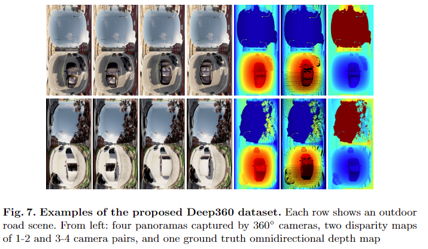  
**Fig. 7 提案データセットDeep360 の例**  
各行は屋外の道路シーンを表す。  
左から順に: 4つの360°カメラによるパノラマ画像, 2つのカメラペア(1-2, 3,4)の視差マップ, 最後が全方位深度マップのground truth。  

バラエティに富んだリアルな360◦屋外道路シーンを取得するため、CARLAの360◦カメラ搭載車に6つの町を自動走行させ、多くのランダムなアクター（歩行者や車両）を発生させる。  
また、自律走行における過酷な状況下での360◦奥行き推定アルゴリズムの学習・評価に使用できるDeep360データセットの汚染版を提供する。  
Deep360(汚染版)データセットは、泥の斑点、水滴、まぶしさという3つの一般的な屋外要因によって汚れたり影響を受けたりしたパノラマを含んでいます。  
Fig.8 は、本データセットに含まれる3種類の汚れたパノラマを示したものです。  
 提案するデータセットと他の360◦データセットの概要をTable. 2に示す。  

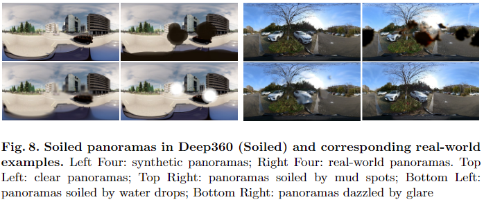  
**Fig. 8 Deep360の汚染パノラマ画像と、対応する実環境例**  
左の4枚が合成画像、右の4枚が実写画像。 左上 : 綺麗なパノラマ, 右上 : 泥で汚れたケース, 左下 : 水滴がついてるケース, 右下 : グレアでまぶしいパターン。  

**Table 2. 提案ンデータセットと既存のデータセットの概要**  
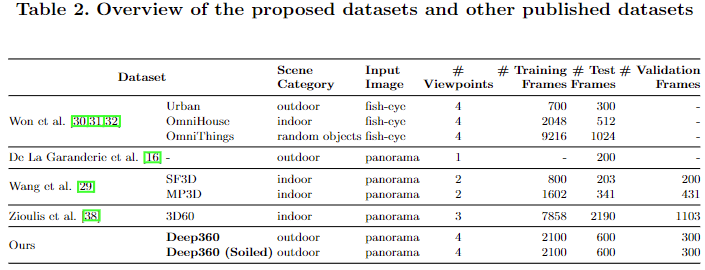  

# 5 Experiments

## 5.1 Experimental Settings
**Datasets(データセット)**  
提案フレームワークをDeep360および広く使用されている3D60にて学習、評価した。  
この2つのデータセットにより屋外および屋内のシーンをカバーすることができる。  
Deep360では、4視点すべてのパノラマを使用して、多視点設定のMODEの性能を検証しています。  
3D60では3視点のうち視点のビューのパノラマを使用して、2視点設定でのMODEのパフォーマンスを検証しています。  
トレーニングの詳細については、補足資料をご覧ください。  

**Evaluation Metrics(評価指標)**  
提案フレームワークの定量的評価には、MAE(平均絶対誤差)、RMSE(二乗平均誤差)、$Px1,3,5$ （画素誤差 > 1,3,5 となる外れ値の割合）、D1[21](画素誤差が>3 および >5% の外れ値の割合を用いて、視差結果を評価している。  
MAE，RMSE，AbsRel(絶対相対誤差)，SqRel(二乗相対誤差)，SILog[9] (スケール不変対数誤差)，$\delta 1，2，3$ [17]($\max(\frac{\hat{y}}{y^\star}, \frac{y^\star}{\hat{y}}) < 1.25, {1.25}^2, {1.23}^3$の閾値における精度) を用いて深度結果を評価した。

## 5.2 Experimental Results
まず、データセットDeep360においてMODEの全方位ステレオマッチングネットワークを評価する。  
優れたステレオマッチングアルゴリズムであるPSMNet [4]とAANet [33]、および全方位型アルゴリズム360SD-Net [29]と比較します。  
360SD-Netは上下方向の360◦ステレオ用に設計されているため、左右方向のステレオマッチング用にモデルの一部を変更した。  
PSMNetとAANetについては、著者らが事前に学習したモデルを用い、そのハイパーパラメータに従って、Deep360上でfine-tuningを行った。  
Table.3の定量的な結果から、球面特徴学習を用いた我々のステレオマッチングネットワークは、360◦ステレオマッチングにおいてSOTA性能を達成していることがわかる。

**Table 3. Deep360データセットにおけるステレオマッチングの定量的な結果**  
こちらは、視差エラーの指標である。  
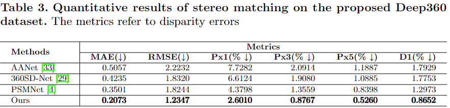  

SOTAな全方位奥行き推定手法と比較することで、フレームワーク全体を評価する。  
Deep360上のSOTA作品の性能を提示するために、単眼UniFuse [14]、両眼CSDNet [18]、360SD-Net [29]、マルチビューOmniMVS [31] など様々な手法をテストする。  
これら全てのモデルは、著者らによる事前学習済みモデルでfine-tuuingされている。  
Table. 4とFig. 9に示すように、MODEフレームワークは、異なるデータセット、特に汚れたパノラマを含むデータセットにおいて、SOTAな全方位奥行き推定法と比べても良好な性能を発揮することがわかった。  
さらに、異なる360◦マルチカメラのセットアップを持つデータセットでの性能の一貫性を見ることで、フレームワークの拡張性を検証する。  
OmniMVSは魚眼画像しか入力にできないため、3D60での結果はない。そこで、OmniMVS の学習・評価を行うために、Deep360 データセットの魚眼版 を作成した。  
ERP領域(正距円筒画像)での360◦奥行き推定を評価、結果を示す。  

**Table 4. 各データセットごとの全方位深度推定手法の定量的な比較**  
指標は深度の誤差。
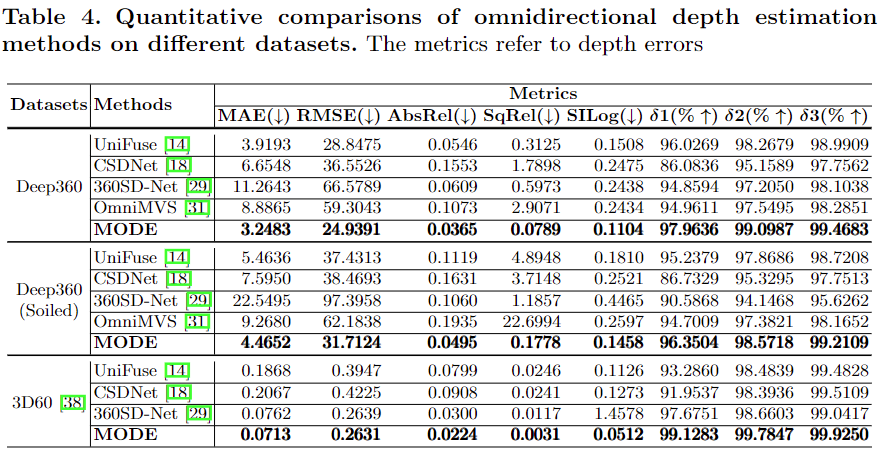  

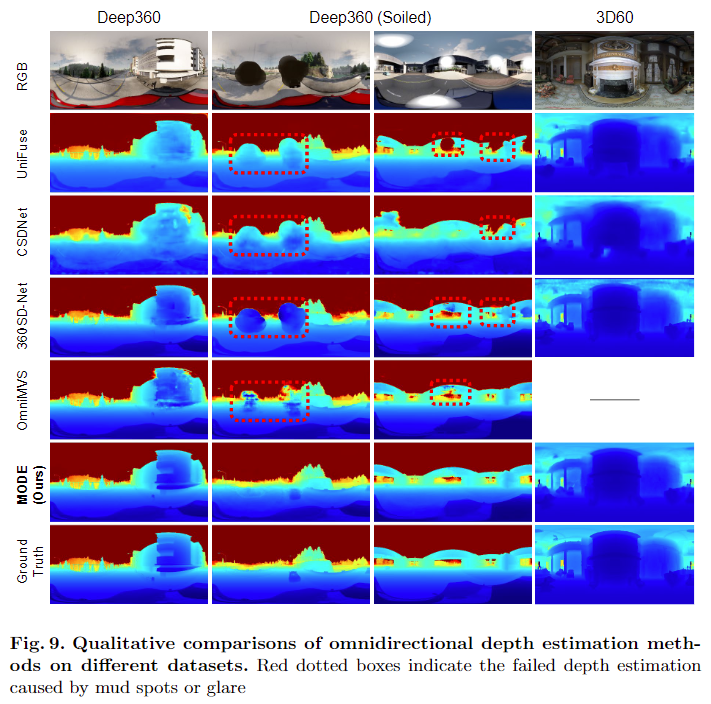  
**Fig. 9. 各データセットごとの全方位深度推定手法の定性的な比較**  
赤破線矩形は泥汚れやグレアによる深度推定の失敗を示す。  

## 5.3 Ablation Studies
Table 5は、全方位ステレオマッチングネットワークのablation studyである。  
この結果より、切り抜きなしのパノラマを使用し、球面畳み込みを適用することで、性能が向上することがわかる。  
Table 6は深度マップ融合ネットワークのablation studyを示している。  
この結果より、融合ステージが深度マップの品質を向上させることが示される。  
表の行から、ネットワークに各コンポーネントを追加することにより、徐々に改善されていく事が分かる。  

**Table 5. Deep360 における 全方位ステレオマッチングのablation studiy**  
画像クロップの有無と球面convolution(SC)にちついて比較を行った。  
指標は視差エラー。  
提案ステレオマッチングネットワーク性能を入力画像のクロップの有/無及び球面convolutionの使用について計算した。  
指標は視差エラー。  
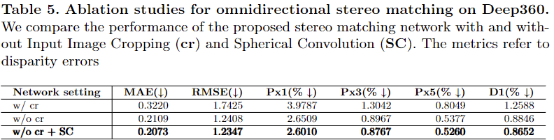  

**Table 6. Ablation studies for the multi-view depth map fusion network on Deep360 (Soiled).**  
Different components used by our depth map fusion network are denoted as: Encoder-Decoder and Skip Connection architecture (En-De-SC); incorporation of reference panoramas (img); incorporation of confidence maps (conf ). 
1行目は融合なしの結果(ステレオマッチングステージの結果)である。  
2行目のネットワークは本研究のベースラインであり、2次元畳み込み層を積み重ねたものである。  
本研究の深度マップ融合ネットワークで使用される様々なコンポーネントを以下のように表記する。  
エンコーダ・デコーダ・スキップ接続アーキテクチャ(En-De-SC)  
参照パノラマの組み込み(img)  
信頼度マップ(conf)の組み込み  
指標は深度エラー。  
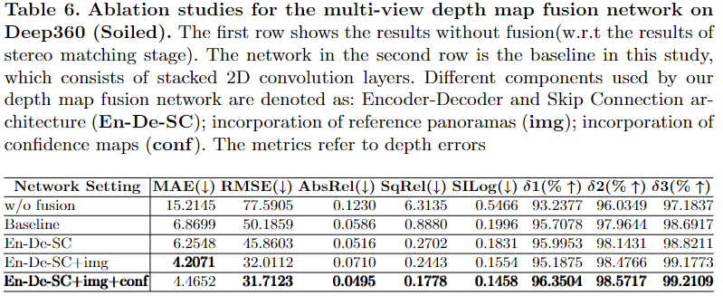  

# 6 Conclusions
本論文では360◦カメラからの多視点全方位奥行き推定のための2段階フレームワークMODEを提案した。  
左右組の360◦カメラの線形エピポーラ拘束を達成するためにカッシーニ投影を採用し、全方位ステレオマッチングの性能を向上させている。  
球面畳み込みの使用によりパノラマの歪みを効果的に克服している。  
多視点深度の融合はは、冗長設計によりフレームワークのロバスト性を向上させる。  
実験結果から、提案するMODEは屋内外のデータセットでSOTAの性能を達成し、カメラレンズの汚れや映り込みに対してロバストであることが示された。  
このフレームワークは、任意の360◦マルチカメラのセットアップに対応しています。 
加えて、高品質なパノラマと汚れたパノラマの両方を含む大規模な合成道路シーンデータセットも提供する。
最後に、合成データで学習したモデルを用いて実環境でテストを実施し提案するフレームワークの汎用性と頑健性を検証した。  

**Acknowledgements**  
南京大学先端微細構造協創センター高性能計算機センターと南京先端人工知能研究所から提供された計算資源に謝意を表する。
