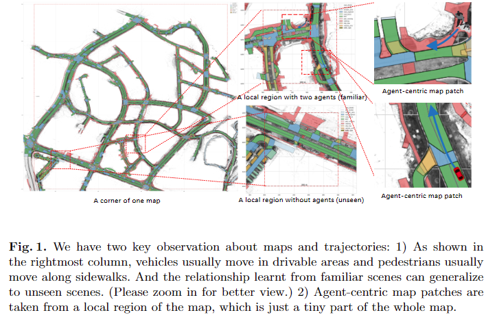
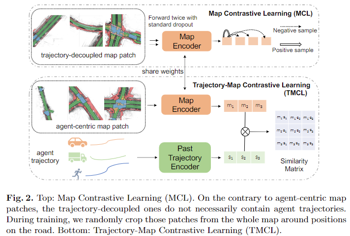
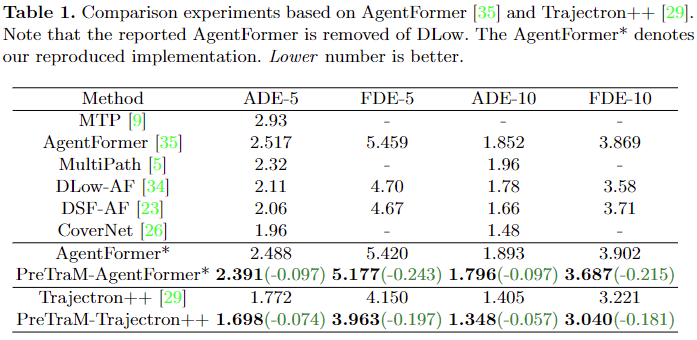
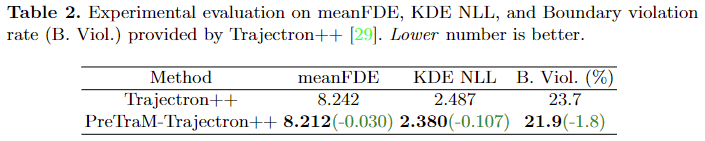
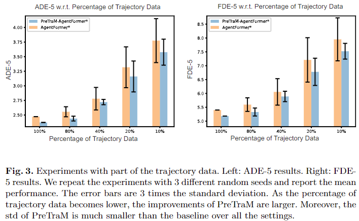
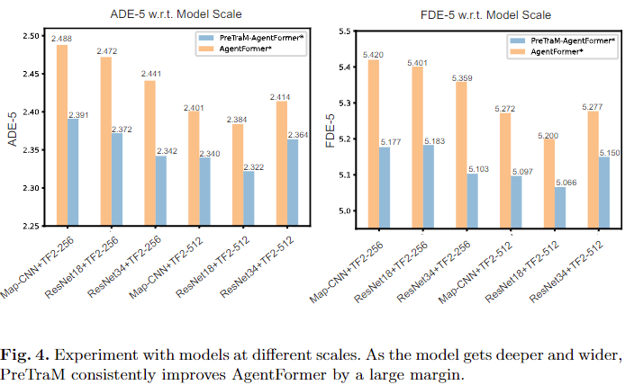
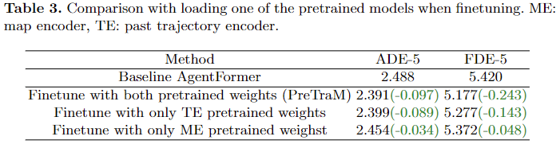
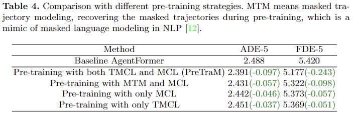

# PreTraM: Self-Supervised Pre-training via Connecting Trajectory and Map

# Abstract
近年、ディープラーニングは軌跡予測において大きな進歩を遂げている。  
しかし、軌跡データが乏しいことが、データ喰らいなディープラーニングモデルが優れた表現を学習することを 妨げている。  
コンピュータビジョンや自然言語処理では、表現学習のための事前学習手法が存在するが、それも大規模なデータを必要とする。  
軌跡データが不十分なため(例えば、nuScenesデータセットでは34Kサンプルしかない)、軌跡予測においてそれを成功させることは難しい。  
軌跡データの不足を回避するために、軌跡と密接に関連する別のデータモダリティ、すなわち、既存のデータセットに豊富に含まれるHD-mapsに頼ることにあうる。  
本論文では軌跡予測のために、軌跡とマップを結びつける事によりself-supervisedな事前学習を行う手法であるPreTraMを提案する。  
PreTraMは以下の2つの部分から構成される。  

1) 軌跡-マップ間 対照学習:  
クロスモーダルな対照学習により、軌跡と地図を共通の埋め込み空間へ投影する。  
2) 地図対照学習：  
大量のHD地図に対して対照学習を行い、地図の表現力を強化する。  

AgentFormer や Trajectron++　といった一般的ベースラインと比較し、PreTraMはnuScenesデータセットにおいて、誤差を各手法において5.5%、6.9%削減している。  
PreTraMがデータ効率を向上させ、モデルサイズに良くスケールすることを示します。  
コードと事前学習済みモデルは、https://github.com/chenfengxu714/PreTraM で公開予定です。

**Keywords** :  
Trajectory Forecasting, Self-Supervised Learning, Pre-training, Contrastive Learning, Multi-modality

# 1 Itroduction
軌跡予測は、過去の軌跡と周囲の情景を条件として将来の軌跡を予測することを目的とした、自律走行における難しいタスクである。  
現在の深層学習モデルは、データ駆動型の教師あり学習による軌跡予測が主流となっています。  
しかし、軌跡データは高度なセンサーシステムを搭載した車両によって収集されることもあり、収集もアノテーションも非常に困難であり、コストもかかる。  

  
**Fig. 1**  
地図と軌跡については2つの重要な観点がある:  

1) 最右の列に示すように、通常、車両は走行可能な場所を、歩行者は歩道を移動する。  
また、見慣れたシーンから学習した関係は、見たことのないシーンにも一般化できる。(図を拡大するとよく見えます。)   
2) エージェント中心の地図パッチは、地図全体のごく一部である局所領域から取得される。  

アノテーターは、オブジェクトにラベルを付け、位置を関連付け、軌跡を生成し平滑化する必要がある。  
この複雑な手順はデータの規模を大きくする枷となっている。  
この分野でポピュラーなオープンソースの軌跡予測データセットnuScenes [3]は34Kサンプルしかなく、初歩的な小規模画像データセットMNISTの60Kサンプル[10]に比べてはるかに少ない。  
軌跡データの少なさがモデルに優秀な軌跡表現を学習することをさまたげ、それにより性能が低下している。  
自然言語処理（NLP）やコンピュータビジョン（CV）の分野では、膨大なラベル無しデータセットを用いた自己教師付き事前学習が、言語・視覚表現の学習に有効であることが分かっている。  
古典的な手法である自己回帰言語モデリング[2]、Masked-Autoencoder[12]、対象学習[6, 18]は概念的には単純であるが、何十億もの学習データを必要とする。  
最近の手法であるCLIP[28]の結果では、クロスモーダル対照学習は事前学習データが非常に少ない(4倍程度)が、依然として利用可能な軌跡データよりはるかに多いデータ量が必要であることが示されている。  
大規模なラベルなしデータセットが存在するNLPやCVとは異なり、軌跡データセットを拡張するためのボトルネックは、データ収集とアノテーションにあります。  
このため、軌跡予測では、既存の事前学習スキームから恩恵を受けることが重要な課題となっています。  
我々の知る限り、軌道予測において事前学習について検討した研究はほとんどない。  
軌跡の不足を補うために、我々は軌跡と密接に関連する別のデータ様式、すなわちHD-mapsを頼りにする。  
実際、我々は地図について二つの重要な事実を観測している:  

- エージェントの軌跡は周囲の地図と相関がある[13, 24]  
代表例としては、軌道の形状は通常HD-mapのトポロジーに従うことが上げられる。  
Fig.1 右端列に示すように、通常、車両は走行可能な領域を移動し、歩行者は歩道に沿って移動する。 
さらに重要なことに、あるシーンでの軌跡と地図の関係は他のシーンにも一般化できる。  
例えば、Fig.1 の中央のシーンでは、モデルは上のシーンから、移動する車は道路の境界に沿って移動すべきであると学習する。  
この関係を捉えることで、モデルはまだ見ぬ下のシーンにいる車も道路の境界線に沿うはずだと知ることができる。  
- 軌跡予測における既存研究は、少なくとも1つの注釈付き軌跡を含む局所領域であるエージェント中心マップパッチのみを利用し、より広い領域をカバーするマップの他の部分を著しく利用しにくくしています。  
Fig.1に示すように、エージェント中心のマップパッチは、左端のグローバルマップと比較すると非常に小さい。  

上記の考察に基づき、我々は軌跡予測のための軌跡とマップをつなぐことで自己教師付き事前学習を行う方式であるPreTraMを提案する。  
具体的には、2つの方法を用いてモデルの軌跡エンコーダとマップエンコーダを連携して事前学習する。  
1) Trajectory-Map Contrastive Learning (TMCL):  
CLIP[28]を参考に、軌跡と対応する地図パッチを対照学習させ、両者の関係をモデルにとらえさせる。  
2) 地図対比学習(MCL):  
軌跡から切り離された大量の地図パッチを対照学習することで、より強力な地図エンコーダを学習する(エージェント中心の地図パッチより782倍多い)。  

PreTraMはTMCLとMCLの相乗効果:  
TMCLによって地図表現と軌跡表現を橋渡しすることでより良い軌跡表現を学習するので、軌跡エンコーダはMCLによって強化された地図表現の恩恵を受ける。  

本手法はnuScenesデータセット[3]において一般的な予測モデルであるAgentFormer[35]やTrajectron++[29]それぞれに対して誤差を5.5%と6.9%削減することができる。  
さらに重要なことは、利用可能なデータが少ない場合でもPreTraM はより大きな性能向上を達成することができることである。  
印象的なことにAgentFormerにPreTraMを適用すると、70%の軌跡データを用いただけで100%の軌跡データで学習したAgentFormerよりも優れた性能を発揮することがわかった。  
これは、本事前学習方が強力なデータ効率をもたらすことを示している。  
くわえて、AgentFormerの大規模バージョンにPreTraMを適用した場合も、モデルのスケールアップにあわせ予測精度が一貫して向上することを確認しました。  
また、十分なablation studyを行い、PreTraMがどのように機能するかを明らかにした。  

要約すると我々の主な貢献は以下の通りです。
- 軌跡とマップを連携させることで、軌跡予測のための新しい自己教師あり事前学習方式であるPreTraMを提案  
PreTramは軌跡-マップ対照学習とマップ対照学習から構成される。  
- PreTraMがFDE-10において、一般的ベースラインと比較して最大6.9%の相対的な改善を達成することを実験で示した
- PreTraMは予測モデルのデータ効率を向上させ、70%の学習データを使用でありながら、100%の学習データを使用するベースラインに勝り、モデルを大きくした際も性能がスケールする。  
- ablation studyと解析を通じて、TMCLとMCLそれぞれの有効性を実証し、PreTraMの仕組みを明らかにした。

# 2 Background

## 2.1 Problem Formulation of Trajectory Forecasting(軌道予測の定式化)
軌跡予測とは、あるシーンに置ける複数の対象エージェントの未来の軌跡を予測しようとする行為である。  
典型的な問題設定では、全てのエージェントの履歴状態 $x$ の集合および周辺の HD-mapのパッチ集合 $M$ をモデル$f_\omega$ に入力し、各エージェントの未来の軌跡　$y = f_\omega (x, M)$ を予測する。  
HD-map(高精度地図)には豊富な意味情報が含まれる(例えば、走行可能エリア、停止線、信号機など)[3]。  
本論文では各エージェント周辺のラスタライズされた見下ろし視点の意味画像のパッチ集合 $M$ を採用する。
すなわち $M = \{m_i\}_{i \in \{1,...,A\}}, m_i \in \mathbb{R}^{C\times C\times 3}$、ここで$C$はコンテキストのサイズを表し、$3$はRGBのチャネル数を意味する。  
HD-mapにおいては、各色には特定の意味が割り当てられている。  
履歴状態については、シーン中のエージェントの数を$A$とした上で、履歴の期間を$T$とすると、 $X = s_{1,...A}^{(-T:0)} \in \mathbb{R}^{T \times A \times D}$と表す。  
ここで、$s_i$はエージェント$i$の履歴状態を表し、$0$は現在のtime stepを表す。  
$D$は通常エージェントの2次元もしくは3次元の座標位置に割り当てられる特徴量の次元、向きや速度等のその他の情報である。  

## 2.2. Contrastive Learning
対照学習は[6-8,18]によって普及した、自己教師あり表現学習の強力な手法である。  
彼らはインスタンス識別を事前学習の課題として、意味的に近い要素は(特徴量空間上)近くなるように、意味的に近くない物は遠くになるようにする[14]。  
例えばSimCLR [6]では入力のミニバッチが与えられると、各入力$x_i$は正のサンプル$x^+_i$に変換される。  
ここで$h_i,h^+_i$を$x_i, x^+_i$の隠れ表現とする。   
N組の$(x_i,x^+_i)$のミニバッチに対して、InfoNCE Loss[25]を学習の目的関数として採用する。   
特に興味を示したのはNLPにおける対照学習を探求したSimCSE [14] です。  
単語置換や削除をaugumentationに使うのではなく、モデル中の異なるドロップアウトマスクをポジティブサンプルに対する最小限のaugumentationとして使うのである。  
この単純なアプローチは、他のaugumentation操作と比較して、テキストの意味性を完全に保持するという点で非常に効果的であることが判明している。  
また、HD-mapの意味情報を保持するために、マップの対照学習においてもポジティブサンプルに対してドロップアウトを適用する。  
最近ではCLIP[28]が、膨大なデータを条件としたクロスモーダル対照学習の威力を実証した。  
これは、インターネットからペア画像とキャプションを収集し、大きなバッチを使って、画像と対応するテキストをペアリングをモデルに学習させる。  
画像$I_i$とテキスト$T_i$の$N$組のミニバッチに対して、それらの隠れ表現を$(h^I_i ,h^T_i)$とし、画像とテキストのすべての組に対する$N\times N$の類似度行列にクロスエントロピーlossを適用し、以下のようにあらわす。  

$$
l_i=-\log\frac{e^{sim(h_i^I,h_i^T)/\tau}}{\sum_{i=0}^Ne^{sim(h_i^T, h_j^T)/\tau}} \tag{1}
$$

ここで、$sim(\cdot ,\cdot)$は類似度の指標で、典型的にはcos類似度を使用し、$\tau$は温度パラメータである。  
これは、対応するテキストを画像の正サンプルとして用いたInfoNCE lossと見ることができることに注意。   
直感的には、画像をとらえるものとして自然言語を用いることでCLIPは画像とテキストを共有の埋め込み空間に置く。  
その上、式(1)は画像とテキストの正しい組の間の類似性を強制するため、画像とテキストの関係のパターンを学習することができる。  
この直感に従って、軌跡と地図、両者の関係を捉えるための軌跡地図の対比学習目標を設計する。

# 3. Method
軌跡と地図をつなぎあわせた新しい自己教師付き事前学習スキーム（PreTraM）を提案する。  
これにより、小規模な軌跡データと大規模な地図データがある場合であっても、軌跡と地図表現を強化することが出来る。  
軌跡エンコーダとマップエンコーダを共同で事前学習させ、軌跡-マップ間の関係を特徴表現にencodingすることで、良好な軌跡表現を得ることができる。  
Fig. 2に示すように提案手法PreTraMは以下の2つの要素で構成されます:  

1) マップエンコーダと軌跡エンコーダの間で行われる単純な軌跡-マップ対照学習(TMCL)  
ここでは有限の軌跡と対応付けされた地図パッチを使用する。  
2) 大きなバッチサイズを用いたマップエンコーダ上で行う単純な地図対照学習学習(MCL)。  
これはエージェントの軌跡を必ずしも必要とはしない。  
事前学習後、学習済み重みをロードし、オリジナルモデルと同じ学習スケジュール、目的関数でfine-tuningを行う。

  
**Fig2.**  
上：地図対照学習(MCL)  
エージェント中心の地図パッチとは異なり、軌跡分離型の地図パッチは必ずしもエージェントの軌跡を含まない。  
学習中、地図全体からランダムに道路上に位置するパッチを切り出す。
下: 軌跡-地図対照学習(TMCL)。  

## 3.1. Trajectory-Map Contrastive Learning (TMCL) (軌跡-地図間の対照学習)
軌跡エンコーダとマップエンコーダの両方を促進させる、クロスモーダル対照学習法を提案する。 
具体的には、シーンのミニバッチが与えられたとき、全ての入力履歴状態$x$に対し、それらをエージェント毎の軌跡に分割し*独立に*扱う、すなわち、$S = \{s_i|s_i\in x,\forall x \in B\}$ (Bはミニバッチを表す)。  
各エージェントに対して、HD-mapからエージェントの現在位置周辺の中心マップパッチを切り出し、$N_{traj} = |S|$ 組の相関する軌跡とHD-mapパッチの組$(s_i,m_i)$を得る。  
また、一般的な方法に従い、エージェントの向きに対してマップを回転させる[29, 35]。  
モデルは各軌跡 $s_i$ をミニバッチ内の全てのマップパッチの中からペアとなるマップパッチ$m_i$ とマッチングさせることが要求され、逆も同様である。
Fig. 2下段に示すように、軌跡とマップを対応するエンコーダに入力し、特徴量$\{h^{traj}_ i \}, \{h^{map}_i\}$を得る。  
そして、ミニバッチ内の全ての軌跡と地図のペアの類似度行列を計算する。  
なお、隠れ層表現$h$については、地図エンコーダと軌跡エンコーダの後に線形写像層[28]を適用するが、簡単のため図では省略している。   
これは3.2節のMCLの場合と同じである。  
最後に、これらの類似度スコアに対して、以下のように対称クロスエントロピ損失を最適化する[28]。

$$
l_i^{TMCL} = -\log\frac{e^{sim(h_i^{traj}, h_i^{map})/\tau_{traj}}}{\sum_{j=1}^{N_{traj}}e^{sim(h_i^{traj}, h_j^{map})/\tau_{traj}}} \tag{2}
$$

この目的関数により、軌跡と地図の正しい組の類似度を最大にし、それ以外の組の類似度を最小にする。   
その結果、軌跡と地図の埋め込み空間が共有される。  
地図と軌跡を融合して予測を行う予測モデルは、このような共有された埋め込み空間から恩恵を受けることが発見されている。 
これは、映像-言語タスクのモデルが、視覚と言語入力のために揃えた埋め込み空間から恩恵を得るという[20]の知見と一致するものである。  
TMCLの目的関数は、地図と軌跡の間の関係を表現に取り込むことをモデルに教える。  
この関係を捉えることにより、軌跡の埋め込み表現には、入力軌跡を条件とする基礎となる地図の情報が含まれ、予測器の将来の軌跡の幾何学的および経路情報を示唆する。  

## 3.2. Map Contrastive Learning (MCL) (地図の対照学習)
軌跡と地図の関係性の学習をより促進するために、地図対照学習により一般的な地図表現を学習する。  
各訓練iterationにおいて、データセット中のHD-Mapのランダムな部分集合から、$N_{map}$個のマップパッチをランダムに切り出す。  
$N_{map}$はエージェント数$A$よりはるかに大きいことに注意する。  
多数のマップパッチを用いることに加え、MCLを効果的に働かせるための重要な要素は、全く同一のインスタンスをその正のサンプルとして用いる、すなわち、$m^+_i = m_i$とし、マップエンコーダにドロップアウトを適用することである[14]。  
マップエンコーダーを$g_\theta$、$z$をドロップアウト用のランダムマスクとしたとき、隠れ層表現は$h^z_i = gθ(mi,z)$となる。  
Fig. 2の上部に示すように、異なるドロップアウトマスク$z，z′$を用いた2つの別々のフォワードパスで、同じマップパッチをエンコーダーに送る。  
これにより,各$m_i$について2つの表現$h^z_i ,h^{z′}_i$を得る。  
ドロップアウトのおかげで，$h^z_i$と$h^{z′}_i$は異なりながらも、同じトポロジーとセマンティックを符号化します．  
一方、ランダムな回転，反転，ガウスノイズ，カラージッターといったCVで良く用いられるaugumentation操作は，ここでは役に立たない。  
ガウスノイズやカラージッターはHDマップの意味を変えてしまうし、フリップやローテーションはそのトポロジーを変化させてしまう。  
そのかわり、ドロップアウトは正サンプルの最小限のaugumentationとして機能し、実験により有効であることが判明した。 
ドロップアウトと他の補強との比較実験を補足資料のセクション2に示す。 
形式的に、MCLの学習目的は以下の通りである。

$$
l_i^{MCL} = -\log\frac{e^{sim(h_i^{z_i},h_i^{z'_i})/\tau_{map}}}{\sum_{j=1}^{N_{map}} e^{sim(h_i^{z_i},h_j^{z'_j})/\tau_{map}}} \tag{3}
$$

MCLがHDマップの新しい利用法であるのは、HDマップのあらゆる部分使えるからというだけでなく、学習の目的設定をカスタマイズし、より良くHDマップを利用できるようにしたからであることは特筆に値する。  

## 3.3. Training Objective(学習の目的関数)
PreTraMの手法はTMCLとMCL結合することで成る。  
全体の目的関数は、両者の目的を結合したもので、次式で与えられる。

$$
\mathcal{L} = \displaystyle{\sum_{i=1}^{N_{traj}}}l_i^{TMCL} + \lambda\displaystyle{\sum_{i=1}^{N_{map}}}l_i^{MCL} \tag{4}
$$

# 4. Experiments

## 4.1. Dataset and implementation details(データベースと実装の詳細)
**Dataset**  
nuScenesはボストンとシンガポールで収集された最近の大規模な自律走行データセットである。  
 各シーンは2Hzでアノテーションされた1000の運転シーンで構成されており、走行ルートは困難なシナリオを撮影するために慎重に選ばれています。  
 nuScenesデータセットは、ボストンシーポートとシンガポールのワンノース地区、クイーンズタウン地区、ホランドビレッジ地区のHDセマンティックマップを提供し、11のセマンティッククラスで構成されています。  
 このデータセットは、トレーニング用700シーン、検証用150シーン、テスト用150シーンに分割されている。  
 我々の主な実験は、AgentFormer[35]で使用された分割に従っており、AgentFormerでは700シーンのトレーニングセットを、トレーニング用500シーンと検証用200シーンの2つの部分に分割している。　　
そして元々の検証セットをモデルのテストに使用している。

**Baseline**  
AgentFormer[35]とTrajectron++[29]という2つのモデルでPreTraMを用いた実験を行った。   
両者とも、過去の軌跡エンコーダ、マップエンコーダ、未来の軌跡エンコーダ、未来の軌跡デコーダを含むCVAEモデルである。  
我々はAgentFormerを複製し、並列学習をサポートした。  
オリジナルコードと比較すると、公式コードより17.1倍速く学習し(V100 GPU 1台で77時間に対して4.5時間で済んでいる)、ADE-5において公式実装より0.029上回る競争力のある性能を達成しました。 
なお，AgentFormer はより良いサンプリングのためにDLow[34]を別途学習させています。  
我々は表現学習に焦点を当てモデル自体に対するPreTraMの利点について正確な定量評価をしたいので、この部分は再現していません。  
さらに、Trajectron++は適用中にDLowを使用しません。  
異なるモデル間の性能向上を比較することに意味があるように、設定を一貫させたいと考えています。  
Trajectron++ [29]については、その公式実装を用いるが、公平に比較するために、AgentFormerで分割したデータを用いて再トレーニングを行った。  
以下では、PreTraM で事前学習した AgentFormer/Trajectron++ を PreTraM-AgentFormer/PreTraM-Trajectron++ 、文脈上モデルが明らかな場合は PreTraM と表記する。  

**Pre-training and finetuning**  
本事前学習法は、**過去の**軌跡エンコーダと地図エンコーダに適用される。  
TMCLの学習には、過去2秒間の軌跡と100×100サイズの地図パッチをペアリングする。  
このとき、軌跡と地図はランダムに同じ回転を適用し、データ量を増やす。  
MCLでは、学習時に軌跡から切り離された地図パッチを動的に収集する。  
各ミニバッチにおいて、HD-mapの道路に沿ったランダムな位置を中心とした120個のマップパッチを切り出す。  
バッチサイズ32で20エポック、PreTraM目的関数で両エンコーダを事前学習する(1iterationあたりMCLのマップパッチは3440個になる⇚3840の間違い?)。  
事前学習フェーズでは、28.8M個のマップパッチをmapエンコーダの学習に使用します、 これはエージェント中心のマップパッチの782倍である。  
事前学習フェーズはAgentFormerにてV100 GPUで30分と高速です。  
詳細は補足資料のセクション3を参照。 
MCLでは正のサンプルに対してドロップアウトを使用していることを思い出してください。  
AgentFormerやTrajectron++で使われているMap-CNNのような浅いマップエンコーダーでは、各コンボリューションの活性化後にドロップアウトを配置する。  
ResNetファミリーのような比較的深いマップエンコーダでは、各残差ブロックに2つのドロップアウトマスクを配置する。  
ドロップアウトのマスク比はデフォルトで$p=0.1$である。  
fine-tuningでは、AgentFormerとTrajectron++と同じ学習レシピを使用する。  
予測範囲は6秒とし、未来の軌跡の真の値を学習の正解として用いる。  

**Metric**  
主な指標は平均変位誤差(ADE)と最終変位誤差(FDE)である。  
我々は先行研究[29,35]に従い、推論中に$k$個の軌跡をサンプリングし、その誤差の最小値を選び、ADE-$k$、FDE-$k$と表記する。  
上記のサンプリングに基づく指標とは別に、モデルが最も可能性が高いとみなす軌跡のFDEである決定論的指標 meanFDEを用いる。  
また、Kernel Density Estimate-based Negative Log Likelihood (KDE NLL) [29] や boundary violation rate などのメトリクスも活用する。  
前者は軌跡のサンプルにカーネル密度推定を適用して作成した分布の下での正解軌跡のNLLを測定し、サンプル軌跡の予測値が与えられた基底真実軌跡の尤度を示す。 後者は予測軌跡が道路境界に衝突する比率を示すものである。

**Table 1.**  
AgentFormer [35]とTrajectron++ [29]に基づく比較実験。
AgentFormerはDLowを削除したものである。  
AgentFormer* は我々の再現した実装を示す。  
数値は小さい方が良い。

**Table 2.**  
meanFDE、KDE NLL、Trajectron++[29]の提供する境界違反率(B. Viol.)の実験評価。  
数値は小さい方が良い。

# 4.2 Comparison Experiments
ベースラインや他の先行技術と比較した結果をTable 1に示す。  
PreTraMを用いることで、AgentFormer(resp. Trajectron++)に比べ、ADE-5で0.097(resp. 0.074)， FDE-5で0.243(resp. 0.197)，ADE-10で0.097(resp. 0.057)，FDE-10 で0.215(resp. 0.181)パフォーマンスを向上させたことが分かる．  
これはADE-5で4.1%、FDE-10で6.9%の相対的な改善となります。  
驚くべきことに、我々は簡単な事前学習法でこれを達成しました。  
PreTraMは4.1節で述べたように、長い事前学習エポックや膨大な外部データに依存しない。  
事前学習で用いるHD-mapは対象のデータセット元々備わっているものである。  
また、PreTraMは繋ぎ込み可能であり、HD-mapとトラジェクトリを融合したほとんどの予測モデルに簡単に適用することができる。  
これらの結果から、PreTraMは表現学習において、実際にモデルを促進することが実証された。  
また、PreTraM の優位性を示すため、Trajectron++ が提供するメトリックスで評価した結果も示します。  
PreTraM-Trajectron++は、0.107 KDE NLLと1.8%の境界違反率でbaselineを改善しました(Table 2)。  
この2つの指標の改善は、我々の事前学習スキームが予測精度を向上させるだけでなく、安定性と安全性も向上させることを示しています。  

  
**Fig. 3**  
軌跡データの一部を用いた実験。  
左：ADE-5の結果。右側。FDE-5の結果。  
3種類のrandom seedで実験を繰り返し、平均的な性能を報告する。  
エラーバーは標準偏差の3倍である。  
軌跡データの割合が少ないほど、PreTraMの改善度は大きい。  
さらに、PreTraM の標準偏差は、すべての設定において、ベースラインよりもはるかに小さくなっています。

# 4.3 Data Efficiency  
このセクションでは、学習された軌跡と地図の表現がデータ効率を向上させることができるかどうかを調査する。  
これを調べるために、我々はデータセットの一部でPreTraM-AgentFormerを評価し、ベースラインであるAgentFormerと比較する。  
この実験セットでは、我々の強みを最もよく示すために、オリジナルのAgentFormerにおける4層Map Encoderである、Map-CNNの代用としてResNet18を使用する。  
これは、大きなモデルは表現学習においてより優れているという直観によるものである[6, 18, 28]。  
我々はデータセットから80%、40%、20%、10%の軌道をランダムに抽出するが、全てのHD-mapは利用可能なままとする。  
各設定に対して、3つの異なるランダムシードで実験を繰り返し、その平均と標準偏差をFig. 3に示す。  
結果、PreTraM-AgentFormerはすべての設定においてベースラインを上回る性能を持つことが確認された。  
さらに重要なことは、データの割合が小さくなるほど、PreTraMの性能向上は大きくなることである。
10%のデータ、すなわち1200サンプル程度で、PreTraMはADE-5で0.32、FDE-5で0.77、ベースラインを上回った。  
さらに、PreTraMの標準偏差はbaselineよりはるかに小さい。  
ベースラインのADE-5の標準偏差はそれぞれ0.035(80%), 0.079(40%), 0.143(20%), 0.154(10%) であるが、PreTraMのそれは0.017, 0.018, 0.108, 0.091 であった。  
また、70%のデータで学習した場合でも、PreTraM-AgentFormerは100%のデータで学習したベースラインを上回った(2.470 ADE-5 vs 2.472 ADE-5)。  
その他の結果は補足資料のセクション1に示されています。

# 4.4 Scalability Analysis
優れた表現学習法は、モデルサイズに対して性能がスケールする[6, 18]。  
そこで、異なる深さと幅のマップエンコーダと軌跡エンコーダで PreTraM を評価する。  
Map-CNN はオリジナルの AgentFormerで用いられているマップエンコーダである。  
これは単なる 4 層畳み込みネットワークである。  
また、ResNet18やResNet34をマップエンコーダとして使用することもできる。  
256や512といった様々なチャンネルサイズの軌跡エンコーダも試した。  
Fig 4に示すように、PreTraMは異なるスケールのモデルに対して一貫してADEとFDEを改善します。 ResNet34+TF-512モデルではオーバーフィッティングが見られ、そのため小さいモデルと比較して性能が低下していることに注意してください。 

  
**Fig. 4**  
さまざまなスケールのモデルで実験を行う。  
モデルが深くなったり広くなったりすると、PreTraMは一貫してAgentFormerを大きく向上させます。

# 4.5 Analysis
Map Encoderの事前学習に2880万個のマップを利用しており、PreTraMがマップ表現を強化するのは当然であるが、前節で提案したように、もう一つの重要な目標は、軌道表現をさらに強化することである。  
そこで、PreTraMの機能を深く掘り下げた実験を行い、PreTraMがどのように軌跡表現を強化するのかを考察する。  
実験はすべてMap-CNNを搭載したAgentFormer上で完結する。  

**PreTraMは本当に軌跡表現を向上させるのか?**  
事前に学習したエンコーダ、軌跡エンコーダ(TE)とMapEncoder(ME)のいずれかをfine-tuningの段階でロードすることで、定量的に実証することができる。  
Table 3に示すように、事前に学習したマップエンコーダのみをロードすることで予測性能が向上することが確認できる。  
さらに重要なことは、TE の事前学習済み重みをロードするだけで、MEとTE の両方をロードするのとほぼ同じ結果を得られることが観察されることである。
これは、学習された軌跡表現が強力であり、PreTraMの主要な利点は軌跡表現によっていることを意味します。  
よって我々の答えは "PreTraMは正に軌跡表現を改良しています"となります。  

**TMCLは軌跡表現の向上に不可欠か？**  
TMCLの寄与を調べるために、我々はTMCLに代わる軌道表現の事前学習の目的関数について実験を行った。  
自然言語処理におけるシーケンスモデリングのためのMasked Language Modeling(MLM)[12]にヒントを得て、入力履歴の一部をランダムにマスクし、マスクされた部分を回復するよう軌跡エンコーダーに依頼する。  
このタスクをMasked Trajectory Modeling (MTM)と呼び、MTMとMCLの目的に対してモデルを事前学習させる。
また、変数制御に関しては、MCLのみに対してモデルを事前学習させる。  
Table 4に示すように、MTMとMCLの組み合わせはベースラインより改善されるが、MCLのみの事前学習とほぼ同等であることがわかる。  

**Table 3**  
**finetuning時に学習済みモデルをロードした場合の比較**  
ME: マップエンコーダ、TE: 過去軌跡エンコーダ  

**Table 4**  
**事前学習ストラテジーの比較**  
MTMとはMasked Trajectory Modelingの略で、事前学習時にマスクされた軌跡を復元するもので、自然言語処理におけるmasked laungateモデリングを模したものである[12]。

**MCLは軌跡表現の向上に不可欠か？**  
実際、表4に示すように、MCLのみで事前学習を行った場合0.046の改善となった。  
これは、HD-mapが予測の前段階として重要であり、一般に地図表現を良くすることで予測が向上することを考えると、理にかなっていると言えるでしょう。  
しかし、MCLは軌跡表現にも有用なのでしょうか？  
これを調べるために、TMCLによる事前学習のみを行いました。  
その結果、MCLを用いない場合、TMCLはPreTraMと比較して、例えば0.037 ADE-5に対してPreTraMでは0.097 ADE-5と、限られた改善しかもたらさなかった（Table.4）。  
これは、地図と軌跡は全く異なるモダリティであるが、軌跡データが限られている状況では、PreTraMはより多くの地図を使用することで軌跡表現を強化しているといえる。  

つまり、"MCLは軌跡の表現力を向上させるために重要である "というのが我々の答えである。

# 5 Related works
軌跡予測モデルが与えられたとき、適用可能な事前学習スキームは、採用するシーン表現に大きく依存する。  
本節では、まず、シーン表現の観点から、文献を簡潔に要約する。  
次に、軌跡予測のための自己教師あり学習に関するいくつかの研究をレビューする。

## 5.1 Scene Representation in Trajectory Forecasting
複雑な都市交通シナリオでは、正確な予測を行うために、シーンの意味情報を利用することが極めて重要である。  
広く採用されているアプローチは、ターゲットエージェント周辺のラスタライズされたトップダウンのセマンティック画像を入力として採用し、CNNを使用してコンテキストを符号化することである[5, 9, 27, 29, 35]。 
予測されるエージェントの過去の軌跡は個別に符号化され、その後コンテキストを埋め込むことで集約される。 
我々の提案する PreTraM は、このシーン表現をモデルの事前学習に直接適用することができる。  
画像ベースの表現は、シーンの複雑さに関係なく入力サイズが一定であるため、符号化が簡単で統一的である。  
一方で、最近、地図の豊富な意味的・構造的情報（例えば、道路セグメント間の関係）がラスタ化によって失われるとの意見があった[13, 21]。  
このため、彼らはシーンをグラフとして表現することを提案し、構造化情報を自然に継承している。  
そして、シーングラフから文脈情報を符号化するために、Graph neural network(GNN)[1, 21]とTransformers[13, 33]が採用されるようになった。  
そして、多くのグラフベースモデルが複数のベンチマークにおいて最先端の性能を達成した[11, 15-17, 32, 36]。

## 5.2 Self-Supervised Learning in Trajectory Forecasting
事前学習や、より広い意味での自己教師あり学習は、軌跡予測においてあまり研究されていない。  
軌道予測への応用を研究している最近の研究はほんの数件しかない。  
自然言語処理における同様の手法に触発され、道路要素とエージェントの両方を含むノード表現を強化するために、補助的なグラフ補完タスクが[13]で提案された。  
しかし、グラフ補完の目的関数は、予測タスクと結合され最適化された。 
さらに、この補助タスクは、シーングラフのための彼らのTransformerベースのエンコーダに適用されている。このことにより自己教師あり学習のためのデータ量が予測データセットのサイズに制限されている。  
これに対し、我々のPreTraMフレームワークは、エージェントと関連付けられていない多数の地図パッチを軌道エンコーダに利用させる。  
[22]では、ラスタライズされた地図とエージェント関係の表現の事前学習にSimCLRが採用された。  
彼らは意図的にドメイン知識に基づく意味的不変な操作の仮定を導入した。  
本論文では、[14]に従い、意味的不変操作の仮定を回避している。 
さらに、[22]は同一モダリティのデータ内での対比学習に着目しており、自律走行という広いコミュニティにおいて、[4]はサンプルの効率を改善するために地図上でのシングルモーダル対比学習を採用している。
一方、我々のPreTraMフレームワークはシングルモーダルおよびクロスモーダル対比学習を用いて軌道および地図表現の共同学習を行っている。  
第4.5節に示すように、PreTraMは各データモダリティにおいて、シングルモーダル対照学習に対して明確な性能優位性を持っている。

# 6 Discussion and Limitations
我々の実験では、ラスタライズされた地図表現に基づく予測モデルに対してPreTraMが有効であることを示した。  
原理的には、PreTraM は画像ベースのマップエンコーダーに限定されるものではない。  
また、パイプラインから地図と軌跡の埋め込み表現を別々に取得できれば、5.1節でレビューした一般的なグラフベースの手法にもPreTraMを適用することが可能である。  
例えば，いくつかの研究では，マップグラフをエンコードしてから軌跡のエンコーディングと融合する，2段階のグラフエンコード方式が採用されています[15, 16, 21]．  
また，GNN は事前学習時に CNN と異なる振る舞いをする可能性があることを指摘し，今後の研究として PreTraM をグラフベースの手法に拡張したいと考えている．  
一方，道路要素とエージェントを一つのグラフに統合してから集約する研究もある [11, 13, 17, 32, 36]．  
これらのモデルでは、地図と軌跡の埋め込み表現のペアが一致しないため、PreTraMを適用することができない。  
我々は、これらのモデルのための代替的な事前学習方法を探求することに興味がある。  
また、PreTraMは生のセンサー入力から直接軌道を予測するエンドツーエンドの手法[19, 30]にも有効である可能性がある。  
クロスモーダル対照学習は、3D点群や画像などのセンサ入力を用いて軌道表現を強化するために適用することができる。  
もう一つの興味深い拡張は、相互作用のモデリングを強化するために、マルチエージェントの軌道埋め込みをマップと対比させることである[31]。

# 7 Conclusion
本論文では、軌跡予測のための新しい自己教師付き事前学習スキームであるPreTraMを提案した。  
本論文では、エージェントとHDマップの関係を把握するためのTrajectory-Map Contrastive Learning (TMCL) と、エージェントに関連しない多数の拡張マップパッチを用いてマップ表現を強化するMap Contrastive Learning (MCL) を設計する。  
PreTraMにより、Trajectron++とAgentFormerの誤差を5.5%と6.9%削減することができた。  
さらに、PreTraMはモデルのデータ効率を向上させている。  
また、モデルサイズが大きくなっても、本手法が一貫してパフォーマンスを向上させることができることを実証した。  
ablation studyおよび解析を通じて、PreTraMがマップと軌跡の表現を実際に強化することが示された。  
特に、地図表現と軌跡表現をTMCLで橋渡しすることにより、より良い軌跡表現を学習し、軌跡エンコーダがMCLによって強化された地図表現の恩恵を受けられるようになった。  
特に、地図表現と軌跡表現をTMCLで橋渡しすることにより、より良い軌跡表現を学習し、軌跡エンコーダがMCLによって強化された地図表現の恩恵を受けられるようにすることができる。  
したがって、性能の向上は、我々のフレームワークにおけるMCLとTMCLの首尾一貫した統合に起因するものである。

# Acknowledgements
Trajectron++に関連する実験に協力してくれたBoris IvanovicとRowan McAllisterに心から感謝します。  
この研究は、Google-BAIR Commonsプログラムの支援を受けました。また、GoogleはGoogle-BAIR Commonsプログラムを通じて、クラウドコンピューティングクレジットの寛大な寄付を提供しました。