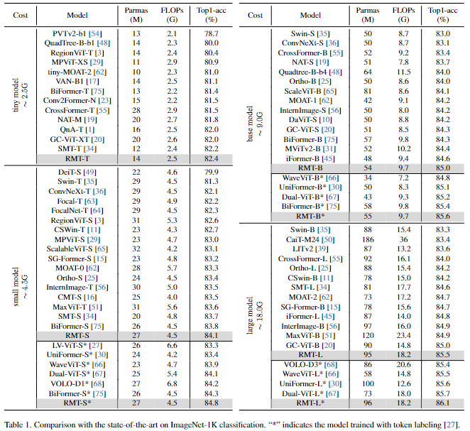

# RMT : Retentive Networks Meet Vision Transformers
[paper](https://arxiv.org/abs/2309.11523v5)
[github](https://github.com/qhfan/RMT)

## Abstract
Vision Transformer (ViT)は、近年コンピュータ・ビジョンのコミュニティで注目を集めている。
しかし、ViTの核となる要素である「Self-Attention」は、明示的な空間的事前分布を持たず、計算量も2次関数的であるため、ViTの適用性に制約がある。
このような問題を解決するために、我々は自然言語処理分野のRetentive Network(RetNet)から着想を得て、汎用の明示的な空間事前分布を持つ強力な視覚バックボーンであるRMTを提案する。 
具体的には、RetNetの時間的減衰メカニズムを空間領域に拡張し、マンハッタン距離に基づく空間的減衰行列を提案し、Self-Attentionに明示的な空間的事前分布を導入する。 
さらに、空間的減衰行列を崩すことなく、大域的な情報をモデル化する計算負荷を軽減することを目的として、明示的な空間的先行に巧みに適応するAttention分解形式を提案する。
空間減衰行列とAttention分解形式に基づき、線形の複雑度で視覚バックボーンに明示的な空間事前分布を柔軟に統合することができる。 
広範な実験により、RMTは様々な視覚タスクにおいて卓越した性能を示すことが実証された。 
具体的には、余分な学習データなしで、RMTはImageNet-1kにおいて27M/4.5GFLOPsのモデルで84.8%、96M/18.2GFLOPsのモデルで86.1%のtop-1 accを達成した。 
下流のタスクでは、RMTはCOCO検出タスクで54.5 box APと47.2 mask APを達成し、ADE20K sematic segmentationタスクで52.8mIoUを達成した。

コードはこちら: //github.com/qhfan/RMT

## 1. Introduction
Vision Transformer（ViT）[12]は、研究者から非常に支持されている優れたvisionアーキテクチャである。
しかし、ViTのコアモジュールであるSelf-Attention固有の構造には、明示的な空間的優先度が欠けている。さらに、Self-Attentionの2次関数的な複雑さは、大域的な情報をモデル化する際に大きな計算コストにつながる。
これらの問題はViTの応用を制限する。
このような問題を軽減するために、これまで多くの研究が試みられてきた [13, 16, 30, 35, 50, 57, 61]。 
例えば、Swin Transformer [35]では、著者はウィンドウ演算を適用することで、self-attentionに使用するトークンを分割している。 
この演算はself-attentionの計算コストを削減するだけでなく、窓の使用と相対位置の符号化を通じて、モデルに空間的な事前分布を導入する。
これに加えて、NAT[19]はself-attentionの受容野を畳み込みの形状に合わせて変化させることで、計算コストを削減すると同時に、モデルが受容野の形状を通して空間敵優先度を知覚することを可能にする。 
これまでの方法とは異なり、我々は最近NLPの分野で成功を収めたRetentive Network (Ret- Net) [46]からインスピレーションを得ている。
RetNetは距離依存の時間的減衰行列を利用して、一次元の単方向テキストデータに対して明示的な時間的事前分布を提供する。 
RetNetに先立つALiBi [41]も同様のアプローチを適用し、自然言語処理タスクで成功を収めている。 
我々はこの時間減衰行列を空間領域に拡張し、トークン間のマンハッタン距離に基づく2次元双方向空間減衰行列を開発した。
空間減衰行列では、ターゲット・トークンに対して、周囲のトークンが遠ければ遠いほど、そのattentionスコアの減衰の度合いが大きくなる。 
この特性により、ターゲットトークンはグローバルな情報を知覚すると同時に、様々な距離にあるトークンに対して異なる注意レベルを割り当てることができる。 
この空間減衰行列を用いて、視覚のバックボーンに明示的な空間優先度を導入する。
RetNetにヒントを得て、マンハッタン距離を明示的な空間的事前分布として取り入れたこのSelf-Attentionメカニズムを、我々はManhattan Self-Attention (MaSA)と名付ける。
明示的な空間優先度の他に、self-attentionを用いた大域的モデリングに起因するもう一つの問題は、膨大な計算負荷である。 
従来のsparseなattentionメカニズム[11, 35, 53, 63, 75]や、RetNet[46]における保持の分解方法は、ほとんどが空間減衰行列を乱し、MaSAには不向きである。
空間減衰行列を損なうことなく大域情報をスパースにモデル化するために、我々は画像の2軸に沿ってself-attentionを分解する方法を提案する。
この分解法は、優先度情報を失うことなく、self-attentionと空間減衰行列を分解する。 
分解されたMaSAは、グローバルな情報を線形な複雑さでモデル化し、元のMaSAと同じ受容野の形状を持つ。 
Fig. 2において、MaSAを他のSelf-Attention機構と比較する。 
我々のMaSAは、対応するものよりも豊富な空間的優先度をモデルに導入していることがわかる。

MaSAに基づき、RMTと呼ばれる強力なビジョンバックボーンを構築する。 
提案手法の有効性を広範な実験により実証する。 
Fig. 1に示すように、我々のRMTは画像分類タスクにおいて、最先端の（SOTA）モデルを凌駕する。 
さらに、我々のモデルは、物体検出、インスタンス分割、セマンティック分割などのタスクにおいて、他のモデルと比較してより顕著な優位性を示す。 

我々の貢献は要約すると以下である：

* マンハッタン距離に基づく空間減衰行列を提案、self-attentionを補強することで、明示的な空間優先度を持つマンハッタンself-attention(MaSA)を作成した
* MaSAの分解形式を提案し、空間減衰行列を崩すことなく、グローバルな情報モデリングを線形の複度で可能にした。
* MaSAを活用し、汎用的な強力なビジョンバックボーンであるRMTを構築。  
RMTはImageNet-1kにおいて、余分な学習データなしで画像分類のトップ1の精度を達成し、物体検出、インスタンス分割、セマンティック分割などのタスクで優れている。

Figure1. 224×224解像度のImageNet-1KにおけるFLOPs対Top-1精度。「*」はトークン・ラベリング[27]で学習したモデル。

Figure 2.異なるself-attentionメカニズムの比較。 
MaSAでは、濃い色はより小さな空間減衰率を表し、薄い色はより大きな空間減衰率を表す。 
距離によって変化する空間減衰率は、モデルに豊富な空間優先度情報を与える。

## 2. Related Work
**Transformer**. 
Transformerアーキテクチャは、リカレントモデルの学習限界に対処するために、最初に[52]で提案され、その後、多くのNLPタスクで大成功を収めた。 
画像を小さな、重複しないパッチシーケンスに分割することで、Vision Transformer(ViT)[12]も大きな注目を集め、視覚タスクで広く使用されるようになった[5, 14, 18, 39, 58, 66]。 
RNNとCNNがそれぞれNLPとCVの分野を支配してきた過去とは異なり、トランスフォーマーアーキテクチャは様々なモダリティと分野で輝きを放っている[26, 37, 42, 60]。
コンピュータビジョンの分野では、多くの研究がViTに空間優先度を導入し、学習に必要なデータを削減しようとしている[6, 19, 49]。 
同時に、self-attentionの計算コストを削減するために、様々なスパースattentionメカニズムが提案されている[13, 53, 54, 57]。

**Prior Knowledge in Transformer**. 
Transformerの性能を向上させるために、事前知識をTransformerモデルに組み込む試みが数多くなされてきた。 
オリジナルのTransformer[12, 52]は、各トークンの位置情報を提供するために三角関数によるエンコーディングを使用している。 
視覚タスクでは、[35]が元の絶対位置エンコーディングに代わるものとして相対位置エンコーディングの使用を提案している。
[6]は、畳み込み層におけるゼロパディングもViTに位置認識を提供することができ、この位置エンコード方法は非常に効率的であると指摘している。 
多くの研究において、FFNの畳み込み[13, 16, 54]は、ViTの位置情報をさらに豊かにするために視覚モデルに採用されている。 
NLPタスクのために、最近のRetentive Network [46]では、距離変化に基づく事前知識をモデルに提供するために、時間減衰行列が導入されている。 
RetNet以前には、ALiBi [41]も同様の時間的減衰行列を使用している。

## 3. Methodology
### 3.1. Preliminary
**Temporal decay in RetNet**. 
Retentive Network(RetNet)は言語モデルのための強力なアーキテクチャである。 
本研究では、シーケンスモデリングのための保持メカニズムを提案する。  
リテンションは、Transformerにはない時間的減衰を言語モデルにもたらす。 
リテンションはまず、シーケンスモデリング問題を再帰的に考える。 
これは式(1)のように書くことができる：

$$
o_n = \sum_{m=1}^n \gamma^{n-m}\left(Q_ne^{in\theta}\right)\left(K_me^{im\theta}\right)^\dagger v_m \tag{1}
$$

並列学習プロセスにおいて、式(1)は以下のように表される：

$$
Q=(XW_Q) \odot \Theta, K=(XW_K) \odot \bar{\Theta}, V=XW_V \\
\Theta_n = e^{in\theta}, D_{nm} =\begin{cases} \gamma^{n-m} & n \geq m \\ 0 & n < m \end{cases} \\
Retention(X) = (QK^T\odot D)V \tag{2}
$$

ここで、$\bar{\Theta}$ は $\Theta$ の複素共役、$D \in \mathbb{R}^{|x|\times|x|}$ は因果的マスキングと指数関数的減衰を含む。  
これは、一次元シーケンスにおける相対距離を象徴するもので、テキストデータに明示的な時間的優先度をもたらす。

### 3.2. Manhattan Self-Attention
RetNetのretentionから出発して、我々はそれをManhattan Self-Attention (MaSA)に進化させる。 
MaSAの中では、リテンションで観察される一方向的で一次元的な時間的減衰を、双方向的で二次元的な空間的減衰に変換する。 
この空間的減衰は、視覚のバックボーンにマンハッタン距離にリンクした明示的な空間的優先度を導入する。 
さらに、画像の2軸に沿ってself-attention行列と空間減衰行列を同時に分解する簡単なアプローチを考案する。

**From Unidirectional to Bidirectional Decay:**  
RetNetでは、テキストデータの因果的性質のため、保持は一方向であり、各トークンは先行するトークンのみに注目し、後続のトークンは注目しない。 
この特性は、画像認識のような因果的特性を欠くタスクには不向きである。 
そこで、式3で表されるように、保持を双方向に広げる：

$$
\begin{aligned}
{BiRetention}(X) &= (QK^T\odot D^{Bi}) V \\
D_nm^{Bi} &= \gamma^{|n-m|} \tag{3}
\end{aligned}
$$

ここで ${BiRetention}$ 双方向モデリングを表す。  

**From One-dimensional to Two-dimensional Decay:**  
To adapt to this, we adjust each element in the matrix D to represent the Manhattan distance between the respective token pairs based on their 2D coordinates. 
The matrix $D$ is redefined as follows:

retentionは双方向のモデリングをサポートするようになったが、この機能は依然として一次元レベルに限定されており、二次元の画像には不十分である。 
この制限に対処するために、我々は一次元のリテンションを二次元に拡張する。  
画像の文脈では、各トークンは平面内の2次元座標で一意に位置決めされ、$n$番目のトークンは$(x_n,y_n)$と表記される。 
これに適応するために、行列$D$の各要素を調整して、それぞれのトークン対の2次元座標に基づくマンハッタン距離を表現する。 
行列$D$は以下のように再定義される：

$$
D_{nm}^{2d} = \gamma^{|x_n-x_m|+|y_n-y_m|} \tag{4}
$$

リテンションでは、ソフトマックスは放棄され、ゲート関数に置き換えられる。  
この変化により、RetNetは複数の柔軟な計算形式を持つようになり、並列学習やリカレント推論処理に適応できるようになる。 
この柔軟性にもかかわらず、我々の実験でRetNetの並列計算形式のみを利用する場合、ゲーティング関数を保持する必要性は議論の余地がある。 
我々の知見によれば、この変更は視覚モデルの結果を改善するものではなく、むしろ余分なパラメータと計算の複雑さをもたらす。

その結果、モデルに非線形性を導入するためにソフトマックスを引き続き採用する。 
前述のステップを組み合わせると、マンハッタンself-attentionは次のように表される。

$$
\begin{aligned}
MaSA(X) &= (Softmax(QK^T)\odot D^{2d}) V \\
D_{nm}^{2d} &= \gamma^{|x_n-x_m|+|y_n-y_m|} \tag{5}
\end{aligned}
$$

**Decomposed Manhattan Self-Attention.** 
visonバックボーンの初期段階では、トークンが大量にあるため、グローバルな情報をモデル化しようとすると、Self-Attentionの計算コストが高くなる。 
我々のMaSAもこの課題に遭遇する。 
既存のsparseなattentionメカニズム[11, 19, 35, 53, 63]や、オリジナルのRetNetのリカレント／チャンク単位・リカレント形式を直接利用すると、マンハッタン距離に基づく空間減衰行列が破壊され、その結果、明示的な空間事前情報が失われる。
この問題に対処するため、Self-Attentionを分解するだけでなく、空間減衰行列も分解する簡単な分解方法を紹介する。  
分解されたMaSAは式6で表される。  
具体的には、画像の水平方向と垂直方向について別々に注意スコアを計算する。 
その後、これらの注意の重みに1次元の双方向減衰行列を適用する。 
一次元減衰行列は、トークン間の水平方向と垂直方向の距離$(D^H_{nm} = \gamma^{|y_n-y_m|}, D^W_{nm} = ˶gamma^{|x_n-x_m|})$ を意味する：

Figure 3. RMTのアーキテクチャ全体

Figure 4. 分解されたMaSAに置ける空間減衰行列

$$
\begin{aligned}
Attn_H = Softmax(Q_H K_H^\tau)\odot D^H, \\
Attn_W = Softmax(Q_WK_W^\tau)\odot D^W ,\\
MaSA(X) = Attn_H (Attn_W V)\tau \tag{6}
\end{aligned}
$$

$MaSA$ の分解に基づき、各トークンの受容野の形状をFig. 4に示すが、これは完全なMaSAの受容野の形状と同一である。 
図4は、我々の分解法が明示的な空間的事前分布を完全に保存していることを示している。
MaSAの局所表現能力をさらに高めるために、[75]に倣って、DWConvを用いた局所文脈強調モジュールを導入する：

$$
X_{out} = MaSA(X) + LCE(V) \tag{7}
$$

### 3.3. Overall Architecture
MaSAをベースにRMTを構築し、そのアーキテクチャをFig. 3に示す。
最初の3つのステージは分解されたMaSAを利用し、最後のステージはオリジナルのMaSAを利用する。 
多くの先行するバックボーン[16, 30, 72, 75]と同様に、CPE[6]を我々のモデルに組み込んでいる。

## 4. Experiments
ImageNet-1K[9]での画像分類、COCO2017[33]での物体検出とインスタンス分割、ADE20K[74]での意味分割など、複数の視覚タスクに対して広範な実験を行った。
また、RMTにおける各要素の重要性を検証するためのアブレーション研究も行っている。詳細は付録を参照されたい。

### 4.1. Image Classification
**Settings.** 
我々はImageNet-1K [9]でモデルをスクラッチで訓練する。 
我々は[48]と同じ学習戦略に従い、公正な比較のために唯一分類損失のみを見る。 
RMT-T/S/B/L[24]では、確率的深度[24]の最大増加率をそれぞれ0.1/0.15/0.4/0.5に設定する。
モデルの学習には、コサイン減衰学習率スケジューラ付きの AdamW オプティマイザを使用する。 
初期学習率、重み減衰、バッチサイズをそれぞれ0.001、0.05、1024に設定する。 
我々は[35]で用いられた強力なデータ増強と正則化を採用する。 
我々の設定はRandAugment [8] (randm9-mstd0.5-inc1), Mixup [70] (prob=0.8), CutMix [69] (prob=1.0), Random Erasing [73] (prob=0.25)である。 
LV-ViT[27]やVOLO[68]と同様に、従来の学習方法に加えて、トークン・ラベリングを利用したモデルを学習し、補足的な監視を行う。

Table. 1.ImageNet-1K分類における最新技術との比較。「*」はトークン・ラベリング[27]で学習したモデルを示す。

**Results.** 
Table. 1では、RMTを多くの最先端モデルと比較している。  
Table. 1の結果から、RMTはすべての設定において一貫して従来のモデルを上回っていることがわかる。 
具体的には、RMT-Sはわずか4.5GFLOPで84.1%のTop1精度を達成した。  
RMT-Bも同様のFLOPsでiFormer [45]を0.4%上回っています。 
さらに、我々のRMT-Lモデルは、少ないFLOP数にも関わらずMaxViT-B[51]を0.6%上回るTop1精度を達成しています。 
また、我々のRMT-Tも多くの軽量モデルを凌駕している。 
トークン・ラベリングを用いて学習されたモデルに関しては、我々のRMT-Sは現在の最先端であるBiFormer-Sを0.5%上回っている。

### 4.2. Object Detection and Instance Segmentation
**Settings.** 
MMDetection[4]を採用し、RetinaNet[32]、Mask-RCNN[22]、Cascade Mask R-CNN[2]を実装する。 
RetinaNetとMask R-CNNには、一般的に使用される 「1×」(12学習エポック)の設定を使用する。 
また、マスクR-CNNとカスケードマスクR-CNNには 「3×+MS」を用いる。 
[35]に従い、学習中、画像は短辺が800ピクセル、長辺が1333ピクセル以内にリサイズされる。 
モデルを最適化するために、学習率0.0001、バッチサイズ16のAdamWオプティマイザを採用する。 
「1×」ではエポック8と11で学習率が0.1ずつ低下し、「3×+MS」ではエポック27と33で学習率が0.1ずつ低下する。

Table 2.COCO val2017の物体検出とinstance segmentationにおけるRetinaNetとMask R-CNNを用いた他のバックボーンとの比較。

Table3.マスクR-CNNを使用した「3×+MS」スケジュールによる他のバックボーンとの比較。

Table 4.カスケードマスクR-CNNを使用した「3×+MS」スケジュールによる他のバックボーンとの比較。

**Results.** 
Table.2, Table.3、Table.4は異なる検出フレームワークを用いた結果を示している。  
その結果、全ての比較において我々のRMTが最も優れていることがわかる。 
RetinaNetフレームワークでは、我々のRMT-TはMPViT-XSを+1.3AP上回った。 
「1×」スケジュールのマスクR-CNNに関しては、RMT-Lが最近のInternImage-BをボックスAPで+2.8、マスクAPで+1.9上回る。 
「3×+MS」スケジュールでは、RMT-SはInternImage-TをボックスAPで+1.6、マスクAPで+1.2上回った。 
その上、カスケードマスクR-CNNに関しては、我々のRMTは他のバックボーンよりはるかに良い性能を維持している。 
以上の結果から、RMTは他のバックボーンより明らかに優れていることがわかる。

Table 5.ADE20Kにおける最先端技術との比較。

## 4.3. Semantic Segmentation
**Settings.** 
MMSegmentation[7]に基づくSemantic FPN[28]とUperNet[59]を採用し、ImageNet-1Kで事前学習したRMTをバックボーンとして適用する。 
Semantic FPNの学習にはPVT[53]と同じ設定を用い、80k回の反復学習を行っている。 
全てのモデルは入力解像度512 ×512で学習される。 
モデルをテストする際には、画像の短辺を512ピクセルにリサイズする。 
UperNetに関しては、Swin[35]のデフォルト設定に従う。 
オプティマイザとしてAdamWを用い、重み減衰を0.01として、160K反復のモデル学習を行う。 
学習率は6×10-5に設定し、1500回のウォームアップを行う。

**Results.** 
semantic segmentationの結果をTable 5に示す。
すべてのFLOPは512 × 2048の解像度で測定されているが、RMT-Tのグループは512 × 512の解像度で測定されている。 
すべての比較において、我々のモデルは最高の性能を達成している。  
特に、RMT-SはSemantic FPNで+1.2mIoUのShunted-Sを上回った。 
さらに、我々のRMT-Bは最近のInternImage-Sを+1.8mIoUで上回った。 
以上の結果はすべて、我々のモデルがdenseな推定において優れていることを示している。

## 4.4. Ablation Study
**Strict comparison with previous works.** 
先行手法との厳密な比較を行うために、全体アーキテクチャのRMTのハイパーパラメータ(階層構造を使用するかどうか、階層モデルの4つのステージのチャネル数、位置エンコードと畳み込みステムを使用するかどうかなど)をDeiT [49]とSwin [35]に合わせ、Self-Attention/Window Self-Attentionのみを我々のMaSAに置き換えた。
比較結果をTalbe 6に示す。 Table 6では、RMTがDeiT-S、Swin-T、Swin-Sを大きく上回っている。  

**MaSA** 
表6に示すように、Manhattan Self-Attentionがモデルに与える影響を検証する。  
MaSAは、画像分類とその下流のタスクにおいて、モデルの性能を大きく向上させる。 
具体的には、MaSAの分類精度は何もないアテンションよりも0.8%高い。

**Softmax.** 
我々はMaSAのSoftmaxをこのゲート関数に置き換える。
しかし、ゲーティング関数を利用したモデルは安定した学習を行うことができない。 
これは、ゲーティング関数がSoftmaxより劣っているという意味ではないことに注意する必要がある。 
ゲーティング関数は、我々の分解形式や空間減衰と相性が悪いだけかもしれない。

**LCE.** 
Local Context Enhancementもまた、我々のモデルの優れた性能に一役買っている。 
LCEはRMTの分類精度を0.3%向上させ、下流タスクにおけるモデルの性能を高める。

**CPE.** 
従来の手法と同様に、CPEは我々のモデルに柔軟な位置エンコードとより多くの位置情報を提供し、画像分類や下流のタスクにおけるモデルの性能向上に寄与している。

Table 6.アブレーション試験。RMT、DeiT、Swin-Transformerを厳密に比較している。  

Table 7.分解MaSA（MaSA-d）と元のMaSAの比較。

Table 8.RMT-SのアーキテクチャにおけるMaSAとリテンションの比較。

Table 9.SOTAモデル間の推論速度の比較。  

**Convolutional Stem.** 
モデルの最初の畳み込みステムは、より優れた局所情報を提供し、それによって様々なタスクに対するモデルの性能をさらに向上させる。

**Decomposed MaSA.** 
RMT-Sでは、Table 7に示すように、分解したMaSA(MaSA-d)を第3段階で元のMaSAに置き換えて、分解手法の有効性を検証する。  
画像分類に関しては、MaSA-dとMaSAは同程度の精度を達成しているが、セマンティックセグメンテーションに関しては、MaSA-dを採用することで、同様の結果を得ながら、計算負荷を大幅に軽減することができる。

**MaSA v.s. Retention.**  
Table. 8に示すように、RMT-Sのアーキテクチャでは、MaSAをオリジナルのretentionに置き換える。  
Swin-Transformer[35]で採用されているチャンク単位のretentionの方法を用いて、トークンをチャンクに分割する。 
一次元の因果データをモデル化する際のリテンションの限界により、それに基づくビジョンバックボーンの性能はRMTに劣る。 
さらに、チャンク単位の保持とリカレント形式のretentionは、ビジョンバックボーンの並列性を乱し、推論速度を低下させる。

**Inference Speed.**
Talbe. 9では、RMTの推論速度を、最近最も性能の良いビジョンバックボーンと比較している。Table 9 では我々のRMTは速度と精度の最適なトレードオフを示している。

## 5. Conclusion
In this work, we propose RMT, a vision backbone with explicit spatial prior. 
RMT extends the temporal decay used for causal modeling in NLP to the spatial level and introduces a spatial decay matrix based on the Manhattan distance. 
The matrix incorporates explicit spatial prior into the Self-Attention. Additionally, RMT utilizes a Self-Attention decomposition form that can sparsely model global information without disrupting the spatial decay matrix. 
The combination of spatial decay matrix and attention decomposition form enables RMT to possess explicit spatial prior and linear complexity. 
Extensive experiments in image classification, object detection, instance segmentation, and semantic segmentation validate the superiority of RMT.

## A. Architecture Details
Our architectures are illustrated in the Tab. 10. For convolution stem, we apply five 3 ×3 convolutions to embed the image into 56 ×56 tokens. 
GELU and batch normalization are used after each convolution except the last one, which is only followed by batch normalization. 
3 ×3 convolutions with stride 2 are used between stages to reduce the feature map’s resolution. 
3 ×3 depth-wise convolutions are adopted in CPE. Moreover, 5 ×5 depth-wise convolutions are adopted in LCE. RMT-DeiT-S, RMT-Swin-T, and RMT-Swin-S are models that we used in our ablation experiments. 
Their structures closely align with the structure of DeiT [49] and Swin-Transformer [35] without using techniques like convolution stem, CPE, and others.

## B. Experimental Settings
**ImageNet Image Classification.** 
We adopt the same training strategy with DeiT [49] with the only supervision is the classification loss. 
In particular, our models are trained from scratch for 300 epochs. 
We use the AdamW optimizer with a cosine decay learning rate scheduler and 5 epochs of linear warm-up. 
The initial learning rate, weight decay, and batch size are set to 0.001, 0.05, and 1024, respectively. 
Our augmentation settings are RandAugment [8] (randm9-mstd0.5-inc1), Mixup [70] (prob=0.8), CutMix [69] (probe=1.0), Random Erasing [73] (prob=0.25) and Exponential Moving Average (EMA) [40].
The maximum rates of increasing stochastic depth [24] are set to 0.1/0.15/0.4/0.5 for RMT-T/S/B/L, respectively. 
For a more comprehensive comparison, we train two versions of the model. 
The first version uses only classification loss as the supervision, while the second version, in addition to the classification loss, incorporates token labeling introduced by [27] for additional supervision. 
Models using token labeling are marked with“*”.

**COCO Object Detection and Instance Segmentation.**
We apply RetinaNet [32], Mask-RCNN [22] and Cascaded Mask-CNN [2] as the detection frameworks to conduct experiments. We implement them based on the MMDetection [4]. 
All models are trained under two common settings:“1×” (12 epochs for training) and“3×+MS” (36 epochs with multi-scale augmentation for training). 
For the “1×” setting, images are resized to the shorter side of 800 pixels. 
For the “3×+MS”, we use the multi-scale training strategy and randomly resize the shorter side between 480 to 800 pixels. We apply AdamW optimizer with the initial learning rate of 1e-4. 
For RetinaNet, we use the weight decay of 1e-4 for RetinaNet while we set it to 5e-2 for Mask-RCNN and Cascaded Mask-RCNN. For all settings, we use the batch size of 16, which follows the previous works [35, 63, 64].

**ADE20K Semantic Segmentation.** 
Based on MMSegmentation [7], we implement UperNet [59] and Seman- ticFPN [28] to validate our models. 
For UperNet, we follow the previous setting of Swin-Transformer [35] and train the model for 160k iterations with the input size of 512 ×512. 
For SemanticFPN, we also use the input resolution of 512 ×512 but train the models for 80k iterations.

## C. Efficiency Comparison
We compare the inference speed of RMT with other backbones, as shown in Tab. 11. 
Our models achieve the best trade-off between speed and accuracy among many competitors.

## D. Details of Explicit Decay
We use different $\gamma$ for each head of the multi-head ReSA to control the receptive field of each head, enabling the ReSA to perceive multi-scale information. 
We keep all the $\gamma$ of ReSA’s heads within a certain range. Assuming the given receptive field control interval of a specific ReSA module is [a,b], where both a and b are positive real numbers. 
And the total number of the ReSA module’s heads is N. 
The $\gamma$ for its ith head can be written as Eq. 8:

$$
\gamma_i = 1 - 2^{-a - \frac{(b-a)i}{N}}\tag{8}
$$

For different stages of different backbones, we use different values of a and b, with the details shown in Tab. 12.

Table 10. Detailed Architectures of our models.

Table 11. Comparison of inference speed.

Table 12. Details about the $\gamma$ decay.

