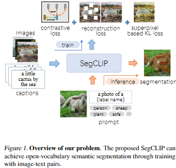
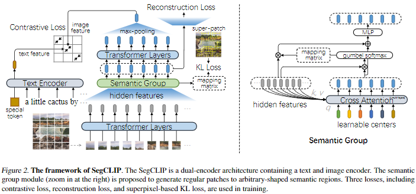
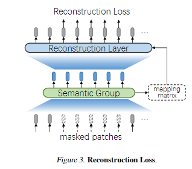

# SegCLIP: Patch Aggregation with Learnable Centers for Open-Vocabulary Semantic Segmentation

## Abstract

近年、CLIPなどの言語-画像間の対照事前学習が、様々な下流タスクで有望な結果を示している。  
この学習済みモデルは、大規模なテキストと画像の対応データから学習することで、画像に対する豊かな視覚的概念を捉えることができる。  
しかし、学習された視覚的知識を自由な語彙でのセマンティックセグメンテーションに転用する研究は今だ十分には行われていない。  
本論文では、CLIPをベースにしたSegCLIPというモデルを、アノテーションを必要としない自由語彙でのセグメンテーションのために提案する。  
SegCLIPはViTに基づくセグメンテーションを実現し、主なアイデアは、テキストと画像のペアに対する学習を通じて、意味領域における学習可能な中心を持つパッチを集めることである。  
この収集操作は意味的なグループを動的にとらえ、最終的なセグメンテーション結果を生成するために使用される。
さらに、マスクされたパッチに対する再構成損失と、疑似ラベルを用いた超解像ベースのKL損失を提案。視覚的表現を強化する。  
実験の結果、我々のモデルはPASCAL VOC 2012 (+0.3% mIoU)、PASCAL Context (+2.3% mIoU)、COCO (+2.2% mIoU)と、ベースラインと比較して同等以上のセグメンテーション精度を達成した。  
コードは https: //github.com/ArrowLuo/SegCLIP で公開している。

## 1. Introduction

Semantic segmentation, aiming to assign a label to each pixel of a given image, is an important task and has been researched for a long time.
The CNN-based approaches (Long et al., 2015; Ronneberger et al., 2015; Chen et al., 2015; Zhao et al., 2017; Chen et al., 2018; Wen et al., 2022) and Transformer-based approaches (Cheng et al., 2021; Zheng et al., 2021; Xie et al., 2021; Cheng et al., 2022; Jain et al., 2022) have achieved impressive performance on this topic.
However, two significant limitations still need exploration: expensive pixel-level labeling and restricted labeled categories leading to weak generalization (Bucher et al., 2019; Xian et al., 2019).
Recent works propose to leverage large-scale image-text pre-trained models to alleviate the above limitations.
These works involve zero-shot or weakly supervised semantic segmentation because the large image-text pairs are class-agnostic.
Due to the target being to segment an image with arbitrary categories instead of fixed labeling vocabularies, this kind of method is also called open-vocabulary semantic segmentation (Ghiasi et al., 2021; Xu et al., 2022b; Liang et al., 2022; Ma et al., 2022).
They can be roughly divided into two types.
The first is the classification-based method, supervised by the extracted pseudo labels or text features from a pre-trained model, e.g., CLIP (Radford et al., 2021).
Moreover, this type is usually achieved with a fully convolutional network or carries out prediction based on mask proposals (Zhou et al., 2022a; Xu et al., 2022b).
The other is to group semantic regions along training with large-scale image-text datasets, which can be called the group-based method (Xu et al., 2022a). Through different routes, the fundamental logic behind them is that the image-text pretrained model can learn vision-text alignment from image-level to pixel-level features.
Some interpretability methods, like CAM (Selvaraju et al., 2017) and Transformer-interpretability (Chefer et al., 2021), can support such an argument, such as in the work of (Zabari & Hoshen, 2021).
Following the research line of learning pixel-level alignment from image-text pairs, we explore the semantic regions with the group-based method in this paper.
Compared with the classification-based method, which involves mask proposals and label classification, the group-based method is straight-forward.
It has consistent objectives with the pretraining model, e.g., training with a contrastive loss using image- text pairs.
Further, the group-based model jointly learns visual and textual representations as humans do, so it has
the potential to be improved from a multimodal perspective.
Instead of training from scratch, the group-based method can also benefit from the pre-trained model.
To this end, we propose a group-based model SegCLIP to accomplish open-vocabulary semantic segmentation.
The Seg-CLIP can be regarded as segmentation+CLIP.
Specifically, the proposed model has a similar architecture to the CLIP but a modified image encoder.
The image encoder is based on the ViT (Vision Transformer) (Dosovitskiy et al., 2021).
Instead of operating on regular grids, we designed a plugged semantic group module to aggregate patches with learnable centers.
The learnable centers can dynamically merge visual patches to semantic concepts via a mapping matrix generated by a cross-attention mechanism.
This plugged group module can be inserted into the middle layers of the image encoder to generate irregular-shaped segments.
Thus, the SegCLIP can transfer knowledge from CLIP to semantic segmentation.
We use a small number of image-text pairs to train our experiments’ extra randomly initialized parameters.
Figure 1 illustrates the training and inference process.
During inference, the label name is filled into a given prompt format, and the semantic segments are obtained by calculating the similarity between the text representation and the semantic groups.

Figure 1. Overview of our problem. The proposed SegCLIP can achieve open-vocabulary semantic segmentation through training with image-text pairs.

Moreover, we propose two auxiliary losses to enhance the visual representation for semantic segmentation.
One is a reconstruction loss, which aims to recover the masked patches through their visual context.
Such a reconstruction loss is effective from the previous work (He et al., 2022; Wang et al., 2022a; Zhou et al., 2022b). The difference is that our reconstruction process is designed based on irregular-shaped segments with a mapping matrix instead of regular patches.
The other is a KL loss (Kullback-Leibler divergence Loss) used to learn a better mapping matrix via the superpixel label, which can be obtained via the off-the-shelf tool.
The KL loss can keep the consistency of pixel-level features.

## 2. Model

Figure 2はSegCLIPをデュアルエンコーダーアーキテクチャとして示している。  
一方のエンコーダはテキスト表現用であり、もう一方は画像表現用である。  
我々は差し込まれたセマンティックグループモジュールを提案し、画像エンコーダにおいて学習可能な中心を持つパッチを集約することで、CLIPにセマンティックセグメンテーションを扱う能力を追加する。  
SegCLIPのバックボーンはCLIPのViTバージョンであり、詳細は(Radford et al., 2021)に記載されている。  
本節では、SegCLIPのアーキテクチャ、学習ロス、推論処理について詳しく述べる。

Figure 2. SegCLIPのフレームワーク。  
SegCLIPは、テキストエンコーダと画像エンコーダを含むデュアルエンコーダアーキテクチャである。
セマンティックグループモジュール(右の拡大図)は、任意の形状のセマンティック領域への規則的なパッチを生成するために提案されている。  
学習には、コントラスト損失、再構成損失、超解像ベースのKL損失の3つの損失が用いられる。

## 2.1. Main Architecture

The architecture of SegCLIP mainly consists of a text encoder ET(·) and an image encoder EI(·), similar to the CLIP.
Such a design can transfer the knowledge naturally from the pre-trained weights of the CLIP instead of training from scratch.
Nevertheless, it takes work to achieve semantic segmentation directly because the CLIP is pre-trained with image-level features and needs help to finish pixel-level tasks.
We propose a plugged semantic group module within the image encoder with learnable centers to aggregate the low-layer pixel features to achieve the segmentation.
The learnable centers can be regarded as semantic regions and gather semantical pixels along with the training process.
Thus, the SegCLIP can finish open-vocabulary semantic segmentation.
As shown in Figure 2, the model’s input is a pair of text T = {wi}Mi=1 and image I = {pj}Nj=1, where wi means the i-th token within the text, pj means the j-th non-overlapped patches of the image, M and N denotes the number of given text and image, respectively.
Following the ViT version of CLIP, the token is generated via a lower-cased byte pair encoding (BPE), and the tokens representation {ewi }Mi=1 and patches representation {epj }Nj=1 are obtained by an Embedding operation and a linear projection, respectively.
Then the tokens representation is fed into Transformer layers (Vaswani et al., 2017) to generate the final text feature as zw = ET ({ewi }Mi=1).
The image representation is fed into other Transformer layers plus the semantic group module to generate the final image feature as zp = EI ({epj }Nj=1).
Finally, the contrastive loss can be calculated on the text feature zw and the image feature zp. In our setting, the text feature zw comes from a special token [SEP], which is appended as the last token of the text. The image feature zp is generated by the last Transformer layer followed by a
max-pooling operation.

## 2.2. Semantic Group Module

To gather the regular patches to arbitrary-shaped semantic regions, we design a semantic group to plug into the Transformer layers of the image encoder.
In other words, the semantic group module can be regarded as the second stage of the image encoder, with different Transformer layers as the first and third stages. Assuming the patches representation is Hp = {hspj }Nj=1 after passing through the first stage’s s-th (also the last) Transformer layer.
The semantic group module can gather different patches by calculating semantic similarity.
Specifically, we first randomly initialize a group of learnable centers Hc = {ck}Lk=1, then obtain contextual centers ˆHc = {ˆck}Lk=1 through some cross-attention layers as follows,

ˆHtc = CrossAttention(Htc, Hp, Hp), (1)

where t is the layer number of cross-attention, the start H1c is the Hc, and the ˆHc is the last ˆHtc, the CrossAttention is a cross-attention layer, the same as the Self-Attention layer in Transformer (Vaswani et al., 2017), but the input is asymmetrically separate embedding sequences, in here, the query is Htc, and the key and value are Hp, respectively.
After obtaining the contextual centers ˆHc, we can assign each patch to a corresponding center via a mapping matrix M∈RN×L generated by the Gumbel-Softmax operation (Jang et al., 2017; Xu et al., 2022a).

M= Gumbel-Softmax(Hp ˆH⊤c ), (2)

where each row of Mis a one-hot vector, and Mjk denotes the j-th patch belongs to k-th semantic center if its value is 1.
The Mkeeps a patch belonging to only and if only a center, which benefits the final semantic segmentation.
Finally, we can calculate the representation of semantic regions ˆHp with the patches representation Hp, the mapping matrix M, and the contextual centers ˆHc as follows,

ˆHp = MLP(MEAN(M⊤Hp) + ˆHc), (3)

where MEAN denotes doing the average for each center using the patches belonging to it. MLP is a multilayer perceptron block containing two fully-connected layers and a GELU (Hendrycks & Gimpel, 2016) between them.
The generated representation of semantic regions ˆHp is fed to the Transformer layers of the third stage to learn sufficiently interactive region features Zp further.

## 2.3. Reconstruction Loss

In addition to the contrastive loss, we propose a self-supervised reconstruction loss to enhance the visual repre-sentation for segmentation.
As shown in Figure 3, the reconstruction loss aims to recover the masked patches through their visual context, similar to MAE (He et al., 2022).
The difference is that our reconstruction process is designed based on irregular-shaped segments with a mapping matrix.
We first generate a masked version of region representation ˆH(m)p and mapping matrix M(m) via the semantic group module on the unmasked patches for the MAE encoder.
However, the region representation can not be used to calculate the reconstruction loss because the unmasked patches have been gathered into different regions.
We propose a reconstruction layer to restore the representation of patches from ˆH(m)p as,

 ̃H(m)p = GELU(Linear(M(m))⊤ ˆH(m)p), (4)

where Linear is a fully-connected layer, and the GELU
is the activation function. Then we use extra Transformer
layers, similar to the third stage of the image encoder, to
obtain the final representation Z(m)p using the  ̃H(m)p .
We keep the MAE decoder as in (He et al., 2022) with the
input Z(m)p . Finally, the reconstruction loss is the mean
squared error (MSE) between the reconstructed image I(m)
and the original image I, Lrec = MSE(I(m), I).

 
Figure 3. Reconstruction Loss.

## 2.4. Superpixel based KL Loss

Besides the reconstruction loss, we propose a superpixel-based KL loss to guild the learning of a mapping matrix.
The motivation is to keep the pixel-level consistency when gathering the patches to regions. Intuitively, the pixels of a superpixel should be gathered into a region instead of one more region.
The calculation process is illustrated in Figure 4.
For a given image, we first obtain its superpixel with a graph-based segmentation method from (Felzenszwalb & Huttenlocher, 2004), which is unsupervised and does not need to train on any datasets.
There are many other super-pixel methods, but we chose this typical one as a demonstration.
Assuming there are some superpixels, each pixel in the same superpixels has the same label, e.g., superpixel id.
Thus for each patch, we assign it a label, e.g., the average floor value of ids from its pixels.
Thus, we can obtain a super-patch corresponding to the superpixel. Intuitively, the patches within a super-patch are also covered by a superpixel.
Note that a superpixel id is a number used to distinguish different superpixels, and we do not care about its meaning in the loss calculation.
Every patch of a super-patch should have a consistent probability in the mapping matrix Mbecause they should be gathered in a region.
In other words, the probability of a patch in the mapping matrix should be similar to the average probability of the patches within the same super-patch.
Thus, a symmetric KL loss is designed as follows,

ˆPj = softmax( 1
|Gj|
∑
ˆj∈Gj
Pˆj
), (5)
Lsup = 1
2N
N∑
j=1
(KL(Pj, ˆPj)+KL( ˆPj,Pj)), (6)

where KL is the Kullback-Leibler divergence, Pj is the regions’ probability of j-th patch, which is obtained by the j-th row of M after softmax operation, and Gj is the indexes of the patches contained in a super-patch which also contains the j-th patch.
By decreasing the Lsup, the model tends to gather the patches within a superpixel together, which benefits the segmentation.

## 2.5. Training and Inference

Training In addition to the reconstruction loss Lrec and the superpixel-based KL loss Lsup, the model is also trained with the contrastive loss Lcon in an end-to-end manner.
The total loss is the sum of them,

Ltotal = Lcon + Lrec + Lsup. (7)

The Lcon is a symmetric cross-entropy loss calculated on the text feature zw and image feature zp, similar to the CLIP (Radford et al., 2021),

Lcon = 1
2(Lt2i + Li2t), (8)
Lt2i =−1
B
B∑
i
log exp (s(z(i)w , z(i)p ))
∑B
j=1 exp (s(z(j)w , z(i)p
), (9)
Li2t =−1
B
B∑
i
log exp (s(z(i)w , z(i)p ))
∑B
j=1 exp (s(z(i)w , z(j)p
), (10)

where, s(zi, zj) = ziz⊤
j
∥zi∥∥zj∥ is the cosine similarity, Bis the
batch size, the superscripts (i) and (j) means the i-th and
j-th sample, respectively.

Inference Due to the learned mapping matrix, the Seg-CLIP can finish semantic segmentation without further finetuning on any datasets.
The image feature can be obtained through the image encoder for a segmentation task with candidate labels.
For the text feature, we use a template a photo of a {label name}. to form the input text of the text encoder with different label names.
Specifically, we use the Zp ∈ RL×H from the last Transformer layer of the image encoder as the representation of each region, where L is the number of learnable centers, and H is the hidden size.
The label features can be denoted as {z(τ)w }Tτ=1 if there are T candidate labels.
After calculating the cosine similarity of each row of Zp and each z(τ)w via s(zi, zj) from Eqs. (9-10), we can obtain a similarity matrix ˆS ∈ RL×T, in which each row denotes the labels’ probability of a region.
Then the similarity S ∈RN×T between patches and candidate labels can be calculated using the mapping matrix M∈RN×L via S = MˆS.
We can assign each patch a label with the highest similarity of each row from the S.
We can further execute an interpolation operation on the S from N to image size to obtain a pixel-level assignment matrix, then an irregular-shaped and pixel-level segmentation.

