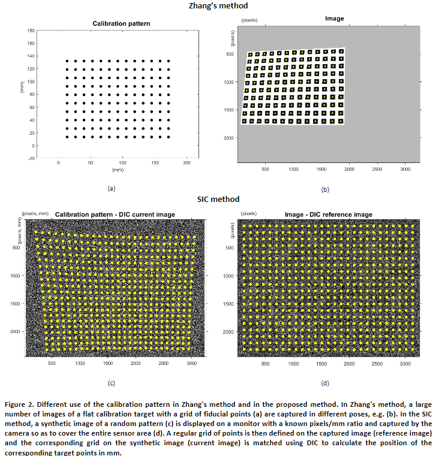
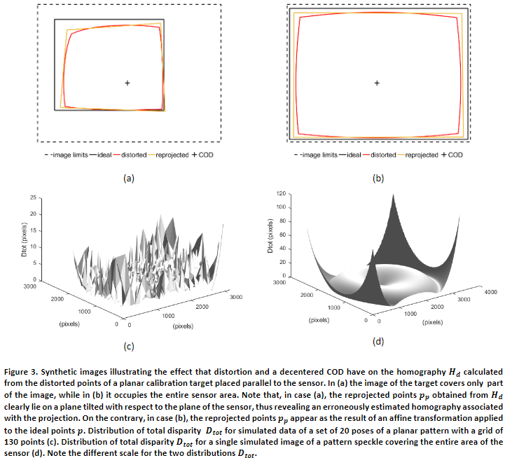
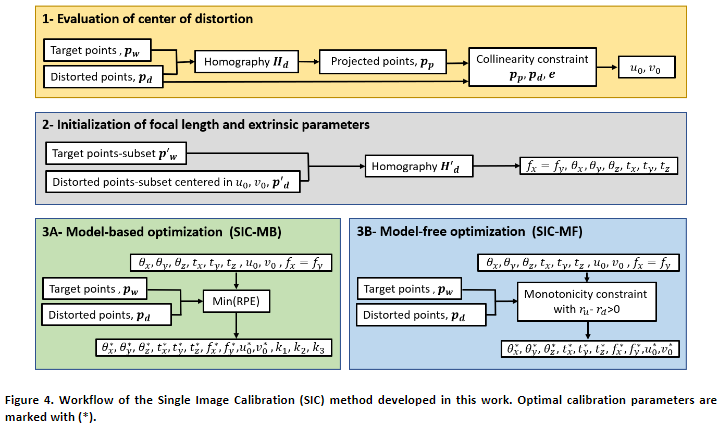
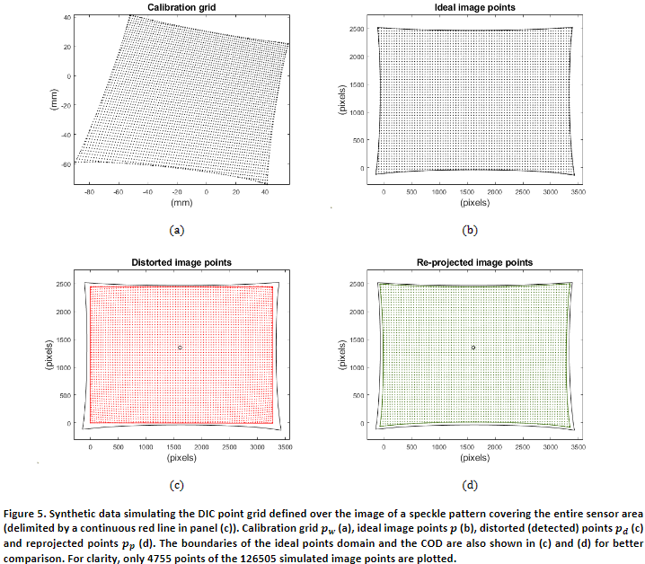

# Single-image camera calibration with model-free distortion correction
[arXiv](https://arxiv.org/abs/2403.01263)

## 2. METHODS
ビデオベースの計測では、画像形成は理想的なピンホールモデルによって記述される。  
つまり、点の画像とその実際の対応物は、透視変換によって関連付けられる(Figure 1の画像形成スキームを参照)。  
カメラキャリブレーションプロセスは、ワールドリファレンスシステム $\Sigma_W$ における3D点座標から、センサフレーム $\Sigma_S$ における2D画像点座標への変換のパラメータを評価することからなる。  
Zhangの方法[3]では、カメラのキャリブレーションは、高精度で位置が既知である特徴の平面グリッド(マーカー・セントロイドまたはチェッカーボード・コーナー)の最低3枚の画像を使用して実行される。  
平面キャリブレーションターゲットは、ワーキングボリューム内に異なる向きで順次配置され、各ポーズでターゲットの画像がキャプチャされます。
平面目標がワールド座標系の$Z=0$上にあると仮定すると、目標点のワールド座標 $p_W=[X,Y]^T$ と、センサー平面における理想的な(歪みのない)画像投影の座標 $p=[x,y]^T$ との関係は次のようになる：

$$
S \begin{bmatrix} x \\ y \\ 1 \end{bmatrix} = 
\begin{bmatrix} f_x & 0 & c_x \\ 0 & f_y & c_y \\ 0 & 0 & 1 \end{bmatrix} 
\begin{bmatrix} r_{11} & r_{12} & t_x \\ r_{21} & r_{22} & t_y \\ r_{31} & r_{32} & t_z \end{bmatrix} \begin{bmatrix} X \\ Y \\ 1 \end{bmatrix} =
\mathbf{A} \mathbf{E} \begin{bmatrix} X \\ Y \\ 1 \end{bmatrix}
\tag{1}
$$

ここで$S$は任意のスケールファクターである(透視投影モデルにおけるスケールファクターの幾何学的解釈についてはFigure 1を参照)。  
内部行列 $\mathbf{A}$ は、カメラ参照フレーム $\Sigma_C$(mm単位)からセンサー画像フレーム $\Sigma_S$(ピクセル単位)への画像点座標間のアフィン変換を定義する[3]。  
特に、$f_x$ と $f_y$ はセンサーの水平方向と垂直方向に沿った画像スケールファクター(焦点距離とも呼ばれる)、$\gamma$ は2つの画像軸の歪度(本研究ではヌルと仮定)、$u_0$ と $v_0$ は投影中心からセンサー面への垂線の足として定義される主点 $\mathbf{e}$ の座標である[3]。  
内部パラメータはカメラ/レンズアセンブリの特性であり、カメラの姿勢からは独立している。
外部パラメータ行列 $\mathbf{E}$ は、ワールド座標フレーム $\Sigma_W$ からカメラ座標フレーム $\Sigma_C$ への剛体変換を記述する。  
特に、回転行列$mathbf{R}$の最初の2列$r_1$と$r_2$の成分と並進ベクトル$mathbf{t} = [t_x, t_y, t_z]^T$を含む。  
[3]と同じ表記法を用いて、キャリブレーション平面の向きを3次元ベクトル$mathbf{r}$で表す。  
コンパクト化のため、ベクトル $\mathbf{r}$ に並進ベクトル $\mathbf{t}$ を付加し、外部パラメータベクトル $\mathbf{V_E} = [\theta_x, \theta_y, \theta_z, t_x, t_y, t_z]^T$ とする。  
内部パラメータはベクトル $\mathbf{V_I} = [f_x, f_y, u_0, v_0]^T$ に格納される。  
モデル平面上の物理点 $\mathbf{p_W}$ とセンサ平面上のその画像 $\mathbf{p}$ の間の透視変換を記述するホモグラフィ $\mathbf{H} = \mathbf{AE}$ は、モデル平面の単一画像からスケールファクタまで推定できる。  
その推定手順(少なくとも4つの携速店を必要とする)は、参考文献[3] の付録Aに詳しく記述されている。  
しかし、$mathbf{H}$の9つの成分から内部・外部パラメータをそれぞれ抽出するためには、異なるポーズ、すなわち $n$ 個の異なるホモグラフィの校正平面の少なくとも $n=3$ 枚の画像($\gamma=0$ の場合は $n=2$ )が必要である。  
より多くの校正パターンポーズ(通常 $n\ge 10$）を使用することで、手法の精度と正確さの両方が向上することが示されている[3]。

実画像における歪みの存在は、検出された画像点の座標 $\mathbf{p_d} = [x_d, y_d]^T$ を(1)で計算された理想点座標 $\mathbf{p}$ に関係付ける適切な関数を定義することで対処される。  
様々な洗練された歪みモデルが文献[24]で提案されているが，歪みの半径方向成分が他の成分よりも支配的であることが一般的に受け入れられている． 
歪み関数にさらなる成分を追加することは，RPE(再構成誤差)の点からは無関係であることが多いが、結果の実現可能性に悪影響を及ぼす可能性がある．
本研究では，歪みの半径方向成分のみを考慮し，CMT(Calibration Matlab Toolbox) と同様に，以下のように6次の偶数次多項式関数で記述されると仮定する:

$$
\begin{aligned}
x_d &= f_x(x_n + x_n[k_1r^2_n + k_2r^4_n + k_3r^6_n]) + u_0 \\
y_d &= f_y(y_n + y_n[k_1r^2_n + k_2r^4_n + k_3r^6_n]) + v_0 \\
\end{aligned}
\tag{2}
$$

ここで: 

$$
r^2_n &= \sqrt{x_n^2 + y_n^2} \tag{3}
$$

そして、正規化された理想座標は以下のように計算される：

$$
\begin{aligned}
x_n &= \frac{x - u_0}{f_x} \\
y_n &= \frac{y - v_0}{f_y}.
\end{aligned} \tag{4}
$$

係数 $k_1, k_2$, $k_3$ は半径方向の歪み関数のパラメータを表す。  
[3]と同様に、歪みの中心は主点 $\mathbf{e}$ と一致すると仮定する。  
歪められた点 $\mathbf{p_d}$ の理想的な投影点 $\mathbf{p}$ の位置からのずれを定義するために所定の解析モデルを用いる場合、歪みパラメータは固有パラメータ集合に未知数として追加される。  
歪みの除去に成功すると、歪みのない点 $\mathbf{p}$ が回復され、その点は理想ホモグラフィ $\mathbf{H}$ によって目標点 $\mathbf{p_w}$ と関係付けられる(式1)。  
ここで重要なのは歪みの量とスケールファクター(焦点距離パラメータ)の間には曖昧さが存在することに注意することである[22]。  
この曖昧さは，通常，歪んだ点と歪んでいない点が一致する歪みの中心で半径方向の歪みがヌルであると仮定することによって解決される．  
Zhangの方法では，歪みの存在は2段階のアプローチで扱われる．  
最初のステップでは，画像にノイズや歪みがないと仮定し，解析解を用いて内部パラメータと外部パラメータの近似推定値を計算する．  
得られた値は，パラメータセット全体(歪み関数の係数を含む)を改良する非線形最適化問題の初期推測値として使用される． 
この目的関数は，再投影誤差RPEで表現される。  
再投影誤差は式(1)～(4)によって計算される、歪められた画像上の点と，検出された対応点との間のユークリッド距離である．  
強く歪んだ画像の場合、主点と焦点距離の解析的計算[3]は失敗する可能性がある。  
このため、近似的な初期値を計算するために、別のアプローチがよく使われる。
例えば、本論文で提案手法との比較のために検討した CMT(Calibration Matlab Toolbox) [11]では、主点はセンサーの中心にあると仮定し、焦点距離は消失点から推定する。  
Zhangの方法は間違いなく強力であり、実装も簡単であるが、いくつかの制限に悩まされる：  
- 結果の不確かさを低減させるには、十分な数の画像が必要（通常 $n\ge10$）。  
- 演算対象立体内の校正ターゲットの位置と向きは、校正結果に影響を与える。  
- キャリブレーション用ドットパターンを使用する場合、遠近法による変形が(円形または正方形の)マーカーの重心位置の精度に影響を与える可能性があり、チェッカーボードパターンの場合、デフォーカスがコーナー位置の精度に影響を与える可能性があある。
- 所定の歪み関数は、レンズ/カメラアセンブリの実際の歪みに適応することを余儀なくされます。  
そのため、特に多数の歪みパラメータを実装する場合、最終的な最適化の結果は、RPE値が小さい場合でも、真の値を正確に反映しない可能性がある。   
- 設計パラメータと最適化問題の非線形性が組み合わさることで、パラメータの不正確な初期値や不適切な境界により局所最小解への収束につながる可能性がある。  
内部パラメータは特に推定誤差の影響を受けやすい。 

本研究では、上記の限界を克服することを目的として、次のような方法を採用する：  
- スペックル分布をCalibration Patternとして使用し、DICを使用して点ペア $\mathbf{p_d}$ と $\mathbf{p_w}$ をサブピクセル精度で一致させる。 
さらに、スペックルパターンは遠近歪みとデフォーカスの両方に強い [27]。  
従来のドット／チェッカーボードパターンと比較してスペックル校正パターンを使用する利点は、[6]で紹介、議論されているので、ここでは繰り返さない。  
- 歪みを除去し、calibrationパラメータ一式に対する正確な初期推定値(真の値に対する誤差1％未満)を計算するには、1枚の画像で十分である。  
唯一の要件は、スペックル画像でセンサー全体を完全にカバーすることである(Figure 2d参照)。  
これが本研究で紹介する方法の主な新規性である。  
- 歪みの中心と焦点距離の正確な推定は、他の設計変数とは別に実行されるため、カップリングエラーを避けることができる。  
- 画像の歪みは、センサーエリア全体にわたり、その境界まで高密度に均一にマッピングすることができる。 
このマップは、モデルフリーのポイントワイズワープ関数として使用することも、現在のレンズ/カメラシステムに適切と考えられる解析モデルで補間することもできる。

Figure 2.  Zhangの手法と提案手法におけるキャリブレーションパターンの使い分け。  
Zhangの手法では、格子状の携速店 (a)を持つ平坦なキャリブレーションターゲットの多数の画像が、例えば(b)のように異なる姿勢でキャプチャされる。  
SIC法では、ランダムパターンの合成画像(c)を既知のpixel/mm比でモニターに表示し、センサー領域全体をカバーするようにカメラで撮影する(d)。 
次に、撮影された画像(参照画像)上に点の規則的なグリッドを定義し、合成画像(現在画像)上の対応するグリッドをDICを使用してマッチングさせ、対応するターゲット点の位置をmm単位で計算する。

上記の特性は、センサーの全領域をカバーするスペックルcalibrationターゲットの単一画像を使用することの直接的な結果である。 
Fgigure 2は、従来のZhangのカメラ校正法(ZM)と本研究で提案するアプローチとの基本的な違いを示している。  
ZMでは、モデル平面に取り付けた基準系に格子状の計測点 $\mathbf{p_w}$ を定義し(Figure 2a)、各ポーズにおいて対応する画像点 $\mathbf{p_d}$ の位置を計算する(Figure 2b)$^1$。
SIC法では、撮像画像の全領域に高密度の規則正しいグリッド $\mathbf{p_d}$ を定義し(Figure 2d)、ピクセルからmmへの変換係数が高精度に既知である合成校正画像上で、モニタ上の対応する目標点 $\mathbf{p_w}$ をDICによりマッチングさせる(Figure 2c)。  
したがって、後者の場合、点グリッド $\mathbf{p_d}$ は画像全体を高密度に均一に覆うが(Figure 2dでは、わかりやすくするために粗い点グリッドのみを示す)、対象点は合成スペックル画像の不規則な領域に不均一に分布する(Figure 2c)。  
一方、ZMの場合、モデル平面上の規則的な点格子(Figure 2a)の歪んだ(透視による)画像は、画像の一部分のみを不均一に覆っている(Figure 2b)。 
さらに、calibration格子の点数$n_p$は、2つのケースで大きく異なる。  
標準的なキャリブレーションターゲットでは、$n_p$ は数百のオーダーである（本研究では$n_p=130$）。  
スペックルターゲットの場合、$n_p$ は画像サイズとDIC解析のパラメータ(サブセットと間隔)に依存するが、標準caribpationグリッドの場合よりも約 $10^3$ 大きい(本研究のシミュレーション画像では$n_p=126505$points)。

*1 : 物理点 $\mathbf{p_w}$ と対応する画像点 $\mathbf{p_w}$ の接尾辞 $i=1, \dots n_p$ ($n_p$ はcalibrationグリッドの点数) は省略する。

Figure  3.  センサーに平行に置かれた平面キャリブレーションターゲットの歪んだ点から計算されたホモグラフィ $\mathbf{H_d}$ に歪みと偏芯したCODが与える影響を示す合成画像。  
(a)では、ターゲット画像は画像の一部しかカバーしていないが、(b)では、ターゲットはセンサーエリア全体を占めている。  
(a)の場合、$\mathbf{H_d}$ から得られる再投影点 $\mathbf{p_p}$ は、センサーの平面に対して傾いた平面上にあることが明らかである。  
逆に、(b)の場合、再投影された点 $\mathbf{p_p}$ は、理想点 $\mathbf{p}$ にアフィン変換を適用した結果として現れる。  
130点のグリッドを持つ平面パターンの20ポーズセットのシミュレートデータの総視差 $\mathbf{D_{tot}}$ の分布(c)。  
センサーの全領域を覆うパターンのスペックルの単一シミュレー ション画像に対する全視差 $\mathbf{D_{tot}}$ の分布(d)。  
2つの分布 $\mathbf{D_{tot}}$ のスケールが異なることに注意。  
この $\mathbf{p_w-p_d}$ の点のペアの定義の違いは、歪んだ画像点からのホモグラフィ計算結果に劇的な影響を与える。  
ここで重要なことは、$\mathbf{p_p}=[x_p, y_p]^T$ として計算される再投影点 $\mathbf{p_p=Hp_w}$(式1)は、理想レンズの場合のみ $\mathbf{p}$ と一致することである。  
ホモグラフィを実画像点 $\mathbf{p_d}$ から計算するとき、$\mathbf{p_w}$ の最尤推定値を生成する $\mathbf{p_d}$ の透視変換を記述する。  
重要なことは、ホモグラフィ $\mathbf{H_d}$ (接尾辞 $d$ は、正解データ $\mathbf{H}$ と区別するために使用される)は、歪みの中心からの距離に関係なく、同じ重みで歪んだ点を考慮して計算されることである。
Figure 3は、ZMに従って取得された画像(Figure 2b)と、SICで要求される画像領域全体をカバーする点グリッド(Figure 2d)に対する、 $\mathbf{H_d}$ の計算結果の違いを示している。  
特に、Figure 3は、再投影された点グリッドに対する唯一の歪みの影響を強調するために、$\mathbf{R=I}$ （すなわち、モデル平面がセンサーに平行）で生成された合成画像を参照する。  
説明のために、合成画像は強い樽型歪みと高度に偏芯したCODを持つ。  
わかりやすくするため、図には矩形の点格子領域の境界のみを示している。

2つのシミュレーション画像を比較すると、Figure 3aの再投影点は、3つの要因の直接的な結果として、正解値と大きく異なることがわかる：  
(i)センサーの部分的なカバー率、(ii)歪みによってもたらされる点間隔の不均一性、(iii)CODの偏芯。  
特に、再投影された点の領域はCODの方向にシフトしており、さらに重要なことに、理想的な再投影平面(センサーに平行)に対して傾いているように見えるため、その点に関連するホモグラフィが誤って推定されていることがわかる。  
逆に、Figure 3bでは、再投影された点は、正解値の単なる拡大縮小コピーに見える。  
実際、スケールファクターには異方性があり(長方形のセンサーの水平方向と垂直方向で点の数が異なるため)、CODに向かってパターンがわずかにドリフトしている。  
ある歪みのレベルに対して、Figure 3bの再投影パターンと正解値の間の類似性は、考慮する点の数が多いほど近くなる。 
同じ考察が $R \ne I$ の場合にも当てはまる。  
再投影された点と正解値(Figure 3b,d) との間に (近似的な) アフィン変換が存在することが、本研究で開発されたcalibration法の基礎となっている。

Figure  4. 本研究で開発したSIC(Single Image Calibration)法のワークフロー。  
最適なキャリブレーションパラメータは(*)で示されている。

Figure 3cとFigure 3dは、標準校正ターゲット([26]のFig.1参照)の20ポーズセットとスペックルターゲットの単一ポーズについて、それぞれ歪んだデータと再投影された合成ノイズフリーデータの合計視差 $D_{tot}=\parallel \mathbf{p_p - p_d}$ を報告している。
最初のケース(Figure 3c)では、任意の $n^{th}$ 推定ホモグラフィ $\mathbf{H_d}$ は、$n^{th}$ ポーズにおける画像格子点 $\mathbf{p_d}$ の最良の局所近似を表す再投影点の集合 $\mathbf{p_p}$ を生成する。  
これは $n^{th}$ ポーズにおける画像格子点 $\mathbf{p_d}$ の最良の局所近似を表す(すなわち、$\mathbf{p_p  \sim p_d}$ であり、$D_{tot}$ 値が低い)。  
しかし、大域レベル($\mathbf{p_p  \ne p}$)では不正確な寄与を与える。  
一方、Figure 3dのプロットは、センサ全体をカバーする単一のスペックル画像から推定された $\mathbf{H_d}$ から、大域的な歪み分布(すなわち、$\mathbf{p_p} \sim S\mathbf{p}$、したがって画像のエッジで高い$D_{tot}$値)の初期段階で近い(スケーリングされた)近似がすでに得られることを明確に示している。  
Figure 4はシングルイメージキャリブレーション(SIC)法のワークフローを示す。  
手順の最初の2つのステップは、歪みのない画像点のスケーリングされた近似を得ることを目的とし、そこから内部および外部パラメータのフルセットの非常に正確な初期推測（誤差<1%）を計算する。  
キャリブレーションは、解析的な歪み関数を定義することにより(ステップ#3A、SIC-モデルベースアプローチ、SIC-MB)、あるいは代わりに、計算されたラジアル歪みデータの密で均一な分布を使用して、画像のポイントワイズ・アンワーピングを実行することによって(ステップ#3B、SIC-モデルフリーアプローチ、SIC-MF)、改良することができる。  

  
Figure 5. センサーの全領域を覆うスペックルパターンの画像上に定義されたDIC点グリッドをシミュレートした合成データ(パネル(c)では連続した赤線で区切られている)。
キャリブレーショングリッド $\mathbf{p_w}$ (a)、理想画像点 $\mathbf{p}$ (b)、歪んだ(検出された)点 $\mathbf{p_d}$ (c)、再投影点 $\mathbf{p_p}$ (d)。  
(c)と(d)には比較のために理想点領域とCODの境界も示してある。 
わかりやすくするために、$126505$ 点のシミュレーション画像のうち、$4755$ 点のみをプロットしている。

提案された手順を段階的に説明するために、Section 3で報告されるシミュレーションデータのポーズ#1が例として考慮されている。  
このポーズは、すべての非ヌル外部パラメータ $(\mathbf{V_E} = [8^{\circ}, 16^{\circ}, -26^{\circ},5, 8, 300]^T)$ によって特徴付けられ、したがって一般的なケースを代表する([26]のFig.2およびFig.5a,bの 粗いグリッドを参照)。  
内部パラメータとバレル歪み関数の係数はそれぞれ $\mathbf{V_I} = [9285.7, 9278.6, 1609, 1353]^T$ と $\mathbf{K}=[-1.3, 8.8, -163]^T$ とした。  
歪みの中心(主点 $\mathbf{e}$ と一致)は、センサーの中心 $\mathbf{e_s} = [u_s, v_s]^T = [1632, 1224]^T$ からかなり離れたところに意図的に設定されている。
$n_p=126505$ 点のターゲット点 $\mathbf{p_w}$ を画像全体に投影し、SIC法に必要なスペックル画像の点データ $\mathbf{p_d}$ をシミュレートして画像データを生成した(Figure 2d)。  
Figure 5dは、理想点領域の境界(連続した黒線)と、歪んだ点 $\mathbf{p_d}$(Figure 5cに示す)から計算されたホモグラフィ $\mathbf{H_d}$ から得られた再投影点 $\mathbf{p_p}$ を示す。  
1枚の画像(Figure 5c)からカメラを較正するために必要な手順を以下に詳述する。

*Step #1: 歪みの中心の評価*  
Figure 5dは、画像全体を覆う非常に密な格子点 $\mathbf{p_d}$ を用いてホモグラフィ $\mathbf{H_d}$ を求めると、再投影された点 $\mathbf{p_p}$ は、スケールファクター $S$ だけ基底真理 $\mathbf{p}$ と異なるように見えることを示している。  
実際、再投影された点 $\mathbf{p_p}$ は、歪んでいない点の集合 $\mathbf{p_u} =[x_u, y_u]^T = S\mathbf{p}$ とは一致しない。  
なぜなら、ホモグラフィ $\mathbf{H_d}$ の計算は、水平方向と垂直方向(矩形センサーの最も一般的な場合)の異なる点の数 $\mathbf{p_d}$ の影響を受け、それらの方向に沿って、*COD*偏心によるパターンの異なる歪みの度合いの影響を受けるからである。  
従って、歪みのない点 $\mathbf{p_u}$ に対して、$\mathbf{p_p}$ の分布はアスペクト比 $AR = S_y / S_x \ne 1$(ここで、 $S_x$ と $S_y$ は水平方向と垂直方向のスケールファクターである)となり、樽(ピンクッション)歪みのために*COD*の方へ(遠ざかる方へ)シフトする。  
十分近似されていれば、再投影された点 $\mathbf{p_p}$ と歪んでいない点 $\mathbf{p_u}$ の間にはアフィン変換が存在すると仮定できる。  
この変換を評価するために、まず、2組の点 $\mathbf{p_d}$ と $\mathbf{p_p}$ を、それぞれ $(u_0, v_0)$ (*COD*座標) と $(u_c, v_c)$ (再投影された点パターンの中心の座標)でシフトして、センサフレームの原点にセンタリングする：

$$
\begin{aligned}
\mathbf{p_{d0}} = 
\begin{bmatrix} x_{d0} \\ y_{d0}\end{bmatrix} =
\begin{bmatrix} x_{d} - u_0 \\ y_{d} - v_0\end{bmatrix} \\
\mathbf{p_{p0}} = 
\begin{bmatrix} x_{p0} \\ y_{p0}\end{bmatrix} =
\begin{bmatrix} x_{p} - u_0 \\ y_{p} - v_0\end{bmatrix}
\end{aligned}
\tag{5}
$$  

次に、中心射影点 $\mathbf{p_{p0}}$ に異方性スケーリングを適用し、次のように中心歪みなし点 $\mathbf{p_{u0}}$ を得る：

$$
\begin{aligned}
\mathbf{p_{u0}} = 
\begin{bmatrix} x_{u0} \\ y_{u0}\end{bmatrix} =
\begin{bmatrix} S_x & 0 \\ 0 & S_y \end{bmatrix}
\begin{bmatrix} x_p -u_c \\ y_p - v_c \end{bmatrix} =
\begin{bmatrix} x_u -u_0 \\ y_u - v_0 \end{bmatrix}.
\end{aligned}
\tag{6}
$$  

Since only radial distortion is considered, each pair of points $\mathbf{p_{d0}} - \mathbf{p_{u0}}$ must lie on a line $l$ passing through the origin of the sensor frame.  
The set of the unknown parameters in Eq.(6) can therefore be estimated by imposing the collinearity  constraint, i.e. by  minimizing  the sum $CC$ of the distances of  the $n_p$ lines $l$ from $[0,0]$ , defined as follows: 

$$
CC(S_x, S_y, u_0, v_0, u_c, v_c) = \frac{1}{n_p}\sum_{i=1}^{n_p} 
\frac{\parallel x_{u0}(i) y_{d0}(i) - y_{u0}(i) x_{d0}(i) \parallel}{\sqrt{(y_{d0}(i) - y_{u0}(i))^2 + (x_{d0}(i) - x_{u0}(i))^2}}. \tag{7}
$$