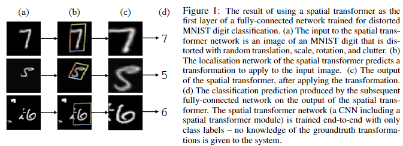
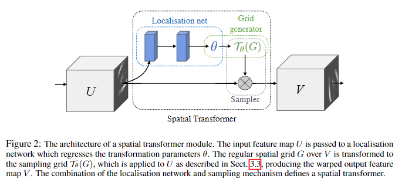
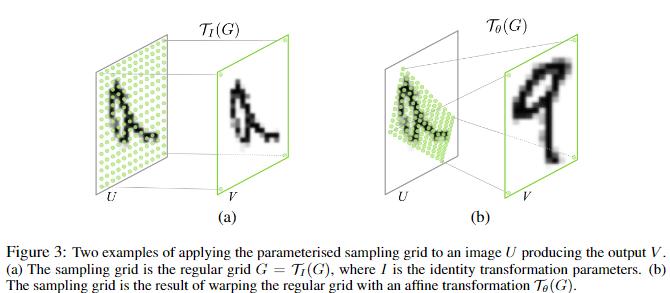
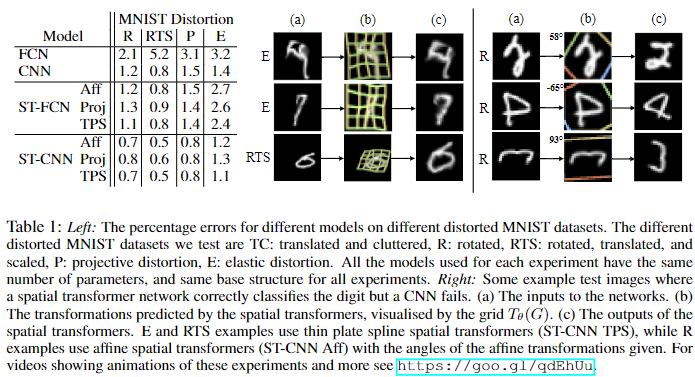
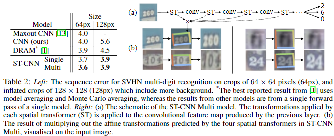
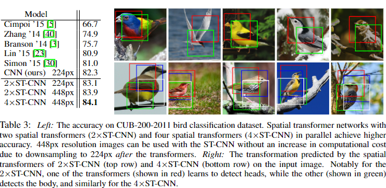
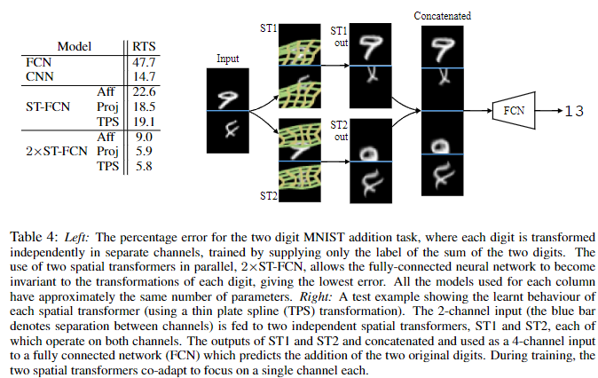
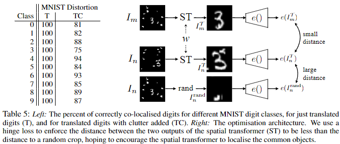
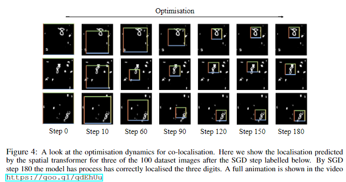
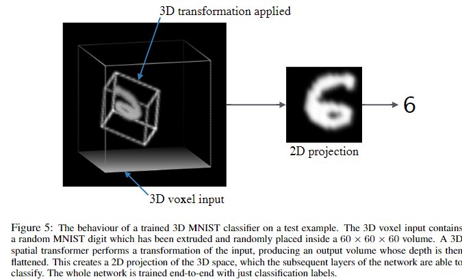

# Spatial Transformer Network
[paper](https://arxiv.org/abs/1506.02025)
[code](https://github.com/vicsesi/PyTorch-STN)
[tutorial](https://pytorch.org/tutorials/intermediate/spatial_transformer_tutorial.html)

## Abstract
畳み込みニューラルネットワークは、非常に強力なモデルクラスであるが、計算量やパラメータ効率の面から、入力データに対する空間的不変性が欠落しているといえる。
本研究では、学習可能な新しいモジュールであるSpatial Transformer を導入し、ネットワーク内でのデータの空間操作を明示的に可能にする。 
この微分可能なモジュールは、既存の畳み込みアーキテクチャに挿入することができ、ニューラルネットワークに、余分な学習監督や最適化プロセスの変更なしに、特徴マップそのものを条件として、特徴マップを能動的に空間変換する能力を与える。 
Spatial Transformerを使用することで、並進、スケール、回転、およびより一般的なワーピングに対する不変性を学習するモデルが得られることを示す。

## 1. Introduction
近年、高速でスケーラブルなend-to-endの学習フレームワークである畳み込みニューラルネットワーク(CNN)[21]の採用により、コンピュータ・ビジョンの状況は劇的に変化し、前進している。  
最近の発明ではないが、分類[19, 28, 35]、localization[31, 37]、semantic segmentaion[24]、行動認識[12, 32]などのタスクで、CNNベースのモデルが最先端の結果を達成している。 
画像を推論できるシステムの望ましい特性は、物体のポーズや部分の変形をテクスチャや形状から切り離すことである。
CNNに局所的なmax-pooling層を導入することで、ネットワークが特徴の位置に対してある程度空間的に不変であることを可能にし、この特性を満たすのに役立っている。 
しかし、一般的にマックス・プーリングの空間的サポートは小さいため(例えば $2\times2$ pixel)、この空間的不変性はmax-poolingと畳み込みの深い階層にわたってのみ実現され、CNNの中間的な特徴マップ(畳み込み層の活性化)は入力データの大きな変換に対して実際には不変ではない[6, 22]。 
このCNNの限界は、データの空間的配置の変化に対処するための、限定された、あらかじめ定義されたプーリング機構しか持たないことに起因する。 
本研究では、空間変換機能を提供するために、標準的なニューラルネットワークアーキテクチャに組み込むことができる、Spatial Transformerモジュールを導入する。 
Spatial Transformerの動作は、個々のデータサンプルに条件付けされ、問題のタスクに適した動作が訓練中に(追加の監視なしで)学習される。
受容野が固定的かつ局所的であるプーリングレイヤーとは異なり、Spatial Transformerモジュールは、各入力サンプルに対して適切な変換を生成することにより、画像(または特徴マップ)を能動的に空間変換することができる動的なメカニズムである。 
変換は(非局所的に)特徴マップ全体に対して実行され、スケーリング、クロッピング、回転、および非剛体変形を含むことができる。 
これにより、Spatial Transformerを含むネットワークは、最も関連性の高い(注目すべき)画像の領域を選択するだけでなく、それらの領域を正規の期待されるポーズに変換し、次のレイヤーでの認識を単純化することができる。 
注目すべきは、空間変換器は標準的なバックプロパゲーションで学習することができ、それらが注入されたモデルのend-to-endの学習が可能であることである。

Spatial TransformerをCNNに組み込むことで、例えば次のような様々なタスクに役立てることができる：
(i)画像分類：CNNが、特定の数字を含むかどうかに応じて画像の多方向分類を行うように学習されているとする；
ここで、桁の位置と大きさはサンプルごとに大きく異なる(そしてクラスとは無相関である)可能性がある；
適切な領域を切り出し、スケール正規化するSpatial Transformerは、その後の分類タスクを単純化し、優れた分類性能につながる；
(ii)共定位：同じ(しかし未知の)クラスの異なるインスタンスを含む画像セットが与えられると、空間変換器を使用して、各画像内でそれらを定位させることができる；
(iii) 空間的注意：Spatial Transformerは、[14, 39]のような注意メカニズムを必要とするタスクに使うことができるが、より柔軟性が高く、強化学習を使わずに純粋にバックプロパゲーションで学習することができる。
アテンションを使用する主な利点は、変換された(つまりアテンションされた)解像度の低い入力を、解像度の高い生の入力に優先して使用することができ、計算効率が向上することである。

本稿の残りの部分は以下のように構成されている： 
Sect. 2で我々の研究に関連するいくつかの研究について述べ、Sect. 3で空間変換器の定式化と実装を紹介し、最後にSect.4.追加の実験を示し、実装の詳細は付録Aに示す。

Figure 1：歪んだMNISTの数字を分類するために訓練された全結合ネットワークの第1層としてSpatial Transformerを使用した結果。 
(a) Spatial Transformerネットワークへの入力は、ランダムな平行移動、スケール、回転、乱雑さで、ゆがまされたMNISTの数字の画像である。 
(b) Spatial Transformerのローカリゼーションネットワークは、入力画像に適用する変換を予測する。 
(c) 変換を適用した後のSpatial Transformerの出力。 
(d) 空間変換器の出力に対して後続の完全連結ネットワークが生成した分類予測。 
空間変換器ネットワーク（空間変換器モジュールを含むCNN）は、クラスラベルのみを用いてエンドツーエンドで学習される。

## 2 Related Work
このセクションでは、ニューラルネットワークによる変換のモデル化[15, 16, 36]、変換不変表現の学習と分析[4, 6, 10, 20, 22, 33]、特徴選択のための注意と検出メカニズム[1, 7, 11, 14, 27, 29]など、この論文に関連する先行研究について述べる。
Hinton [15]による初期の研究は、オブジェクトのパーツに正準参照フレームを割り当てることに着目したもので、このテーマは[16]でも繰り返され、2Dアフィン変換が変換されたパーツからなる生成モデルを作成するためにモデル化された。
生成学習スキームのターゲットは変換された入力画像であり、入力画像とターゲット間の変換はネットワークへの追加入力として与えられる。 
その結果、パーツを合成することでオブジェクトの変換画像を生成することを学習できる生成モデルが得られる。
変換された部分の合成という概念は、Tieleman [36]によってさらに推し進められ、学習された部分は明示的にアフィン変換され、変換はネットワークによって予測される。 
このような生成的カプセルモデルは、変換の監視から分類のための識別特徴を学習することができる。
入力画像の変換に対するCNN表現の不変性と等変量性は、原画像と変換画像の表現間の線形関係を推定することによって、[22]で研究されている。
Cohen と Welling [6]は、この振る舞いを対称群との関係で分析し、Gens と Domingos [10]が提案したアーキテクチャでもこれを利用し、対称群に対してより不変な特徴マップを実現している。
変換に不変な表現を設計する他の試みは、散乱ネットワーク [4]、変換されたフィルタのフィルタバンクを構築するCNN [20, 33]である。  
Stollengaら[34]は、同じ画像の後続のフォワード・パスに対して、ネットワークのフィルタの応答をゲートするために、ネットワークの活性に基づくポリシーを使用する。
この研究では、[9]でクラスタリングのために行われたような、特徴抽出器ではなくデータを操作することによって不変表現を達成することを目指している。 
選択的注意を持つニューラルネットワークは、クロップをすることによってデータを操作するため、平行移動不変性を学習することができる。 
一方、[14]は生成モデルでガウシアンカーネルを利用することで、微分可能な注意メカニズムを使用している。
Girshickらによる研究 [11]は、注意の一形態として領域提案アルゴリズムを使用し、[7]は顕著な領域をCNNで回帰することが可能であることを示している。 
本稿で紹介するフレームワークは、あらゆる空間変換に対する微分可能な注意の一般化と見ることができる。

Figure 2：Spatial Transformer モジュールのアーキテクチャ。 
入力特徴マップ$U$は、変換パラメータ $\theta$ を回帰するlocalizationネットワークに渡される。
$V$ 上の規則的な空間グリッド $G$ はサンプリンググリッド $\Tau_\theta(G)$ に変換され、3.3で説明するように $U$ に適用され、ワープされた出力特徴マップVを生成する。 
localizationネットワークとサンプリングメカニズムの組み合わせは、Spatial Transformerを定義する。

## 3 Spatial Transformers
このセクションでは、Spatial Transformer の定式化について述べる。 
これは微分可能なモジュールであり、1回のフォワードパスで特徴マップに空間変換を適用する。
マルチチャンネル入力の場合、同じワーピングが各チャンネルに適用される。 
簡単のため、このセクションでは、変換器ごとに単一の変換と単一の出力を考えるが、実験で示したように、複数の変換に一般化することができる。
Spatial Transformerの仕組みは、Figure 2に示すように3つの部分に分かれている。
計算の順序としては、まずlocalisation ネットワーク(Section 3.1)が入力特徴マップを受け取り、いくつかの隠れ層を通して、特徴マップに適用すべき空間変換のパラメータを出力する。
この特徴マップが入力に対する変形の制約を与える。
推定された変換パラメータはサンプリンググリッドを生成するために使用される。
サンプリンググリッドとは、変換された出力を生成するために入力マップがサンプリングされるべき点の集合である。 
これはSection 3.2にて説明するgrid generatorによって行われる。
最後に、特徴マップとサンプリンググリッドがサンプラーへの入力として取り込まれ、グリッドポイントで入力からサンプリングされた出力マップが生成される(Section 3.3節)。 
これら3つのコンポーネントの組み合わせは空間変換器を形成し、以下の節でより詳細に説明される。

### 3.1 Localisation Network
localisation ネットワークは、幅 $W$ 、高さ$H$ 、チャンネル $C$ を持つ入力特徴マップ $U\in \mathcal{R}^{H\times W\times C}$ を受け取り $\theta$ を出力する。
$\theta$ は特徴マップに適用される変換 $\Tau_\theta$ のパラメータである：$\theta = f_{loc}(U)$。 
$\theta$ のサイズは、パラメータ化される変換タイプによって変化し、例えばアフィン変換の場合、$\theta$ は式(10)のように6次元である。 
localisation ネットワーク関数 $f_{loc}()$ は、全結合ネットワークや畳み込みネットワークなど、どのような形式をとることもできるが、変換パラメータ $\theta$ を生成するための最終回帰層を含まなければならない。

### 3.2 Parameterised Sampling Grid
入力特徴マップのワーピングを実行するために、各出力ピクセルは、入力特徴マップの特定の位置を中心とするサンプリングカーネルを適用することによって計算される(これについては次のセクションで詳しく説明する)。 
*pixel* とは、一般的な特徴マップの要素のことであり、必ずしも画像のことではない。 
一般に、出力ピクセルは、ピクセル $G_i = (x^t_i,y^t_i)$ 群の規則的なグリッド $G = {G_i}$ 上に位置するように定義され、出力特徴マップ $V\in \mathcal{R}^{H'\times W'\times C}$ を形成する。
ここで、$H'$ と $W'$ はグリッドの高さと幅であり、$C$ はチャンネル数であり、入力と出力で同じである。
説明を明確にするため、とりあえず $\Tau_\theta$ が2次元アフィン変換 $A_\theta$ であると仮定する。 
他の変換については後述する。このアフィンの場合、点ごとの変換は

$$
\left(
\begin{aligned}
    x^s_i\\
    y^s_i
\end{aligned}
\right)
= \Tau_\theta(G_i) = A_\theta
\left(
\begin{aligned}
    x^t_i\\
    y^t_i\\
    1
\end{aligned}
\right) =
\left[
\begin{aligned}
    \theta_{11} \theta_{12} \theta_{13}\\
    \theta_{21} \theta_{22} \theta_{23}
\end{aligned}
\right]
\left(
\begin{aligned}
    x^t_i\\
    y^t_i\\
    1
\end{aligned}
\right) \tag{1}
$$

ここで、$(x^t_i, y^t_i)$ は出力特徴マップの規則的なグリッドのターゲット座標、$(x^s_i, y^s_i)$ はサンプル点を定義する入力特徴マップのソース座標、$A_\theta$ はアフィン変換行列である。
出力の空間的境界内にあるときは $-1\le x^t_i, y^t_i\le 1$、入力の空間的境界内にあるときは $-1\le x^s_i, y^s_i \le 1$ となるように、高さと幅を正規化した座標を使用する( $y$ 座標についても同様)。
ソース／ターゲットの変形およびサンプリングは、グラフィックスで使用される標準的なテクスチャマッピングと座標に相当する[8]。
式 (10)で定義される変換は、入力特徴マップにトリミング、平行移動、回転、スケール、スキューを適用することを可能にし、localisationネットワークによって生成される6つのパラメータ( $A_\theta$ の6要素)のみを必要とする。
これは、変換が縮小である場合(すなわち、左の $2\times 2$ 部分行列の行列式が $1$ より小さい大きさを持つ場合)、写像された正方格子は、$x^s_i, y^s_i$ の範囲より小さい面積の平行四辺形に位置することになるため、トリミングを可能にする。 
この変換がグリッドに与える影響を、同一変換と比較してFigure 3に示す。

Figure 3：出力 $V$ を生成する画像 $U$ にパラメータ化されたサンプリンググリッドを適用した2つの例。 (a) サンプリンググリッドは正格子 $G = T_I(G)$ であり、$I$ は同一変換パラメータである。 
(b) サンプリンググリッドは、アフィン変換 $T_\theta(G)$ で正規グリッドをワーピングした結果である。

変換 $T_\theta$ のクラスは、注意のために使用されるような、より制約されたものであってもよい。

$$
A_\theta =
\left[
    \begin{aligned}
    s\ 0\ t_x \\
    0\ s\ t_y 
    \end{aligned}
\right] \tag{2}
$$

$s, t_x, t_y$ を変化させることで、トリミング、平行移動、等方的なスケーリングが可能になる。
変換 $T_\theta$ は、8つのパラメータを持つ平面射影変換、ピースワイズアフィン、薄板スプラインなど、より一般的なものにもできる。

実際、この変換は、パラメータに関して微分可能であれば、どのようなパラメータ化された形でもよい。
- これにより、サンプル点 $T_\theta(G_i)$ からlocalisationネットワーク出力 $\theta$ まで、勾配がバックプロパゲートされる。
変換が構造化された低次元の方法でパラメータ化されていれば、ローカリゼーション・ネットワークに割り当てられるタスクの複雑さが軽減される。
例えば、構造化された微分可能な変換の一般的なクラスは、注目変換、アフィン変換、射影変換、薄板スプライン変換のスーパーセットであり、$\Tau_\theta＝M_\theta B$ であり、ここで $B$ はターゲットグリッド表現(例えば(10)では、$B$は同次座標の正格子$G$)であり、$M_\theta$は $\theta$ でパラメータ化された行列である。
この場合、あるサンプルに対する $\theta$ の予測方法を学習するだけでなく、目の前の課題に対する $B$ を学習することも可能である。

### 3.3 Differentiable Image Sampling
入力特徴マップの空間変換を行うために、サンプラーは入力特徴マップ $U$ とともにサンプリング点の集合 $T_\theta(G)$ を取り、サンプリングされた出力特徴マップ $V$ を生成しなければならない。
$T_\theta(G)$ の各座標 $(x^s_i, y^s_i)$ は、出力 $V$ の特定のピクセルでの値を得るためにサンプリングカーネルが適用される入力の空間位置を定義する。 これは次のように書くことができる。

$$
V^c_i = \sum_n^H \sum_m^W U^c_{nm} k(x^s_i - m; \Phi_x) k(y^s_i - n; \Phi_y) \  \forall i \in [1... H'W']\ \  \forall c \in [1...C] \tag{3}
$$

ここで $\Phi_x$ と $\Phi_y$ は、画像補間(バイリニアなど)を定義する一般的なサンプリング・カーネル $k()$ のパラメータ、$U^c{nm}$ は入力のチャンネル $c$ の位置 $(n,m)$ における値、$V^c_i$ はチャンネル $c$ の位置 $(x^t_i, y^t_i)$ におけるピクセル $i$ の出力値である。 
サンプリングは，入力の各チャンネルに対して同じように行われるので，どのチャンネルも同じように変換されることに注意する(これにより，チャンネル間の空間的な一貫性が保たれる)。
理論的には，$x^s_i$ と $y^s_i$ に対して(副)勾配を定義できる限り，どのようなサンプリングカーネルを用いても構わない。
例えば、整数サンプリング・カーネルを使うと、式(3)は次のようになる。

$$
V^c_i = \sum_n^H \sum_m^W U^c_{nm} \delta([x^s_i + 0.5] - m) \delta([y^s_i + 0.5] - n)  \tag{4}
$$

ここで $[x + 0.5]$ は $x$ を最も近い整数に丸めることであり、$\delta()$ はクロネッカーデルタ関数である。
このサンプリングカーネルは、$(x^s_i, y^s_i)$ に最も近いピクセルの値を出力位置 $(x^t_i, y^s_i)$ にコピーするだけに等しい(nearest neighbor)。
あるいは、バイリニアサンプリングカーネルを使うこともでき、次のようになる

$$
V^c_i = \sum_n^H \sum_m^W U^c_{nm} \max(0, 1 - |x^s_i - m|) \max(0, 1 - |y^s_i - n|)  \tag{5}
$$

このサンプリングメカニズムによる損失のバックプロパゲーションを可能にするために、 $U$ と $G$ に関する勾配を定義することができる。
バイリニアサンプリング 式(5)の偏導関数は次のようになる。

$$
\begin{align}
\frac{\partial V^c_i}{\partial U^c_{nm}} = \sum^H_n \sum^W_m \max(0, 1 - |x^s_i - m|)\max(0, 1 - |y^s_i - n|) \tag{6} \\
\frac{\partial V^c_i}{\partial x^s_i} = \sum^H_n \sum^W_m U^c_{nm} \max(0, 1 - |y^s_i - n|) 
\left\{
    \begin{aligned}
    0\ & if\ |m-x^s_i| \ge 1\\
    1\ & if\ m \ge x^s_i\\
    -1\ & if\ m < x^s_i
    \end{aligned}
\right.
\tag{7}
\end{align}
$$

式(7)に関しては $\frac{\partial V^c_i}{\partial x^s_i}$ も同様である。
本式により(副)微分可能なサンプリング機構を与え、損失勾配を入力特徴マップ(6)だけでなく、サンプリンググリッド座標(7)に戻すことができる。
従ってたとえば式(10)のように$\frac{\partial x^s_i}{\partial \theat}$　and $\frac{\partial x^s_i}{\partial \theat}$は簡単に微分できるので、変換パラメータ $\theta$ とlocalisationネットワークに戻すことができる。 
サンプリング関数の不連続性のため、部分勾配を使用する必要がある。 
このサンプリングメカニズムはGPU上で非常に効率的に実装することができ、入力の全ての位置の和を見るのではなく、代わりに各出力画素のカーネルサポート領域を見るだけである。

## 3.4 Spatial Transformer Networks
loalisationネットワーク、グリッド・ジェネレーター、サンプラーを組み合わせると、Spatial Transformerになる(Figure 2)。 
これは自己完結型のモジュールであり、CNNアーキテクチャに任意の時点、任意の数で落とし込むことができ、空間変換ネットワークを生成する。 
このモジュールは計算速度が非常に速く、学習速度を損なわないので、なにも気にせずに使っても時間のオーバーヘッドはほとんど発生せず、変形処理の出力に適用できる後続のダウンサンプリングによって、注意深いモデルでも高速化することができる。
CNN内に空間変換器を配置することで、ネットワークは学習中に特徴マップを能動的に変換する方法を学習し、ネットワークの全体的なコスト関数を最小化することができる。
各トレーニングサンプルをどのように変換するかという知識は、トレーニング中に圧縮され、localisationネットワークの重み(およびSpatial Transformerの前の層の重み)にキャッシュされる。
いくつかのタスクでは、localisationネットワークの出力 $\theta$ をネットワークの残りの部分にフィードフォワードすることも有用である。
出力次元 $H'$ と $W'$ を入力次元 $H$ と $W$ と異なるように定義できるので、特徴マップをダウンサンプリングまたはオーバーサンプリングするためにSpatial Transformerを使用することも可能である。
しかし、固定された小さな空間サポートを持つサンプリングカーネル(バイリニアカーネルなど)では、空間変換器を使用したダウンサンプリングはエイリアシング効果を引き起こす可能性がある。
最後に、CNNでは複数の空間変換器を持つことが可能である。 
複数の空間変換器をネットワークの深さ方向に配置することで、より抽象的な表現に変換することができ、またローカライゼーションネットワークに、予測される変換パラメータのベースとなる、潜在的により有益な表現を与えることができる。 
また、複数の空間変換器を並列に使用することもできます。
これは、特徴マップに複数のオブジェクトや個別に注目すべき部分がある場合に便利です。 
純粋なフィードフォワードネットワークにおけるこのアーキテクチャの限界は、並列空間変換器の数によって、ネットワークがモデル化できるオブジェクトの数が制限されることである。

## 4 Experiments
このセクションでは、多くの教師あり学習タスクにおけるSpatial Transformerネットワークの利用を探求する。 
Section 4.1では、まずMNIST手書きデータセットの歪んだバージョンに対する実験から始める。
4.1では、まずMNIST手書きデータセットの歪んだバージョンに対する実験から始め、入力画像を能動的に変換することによって分類性能を向上させる空間変換器の能力を示す。 
4.2では、Spatial Transformerをテストする。
4.2では、実世界の困難なデータセットであるStreet View House Numbers [25]を用いて、数字認識のためのSpatial Transformerネットワークをテストし、CNNの畳み込みスタックに埋め込まれた複数のSpatial Transformerを用いた最先端の結果を示す。 
最後に、Section 4.3で空間変換器の利用について調べる。
4.3では、CUB-200-2011鳥類データセット[38]において、オブジェクトのパーツを発見し、それらに注目するように学習することで、きめ細かな分類のための複数の並列空間変換器の利用を調査し、最先端の性能を示す。 
MNISTの追加と共局在化の更なる実験は付録Aにある。

### 4.1 Distorted MNIST
このセクションでは、MNIST手書きデータセットをテストベッドとして使用し、Spatial Transformerを使用することでネットワークが不変性を学習できる変換の範囲を探索する。 
まず、さまざまな方法で歪められたMNISTデータを分類するために、さまざまなニューラルネットワークモデルを訓練する実験から始める：
回転(R)、回転・平行移動・スケール・(RTS)、射影変換(P)、弾性ワーピング(E) - 弾性ワーピングは破壊的で、場合によっては逆変換できないことに注意。 
このデータを作成するために使用された歪みの詳細については、付録Aに記載されている。
我々は、ベースラインの全結合ネットワーク(FCN)と畳み込み(CNN)ニューラルネットワーク、および分類ネットワークの前に入力に作用するSpatial Transformer を持つネットワーク(ST-FCNとST-CNN)を訓練する。
Spatial Transformerネットワークはすべてバイリニア・サンプリングを使用するが、アフィン変換(Aff)、射影変換(Proj)、16点thin plate spline 変換(TPS)[2]といった異なる変換関数を使用する。 
CNNモデルには2つのmax pooling層がある。
すべてのネットワークはほぼ同じ数のパラメータを持ち、同一の最適化スキーム(バックプロパゲーション、SGD、多項式クロスエントロピー損失によるスケジュール学習率低下)で学習され、分類ネットワークにはすべて3つの重み層がある。
これらの実験結果をTable 1(左)に示す。
データのどのような特定のタイプの歪みを見ても、Spatial Transformerを有効にしたネットワークが、対応する基本ネットワークよりも優れていることは明らかである。
回転、平行移動、スケール歪み(RTS)の場合、ST-CNNは $\Tau_\theta$ に使用される変換のクラスに応じて0.5％と0.6％を達成するのに対し、空間不変性を提供するために2つのmax-pooling層を持つCNNは0.8％の誤差を達成する。
これは実際、ST-FCNが達成した誤差と同じであり、ST-FCNはネットワーク内に畳み込み層やマックスプーリング層を一つも持たず、空間変換器を使用することが空間不変性を達成する代替方法であることを示している。 
ST-CNNモデルは、ST-FCNモデルよりも一貫して優れた性能を示すが、これはST-CNNのマックス・プーリング層が空間不変性をさらに高め、畳み込み層が局所構造をよりよくモデル化するためである。
また、ノイズの多い環境で、MNISTの数字を翻訳した60×60の画像と背景の乱雑さを用いてモデルをテストした(例としてFiguire 1の3行目を参照)。
FCNは13.2%、CNNは3.5%の誤差を得たが、ST-FCNは2.0%、ST-CNNは1.7%の誤差を得た。
異なるクラスの変換間の結果を見ると、thin plate spline変換(TPS)が最も強力であり、入力を桁のプロトタイプインスタンスに再形成することで、弾性的に変形した桁の誤差を減らすことができ、分類ネットワークのタスクの複雑さを軽減し、Rなどの単純なデータでover fitしない。
興味深いことに、すべてのSTモデルの入力を変換すると、「標準的な」直立ポーズの数字になる - これは訓練データで見つかった平均ポーズである。
Table 1(右)には、CNNでは正しく分類できないが、Spatial Transformerネットワークでは正しく分類できるいくつかのテストケースに対して実行された変換を示す。
さらなるテスト例は、こちらのアニメーション(https://goo.gl/qdEhUu)で見ることができる。

Table 1: 
左：異なる歪んだMNISTデータセットに対する異なるモデルの誤差の割合。
我々がテストした異なる歪んだMNISTデータセットは以下の通りである。
TC: 平行移動と乱雑化
R: 回転 
RTS: 回転, 平行移動, 拡大縮小
P: 射影変形 
E: 弾性変形
各実験に使用されたモデルはすべて、同じ数のパラメータを持ち、すべての実験において同じ基本構造を持つ。
右：空間変換ネットワークは桁を正しく分類するが、CNNは失敗するテスト画像の例。
(a) ネットワークへの入力
(b) Spatial Transformerの推論した変形。 $\Tau_\theta(G)$ のグリッドで可視化している。
(c) Spatial Transformerの出力
E と RTS の例では  thin plate spline の spatial transformer (ST-CNN TPS)を使用している
一方 R の例では affine変換の spatial transformers (ST-CNN Aff) に角度を空建てて使用している。
これらの実験の動画によるアニメーションは https://goo.gl/qdEhUu を見てください

### 4.2 Street View House Numbers
次に、実世界の難しいデータセットであるStreet View House Numbers(SVHN) [25]でSpatial Transformerネットワークをテストする。 
このデータセットには、約200kの家屋番号の実世界画像が含まれており、各画像内の数字の並びを認識するタスクがある。 
各画像には1桁から5桁の数字があり、スケールや空間的配置に大きなばらつきがある。
[1,13]の実験セットアップに準じ、各桁列の周囲を64×64で切り取ることでデータを前処理する。 
また、[1]と同様に、$128 \times 128$ のより緩やかな切り抜きデータセットも使用する。 
我々は、5つの独立したソフトマックス分類器を導く11の隠れ層を持つベースライン文字列CNNモデルを訓練する。  
これは[19]で使用された文字列モデルであり、各分類器は可変長配列をモデル化するためにヌル文字出力を含む。このモデルは[13]で得られた結果と一致する。
このベースラインCNNを拡張し、入力直後の空間変換器（ST-CNNシングル）を含むようにした。
ここで、localisation ネットワークは4層のCNNである。
また、ベースラインCNNの最初の4つの畳み込み層の前に、空間変換器(ST-CNN Multi)を挿入する拡張も定義する。
ここで、localisationネットワークは32の要素をもつ2層の全結合層である。
ST-CNNマルチモデルでは、最初の畳み込み層の前にある空間変換器は、以前の実験と同様に入力画像に作用するが、ネットワークのより深い部分にある後続の空間変換器は、畳み込み特徴マップに作用し、そこから変換を予測し、これらの特徴マップを変換する(これはTable 2(右)(a)に可視化されている)。
これにより、より深い空間変換器は、生の画像ではなく、より豊富な特徴に基づいて変換を予測することができる。 
すべてのネットワークは、SGDとドロップアウト[17]を用いて、ランダムに初期化された重みでゼロから学習される。 
アフィン変換とバイリニアサンプリングカーネルは、これらの実験ではすべての空間変換ネットワークに使用されている。

Table 2：左：$64 \times 64$ ピクセルのクロップ(64px)と、より多くの背景を含む $128\times 128$ ピクセルのクロップ(128px)に対するSVHN多桁認識のシーケンスエラー。 
* [1]で報告された最良の結果は、モデル平均とモンテカルロ平均を使用している。 
一方、他のモデルの結果は、単一モデルのシングルフォワードパスによるものである。
右：(a) ST-CNNマルチモデルの概略図。各空間変換器(ST)によって適用された変換は、前の層によって生成された畳み込み特徴マップに適用される。 
(b) ST-CNNマルチの4つの空間変換器によって予測されたアフィン変換を乗算した結果を入力画像上で可視化したもの。

### 4.3 Fine-Grained Classification
このセクションでは、複数の変換器を並列に配置したSpatial Transformerネットワークを用いて、鳥のきめ細かな分類を行う。
CUB-200-2011鳥類データセット[38]を用いて我々のモデルを評価した。このデータセットには6k枚の学習画像と5.8k枚のテスト画像が含まれ、200種の鳥類をカバーしている。 
鳥は様々なスケールと方向で現れ、きっちりトリミングされておらず、区別するために詳細なテクスチャと形状分析を必要とする。我々の実験では、学習には画像クラスラベルのみを使用する。
強力なベースラインCNNモデルを考える
バッチ正規化[18]を備えたInceptionアーキテクチャをImageNet[26]で事前に訓練し、CUBで微調整することにより、82.3%という最先端の精度を達成する(これまでの最高結果は81.0%[30])。
ST-CNNは2つまたは4つの並列空間変換器を含み、注意のためにパラメータ化され、入力画像に作用する。
変換器によって取り込まれた識別可能な画像パーツは、パーツ記述サブネットに渡される(各サブネットもInceptionによって初期化される)。
得られたパーツ表現は連結され、1つのsoftmax層で分類される。
アーキテクチャ全体は、バックプロパゲーションによりエンド・ツー・エンドで画像クラスラベルを学習する(詳細はAppendix Aに記載)。  
結果をTable3(左)に示す。 
ST-CNNは84.1%の精度を達成し、ベースラインを1.8%上回った。 
なお、ImageNetトレーニングセットとCUB-200-2011テストセット1との間にはわずかな重複（22/5794）があり、テストセットからこれらの画像を取り除くと、同じST-CNNで84.0%の精度が得られる。
2×ST-CNNによって予測された変換の視覚化(Table 3(右))を見ると、興味深い動作が学習されていることがわかる：1つのSpatial Transformer(赤)は頭部検出器になるように学習し、もう1つのSpatial Transformer(緑)は鳥の体の中心部分に固定する。
その結果、分類ネットワーク用の空間変換器からの出力は、鳥の多少ポーズが正規化された表現になる。
[3]のような先行研究では、鳥の部分を明示的に定義し、供給されたキーポイント学習データでこれらの部分のための別々の検出器を学習しているが、ST-CNNは、追加の監視なしで、データ駆動型の方法で部分検出器を発見し、学習することができる。 
さらに、Spatial Transformerの使用により、変換された448px画像の出力は処理される前に224pxにダウンサンプリングされるため、性能に影響を与えることなく448px解像度の入力画像を使用することができる。

Table 3：左：CUB-200-2011鳥類分類データセットでの精度。2つの空間変換器(2×ST-CNN)と4つの空間変換器(4×ST-CNN)を並列に配置した空間変換器ネットワークがより高い精度を達成。 
448pxの解像度の画像は、変換後に224pxにダウンサンプリングするため、計算コストの増加なしにST-CNNで使用できる。 
右：2×ST-CNN(上段)と4×ST-CNN(下段)の空間変換器が入力画像に対して予測した変換。特に2×ST-CNNでは、Spatial Transformerの一方(赤で示す)は頭部を検出するように学習し、もう一方(緑で示す)は胴体を検出する。

## 5 Conclusion
In this paper we introduced a new self-contained module for neural networks – the spatial transformer. 
This module can be dropped into a network and perform explicit spatial transformations of features, opening up new ways for neural networks to model data, and is learnt in an end-to- end fashion, without making any changes to the loss function. 
While CNNs provide an incredibly strong baseline, we see gains in accuracy using spatial transformers across multiple tasks, resulting in state-of-the-art performance. 
Furthermore, the regressed transformation parameters from the spatial transformer are available as an output and could be used for subsequent tasks. 
While we only explore feed-forward networks in this work, early experiments show spatial transformers to be powerful in recurrent models, and useful for tasks requiring the disentangling of object reference frames, as well as easily extendable to 3D transformations (see Appendix A.3).

## A Appendix
In this section we present the results of two further experiments – that of MNIST addition showing spatial transformers acting on multiple objects in Sect. A.1, and co-localisation in Sect. A.2 showing the application to semi-supervised scenarios. 
In addition, we give an example of the extension to 3D in Sect. A.3. We also expand upon the details of the experiments from Sect. 4.1 in Sect. A.4, Sect. 4.2 in Sect. A.5, and Sect. 4.3 in Sect. A.6.

### A.1 MNIST Addition
In this section we demonstrate another use case for multiple spatial transformers in parallel: 
to model multiple objects. We define an MNIST addition task, where the network must output the sum of the two digits given in the input. 
Each digit is presented in a separate 42 ×42 input channel (giving 2-channel inputs), but each digit is transformed independently, with random rotation, scale, and translation (RTS).
We train fully connected (FCN), convolutional (CNN) and single spatial transformer fully connected (ST-FCN) networks, as well as spatial transformer fully connected networks with two parallel spatial transformers (2×ST-FCN) acting on the input image, each one taking both channels as input and transforming both channels. 
The two 2-channel outputs of the two spatial transformers are concatenated into a 4-channel feature map for the subsequent FCN. As in Sect. 4.1, all networks have the same number of parameters, and are all trained with SGD to minimise the multinomial cross entropy loss for 19 classes (the possible addition results 0-18).
The results are given in Table 4 (left). Due to the complexity of this task, the FCN reaches a minimum error of 47.7%, however a CNN with max-pooling layers is far more accurate with 14.7% error. 
Adding a single spatial transformer improves the capability of an FCN by focussing on a single region of the input containing both digits, reaching 18.5% error. 
However, by using two spatial transformers, each transformer can learn to focus on transforming the digit in a single channel (though receiving both channels as input), visualised in Table 4 (right). 
The transformers co-adapt, producing stable representations of the two digits in two of the four output channels of the spatial transformers. 
This allows the 2×ST-FCN model to achieve 5.8% error, far exceeding that of other models.

Table 4: Left: The percentage error for the two digit MNIST addition task, where each digit is transformed independently in separate channels, trained by supplying only the label of the sum of the two digits. 
The use of two spatial transformers in parallel, 2×ST-FCN, allows the fully-connected neural network to become invariant to the transformations of each digit, giving the lowest error. 
All the models used for each column have approximately the same number of parameters. 
Right: A test example showing the learnt behaviour of each spatial transformer (using a thin plate spline (TPS) transformation). 
The 2-channel input (the blue bar denotes separation between channels) is fed to two independent spatial transformers, ST1 and ST2, each of which operate on both channels. 
The outputs of ST1 and ST2 and concatenated and used as a 4-channel input to a fully connected network (FCN) which predicts the addition of the two original digits. 
During training, the two spatial transformers co-adapt to focus on a single channel each.

### A.2 Co-localisation
In this experiment, we explore the use of spatial transformers in a semi-supervised scenario – co-localisation. 
The co-localisation task is as follows: given a set of images that are assumed to contain instances of a common but unknown object class, localise (with a bounding box) the common object.
Neither the object class labels, nor the object location ground truth is used for optimisation, only the set of images.
To achieve this, we adopt the supervision that the distance between the image crop corresponding to two correctly localised objects is smaller than to a randomly sampled image crop, in some embedding space. 
For a dataset $\mathcal{I} = {I_n}$ of N images, this translates to a triplet loss, where we minimise the hinge loss

$$
\sum^N_n \sum^M_{m\ne n} \max(0, \| c(I^{\Tau}_n) -c(I^{\Tau}_m)\|^2_2 ^ \|c(I^{\Tau}_n) -c(I^{rand}_m)\|^2_2 + \alpha)
$$

where $I^{\Tau}_n$ is the image crop of In corresponding to the localised object, Irandn is a randomly sampled patch from $I_n$ , $e()$ is an encoding function and α is a margin. 
We can use a spatial transformer to act as the localiser, such that $I^{\Tau}_n = T_\theta(I_n)$ where $\theta = f_{loc}(I_n)$ , interpreting the parameters of the transformation $\theta$ as the bounding box of the object. 
We can minimise this with stochastic gradient descent, randomly sampling image pairs $(n,m)$.
We perform co-localisation on translated (T), and also translated and cluttered (TC) MNIST images.
Each image, a $28\tiems 28$ pixel MNIST digit, is placed in a uniform random location in a $84 \times 84$ black background image. 
For the cluttered dataset, we also then add 16 random 6 ×6 crops sampled from the original MNIST training dataset, creating distractors. For a particular co-localisation optimisation, we pick a digit class and generate 100 distorted image samples as the dataset for the experiment. 
We use a margin α = 1, and for the encoding function e() we use the CNN trained for digit classification from Sect. 4.1, concatenating the three layers of activations (two hidden layers and the classification layer without softmax) to form a feature descriptor. 
We use a spatial trans- former parameterised for attention (scale and translation) where the localisation network is a 100k parameter CNN consisting of a convolutional layer with eight 9 ×9 filters and a 4 pixel stride, followed by 2 ×2 max pooling with stride 2 and then two 8-unit fully-connected layers before the final 3-unit fully-connected layer.
The results are shown in Table 5. We measure a digit to be correctly localised if the overlap (area of intersection divided by area of union) between the predicted bounding box and groundtruth bounding box is greater than 0.5. Our co-localisation framework is able to perfectly localise MNIST digits without any clutter with 100% accuracy, and correctly localises between 75-93% of digits when there is clutter in the images. An example of the optimisation process on a subset of the dataset for “8” is shown in Fig. 4. 
This is surprisingly good performance for what is a simple loss function derived from simple intuition, and hints at potential further applications in tracking problems.

Table 5: Left: The percent of correctly co-localised digits for different MNIST digit classes, for just translated digits (T), and for translated digits with clutter added (TC). 
Right: The optimisation architecture. We use a hinge loss to enforce the distance between the two outputs of the spatial transformer (ST) to be less than the distance to a random crop, hoping to encourage the spatial transformer to localise the common objects.

Figure 4: A look at the optimisation dynamics for co-localisation. Here we show the localisation predicted by the spatial transformer for three of the 100 dataset images after the SGD step labelled below. 
By SGD step 180 the model has process has correctly localised the three digits. 
A full animation is shown in the video https://goo.gl/qdEhUu

### A.3 Higher Dimensional Transformers
The framework described in this paper is not limited to 2D transformations and can be easily extended to higher dimensions. 
To demonstrate this, we give the example of a spatial transformer capable of performing 3D affine transformations.

Figure 5: The behaviour of a trained 3D MNIST classifier on a test example. 
The 3D voxel input contains a random MNIST digit which has been extruded and randomly placed inside a 60 ×60 ×60 volume. 
A 3D spatial transformer performs a transformation of the input, producing an output volume whose depth is then flattened. 
This creates a 2D projection of the 3D space, which the subsequent layers of the network are able to classify. 
The whole network is trained end-to-end with just classification labels.