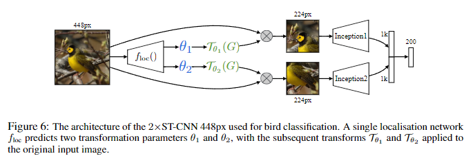

# Spatial Transformer Network
[paper](https://arxiv.org/abs/1506.02025)
[code](https://github.com/vicsesi/PyTorch-STN)
[tutorial](https://pytorch.org/tutorials/intermediate/spatial_transformer_tutorial.html)

## Abstract
畳み込みニューラルネットワークは、非常に強力なモデルクラスであるが、計算量やパラメータ効率の面から、入力データに対する空間的不変性が欠落しているといえる。
本研究では、学習可能な新しいモジュールであるSpatial Transformer を導入し、ネットワーク内でのデータの空間操作を明示的に可能にする。 
この微分可能なモジュールは、既存の畳み込みアーキテクチャに挿入することができ、ニューラルネットワークに、余分な学習監督や最適化プロセスの変更なしに、特徴マップそのものを条件として、特徴マップを能動的に空間変換する能力を与える。 
Spatial Transformerを使用することで、並進、スケール、回転、およびより一般的なワーピングに対する不変性を学習するモデルが得られることを示す。

## 1. Introduction
近年、高速でスケーラブルなend-to-endの学習フレームワークである畳み込みニューラルネットワーク(CNN)[21]の採用により、コンピュータ・ビジョンの状況は劇的に変化し、前進している。  
最近の発明ではないが、分類[19, 28, 35]、localization[31, 37]、semantic segmentaion[24]、行動認識[12, 32]などのタスクで、CNNベースのモデルが最先端の結果を達成している。 
画像を推論できるシステムの望ましい特性は、物体のポーズや部分の変形をテクスチャや形状から切り離すことである。
CNNに局所的なmax-pooling層を導入することで、ネットワークが特徴の位置に対してある程度空間的に不変であることを可能にし、この特性を満たすのに役立っている。 
しかし、一般的にマックス・プーリングの空間的サポートは小さいため(例えば $2\times2$ pixel)、この空間的不変性はmax-poolingと畳み込みの深い階層にわたってのみ実現され、CNNの中間的な特徴マップ(畳み込み層の活性化)は入力データの大きな変換に対して実際には不変ではない[6, 22]。 
このCNNの限界は、データの空間的配置の変化に対処するための、限定された、あらかじめ定義されたプーリング機構しか持たないことに起因する。 
本研究では、空間変換機能を提供するために、標準的なニューラルネットワークアーキテクチャに組み込むことができる、Spatial Transformerモジュールを導入する。 
Spatial Transformerの動作は、個々のデータサンプルに条件付けされ、問題のタスクに適した動作が訓練中に(追加の監視なしで)学習される。
受容野が固定的かつ局所的であるプーリングレイヤーとは異なり、Spatial Transformerモジュールは、各入力サンプルに対して適切な変換を生成することにより、画像(または特徴マップ)を能動的に空間変換することができる動的なメカニズムである。 
変換は(非局所的に)特徴マップ全体に対して実行され、スケーリング、クロッピング、回転、および非剛体変形を含むことができる。 
これにより、Spatial Transformerを含むネットワークは、最も関連性の高い(注目すべき)画像の領域を選択するだけでなく、それらの領域を正規の期待されるポーズに変換し、次のレイヤーでの認識を単純化することができる。 
注目すべきは、空間変換器は標準的なバックプロパゲーションで学習することができ、それらが注入されたモデルのend-to-endの学習が可能であることである。

Spatial TransformerをCNNに組み込むことで、例えば次のような様々なタスクに役立てることができる：
(i)画像分類：CNNが、特定の数字を含むかどうかに応じて画像の多方向分類を行うように学習されているとする；
ここで、桁の位置と大きさはサンプルごとに大きく異なる(そしてクラスとは無相関である)可能性がある；
適切な領域を切り出し、スケール正規化するSpatial Transformerは、その後の分類タスクを単純化し、優れた分類性能につながる；
(ii)共定位：同じ(しかし未知の)クラスの異なるインスタンスを含む画像セットが与えられると、空間変換器を使用して、各画像内でそれらを定位させることができる；
(iii) 空間的注意：Spatial Transformerは、[14, 39]のような注意メカニズムを必要とするタスクに使うことができるが、より柔軟性が高く、強化学習を使わずに純粋にバックプロパゲーションで学習することができる。
アテンションを使用する主な利点は、変換された(つまりアテンションされた)解像度の低い入力を、解像度の高い生の入力に優先して使用することができ、計算効率が向上することである。

本稿の残りの部分は以下のように構成されている： 
Sect. 2で我々の研究に関連するいくつかの研究について述べ、Sect. 3で空間変換器の定式化と実装を紹介し、最後にSect.4.追加の実験を示し、実装の詳細は付録Aに示す。

Figure 1：歪んだMNISTの数字を分類するために訓練された全結合ネットワークの第1層としてSpatial Transformerを使用した結果。 
(a) Spatial Transformerネットワークへの入力は、ランダムな平行移動、スケール、回転、乱雑さで、ゆがまされたMNISTの数字の画像である。 
(b) Spatial Transformerのローカリゼーションネットワークは、入力画像に適用する変換を予測する。 
(c) 変換を適用した後のSpatial Transformerの出力。 
(d) 空間変換器の出力に対して後続の完全連結ネットワークが生成した分類予測。 
空間変換器ネットワーク（空間変換器モジュールを含むCNN）は、クラスラベルのみを用いてエンドツーエンドで学習される。

## 2 Related Work
このセクションでは、ニューラルネットワークによる変換のモデル化[15, 16, 36]、変換不変表現の学習と分析[4, 6, 10, 20, 22, 33]、特徴選択のための注意と検出メカニズム[1, 7, 11, 14, 27, 29]など、この論文に関連する先行研究について述べる。
Hinton [15]による初期の研究は、オブジェクトのパーツに正準参照フレームを割り当てることに着目したもので、このテーマは[16]でも繰り返され、2Dアフィン変換が変換されたパーツからなる生成モデルを作成するためにモデル化された。
生成学習スキームのターゲットは変換された入力画像であり、入力画像とターゲット間の変換はネットワークへの追加入力として与えられる。 
その結果、パーツを合成することでオブジェクトの変換画像を生成することを学習できる生成モデルが得られる。
変換された部分の合成という概念は、Tieleman [36]によってさらに推し進められ、学習された部分は明示的にアフィン変換され、変換はネットワークによって予測される。 
このような生成的カプセルモデルは、変換の監視から分類のための識別特徴を学習することができる。
入力画像の変換に対するCNN表現の不変性と等変量性は、原画像と変換画像の表現間の線形関係を推定することによって、[22]で研究されている。
Cohen と Welling [6]は、この振る舞いを対称群との関係で分析し、Gens と Domingos [10]が提案したアーキテクチャでもこれを利用し、対称群に対してより不変な特徴マップを実現している。
変換に不変な表現を設計する他の試みは、散乱ネットワーク [4]、変換されたフィルタのフィルタバンクを構築するCNN [20, 33]である。  
Stollengaら[34]は、同じ画像の後続のフォワード・パスに対して、ネットワークのフィルタの応答をゲートするために、ネットワークの活性に基づくポリシーを使用する。
この研究では、[9]でクラスタリングのために行われたような、特徴抽出器ではなくデータを操作することによって不変表現を達成することを目指している。 
選択的注意を持つニューラルネットワークは、クロップをすることによってデータを操作するため、平行移動不変性を学習することができる。 
一方、[14]は生成モデルでガウシアンカーネルを利用することで、微分可能な注意メカニズムを使用している。
Girshickらによる研究 [11]は、注意の一形態として領域提案アルゴリズムを使用し、[7]は顕著な領域をCNNで回帰することが可能であることを示している。 
本稿で紹介するフレームワークは、あらゆる空間変換に対する微分可能な注意の一般化と見ることができる。

Figure 2：Spatial Transformer モジュールのアーキテクチャ。 
入力特徴マップ$U$は、変換パラメータ $\theta$ を回帰するlocalizationネットワークに渡される。
$V$ 上の規則的な空間グリッド $G$ はサンプリンググリッド $\Tau_\theta(G)$ に変換され、3.3で説明するように $U$ に適用され、ワープされた出力特徴マップVを生成する。 
localizationネットワークとサンプリングメカニズムの組み合わせは、Spatial Transformerを定義する。

## 3 Spatial Transformers
このセクションでは、Spatial Transformer の定式化について述べる。 
これは微分可能なモジュールであり、1回のフォワードパスで特徴マップに空間変換を適用する。
マルチチャンネル入力の場合、同じワーピングが各チャンネルに適用される。 
簡単のため、このセクションでは、変換器ごとに単一の変換と単一の出力を考えるが、実験で示したように、複数の変換に一般化することができる。
Spatial Transformerの仕組みは、Figure 2に示すように3つの部分に分かれている。
計算の順序としては、まずlocalisation ネットワーク(Section 3.1)が入力特徴マップを受け取り、いくつかの隠れ層を通して、特徴マップに適用すべき空間変換のパラメータを出力する。
この特徴マップが入力に対する変形の制約を与える。
推定された変換パラメータはサンプリンググリッドを生成するために使用される。
サンプリンググリッドとは、変換された出力を生成するために入力マップがサンプリングされるべき点の集合である。 
これはSection 3.2にて説明するgrid generatorによって行われる。
最後に、特徴マップとサンプリンググリッドがサンプラーへの入力として取り込まれ、グリッドポイントで入力からサンプリングされた出力マップが生成される(Section 3.3節)。 
これら3つのコンポーネントの組み合わせは空間変換器を形成し、以下の節でより詳細に説明される。

### 3.1 Localisation Network
localisation ネットワークは、幅 $W$ 、高さ$H$ 、チャンネル $C$ を持つ入力特徴マップ $U\in \mathcal{R}^{H\times W\times C}$ を受け取り $\theta$ を出力する。
$\theta$ は特徴マップに適用される変換 $\Tau_\theta$ のパラメータである：$\theta = f_{loc}(U)$。 
$\theta$ のサイズは、パラメータ化される変換タイプによって変化し、例えばアフィン変換の場合、$\theta$ は式(10)のように6次元である。 
localisation ネットワーク関数 $f_{loc}()$ は、全結合ネットワークや畳み込みネットワークなど、どのような形式をとることもできるが、変換パラメータ $\theta$ を生成するための最終回帰層を含まなければならない。

### 3.2 Parameterised Sampling Grid
入力特徴マップのワーピングを実行するために、各出力ピクセルは、入力特徴マップの特定の位置を中心とするサンプリングカーネルを適用することによって計算される(これについては次のセクションで詳しく説明する)。 
*pixel* とは、一般的な特徴マップの要素のことであり、必ずしも画像のことではない。 
一般に、出力ピクセルは、ピクセル $G_i = (x^t_i,y^t_i)$ 群の規則的なグリッド $G = {G_i}$ 上に位置するように定義され、出力特徴マップ $V\in \mathcal{R}^{H'\times W'\times C}$ を形成する。
ここで、$H'$ と $W'$ はグリッドの高さと幅であり、$C$ はチャンネル数であり、入力と出力で同じである。
説明を明確にするため、とりあえず $\Tau_\theta$ が2次元アフィン変換 $A_\theta$ であると仮定する。 
他の変換については後述する。このアフィンの場合、点ごとの変換は

$$
\left(
\begin{aligned}
    x^s_i\\
    y^s_i
\end{aligned}
\right)
= \Tau_\theta(G_i) = A_\theta
\left(
\begin{aligned}
    x^t_i\\
    y^t_i\\
    1
\end{aligned}
\right) =
\left[
\begin{aligned}
    \theta_{11} \theta_{12} \theta_{13}\\
    \theta_{21} \theta_{22} \theta_{23}
\end{aligned}
\right]
\left(
\begin{aligned}
    x^t_i\\
    y^t_i\\
    1
\end{aligned}
\right) \tag{1}
$$

ここで、$(x^t_i, y^t_i)$ は出力特徴マップの規則的なグリッドのターゲット座標、$(x^s_i, y^s_i)$ はサンプル点を定義する入力特徴マップのソース座標、$A_\theta$ はアフィン変換行列である。
出力の空間的境界内にあるときは $-1\le x^t_i, y^t_i\le 1$、入力の空間的境界内にあるときは $-1\le x^s_i, y^s_i \le 1$ となるように、高さと幅を正規化した座標を使用する( $y$ 座標についても同様)。
ソース／ターゲットの変形およびサンプリングは、グラフィックスで使用される標準的なテクスチャマッピングと座標に相当する[8]。
式 (10)で定義される変換は、入力特徴マップにトリミング、平行移動、回転、スケール、スキューを適用することを可能にし、localisationネットワークによって生成される6つのパラメータ( $A_\theta$ の6要素)のみを必要とする。
これは、変換が縮小である場合(すなわち、左の $2\times 2$ 部分行列の行列式が $1$ より小さい大きさを持つ場合)、写像された正方格子は、$x^s_i, y^s_i$ の範囲より小さい面積の平行四辺形に位置することになるため、トリミングを可能にする。 
この変換がグリッドに与える影響を、同一変換と比較してFigure 3に示す。

Figure 3：出力 $V$ を生成する画像 $U$ にパラメータ化されたサンプリンググリッドを適用した2つの例。 (a) サンプリンググリッドは正格子 $G = T_I(G)$ であり、$I$ は同一変換パラメータである。 
(b) サンプリンググリッドは、アフィン変換 $T_\theta(G)$ で正規グリッドをワーピングした結果である。

変換 $T_\theta$ のクラスは、注意のために使用されるような、より制約されたものであってもよい。

$$
A_\theta =
\left[
    \begin{aligned}
    s\ 0\ t_x \\
    0\ s\ t_y 
    \end{aligned}
\right] \tag{2}
$$

$s, t_x, t_y$ を変化させることで、トリミング、平行移動、等方的なスケーリングが可能になる。
変換 $T_\theta$ は、8つのパラメータを持つ平面射影変換、ピースワイズアフィン、薄板スプラインなど、より一般的なものにもできる。

実際、この変換は、パラメータに関して微分可能であれば、どのようなパラメータ化された形でもよい。
- これにより、サンプル点 $T_\theta(G_i)$ からlocalisationネットワーク出力 $\theta$ まで、勾配がバックプロパゲートされる。
変換が構造化された低次元の方法でパラメータ化されていれば、ローカリゼーション・ネットワークに割り当てられるタスクの複雑さが軽減される。
例えば、構造化された微分可能な変換の一般的なクラスは、注目変換、アフィン変換、射影変換、薄板スプライン変換のスーパーセットであり、$\Tau_\theta＝M_\theta B$ であり、ここで $B$ はターゲットグリッド表現(例えば(10)では、$B$は同次座標の正格子$G$)であり、$M_\theta$は $\theta$ でパラメータ化された行列である。
この場合、あるサンプルに対する $\theta$ の予測方法を学習するだけでなく、目の前の課題に対する $B$ を学習することも可能である。

### 3.3 Differentiable Image Sampling
入力特徴マップの空間変換を行うために、サンプラーは入力特徴マップ $U$ とともにサンプリング点の集合 $T_\theta(G)$ を取り、サンプリングされた出力特徴マップ $V$ を生成しなければならない。
$T_\theta(G)$ の各座標 $(x^s_i, y^s_i)$ は、出力 $V$ の特定のピクセルでの値を得るためにサンプリングカーネルが適用される入力の空間位置を定義する。 これは次のように書くことができる。

$$
V^c_i = \sum_n^H \sum_m^W U^c_{nm} k(x^s_i - m; \Phi_x) k(y^s_i - n; \Phi_y) \  \forall i \in [1... H'W']\ \  \forall c \in [1...C] \tag{3}
$$

ここで $\Phi_x$ と $\Phi_y$ は、画像補間(バイリニアなど)を定義する一般的なサンプリング・カーネル $k()$ のパラメータ、$U^c{nm}$ は入力のチャンネル $c$ の位置 $(n,m)$ における値、$V^c_i$ はチャンネル $c$ の位置 $(x^t_i, y^t_i)$ におけるピクセル $i$ の出力値である。 
サンプリングは，入力の各チャンネルに対して同じように行われるので，どのチャンネルも同じように変換されることに注意する(これにより，チャンネル間の空間的な一貫性が保たれる)。
理論的には，$x^s_i$ と $y^s_i$ に対して(副)勾配を定義できる限り，どのようなサンプリングカーネルを用いても構わない。
例えば、整数サンプリング・カーネルを使うと、式(3)は次のようになる。

$$
V^c_i = \sum_n^H \sum_m^W U^c_{nm} \delta([x^s_i + 0.5] - m) \delta([y^s_i + 0.5] - n)  \tag{4}
$$

ここで $[x + 0.5]$ は $x$ を最も近い整数に丸めることであり、$\delta()$ はクロネッカーデルタ関数である。
このサンプリングカーネルは、$(x^s_i, y^s_i)$ に最も近いピクセルの値を出力位置 $(x^t_i, y^s_i)$ にコピーするだけに等しい(nearest neighbor)。
あるいは、バイリニアサンプリングカーネルを使うこともでき、次のようになる

$$
V^c_i = \sum_n^H \sum_m^W U^c_{nm} \max(0, 1 - |x^s_i - m|) \max(0, 1 - |y^s_i - n|)  \tag{5}
$$

このサンプリングメカニズムによる損失のバックプロパゲーションを可能にするために、 $U$ と $G$ に関する勾配を定義することができる。
バイリニアサンプリング 式(5)の偏導関数は次のようになる。

$$
\begin{align}
\frac{\partial V^c_i}{\partial U^c_{nm}} = \sum^H_n \sum^W_m \max(0, 1 - |x^s_i - m|)\max(0, 1 - |y^s_i - n|) \tag{6} \\
\frac{\partial V^c_i}{\partial x^s_i} = \sum^H_n \sum^W_m U^c_{nm} \max(0, 1 - |y^s_i - n|) 
\left\{
    \begin{aligned}
    0\ & if\ |m-x^s_i| \ge 1\\
    1\ & if\ m \ge x^s_i\\
    -1\ & if\ m < x^s_i
    \end{aligned}
\right.
\tag{7}
\end{align}
$$

式(7)に関しては $\frac{\partial V^c_i}{\partial x^s_i}$ も同様である。
本式により(副)微分可能なサンプリング機構を与え、損失勾配を入力特徴マップ(6)だけでなく、サンプリンググリッド座標(7)に戻すことができる。
従ってたとえば式(10)のように$\frac{\partial x^s_i}{\partial \theat}$　and $\frac{\partial x^s_i}{\partial \theat}$は簡単に微分できるので、変換パラメータ $\theta$ とlocalisationネットワークに戻すことができる。 
サンプリング関数の不連続性のため、部分勾配を使用する必要がある。 
このサンプリングメカニズムはGPU上で非常に効率的に実装することができ、入力の全ての位置の和を見るのではなく、代わりに各出力画素のカーネルサポート領域を見るだけである。

## 3.4 Spatial Transformer Networks
loalisationネットワーク、グリッド・ジェネレーター、サンプラーを組み合わせると、Spatial Transformerになる(Figure 2)。 
これは自己完結型のモジュールであり、CNNアーキテクチャに任意の時点、任意の数で落とし込むことができ、空間変換ネットワークを生成する。 
このモジュールは計算速度が非常に速く、学習速度を損なわないので、なにも気にせずに使っても時間のオーバーヘッドはほとんど発生せず、変形処理の出力に適用できる後続のダウンサンプリングによって、注意深いモデルでも高速化することができる。
CNN内に空間変換器を配置することで、ネットワークは学習中に特徴マップを能動的に変換する方法を学習し、ネットワークの全体的なコスト関数を最小化することができる。
各トレーニングサンプルをどのように変換するかという知識は、トレーニング中に圧縮され、localisationネットワークの重み(およびSpatial Transformerの前の層の重み)にキャッシュされる。
いくつかのタスクでは、localisationネットワークの出力 $\theta$ をネットワークの残りの部分にフィードフォワードすることも有用である。
出力次元 $H'$ と $W'$ を入力次元 $H$ と $W$ と異なるように定義できるので、特徴マップをダウンサンプリングまたはオーバーサンプリングするためにSpatial Transformerを使用することも可能である。
しかし、固定された小さな空間サポートを持つサンプリングカーネル(バイリニアカーネルなど)では、空間変換器を使用したダウンサンプリングはエイリアシング効果を引き起こす可能性がある。
最後に、CNNでは複数の空間変換器を持つことが可能である。 
複数の空間変換器をネットワークの深さ方向に配置することで、より抽象的な表現に変換することができ、またローカライゼーションネットワークに、予測される変換パラメータのベースとなる、潜在的により有益な表現を与えることができる。 
また、複数の空間変換器を並列に使用することもできます。
これは、特徴マップに複数のオブジェクトや個別に注目すべき部分がある場合に便利です。 
純粋なフィードフォワードネットワークにおけるこのアーキテクチャの限界は、並列空間変換器の数によって、ネットワークがモデル化できるオブジェクトの数が制限されることである。

## 4 Experiments
このセクションでは、多くの教師あり学習タスクにおけるSpatial Transformerネットワークの利用を探求する。 
Section 4.1では、まずMNIST手書きデータセットの歪んだバージョンに対する実験から始める。
4.1では、まずMNIST手書きデータセットの歪んだバージョンに対する実験から始め、入力画像を能動的に変換することによって分類性能を向上させる空間変換器の能力を示す。 
4.2では、Spatial Transformerをテストする。
4.2では、実世界の困難なデータセットであるStreet View House Numbers [25]を用いて、数字認識のためのSpatial Transformerネットワークをテストし、CNNの畳み込みスタックに埋め込まれた複数のSpatial Transformerを用いた最先端の結果を示す。 
最後に、Section 4.3で空間変換器の利用について調べる。
4.3では、CUB-200-2011鳥類データセット[38]において、オブジェクトのパーツを発見し、それらに注目するように学習することで、きめ細かな分類のための複数の並列空間変換器の利用を調査し、最先端の性能を示す。 
MNISTの追加と共局在化の更なる実験は付録Aにある。

### 4.1 Distorted MNIST
このセクションでは、MNIST手書きデータセットをテストベッドとして使用し、Spatial Transformerを使用することでネットワークが不変性を学習できる変換の範囲を探索する。 
まず、さまざまな方法で歪められたMNISTデータを分類するために、さまざまなニューラルネットワークモデルを訓練する実験から始める：
回転(R)、回転・平行移動・スケール・(RTS)、射影変換(P)、弾性ワーピング(E) - 弾性ワーピングは破壊的で、場合によっては逆変換できないことに注意。 
このデータを作成するために使用された歪みの詳細については、付録Aに記載されている。
我々は、ベースラインの全結合ネットワーク(FCN)と畳み込み(CNN)ニューラルネットワーク、および分類ネットワークの前に入力に作用するSpatial Transformer を持つネットワーク(ST-FCNとST-CNN)を訓練する。
Spatial Transformerネットワークはすべてバイリニア・サンプリングを使用するが、アフィン変換(Aff)、射影変換(Proj)、16点thin plate spline 変換(TPS)[2]といった異なる変換関数を使用する。 
CNNモデルには2つのmax pooling層がある。
すべてのネットワークはほぼ同じ数のパラメータを持ち、同一の最適化スキーム(バックプロパゲーション、SGD、多項式クロスエントロピー損失によるスケジュール学習率低下)で学習され、分類ネットワークにはすべて3つの重み層がある。
これらの実験結果をTable 1(左)に示す。
データのどのような特定のタイプの歪みを見ても、Spatial Transformerを有効にしたネットワークが、対応する基本ネットワークよりも優れていることは明らかである。
回転、平行移動、スケール歪み(RTS)の場合、ST-CNNは $\Tau_\theta$ に使用される変換のクラスに応じて0.5％と0.6％を達成するのに対し、空間不変性を提供するために2つのmax-pooling層を持つCNNは0.8％の誤差を達成する。
これは実際、ST-FCNが達成した誤差と同じであり、ST-FCNはネットワーク内に畳み込み層やマックスプーリング層を一つも持たず、空間変換器を使用することが空間不変性を達成する代替方法であることを示している。 
ST-CNNモデルは、ST-FCNモデルよりも一貫して優れた性能を示すが、これはST-CNNのマックス・プーリング層が空間不変性をさらに高め、畳み込み層が局所構造をよりよくモデル化するためである。
また、ノイズの多い環境で、MNISTの数字を翻訳した60×60の画像と背景の乱雑さを用いてモデルをテストした(例としてFiguire 1の3行目を参照)。
FCNは13.2%、CNNは3.5%の誤差を得たが、ST-FCNは2.0%、ST-CNNは1.7%の誤差を得た。
異なるクラスの変換間の結果を見ると、thin plate spline変換(TPS)が最も強力であり、入力を桁のプロトタイプインスタンスに再形成することで、弾性的に変形した桁の誤差を減らすことができ、分類ネットワークのタスクの複雑さを軽減し、Rなどの単純なデータでover fitしない。
興味深いことに、すべてのSTモデルの入力を変換すると、「標準的な」直立ポーズの数字になる - これは訓練データで見つかった平均ポーズである。
Table 1(右)には、CNNでは正しく分類できないが、Spatial Transformerネットワークでは正しく分類できるいくつかのテストケースに対して実行された変換を示す。
さらなるテスト例は、こちらのアニメーション(https://goo.gl/qdEhUu)で見ることができる。

Table 1: 
左：異なる歪んだMNISTデータセットに対する異なるモデルの誤差の割合。
我々がテストした異なる歪んだMNISTデータセットは以下の通りである。
TC: 平行移動と乱雑化
R: 回転 
RTS: 回転, 平行移動, 拡大縮小
P: 射影変形 
E: 弾性変形
各実験に使用されたモデルはすべて、同じ数のパラメータを持ち、すべての実験において同じ基本構造を持つ。
右：空間変換ネットワークは桁を正しく分類するが、CNNは失敗するテスト画像の例。
(a) ネットワークへの入力
(b) Spatial Transformerの推論した変形。 $\Tau_\theta(G)$ のグリッドで可視化している。
(c) Spatial Transformerの出力
E と RTS の例では  thin plate spline の spatial transformer (ST-CNN TPS)を使用している
一方 R の例では affine変換の spatial transformers (ST-CNN Aff) に角度を空建てて使用している。
これらの実験の動画によるアニメーションは https://goo.gl/qdEhUu を見てください

### 4.2 Street View House Numbers
次に、実世界の難しいデータセットであるStreet View House Numbers(SVHN) [25]でSpatial Transformerネットワークをテストする。 
このデータセットには、約200kの家屋番号の実世界画像が含まれており、各画像内の数字の並びを認識するタスクがある。 
各画像には1桁から5桁の数字があり、スケールや空間的配置に大きなばらつきがある。
[1,13]の実験セットアップに準じ、各桁列の周囲を64×64で切り取ることでデータを前処理する。 
また、[1]と同様に、$128 \times 128$ のより緩やかな切り抜きデータセットも使用する。 
我々は、5つの独立したソフトマックス分類器を導く11の隠れ層を持つベースライン文字列CNNモデルを訓練する。  
これは[19]で使用された文字列モデルであり、各分類器は可変長配列をモデル化するためにヌル文字出力を含む。このモデルは[13]で得られた結果と一致する。
このベースラインCNNを拡張し、入力直後の空間変換器（ST-CNNシングル）を含むようにした。
ここで、localisation ネットワークは4層のCNNである。
また、ベースラインCNNの最初の4つの畳み込み層の前に、空間変換器(ST-CNN Multi)を挿入する拡張も定義する。
ここで、localisationネットワークは32の要素をもつ2層の全結合層である。
ST-CNNマルチモデルでは、最初の畳み込み層の前にある空間変換器は、以前の実験と同様に入力画像に作用するが、ネットワークのより深い部分にある後続の空間変換器は、畳み込み特徴マップに作用し、そこから変換を予測し、これらの特徴マップを変換する(これはTable 2(右)(a)に可視化されている)。
これにより、より深い空間変換器は、生の画像ではなく、より豊富な特徴に基づいて変換を予測することができる。 
すべてのネットワークは、SGDとドロップアウト[17]を用いて、ランダムに初期化された重みでゼロから学習される。 
アフィン変換とバイリニアサンプリングカーネルは、これらの実験ではすべての空間変換ネットワークに使用されている。

Table 2：左：$64 \times 64$ ピクセルのクロップ(64px)と、より多くの背景を含む $128\times 128$ ピクセルのクロップ(128px)に対するSVHN多桁認識のシーケンスエラー。 
* [1]で報告された最良の結果は、モデル平均とモンテカルロ平均を使用している。 
一方、他のモデルの結果は、単一モデルのシングルフォワードパスによるものである。
右：(a) ST-CNNマルチモデルの概略図。各空間変換器(ST)によって適用された変換は、前の層によって生成された畳み込み特徴マップに適用される。 
(b) ST-CNNマルチの4つの空間変換器によって予測されたアフィン変換を乗算した結果を入力画像上で可視化したもの。

### 4.3 Fine-Grained Classification
このセクションでは、複数の変換器を並列に配置したSpatial Transformerネットワークを用いて、鳥のきめ細かな分類を行う。
CUB-200-2011鳥類データセット[38]を用いて我々のモデルを評価した。このデータセットには6k枚の学習画像と5.8k枚のテスト画像が含まれ、200種の鳥類をカバーしている。 
鳥は様々なスケールと方向で現れ、きっちりトリミングされておらず、区別するために詳細なテクスチャと形状分析を必要とする。我々の実験では、学習には画像クラスラベルのみを使用する。
強力なベースラインCNNモデルを考える
バッチ正規化[18]を備えたInceptionアーキテクチャをImageNet[26]で事前に訓練し、CUBで微調整することにより、82.3%という最先端の精度を達成する(これまでの最高結果は81.0%[30])。
ST-CNNは2つまたは4つの並列空間変換器を含み、注意のためにパラメータ化され、入力画像に作用する。
変換器によって取り込まれた識別可能な画像パーツは、パーツ記述サブネットに渡される(各サブネットもInceptionによって初期化される)。
得られたパーツ表現は連結され、1つのsoftmax層で分類される。
アーキテクチャ全体は、バックプロパゲーションによりエンド・ツー・エンドで画像クラスラベルを学習する(詳細はAppendix Aに記載)。  
結果をTable3(左)に示す。 
ST-CNNは84.1%の精度を達成し、ベースラインを1.8%上回った。 
なお、ImageNetトレーニングセットとCUB-200-2011テストセット1との間にはわずかな重複（22/5794）があり、テストセットからこれらの画像を取り除くと、同じST-CNNで84.0%の精度が得られる。
2×ST-CNNによって予測された変換の視覚化(Table 3(右))を見ると、興味深い動作が学習されていることがわかる：1つのSpatial Transformer(赤)は頭部検出器になるように学習し、もう1つのSpatial Transformer(緑)は鳥の体の中心部分に固定する。
その結果、分類ネットワーク用の空間変換器からの出力は、鳥の多少ポーズが正規化された表現になる。
[3]のような先行研究では、鳥の部分を明示的に定義し、供給されたキーポイント学習データでこれらの部分のための別々の検出器を学習しているが、ST-CNNは、追加の監視なしで、データ駆動型の方法で部分検出器を発見し、学習することができる。 
さらに、Spatial Transformerの使用により、変換された448px画像の出力は処理される前に224pxにダウンサンプリングされるため、性能に影響を与えることなく448px解像度の入力画像を使用することができる。

Table 3：左：CUB-200-2011鳥類分類データセットでの精度。2つの空間変換器(2×ST-CNN)と4つの空間変換器(4×ST-CNN)を並列に配置した空間変換器ネットワークがより高い精度を達成。 
448pxの解像度の画像は、変換後に224pxにダウンサンプリングするため、計算コストの増加なしにST-CNNで使用できる。 
右：2×ST-CNN(上段)と4×ST-CNN(下段)の空間変換器が入力画像に対して予測した変換。特に2×ST-CNNでは、Spatial Transformerの一方(赤で示す)は頭部を検出するように学習し、もう一方(緑で示す)は胴体を検出する。

## 5 Conclusion
本稿では、ニューラルネットワークのための新しい自己完結型モジュール、Spatial Transformerを紹介する。 
このモジュールはネットワークに組み込むことができ、特徴の明示的なSpatial Transformを実行することで、ニューラルネットワークがデータをモデル化する新しい方法を開くことができ、損失関数に変更を加えることなく、エンドツーエンドで学習される。 
CNNは非常に強力なベースラインを提供する一方で、複数のタスクにわたってSpatial Transformerを使用することで精度が向上し、その結果、最先端の性能が得られる。 
さらに、Spatial Transformerから回帰された変換パラメータは出力として利用でき、後続のタスクに利用できる。 
この研究ではフィード・フォワード・ネットワークのみを探究しているが、初期の実験では、Spatial Transformerはリカレント・モデルにおいて強力であり、オブジェクトの参照フレームの分離を必要とするタスクに有用であり、また3D変換にも容易に拡張可能であることを示している(Appendix A.3参照)。

## A Appendix
本節では、さらに2つの実験の結果を紹介する。Section .A.1ではMNISTの追加、Section A.2では共局在化について述べる。
Section A.2では半教師付きシナリオへの応用を示す。 
さらに3Dへの拡張をSection A.3.にて示す。
また、Section 4.1の実験の詳細をSection A.4で、Section 4.2の実験の詳細をA.5で、Section 4.3の実験の詳細をA.6で発展させる。

### A.1 MNIST Addition
このセクションでは、複数の空間変換器を並列に使用する別の使用例を示す：
複数のオブジェクトをモデル化する。MNISTの足し算タスクを定義し、ネットワークは入力で与えられた2桁の数字の和を出力しなければならない。
各桁は別々の42×42入力チャンネルで表示されるが(2チャンネル入力となる)、各桁は独立に変換され、ランダムな回転、スケール、平行移動(RTS)が行われる。
我々は、全結合ネットワーク(FCN)、畳み込みネットワーク(CNN)、単一のSpatial Transformerをもつ全結合ネットワーク(ST-FCN)、および入力画像に作用する2つのSpatial Transformerをもつ全結合ネットワーク(2×ST-FCN)を訓練する。
入力に2つのチャネルを持ち、どちらのチャネルも変換を行う。」
2つの空間変換器の2チャンネル出力は、後続のFCNのための4チャンネル特徴マップに連結される。
Section 4.1と同様に、全てのネットワークは同じ数のパラメータを持ち、19クラス(取りうる加算の結果は0-18)に対して多項式クロスエントロピー損失を最小化するようにSGDで学習される。
結果をTable 4(左)に示す。
このタスクの複雑さのため、FCNは最小誤差47.7%に達するが、max-pooling層を持つCNNは14.7%の誤差ではるかに正確である。
1つの空間変換器を追加すると、両桁を含む入力の単一領域に焦点を当てることでFCNの能力が向上し、誤差は18.5%に達する。
しかし、2つのSpatial Transformerを使用することで、各変換器は(両方のチャネルを入力として受け取りながらも)1つのチャネルの数字を変換することに集中するように学習することができる。これはTable 4(右)にて可視化される。
Transformerは共適応し、Spatial Transformerの4つの出力チャンネルのうち2つのチャンネルで、2桁の安定した表現を作り出す。
これにより、2×ST-FCNモデルは5.8％の誤差を達成し、他のモデルを大きく上回る。

Table 4：左：2桁のMNIST足し算タスクのエラー率。各桁は別々のチャンネルで独立に変換され、2桁の合計のラベルのみを与えて学習。 
2つの空間変換器(2×ST-FCN)を並列に使用することで、全結合ニューラルネットワークが各桁の変換に対して不変となり、最も誤差が小さくなる。
各列に使用されたモデルはすべて、ほぼ同じ数のパラメーターを持っている。
右：各空間変換器の学習された挙動を示すテスト例(thin plate spline(TPS)変換を使用)。
2チャンネルの入力(青いバーはチャンネル間の分離を示す)は、2つの独立したSpatial Transformer、ST1とST2に供給され、それぞれ両チャンネルで動作する。 
ST1とST2の出力は連結され、元の2桁の足し算を予測する完全連結ネットワーク(FCN)への4チャンネル入力として使用される。 
訓練中、2つのSpatial Transformerはそれぞれ1つのチャンネルに集中するように共同適応する。

### A.2 Co-localisation
この実験では、半教師付きシナリオである共同ローカライゼーションにおける空間変換器の使用を探求する。
共同ローカライゼーションのタスクは以下の通り：
共通の、しかし未知のオブジェクトクラスのインスタンスを含むと仮定された画像セットが与えられた場合、共通のオブジェクトを(バウンディングボックスを用いて)ローカライズする。
オブジェクトのクラスラベルも、オブジェクトの位置のグランドトゥルースも、最適化には使われず、画像の集合だけが使われる。 
これを達成するために、ある埋め込み空間において、2つの正しくローカライズされたオブジェクトに対応する画像クロップ間の距離が、ランダムにサンプリングされた画像クロップ間の距離よりも小さいという監視を採用する。
N枚の画像からなるデータセット $\mathcal{I} = {I_n}$ の場合、これはトリプレット損失(triplet loss)に変換される。

$$
\sum^N_n \sum^M_{m\ne n} \max(0, \| c(I^{\Tau}_n) -c(I^{\Tau}_m)\|^2_2 ^ \|c(I^{\Tau}_n) -c(I^{rand}_m)\|^2_2 + \alpha)
$$

ここで、 $I^{\Tau}_n$ はローカライズされたオブジェクトに対応する $I_n$ の画像クロップ、$I^{rand}_n$ は $I_n$ からランダムにサンプリングされたパッチ、$e()$ はエンコーディング関数、$\alpha$ はマージンである。
$I^{\Tau}_n = T_\theta(I_n)$ ここで、 $\theta = f_{loc}(I_n)$  、変換のパラメータ $\theta$ をオブジェクトのバウンディング・ボックスと解釈する。
これを確率的勾配降下法で最小化し、画像ペア $(n,m)$ をランダムにサンプリングする。
翻訳された（T）画像と、翻訳され乱雑になった（TC）MNIST画像に対して共局在化を行う。
各画像は、 $28 \times 28$ ピクセルの MNIST 数字であり、$84 \times 84$ 個の黒背景画像の均一なランダム位置に配置される。
乱雑なデータセットには、元のMNIST訓練データセットからサンプリングしたランダムな $6\times 6$ のクロップを16枚追加し、ディストラクターを作成する。 
特定の共定位最適化のために、数字クラスを選び、100個の歪んだ画像サンプルを実験用データセットとして生成する。 
マージン $\alpha = 1$ を使用し、符号化関数 $e()$ にはSect.4.1で学習したCNNを使用し、3層の活性化層(2つの隠れ層とsoftmaxなしの分類層)を連結して特徴記述子を形成する。
注意(スケールと平行移動)のためにパラメータ化されたSpatial Transformerを使用し、localisationネットワークは、8つの $9\times 9$ フィルタと4ピクセルのストライドを持つ畳み込み層、ストライド2の $2\times 2$の max-pooling、そして最後の3ユニット全結合層の前の2つの8ユニット全結合層で構成される100kパラメータのCNNである。
結果をTable 5に示す。
予測されたバウンディングボックスと正解のバウンディングボックスの重なり(交差の面積を結合の面積で割ったもの)が0.5より大きい場合、その数字が正しくローカライズされていると判断する。 
我々のco-localisationフレームワークは、100%の精度で乱雑さのないMNISTの数字を完璧にローカライズすることができ、画像に乱雑さがある場合は75～93%の数字を正しくローカライズすることができる。 
Figure 4に "8" のデータセットの部分集合に対する最適化処理の例を示す。
これは、単純な直感から導かれた単純な損失関数であるにもかかわらず、驚くほど良い性能であり、追跡問題への更なる応用の可能性を示唆している。

Table5: 左: MNISTの異なる桁クラス、翻訳された桁(T)、およびクラッタが付加された翻訳された桁(TC)に対する、正しく共局在化された桁の割合。 
右：最適化アーキテクチャ：最適化アーキテクチャ。SpatialTransformer(ST)の2つの出力間の距離がランダムクロップまでの距離より小さくなるようにヒンジ損失を用いて強制し、空間変換器が共通のオブジェクトをローカライズするように促す。

Figure 4：co-localisationの最適化ダイナミクス。
ここでは、100枚のデータセットのうち3枚の画像について、SGDステップ後に空間変換器によって予測されたローカライゼーションを示している。 
SGDステップ180までに、モデルは3桁の数字を正しくローカライズしています。 
完全なアニメーションは、ビデオ(https://goo.gl/qdEhUu)に示されている。

### A.3 Higher Dimensional Transformers
本稿で説明するフレームワークは、2次元変換に限定されるものではなく、より高い次元に簡単に拡張することができる。 
このことを示すために、3次元アフィン変換が可能な空間変換器の例を挙げる。
我々は、Section .3.3の微分可能な画像サンプリングを拡張して、3Dバイリニアサンプリングを行う。
(5)の3D等式は次のようになる。

$$
V^c_i = \sum^H_n \sum^W_m \sum^d_l U^c_{nml}\max(0, 1 - |x^s_i - m|)\max(0, 1 - |y^s_i - n|)\max(0, 1 - |z^s_i - l|) \tag{9}
$$

for the 3D input $U \in \mathcal{R}^{H\times W\times D\times C}$ and output $V \in \mathcal{R}^{H'\times W' \times D'\times C}$ , where $H', W'$, and $D'$ are the height, width and depth of the grid, and $C$ is the number of channels. 
Similarly to the 2D sampling grid in Sect. 3.2, the source coordinates that define the sampling points, $(x^s_i,y^s_i ,z^s_i)$ can be generated by the transformation of a regular 3D grid $G = {G_i}$ of voxels $G_i = (x^t_i,y^t_i,z^t_i)$. 
For a 3D affine transformation this is

$$
\left(
    \begin{aligned}
    x^s_i\\
    y^s_i\\
    z^s_i
    \end{aligned}
\right) =  
\left[
    \begin{aligned}
    \theta_{11}\ \theta_{12}\ \theta_{13}\ \theta_{14}\\
    \theta_{21}\ \theta_{22}\ \theta_{23}\ \theta_{24}\\
    \theta_{31}\ \theta_{32}\ \theta_{33}\ \theta_{34}
    \end{aligned}
\right]
\left(
    \begin{aligned}
    x^t_i\\
    y^t_i\\
    z^t_i\\
    1
    \end{aligned}
\right) \tag{10}
$$

3DSpatial Transformerは、2DSpatial Transformerと同じように、ニューラルネットワークに組み込むことで、3D空間でデータをワープさせることができる。
3D transformer のもう一つの興味深い使用法は、3Dの出力を1次元flattenし、3D空間の2Dへの射影を生成することである。たとえば$W^c_{nm} = \sum_l V^c_{nml}$, ここで$W \in \mathcal{R}^{H'\times W'\times C}$
これにより、元の3Dデータをインテリジェントに2Dに投影し、その後の処理の次元と複雑さを大幅に減らすことができる。
我々は、3次元の押し出されたMNISTの数字のデータセットの3次元オブジェクト分類のタスクでこれを実証した。
タスクは、3D空間でランダムに平行移動と回転が行われた数字の3Dボクセルを入力とし、その数字のクラスを出力することである。
その結果、3D空間変換ネットワークは、結果として得られる2D画像において、数字が中心となる3D空間の2D投影を作成するように学習し、残りのレイヤーが分類しやすいようにする。
その一例をFigure 5に示す。

The whole network is trained end-to-end with just classification labels.
Figure 5：テスト例に対する学習済み3D MNIST分類器の動作。 
3Dボクセル入力には、$60\times 60\times 60$ の体積内に押し出されランダムに配置されたランダムなMNISTの数字が含まれる。 
3D空間変換器は入力の変換を行い、深さが平坦化された出力ボリュームを生成する。 
これにより、3D空間の2D投影が作成され、ネットワークの後続層が分類できるようになる。 
ネットワーク全体は、分類ラベルだけでend-to-endに学習される。

### A.4 Distorted MNIST Details
このセクションでは、Section 4.1 でのゆがめたMNISTの実験を発展させる。

**Data.** 
回転データセット(R)は、-90◦から+90◦の間で一様にサンプリングされたランダムな回転でMNIST訓練数字を回転させて生成した。
回転・平行移動・拡大縮小データセット（RTS）は、MNISTの数字をランダムに+45◦と-45◦回転させ、数字を0.7から1.2の間でランダムに拡大縮小し、42×42の画像内のランダムな位置に配置することにより生成した。
投影データセット(P)は、数字を0.75から1.0の間でランダムにスケーリングし、平均がゼロで標準偏差が5ピクセルの正規分布からサンプリングされた量だけMNISTの数字の各コーナーを引き伸ばすことによって生成された。
弾性的に歪んだデータセット(E)は、0.75から1.0の間でランダムに桁をスケーリングし、画像上の規則的なグリッドに配置された薄い板状のスプラインの16個の制御点を、平均がゼロで標準偏差が1.5ピクセルの正規分布からサンプリングされた量だけランダムに不安定化することによって生成した。
変換された乱雑なデータセット(TC)は、MNISTの数字を60×60の黒いキャンバスのランダムな位置に配置し、他の数字画像からランダムにサンプリングした6×6のパッチを画像のランダムな位置に挿入することで生成される。

**Networks.** 
すべてのネットワークは、整流された線形非線形とsoftmax分類器を使用している。
すべてのFCNネットワークは、2つの隠れ全結合層と、それに続く分類層を持っている。
すべてのCNNネットワークは、9×9畳み込み層(ストライド1、パディングなし)、ストライド2の2×2max-pooling層、それに続く7×7畳み込み層(ストライド1、パディングなし)、そして最後のクラス化層の前にストライド2のもう1つの2×2max-pooling層を持つ。
すべての空間変換器(ST)対応ネットワークは、STモジュールをネットワークの先頭に配置し、ST-FCNネットワークでは32ユニットの完全連結層、2×ダウンサンプリングされた入力に作用する2つの20フィルター5×5畳み込み層(ストライド1、パディングなし)、畳み込み層間の2×2最大プーリング、および畳み込み層に続く20ユニットの完全連結層で、ローカライゼーションネットワークに3つの隠れ層を持つ。  
TCデータセットとRTSデータセットのSpatial Transformerネットワークは、空間変換の後に平均プーリングを行い、分類ネットワークのために変換器の出力を2倍ダウンサンプリングする。  
FCNとCNNベースの分類モデルの正確なユニット数は、特定の実験のすべてのネットワークが常に同じ数の学習可能なパラメータ(約400k)を含むようにするため、さまざまである。
つまり、空間トランスネットワークは、一般的に、ローカリゼーションネットワークのパラメータが必要なため、分類ネットワークのパラメータが少なくなる。
FCNは1層あたり128から256のユニットを持ち、CNNは1層あたり32から64のフィルターを持つ。

**Training.** 
すべてのネットワークはSGDで150k反復、同じハイパーパラメータ(バッチサイズ256、基本学習率0.01、重み減衰なし、ドロップアウトなし)、同じ学習率スケジュール(50k反復ごとに学習率を10分の1に減少)で学習させた。 
ネットワークの重みはランダムに初期化するが、ローカライゼーション・ネットワークの最終回帰層は同一性変換を回帰するように初期化する(重みゼロ、同一性変換バイアス)。 
すべてのモデルについて、異なるランダムシードで3回の完全な学習を行い、平均精度を報告する。

### A.5 Street View House Numbers Details
Section 4.2のSVHN実験では、[1, 13]に従い、学習セットから5k画像からハイパーパラメータを選択する。
4.2のSVHN実験では、[1, 13]に従い、学習セットから5k画像からなる検証セットからハイパーパラメータを選択する。 
すべてのネットワークはSGD（128バッチサイズ）で400k反復学習され、基本学習率は0.01で80k反復ごとに10分の1に減少させ、重み減衰は0.0005に設定し、最初の畳み込み層とローカリゼーションネットワークを除くすべての層でドロップアウトを0.5に設定した。  
空間トランスネットワークのローカリゼーションネットワークの学習率は、基本学習率の10分の1に設定された。  
conv[N,w,s,p]は、ストライドsとピクセルパディングpを持つ、サイズw×wのN個のフィルターを持つ畳み込み層、fc[N]はN個のユニットを持つ完全連結層、max[s]はストライドsを持つs×sの最大プーリング層という表記を採用する。
CNNモデルはconv[48,5,1,2]-max[2]-conv[64,5,1,2]-conv[128,5,1,2]-max[2]-conv[160,5,1,2]-conv[192,5,1,2]-max[2]-conv[192,5,1,2]- conv[192,5,1,2]-max[2]-conv[192,5,1,2]-fc[3072]-fc[3072]-fc[3072],の5つの並列fc[11]と分類のためのソフトマックス層が続く([19]と同様)。
ST-CNNシングルはCNNモデルの最初の畳み込み層の前に1つの 空間変換器（ST）を持ち、STのlocalisationネットワーク・アーキ テクチャは次のとおりである：conv[32,5,1,2]-max[2]-conv[32,5,1,2]-fc[32]-fc[32]。ST-CNNマルチは4つの空間変換器を持ち、CNNモデルの最初の4つの畳み込み層の前にそれぞれ1つずつ、単純なfc[32]-fc[32]localisationネットワークを持つ。
ネットワークの重みはランダムに初期化するが、localisationネットワークの最後の回帰層は、同一性変換を回帰するように初期化する(重みがゼロ、同一性変換バイアス)。
異なるランダムシードで2回のフルトレーニングを行い、1つのモデルで得られた平均精度を報告する。

### A.6 Fine Grained Classification Details
このセクションでは、我々のきめ細かな画像分類アーキテクチャをより詳細に説明する。 
このタスクのために、我々は空間変換器を微分可能な注意メカニズムとして利用し、各変換器は自動的に識別可能な物体部分に注目するように学習することが期待される。 
すなわち、各変換器は注目窓の位置$(x,y)$ を予測し、スケールは画像サイズの50％に固定される。
変換器は入力画像から224×224クロップをサンプリングし、それぞれのクロップはそれ自身のCNNストリームによって記述され、マルチストリームアーキテクチャを形成する(Figure 6)。  
ストリームの出力は1024-Dクロップ記述子であり、これらは連結され、200-wayソフトマックス分類器で分類される。 ネットワークの主要な構成要素として、バッチ正規化[18]を備えた最先端のInceptionアーキテクチャを利用し、ImageNetチャレンジ(ILSVRC)データセットで事前に訓練した。
我々のモデルは、ILSVRC検証セットにおいて、1枚の画像の切り抜きで27.1%のトップ1エラーを達成した(最小辺が256になるようにリサイズされたシングルスケールの画像でのみ学習した)。 
クロップ記述ネットワークは、Inceptionアーキテクチャを採用し、最後のレイヤ(1000-way ILSVRC分類器)を削除することで、出力は1024-D記述子となる。
localisationネットワークは、すべてのトランスフォーマーで共有され、以下の方法でInceptionから導き出された。 
ILSVRC分類層とは別に、空間情報を保持するために最後のプーリング層も削除した。 
この切り捨てられたInceptionネットの出力は、7×7の空間分解能と1024の特徴チャンネルを持つ。

その上に、変形を予測するための3つのウェイトレイヤーを加えた：
(i) 1×1畳み込み層で、特徴チャンネル数を1024から128に減らす；
(ii) 128-D出力を持つ全結合層；
(iii) 2N-D出力を持つ全結合層。Nはtransformerの数である（N = 2とN = 4で実験した）。

パラメータの数と計算時間の観点から、アーキテクチャを最適化する努力はしていないことに注意されたい。 
我々の目的は、空間変換ネットワークが画像ラベルだけで学習した場合に、意味のあるオブジェクト部分を自動的に発見できるかどうかを調べることであり、これは定量的にも定性的にも確認された(Section 4.3節)。
モデルはSGD（バッチサイズ256）で30k反復学習され、初期学習率は0.1、10k、20k、25k反復後に10分の1に減少された。 
安定性のため、localisationネットワークの学習率は基本学習率に $10^{-4}$ を乗じたものとした。
重みの減衰は $10^{-5}$ に設定し、200種別の分類層の前に0.7のドロップアウトを使用した。 
Spatial Transformerの入力画像サイズは224×224と448×448の2種類を評価した。
後者の場合、localisationネットの前に固定2×ダウンスケーリング層を追加し、入力が224 ×224のままとなるようにした。
この2つの設定の違いは、サンプリングを行う画像のサイズにあり(224対448)、小規模な作物のサンプリングには448の方が適している。 
変換器の出力は、どちらの場合も224×224の作物である(作物記述Inceptionネットと互換性があるように)。
学習時には、ランダム・サンプリング(256 ×S から224 ×224、512 ×S から448 ×448(Sは最大の画像辺))と水平反転という形で、従来の増大を利用した。 
localisationネットは、Spatial Transformer cropsで画像平面をタイル化するように初期化された。 
我々はまた、より複雑な変換(アフィンだけでなく、位置とスケール)でも実験したが、同様の結果が観察された。 
これは、学習セットのサイズが非常に小さい(6k画像、200クラス)ためと考えられ、すべての学習シナリオで重度のオーバーフィッティングに気づきました。
ハイパーパラメータは、訓練セットに対する交差検証によって推定された。

Figure 6：鳥の分類に使われた2×ST-CNN 448pxのアーキテクチャ。
単一の局在化ネットワーク $f_{loc}$ は、2つの変換パラメータ $\theta_1$ と $\theta_2$ を予測し、それに続く変換 $\Tau_{\theta_1}$ と $\Tau_{\theta_2}$ が元の入力画像に適用される。