# [WHAT DO VISION TRANSFORMERS LEARN? A VISUAL EXPLORATION](https://arxiv.org/abs/2212.06727)
2022/12/13  

## ABSTRACT
Vision transformer(ViT)は、コンピュータビジョンのデファクトアーキテクチャとして急速に普及していますが、なぜ機能し、何を学習しているのかについてはほとんど理解されていません。  
既存の研究では、畳み込みニューラルネットワークのメカニズムが視覚的に分析されていますが、ViTsの類似の探求は依然として難しいとされています。  
本論文では、まずViTs上で視覚化を行う際の障害に対処する。  
これらの解決策により、言語モデル(CLIPなど)とともに教師あり学習をしたViTのニューロンが、視覚的特徴ではなく、意味的概念によって活性化されることを観察することができた。  
また、ViTとCNNの根本的な違いも探求し、TransformerはCNN型と同様に画像の背景特徴を検出するが、その予測は高周波情報への依存度がはるかに低いことを発見した。  
一方、両アーキテクチャは、特徴が初期層の抽象的なパターンから後期層の具体的なオブジェクトへと進展いく挙動においては同様の振る舞いをする。  
さらに、ViTは最終層を除くすべての層で空間情報を保持することを示す。  
既存研究とは異なり、最後の層は空間情報を破棄し、学習されたグローバルプーリング操作として振舞う可能性が高いことを示す。 
最後に、DeiT、CoaT、ConViT、PiT、Swin、Twinなど、様々なViTのバリエーションで大規模な可視化を行い、本手法の有効性を検証する。

# 1 Introduction
近年、画像分類、セマンティックセグメンテーション、物体検出など、様々なタスクで視覚変換器（ViT）が急速に普及している (Dosovitskiy et al., 2020; He et al., 2021; Dong et al., 2021; Liu et al., 2021; Zhai et al., 2021; Dai et al., 2021).  
CNNは熱心に採用され、常に革新的なアーキテクチャが導入されているにもかかわらず、CNNがどのような帰納的バイアスや特徴量を学習する傾向があるかについてはほとんど知られていない。 
特徴の可視化と画像再構成は、CNNの働きを覗く鏡を提供してきたが(Olah et al., 2017; Zeiler & Fergus, 2014; Dosovitskiy & Brox, 2016)、これらの方法は可視化が困難であるViT表現の理解にはあまり成功をあげていない。  
本研究では、正しい表現を適切に適用すれば、ViTの特徴量可視化が実際に成功することを示す。  
この洞察により、ViTとそれらが画像から得る情報を視覚的に探索することができる。

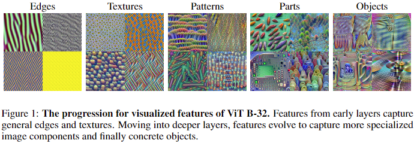  
Figure 1: ViT B-32の特徴量可視化の過程です。初期のレイヤーの特徴量は、一般的なエッジやテクスチャーを捉えています。  
深い層に行くほど、特徴量はより特化した画像構成要素をとらえるようになり、最終的には具体的なオブジェクトを捉えるように進化していきます。 

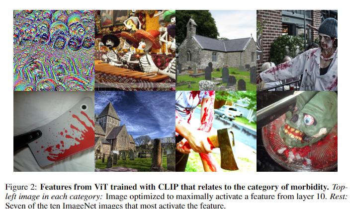  
Figure 2: CLIP(画像と言語のマルチモーダルモデル)で学習されたViTの特徴量のうち【罹患】のカテゴリに関連するもの。  
各カテゴリの左上隅の画像 : 第10層の特徴量を最大限に活性化するように最適化した画像  
残りの画像 : ImageNetの画像のウチ指定の特徴量を最も活性化させる画像上位10枚のうちの7枚  

vision transformerの挙動を調べるため、最初に、ニューロンを最大限に活性化させる画像を合成するための改良された技術を組み込んだ可視化フレームワークを確立する。 
Transformerアーキテクチャーにおける内部表現を分解して可視化することで、パッチトークンが最終段のattention blockを除いて、すべての層で空間情報を保持することを発見した。  
ViTの最後の層は、平均プーリングに似たトークン混合操作を学習し、分類ヘッドはCLSトークンの代わりにランダムトークンを摂取しても同等の精度を示していた。  
空間情報の役割を調べた後、ViTとCNNのふるまいの違いを掘り下げる。  
活性化を最大化する可視化を行う場合、ViTはCNNよりも常に高品質の画像背景を生成することが分かった。  

そこで、推論中に画像の前景をマスクしてみた、するとViTは画像の背景だけにさらされたときに一貫してCNNを上回る性能を示すことがわかった。 
これらの結果は、transformerモデルが画像中の多くのソースから情報を抽出し、分布外汎化(Paul & Chen, 2021)や敵対的頑健性(Shao et al, 2021)において優れた性能を示すという観測を裏付けるものである。  
加えて、畳み込みニューラルネットワークは、画像の高周波テクスチャ情報に大きく依存することが知られている(Geirhos et al.、2018)。  

一方、ViTは、入力から高周波成分を取り除いた場合でも良好に動作することがわかった。   
画像のみのモデルでは、明確な物理的物体や形状に対応する単純な特徴が含まれているが、CLIP(Radford et al., 2021)のlanguage supervisonでは、複雑な抽象概念に反応するニューロンが含まれていることがわかった。  
これには、品詞(例：形容語句、形容詞、前置詞)に関連する視覚的特徴に反応するニューロン、幅広い視覚シーンに反応する「音楽」ニューロン、さらには病的な抽象概念に反応する「死ニューロン」などが含まれます。

我々の成果を以下にまとめる:
**I.**  
Key、Query、Valueなど、Transformer ベースのモデルの比較的低次元の構成要素に標準的な特徴可視化手法を適用すると、解釈不能で敵対的な動作が発生することを確認した。  
しかしposition-wise feedforward layerの比較的高次元の特徴にこれらのツールを適用すると、成功し、有益な可視化が行われる。  
我々は、ViTs、DeiT、CoaT、ConViT、PiT、Swin、Twinなど、様々なTransformerベースのビジョンモデルで大規模な可視化を行い、我々の手法の有効性を検証した。  

**II.**  
ViTの特徴量に対するパッチ単位画像の活性化パターンが、本質的にsaliency マップのように振る舞い、ある特徴量が画像のどの領域に注目するかを強調することを示した。  
この挙動は、比較的深い層でも維持され、モデルがパッチをグローバルな情報記憶として利用するのではなく、パッチ間の位置関係を保存していることを示している。

**III.**  
ViTとCNNの動作を比較した結果、ViTの方が背景情報をうまく利用し、高周波テクスチャ属性にあまり依存しないことがわかった。  
両ネットワークは、深い層になるに従い複雑な表現を構築し、最終的には異なる物体を検出するための特徴を含むようになる。

**IV.**  
CLIPによる自然言語supervisionが、各種ViTが抽出する特徴量の種類に与える影響について調査した。  
CLIPで学習したモデルには、前置詞、形容詞、概念カテゴリなど、キャプションテキストに対応する画像の構成要素を検出するための様々な特徴が含まれていることがわかった。

## 2 RELATED WORK
### 2.1 OPTIMIZATION-BASED VISUALIZATION
学習中のモデルが何を学習するのかを理解するための一つのアプローチとして、勾配降下法を用いてモデルの内部構造に関する情報を伝える画像を作成することがあります。  
この方法は、特にCNNを理解する上で、効果がある方法であることが証明されています。  
このアプローチの基本戦略は、入力空間を最適化し、モデルの特定の属性を最大化する画像を見つけることである。  
例えば、Erhanら（2009）はネットワークの初期層の特定のニューロンを最大に活性化する画像を可視化するためにこのアプローチを使用し、Olahら（2017）はこれをネットワーク全体のニューロン、チャネル、レイヤーに拡張しています。  
Simonyanら（2014）；Yinら（2020）は、モデルが特定のクラスに割り当てるスコアを最大化する画像を生成する。 
Mahendran & Vedaldi (2015) は、特定の画像例の特徴表現を反転し元画像を復元させるために同様の方法を適用する。
Ghiasiらの最近の研究(2021)では、最適化ベースのクラス可視化をViTに拡張するための技法が研究されている。  
我々はこれらの提案技法のいくつかを、特徴の可視化のためのスキームに取り入れ、適応させる。

### 2.2 OTHER VISUALIZATION APPROACHES
最適化ベースの手法以外にも、CNNを可視化する方法は数多く提案されている。  
DosovitskiyとBrox(2016)は、CNNの特徴表現を反転させる補助モデルを訓練させている。  
Zeiler & Fergus (2014)は**deconvnets**を用いて、様々な層の特徴を強く活性化するパッチを視覚化している。  
Simonyanら（2014）はモデルの分類出力にとって画像のどの部分が重要かを勾配情報を用いて特定する、saliency mapを導入している。  
Zimmermannら(2021)は、CNNの特徴を最大限に活性化する自然画像サンプルが、その特徴を最適化する生成画像よりも情報量が多い可能性があることを実証した。  
我々は、これらのアプローチのいくつかの側面を利用し、ViTの可視化にも有用であることを見出した。

### 2.3 UNDERSTANDING VITS
ViTの急速な普及に伴い、ViTがどのように動作しCNNとどのように異なるのかに大きな関心が集まっているのは当然である。  
その特徴量を直接可視化することはこれまで研究されてこなかったが、最近、ViTの動作の分析が進んでいる。  
Paul & Chen(2021); Naseerら(2021); Shaoら(2021) は、ViTが多くの種類の敵対的な摂動や破損に対して本質的に頑健であることを実証した。  
Raghuら(2021)は、内部表現構造と空間情報の利用がViTとCNNの間でどのように異なるかを比較している。  
Cheferら（2021）はViTの解釈可能性を促進するために「画像関連性マップ」(顕著性マップに似ている)を作成している。

## 3 VIT FEATURE VISUALIZATION
多くの可視化技術と同様に、ランダムなノイズから出発して特徴の活性化を最大化するために勾配ステップ(Olah et al.，2017)を取ります。  
画質を向上させるために、我々は全体の変動に対してペナルティを与え(Mahendran & Vedaldi, 2015)、加えてJitter augmentation(Yin et al., 2020)、ColorShift augmentation、augmentation ensembling(Ghiasi et al., 2021)を採用する。  
最後に、特徴量の可視化で一般的にそうであるように、我々の実験でもガウススムージングがより良く可視化を向上せることがわかります(Smilkov et al., 2017; Cohen et al., 2019)。  

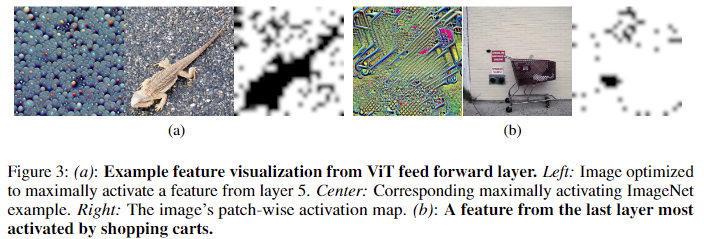  
**Figure 3** : (a): ViTのfeed forwarad層の可視化例  
Left: 第5層の特徴量を最大限に活性化させるように最適化した画像  
Center: ImageNetの画像で最大限に特徴量を活性化させるサンプル  
Right: 画像のパッチ毎のactivation map  
(b): 最終層のうちショッピングカードによって最も活性化する特徴量  

上記の各技術は、以下のように定式化できる。  
ViTは、Layer $l$ における（入力 $x$ の）各パッチ $p$ を、$d$ 個のエントリーを持つ配列 $A_{l,p}$ で表現する。  
特徴ベクトル $f$ をこれらの配列の各エントリから1つずつ構成されるスタックと定義する。  
すべてのパッチ$p$について、$A_{l,p}$ の $i$ 番目のエントリを連結して $f_{l,i}$ を形成するとする。  
このベクトルfはパッチの数に等しい次元を持つことになる。  
最適化の目標は、入力 $x$ に対する $f$ のエントリーの和を最大化することから始まる。  
mainとなるloss関数は以下  
$$
\mathcal{L}_{main}(x, l, i)=\sum_p (f_{l,i})_p. \tag{1}
$$

最適化目標に項 $\Lambda TV(x)$ 追加することで、total variationの正則化を採用する。 
TVはtotal variationを表し、$\Lambda$ は正則化効果の強さを制御するハイパーパラメータである。  
結果をさらに改善するために、入力へのaugumentationを組み合わせることができます。  
入力画像 $x$ に適用するaugumentation の分布を$\mathcal{A}$ とし、$a$ を $\mathcal{A}$ からのサンプルとする。  
1つの画像から入力のミニバッチを作成するために、$\mathcal{A}$ からいくつかのauguentation $\{a_k\}$ をサンプルする。  
最終的に最適化問題は以下の様になる：  

$$
x^*=argmax_x\sum_k \mathcal{L}_{main}(a_k(x), l, i) + \lambda TV(a_k(x)) \tag{2}
$$

$\mathcal{A}$ を $GS(CS(\mathit{Jitter}(x)))$ としたとき最善の可視化結果が得られる。  
ここで $GS$ はガウススムージング、$CS$ はColorShiftを表し、その公式は次の通りである :  

$$
GS(x) = x + \epsilon; \epsilon \sim \mathcal{N}(0, 1) \\
CS(x) = \sigma x + \mu; \mu \sim \mathcal{U}(-1, 1); \sigma \sim e^{\mathcal{U}(-1, 1)}
$$

$\epsilon$ と $\mu$ はともに加法性ノイズであるが、$\mu$ はチャンネル単位(つまり3次元)、$\epsilon$ は画素単位で適用されるため、入力に対する作用が異なることに注意されたい。  
ハイパーパラメータの詳細については、Appendix Bを参照されたい。  

可視化された特徴量の内容をよりよく理解するために、すべての可視化画像と、ImageNetの検証/訓練セットから、関連する特徴を最も強く活性化する画像をペアにして表示する。   
さらに、最も強く活性化する画像をネットワークに通すことで、特徴の活性化パターンをプロットし、その結果の特徴活性化パターンを表示する。  
Figure 3(a)は、このような可視化の例である。  
左端のパネルから、この特徴は砂利に対応すると仮定する。検証セットの中で最も活性化した画像（中）には、小石の多い砂利道の上にトカゲが描かれている。  
興味深いことに、活性化パターン（右）では、砂利の背景が光っているが、トカゲは光っていない。  
この例の活性化パターンは、saliency map(Simonyan et al, 2014)のように振る舞うので、セクション4でさらにネットワークの異なる層にわたってこの現象を探求します。  
本論文で、デモの大部分に採用したモデルは、Dosovitskiyら(2020)の研究に基づいて実装されたViT-B16である。  
さらに、Appendixでは、DeiT Touvronら（2021a）、CoaT Xuら（2021）、ConViT d'Ascoliら（2021）、PiT Heoら（2021）、Swin Liuら（2021）、Twin Chuら（2021）の合計38モデルという幅広いViT亜種で大規模可視化を行い、我々の方法の効果を検証しています。  

ViT-B16 is composed of 12 blocks, each consisting of multi-headed attention layers, followed by a projection layer for mixing attention heads, and finally followed by a position-wise-feed-forward layer.  
For brevity, we henceforth refer to the position-wise-feed-forward layer simply as the feed forward layer.  
In this model, every patch is always represented by a vector of size 768 except in the feed-forward layer which has a size of 3072 (4 times larger than other layers).  
We first attempt to visualize features of the multi-headed attention layer, including visualization of the keys, queries, and values, by performing activation maximization.  
We find that the visualized feedforward features are significantly more interpretable than other layers.  
We attribute this difficulty of visualizing other layers to the property that ViTs pack a tremendous amount of information into only 768 features, (e.g. in keys, queries, and values) which then behave similar to multi-modal neurons, as discussed by Goh et al. (2021), due to many semantic concepts being encoded in a low dimensional space.  
Furthermore, we find that this behaviour is more extreme in deeper layers. See Figure 4 for examples of visualizations of keys, queries and values in both early and deep layers of the ViT.  
Inspired by these observations, we visualize the features within the feed-forward layer across all 12 blocks of the ViT.  
We refer to these blocks interchangeably as layers.  

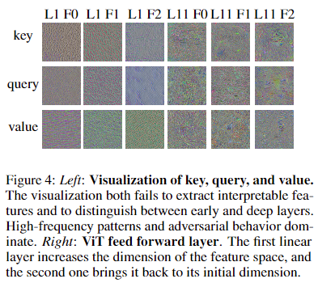  
**Figure 4**: 
Left: Visualization of key, query, and value.  
The visualization both fails to extract interpretable features and to distinguish between early and deep layers.  
High-frequency patterns and adversarial behavior dominate.  
Right: ViT feed forward layer. The first linear layer increases the dimension of the feature space, and
the second one brings it back to its initial dimension.

The feed-forward layer depicted in Figure 5 takes an input of size d = 768, projects it into a t = 4 times higher dimensional space, applies the non-linearity GELU, and then projects back to d dimen- sional space.  
Unless otherwise stated, we always visualize the output of the GELU layers in our experiments. We hypothesize that the network exploits these high-dimensional spaces to store relatively disentangled representations.  
On the other hand, compressing the features into a lower dimensional space may result in the jumbling of features, yielding uninterpretable visualizations.

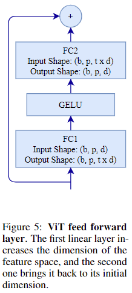  
**Figure 5** : ViT のfeed forward層。  
The first linear layer increases the dimension of the feature space, and the second one brings it back to its initial dimension.  

## 4 LAST-LAYER TOKEN MIXING
In this section, we investigate the preservation of patch-wise spatial information observed in the visualizations of patch-wise feature activation levels which, as noted before, bear some similarity to saliency maps.  
Figure 3(a) demonstrates this phenomenon in layer 5, where the visualized feature is strongly activated for almost all rocky patches but not for patches that include the lizard.  
Additional examples can be seen in Figure 6 and the Appendix, where the activation maps approximately segment the image with respect to some relevant aspect of the image.  
We find it surprising that even though every patch can influence the representation of every other patch, these representations remain local, even for individual channels in deep layers in the network.  
While a similar finding for CNNs, whose neurons may have a limited receptive field, would be unsurprising, even neurons in the first layer of a ViT have a complete receptive field.  
In other words, ViTs learn to preserve spatial information, despite lacking the inductive bias of CNNs.  
Spatial information in patches of deep layers has been explored in Raghu et al. (2021) through the CKA similarity measure, and we further show that spatial information is in fact present in individual channels.

**Figure 6** : Feature activation maps in internal layers can effectively segment the contents of an image with respect to a semantic concept.  
For each image triple, the visualization on top shows the result of our method, the image on the bottom left is the most activating image from the validation set and the image on the bottom right shows the activation pattern.

The last layer of the network, however, departs from this behavior and instead appears to serve a role similar to average pooling.  
We include quantitative justification to support this claim in Appendix section F.  
Figure 3(b) shows one example of our visualizations for a feature from the last layer that is activated by shopping carts.  
The activation pattern is fairly uniform across the image.  
For classification purposes, ViTs use a fully connected layer applied only on the class token (the CLS token).  
It is possible that the network globalizes information in the last layer to ensure that the CLS token has access to the entire image, but because the CLS token is treated the same as every other patch by the transformer, this seems to be achieved by globalizing across all tokens.

Table 1: After the last layer, every patch contains the same information. “Isolating CLS” denotes the experiment where attention is only performed between patches before the final attention block, while “Patch Average” and “Patch Maximum” refer to the experiment in which the classification head is placed on top of individual patches without fine-tuning. Experiments conducted on ViT-B16.

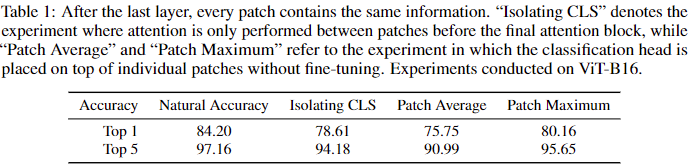  

Based on the preservation of spatial information in patches, we hypothesize that the CLS token plays a relatively minor role throughout the network and is not used for globalization until the last layer.
To demonstrate this, we perform inference on images without using the CLS token in layers 1-11, meaning that in these layers, each patch only attends to other patches and not to the CLS token.  
At layer 12, we then insert a value for the CLS token so that other patches can attend to it and vice versa.
This value is obtained by running a forward pass using only the CLS token and no image patches; this value is constant across all input images.  
The resulting hacked network that only has CLS access in the last layer can still successfully classify 78.61% of the ImageNet validation set as shown in Table 1.  
From this result, we conclude that the CLS token captures global information mostly at the last layer, rather than building a global representation throughout the network.  
We perform a second experiment to show this last-layer globalization behaviour is not exclusive to the CLS token, but actually occurs across every patch in the last layer.  
We take the fully connected layer trained to classify images on top of the CLS token, and without any fine-tuning or adaptation, we apply it to each patch, one at a time.  
This setup still successfully classifies 75.75% of the validation set, on average across individual patches, and the patch with the maximum performance achieves 80.16% accuracy (see Table 1), further confirming that the last layer performs a token mixing operation so that all tokens contain roughly identical information.   
Figure 7 contains a heat-map depicting the performance of this setup across spatial patches.  
This observation stands in stark contrast to the suggestions of Raghu et al. (2021) that ViTs possess strong localization throughout the entire network, and their further hypothesis that the addition of global pooling is required for mixing tokens at the end of the network.

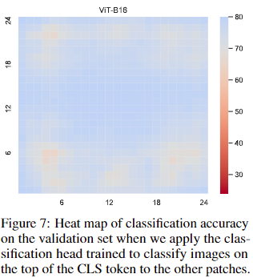  
**Figure 7** : Heat map of classification accuracy on the validation set when we apply the classification head trained to classify images on the top of the CLS token to the other patches.

## 5 COMPARISON OF VITS AND CNNS
As extensive work has been done to understand the workings of convolutional networks, including similar feature visualization and image reconstruction techniques to those used here, we may be able to learn more about ViT behavior via direct comparison to CNNs.  
An important observation is that in CNNs, early layers recognize color, edges, and texture, while deeper layers pick out increasingly complex structures eventually leading to entire objects (Olah et al., 2017).   
Visualization of features from different layers in a ViT, such as those in Figures 1 and 8, reveal that ViTs exhibit this kind of progressive specialization as well.

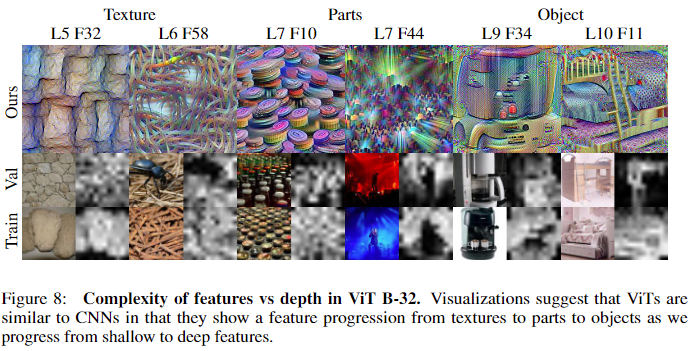  
**Figure 8** : Complexity of features vs depth in ViT B-32. Visualizations suggest that ViTs are similar to CNNs in that they show a feature progression from textures to parts to objects as we progress from shallow to deep features.

On the other hand, we observe that there are also important differences between the ways CNNs and ViTs recognize images.  
In particular, we examine the reliance of ViTs and CNNs on background and foreground image features using the bounding boxes provided by ImageNet Deng et al. (2009).  
We filter the ImageNet-1k training images and only use those which are accompanied by bounding boxes.  
If several objects are present in an image, we only take the bounding boxes corresponding to the true class label and ignore the additional bounding boxes.   

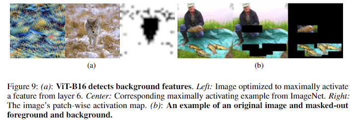  
**Figure 9** : (a): ViT-B16 detects background features.  
Left: Image optimized to maximally activate a feature from layer 6.  
Center: Corresponding maximally activating example from ImageNet.   
Right: The image’s patch-wise activation map. (b): An example of an original image and masked-out foreground and background.

Figure 9(b) shows an example of an image and variants in which the background and foreground, respectively, are masked.  
Figure 9(a) displays an example of ViTs’ ability to detect background information present in the ImageNet dataset.  
This particular feature appears responsible for recognizing the pairing of grass and snow.  
The rightmost panel indicates that this feature is solely activated by the background, and not at all by the patches of the image containing parts of the wolf.  
To quantitatively assess each architecture’s dependence on different parts of the image on the dataset level, we mask out the foreground or background on a set of evaluation images using the aforementioned ImageNet bounding boxes, and we measure the resulting change in top-5 accuracy.  
These tests are performed across a number of pretrained ViT models, and we compared to a set of common CNNs in Table 2.  
Further results can be found in Table 3.

Table 2: ViTs more effectively correlate background information with correct class. Both foreground and background data are normalized by full image top-5 accuracy.

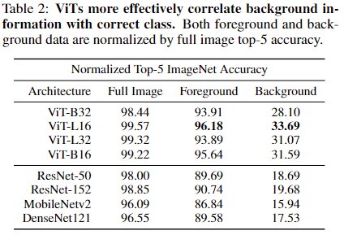  

We observe that ViTs are significantly better than CNNs at using the background information in an image to identify the correct class.  
At the same time, ViTs also suffer noticeably less from the removal of the background, and thus seem to depend less on the background information to make their classification.  
A possible, and likely, confounding variable here is the imperfect separation of the background from the foreground in the ImageNet bounding box data set.  
A rectangle containing the wolf in Figure 9(a), for example, would also contain a small amount of the grass and snow at the wolf’s feet.  
However, the foreground is typically contained entirely in a bounding box, so masking out the bounding box interiors is highly effective at removing the foreground.  
Because ViTs are better equipped to make sense of background information, the leaked background may be useful for maintaining superior performance.  
Nonetheless, these results suggest that ViTs consistently outperform CNNs when information, either foreground or background, is missing.  
Next, we study the role of texture in ViT predictions. To this end, we filter out high-frequency components from ImageNet test images via low-pass filtering.  
While the predictions of ResNets suffer greatly when high-frequency texture information is removed from their inputs, ViTs are seemingly resilient. See Figure 16 for the decay in accuracy of ViT and ResNet models as textural information is removed.  

## 6 VITS WITH LANGUAGE MODEL SUPERVISION
Recently, ViTs have been used as a backbone to develop image classifiers trained with natural language supervision and contrastive learning techniques (Radford et al., 2021).  
These CLIP models are state-of-the-art in transfer learning to unseen datasets.  
The zero-shot ImageNet accuracy of these models is even competitive with traditionally trained ResNet-50 competitors.  
We compare the feature visualizations for ViT models with and without CLIP training to study the effect of natural language supervision on the behavior of the transformer-based backbone.  
The training objective for CLIP models consists of matching the correct caption from a list of options with an input image (in feature space).  
Intuitively, this procedure would require the network to extract features not only suitable for detecting nouns (e.g. simple class labels like ‘bird’), but also modifying phrases like prepositions and epithets. 
Indeed, we observe several such features that are not present in ViTs trained solely as image classifiers.

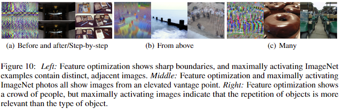  
**Figure 10** :  
Left: Feature optimization shows sharp boundaries, and maximally activating ImageNet examples contain distinct, adjacent images.  
Middle: Feature optimization and maximally activating ImageNet photos all show images from an elevated vantage point.  
Right: Feature optimization shows a crowd of people, but maximally activating images indicate that the repetition of objects is more relevant than the type of object.

Figure 10(a) shows the image optimized to maximally activate a feature in the fifth layer of a ViT CLIP model alongside its two highest activating examples from the ImageNet dataset.  
The fact that all three images share sharp boundaries indicates this feature might be responsible for detecting caption texts relating to a progression of images.  
Examples could include “before and after," as in the airport images or the adjective “step-by-step" for the iPod teardown.  
Similarly, Figure 10(b) and 10(c) depict visualizations from features which seem to detect the preposition “from above", and adjectives relating to a multitude of the same object, respectively.  
The presence of features that represent conceptual categories is another consequence of CLIP training.
Unlike ViTs trained as classifiers, in which features detect single objects or common background information, CLIP-trained ViTs produce features in deeper layers activated by objects in clearly discernible conceptual categories. 

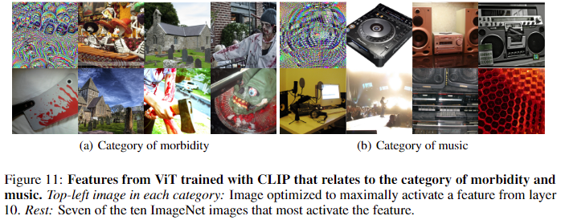  
**Figure 11** : CLIPでトレーニングしたViTの中から、**病態**や**音楽**のカテゴリーに関連する特徴量を示す。  
各カテゴリの左上隅の画像 : Layer 10の特徴量を最も活性かさせる最適化済み画像  
その他 : ImageNet中の画像の中で特徴量を最も活性化させる上位10枚のうちの7枚  

例えば、Figure 11(a)の左上には、墓石と一緒に頭蓋骨のようなものが写り込んでいる。  
ImageNet中の7つの高い活性化を行う画像には、血まみれの武器、ゾンビ、骸骨など、他の明確なオブジェクトが含まれている。  
視覚的に見ると、これらのクラスは非常に異質な属性を持っており、この特徴が画像の中から広く病的状態に関わる要素を検出する役割を担っている可能性を示している。  

Figure 11(b)では、左上のパネルにディスコボールが描かれており、データセットの対応する画像には、ラジカセ、スピーカー、レコードプレーヤー、録音機器、演奏者が含まれていることがわかります。  
このように、これらは視覚的に異なるクラスでありながら、音楽という概念で統一されている。  
画像に対して取りうるキャプションは、ImageNetデータセットのわずか1000クラスよりもはるかに大きいため、高性能なCLIPモデルには、認識する対象をより高いレベルで整理する必要があるのは当然である。 
さらに、CLIPデータセットはインターネットから収集されたもので、キャプションは単純なクラスラベルよりも説明的であることが多い。

## 7 DISCUSSION
vision transformerの内部構造を解明するために、最適化ベースの特徴量可視化のフレームワークを紹介した。  
そして、ViTのどの構成要素が解釈可能な画像を生成するのに最も適しているかを特定、feed-forward層の高次元inner projectionが適していると発見した。  
その一方で、self-attentionのkey, query, value は適していないことを発見した。 
このフレームワークを前述の特徴量に適用すると、ViTは最後の層を除くすべての層で個々のチャンネル匂いてもパッチの空間情報を維持し、ネットワークが空間関係をゼロから学習することを示すことが確認された。  
さらに、最終段のattention層における定位情報の突然の消失は、平均プーリングに似た学習済みのトークン混合動作に起因することを示した。  
CNNとViTの比較では、ViTは背景を有効に利用するために重要であると予想される高周波数情報の損失に対してCNNほど敏感ではないという一見直感に反する性質があるにもかかわらず、画像の背景にのみさらされた場合、背景情報をよりよく利用し、CNNよりもはるかに優れた予測を行うことができることを発見した。  
また、2つのアーキテクチャは、初期の層がテクスチャ属性を学習し、より深い層が高レベルのオブジェクトの特徴や抽象的な概念を学習するという共通の性質を持つと結論付けた。  
最後に、言語モデルの監視下で学習されたViTは、典型的な分類器によく見られるようなオブジェクト固有の視覚的特徴ではなく、意味的・概念的特徴をより多く学習することが示された。

**REPRODUCIBILITY STATEMENT**  
[この論文のリポジトリ](https://github.com/hamidkazemi22/ vit-visualization)  