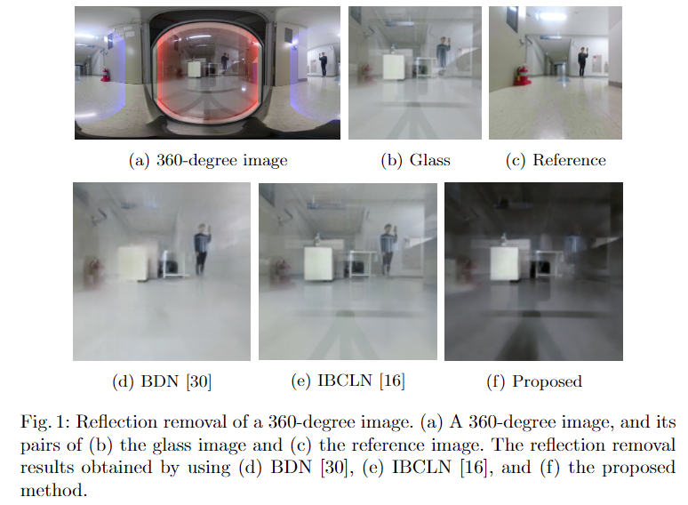
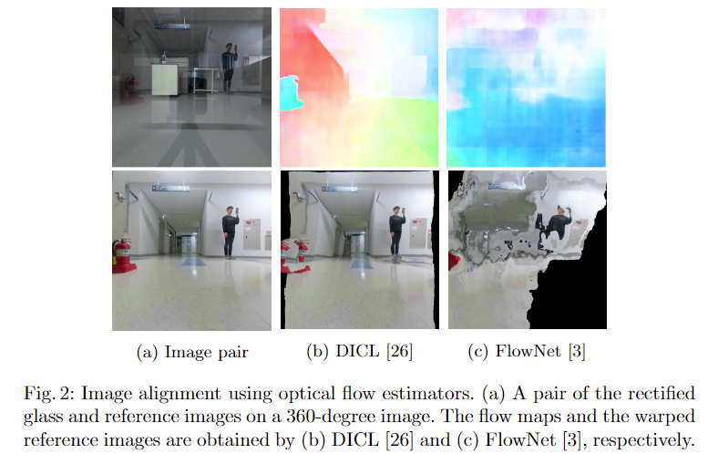
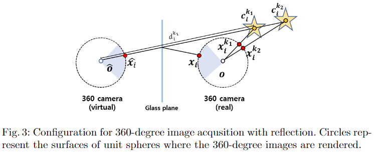
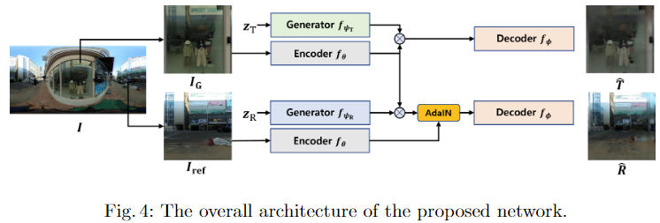
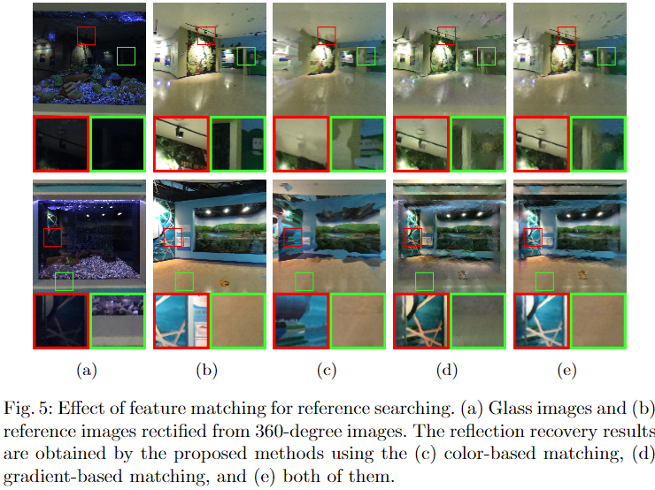
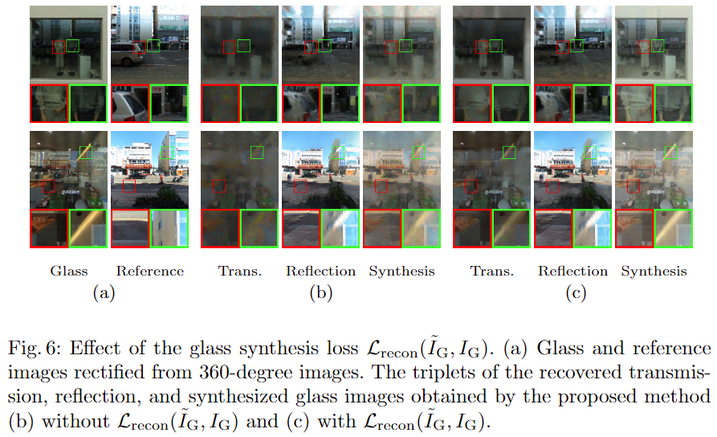
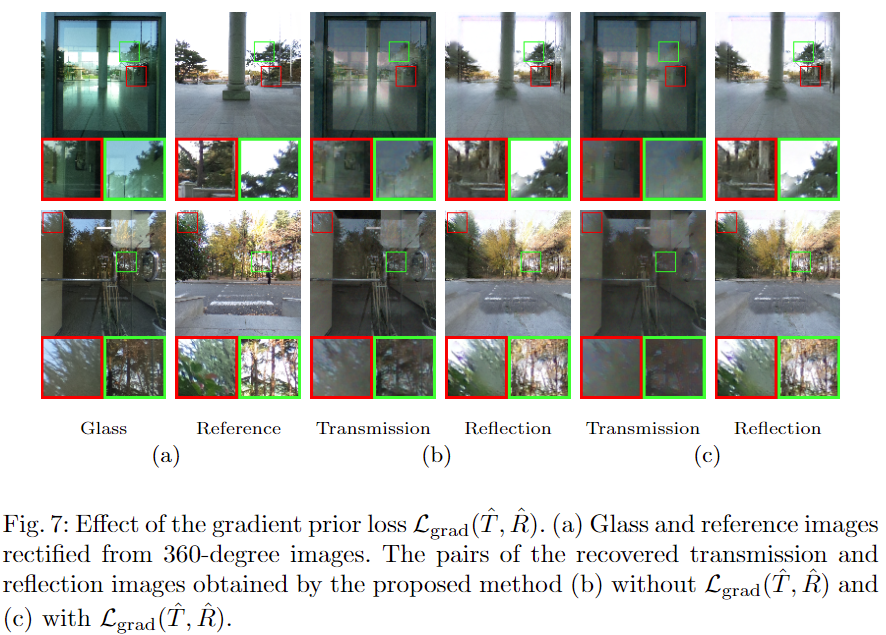
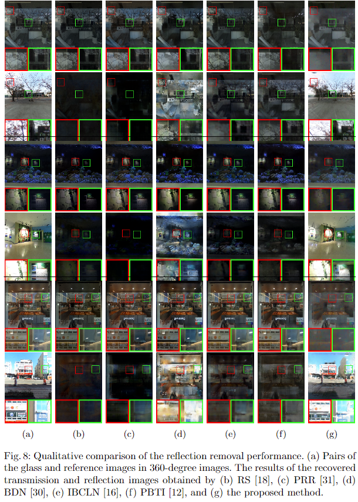
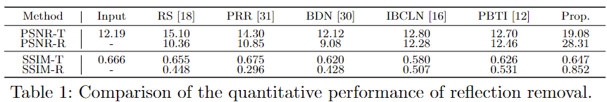
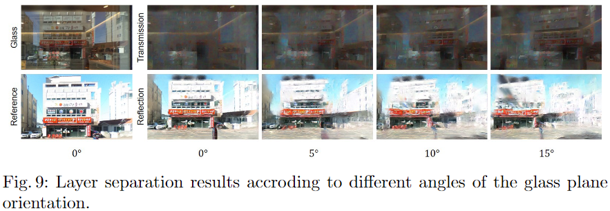

# Zero-Shot Learning for Reflection Removal of Single 360-Degree Image

# Abstract
The existing methods for reflection removal mainly focus on removing blurry and weak reflection artifacts and thus often fail to work with severe and strong reflection artifacts.  
However, in many cases, real reflection artifacts are sharp and intensive enough such that even humans cannot completely distinguish between the transmitted and reflected scenes.  
In this paper, we attempt to remove such challenging reflection artifacts using 360-degree images.  
We adopt the zero-shot learning scheme to avoid the burden of collecting paired data for supervised learning and the domain gap between different datasets.  
We first search for the reference image of the reflected scene in a 360-degree image based on the reflection geometry, which is then used to guide the network to restore the faithful colors of the reflection image.  
We collect 30 test 360-degree images exhibiting challenging reflection artifacts and demonstrate that the proposed method outperforms the existing state-of-the-art methods
on 360-degree images.

# 1 Introduction
We often take pictures through the glass, for example, take a picture of the glass showcase in a museum or a gallery.  
The captured images through the glass exhibit undesired artifacts of the reflected scene.  
Such reflection artifacts decrease the visibility of the transmitted scene behind the glass and thus degrade the performance of diverse computer vision techniques.  
For a few decades, attempts have been made to develop efficient reflection removal methods.  
Whereas many existing methods of reflection removal used multiple glass images taken under constrained environments, the recent learning-based methods achieve outstanding performance by exploiting deep features to separate an input single glass image into transmission and reflection images.
While the existing methods usually assume blurry reflection artifacts associated with the out-of-focus scenes in front of the glass, the actual reflection artifacts exhibit more diverse characteristics than their assumption and often become intensive and sharp.  
Therefore, even the state-of-the-art learning-based methods still suffer from the domain gap between the training and test datasets.
In particular, 360-degree cameras, widely used for VR applications, do not focus on a specific object and usually generate the images with sharp reflection artifacts on the glass region as shown in Fig. 1(a). Figs. 1(b) and (c) show the cropped images of the glass region and the reference region of the actual reflected scene, respectively, where we see that the reflected scene distinctly emerges in the glass image.  
As shown in Figs. 1(d) and (e), the existing learning-based methods [16, 30] fail to remove such artifacts from the glass image, since the reflection characteristics of 360-degree images are different from that of ordinary images.
In such a case, it is more challenging to distinguish which scene is transmitted or reflected in the glass image by even humans. However, we can employ the visual information of the reflected scene within a 360-degree image as a reference to guide the reflection removal effectively.  

  

The only existing reflection removal method [9] for 360-degree images uses a glass image synthesis algorithm for supervised learning, and thus theoretically suffers from the domain gap between the training and test datasets.  
Moreover, it rarely concerns the cooperation between the two tasks of reflection removal for 360-degree images: image restoration and reference image matching.  
In this paper, we apply a zero-shot learning framework for reflection removal of 360-degree images that avoids the burden of collecting training datasets and the domain gap between different datasets.  
Also, the proposed method iteratively estimates the optimal solutions for both the image restoration and the reference matching by alternatively updating the results for a given test image.
We first assume that a 360-degree image is captured by a vertically standing camera in front of the glass plane, and the central region of the 360-degree image is considered as the glass region.  
Then we investigate the reference information matching to the restored reflection image in a 360-degree image and update the network parameters to recover the transmission and reflection images based on the matched reference information.  
Consequently, the proposed method provides an outstanding performance to eliminate the reflection artifacts in 360-degree images, as shown in Fig. 1(f).
The main contributions of this work are summarized as follows.
1. To the best of our knowledge, this is the first work to apply a zero-shot learning framework to address the reflection removal problem for a single 360-degree image that avoids the domain gap between different datasets observed in the existing supervised learning methods.
2. The proposed method refines the reference matching by using the reflection geometry on a 360-degree image while adaptively restoring the transmission and reflection images with the guidance of refined references.
3. We collect 30 real test 360-degree images for experiments and demonstrate the proposed method outperforms the state-of-the-art reflection removal techniques.

# 2 Related Works
In this section, we briefly summarize the existing reflection removal methods.   
We classify the exiting methods into unsupervised and supervised approaches.  
The unsupervised approach includes the computational reflection removal methods and the latest zero-shot learning-based image decomposition method that does not need paired datasets for training.  
In contrast, the supervised approach covers the learning-based single image reflection removal methods.
**Unsupervised approach:** The distinct properties of the reflection artifacts appear in the multiple images taken in the particular capturing environments. [5, 13, 21] removed reflection artifacts in the multiple polarized images according to the unique property of the reflected lights whose intensities are changed by the polarization angles.  
[20] separated multiple glass images captured as varying focal lengths into two component images to have distinct blurriness. [7, 8, 17, 24, 29] analyzed different behaviors of the transmitted and reflected scenes across multiple glass images taken at different camera positions.  
Furthermore, [19] detected the repeated movement of the transmitted scene in a video.  
[23] extracted the static image reflected on the front windshield of a car in a blackbox video.  
On the other hand, removing the reflection artifacts from a single glass image is challenging due to the lack of characteristics to distinguish between the transmission and reflection images.  
[14] selected reflection edges to be removed on a glass image by user assistance.  
[18] separated the input image into a sharp layer and a blurry layer to obtain the transmission and reflection images under the strong assumption that the reflection images are more blurry than the transmission images.  
[15] supposed a glass image causes a large number of the cross-points between two different edges, and separated the glass image into two layers that minimize the total number of the cross-points.  
In addition, [22] removed spatially repeated visual structures because the lights reflected on the front and back surfaces of the glass window yield the ghosting effects.  
[6] proposed a general framework that trains a network to decompose the multiple glass images captured in a constrained environment where the transmitted and reflected scenes are dynamic and static, respectively.  
While the existing methods require multiple glass images or assume distinct characteristics of the reflection artifacts, the proposed method removes the challenging reflection artifacts exhibiting similar features to the transmission image by detecting reference information in a single 360-degree image.  
**Supervised approach:** Deep learning-based reflection removal methods have been proposed in recent years.  
They train the deep networks by using the paired dataset of the glass and transmission images, and provide more reliable results than the computational methods that strongly assume the unique characteristic of reflection artifacts.  
[4] firstly applied CNN for reflection removal and proposed a framework that two networks are serially connected to restore the gradients and colors of the transmission image, respectively.  
[25] revised the framework to predict the colors and gradients of the transmission image simultaneously.  
[30] proposed a novel framework that predicts a transmission image and a reflection image recursively by using the prior result.  
Similarly, [16] adopted a complete cascade framework that repeats to predict the transmission and reflection images from the glass image by feeding back the prior results of transmission and reflection restoration.  
[2] tackled locally intensive reflection artifacts by predicting a probability map indicating local regions of dominant reflection artifacts.
On the other hand, some methods have tackled the training data issues for supervised learning.  
[27] defined a novel loss term to train the network parameters regardless of the misalignment between an input glass image and its ground-truth transmission image that is frequently observed in the existing real training datasets.  
Due to the lack of paired data of real glass and transmission images, [32] modeled a sophisticated image formulation to synthesize glass images, involving the light absorption effect depending on the incident angle of rays on the glass plane.  
[12] generated synthetic glass images by using a graphical simulator to imitate the reflection physically.  
[28] utilized the deep networks for reflection removal as well as the glass image synthesis to make more realistic glass images for training.  
Recently, [9] removed the reflection artifacts using a reference image captured in the opposite direction to the glass window in a panoramic image.

However, all the supervised learning-based methods suffer from the domain gap.  
[1] demonstrated that the reflection removal performance of the existing methods is determined by the types of reflection artifacts in their training dataset.  
However, the proposed method adaptively works for a given input image based on a zero-shot learning framework, and also alleviates the burden of collecting training datasets in the supervised learning framework.

  
Fig. 2: Image alignment using optical flow estimators. (a) A pair of the rectified glass and reference images on a 360-degree image.  
The flow maps and the warped reference images are obtained by (b) DICL [26] and (c) FlowNet [3], respectively.

# 3 Methodology
Since the 360-degree image includes the whole environmental scene around the camera, the glass scene and the associated reflected scene are captured together.  
The proposed method recovers the transmission and reflection images associated with the glass region in a 360-degree image by bringing relevant information from the reference region including the reflected scene.  
In this section, we first explain how to search for the reference image based on the reflection geometry in a 360-degree image.  
Then we introduce the proposed zero-shot learning framework with a brief comparison to the existing method of DDIP [6].  
We finally describe the detailed training process of the proposed method in a test time.

## 3.1 Estimation of Reference Image
We investigate the relationship between the reflection image and the associated reference image.  
As introduced in [9], the reflection image suffers from the photometric and geometric distortions that make it challenging to distinguish the reflected scene from the transmitted scene on the glass image even using the reference image.  
The photometric distortion can be generated by external factors like the thickness of glass, the incident angle of light, and the wavelength of light.  
The image signal processing (ISP) embedded in the camera is also an internal factor of photometric distortion.  
The geometric distortion between the reflection and reference images is mainly caused by the parallax depending on the distances from the camera to the glass or the objects.  
The recent techniques [3, 26] for optical flow estimation fail to estimate the correct correspondence between the glass image and the reference image due to the photometric distortion of the reflection image and the mixed transmission image, as shown in Fig. 2.

  
Fig. 3: Configuration for 360-degree image acqusition with reflection.  
Circles represent the surfaces of unit spheres where the 360-degree images are rendered.

Reducing the geometric distortion and the photometric distortion can be considered as a chicken-and-egg problem.  
The reference image well-aligned with the reflection image provides faithful colors for the restoration of reflected scene contents.  
On the other hand, a well-recovered reflection image yields confident visual features to align the reference image with the reflection image.  
The proposed method finds reliable reference regions for each pixel in the glass image area based on the reflection geometry.  
A 360-degree image is captured by the rays projected from the objects in 3D space to the surface of a unit sphere.  
In particular, the glass region produces additional rays reflected on the glass, and in such cases, we cannot estimate the accurate object locations in 3D space due to the absence of distance information.  
As shown in Fig. 3, when an object is observed at xi in the glass region of a 360-degree image, it would be observed at ˆx if the glass does not exist.  
According to the reflection geometry, we calculate the coordinates of the virtual points ˆxi and ˆo using the Householder matrix [10] defined by the orientation of the glass plane.  
Assuming that the object should be located along the direction of di = ˆxi −ˆo, we consider candidate location of cki for xi by varying the distance to the object from the virtual origin ˆo along di.  
Then we collect the matching candidates xki ’s by projecting the candidate locations cki ’s to the unit surface, respectively.  
In this work, we define the search space including 50 candidate locations of cki ’s sampled along the direction of di to handle the background far from the glass.  
Then we find the optimal matching point mi to xi among xki ’s of the search space that has the smallest feature difference from xi.  
We consider the neighboring pixels to compute a patch-wise feature difference between xi and xki as

$$
\Omega(x_i, x_i^k) = \frac{1}{|\mathcal{N}_i| + 1}\sum_{p_j\in \mathcal{N_i} \cup \{p_i\}} \parallel F_G(p_j) - F_R(p_j^k)\parallel_1 \tag{1}
$$

where $F_G$ and FR represent the arbitrary rectified feature maps of the glass and reference regions in the 360-degree image, respectively, p denotes the pixel location corresponding to x on the rectified image domain, and Ni is the neighbor set of pi. In this work, we set the size of Ni to 24.  
Specifically, for a given xi, we search for the two optimal matching points mci and mg i in terms of the color and gradient features, respectively.  
The notation of the training iteration t is omitted for simplification. To search for the color-based matching point mci , we set FG as a reconstructed reflection image ˆR, and set FR as the rectified reference image Iref.  
Note that ˆR and mci are iteratively updated for training, and more faithful ˆR provides more confident mci , and vice versa.  
The gradient-based matching point mg i is obtained by using the gradient of the rectified glass image IG and Iref for FG and FR, respectively.  
Note that mci and mg i provide partially complementary information for reflection recovery.  
While mci prevents the recovered reflection image from having unfamiliar colors with the reference image, mg i makes the recovered reflection image preserve the structure of the glass image.

  
Fig. 4: The overall architecture of the proposed network.  

## 3.2 Network Architecture
The proposed method is composed of the four sub-networks of encoder, decoder, and two generators, as shown in Fig. 4.  
We share the network parameters of θ and φ for the recovery of the transmission and reflection images, respectively.  
The encoder gets the rectified images from the 360-degree image and extracts the deep features that are able to reconstruct the input images by the decoder.  
Since the deep features in the glass image have both of the transmission and reflection features, the generators provide the mask maps to separate the deep features of the glass image into the transmission feature hT and the reflection feature hR, respectively, given by

$$
\begin{align}
h_T = f_{\theta}(I_G)\cdot f_{\psi_T}(z_T), \tag{2}\\
h_R = f_{\theta}(I_G)\cdot f_{\psi_R}(z_R), \tag{3}
\end{align}
$$

where zT and zR represent the different Gaussian random noises and (·) denotes
the element-wise multiplication.  
However, the photometric distortion of the glass image provides incomplete reflection features to recover the original colors of the reflection image, and the proposed method applies the Adaptive Instance Normalization (AdaIN) [11] on the reflection feature to compensate for the incomplete information.  
The reflection feature hR is transformed by the reference feature href as

$$
\hat{h}_R = \sigma(h_{ref})(\frac{h_R - \mu(h_R)}{\sigma(h_R)}) + \mu(h_{ref}), \tag{4}
$$

where href = fθ(Iref), and μ and σ denote the operations to compute the average and standard deviation across spatial dimensions.  
The proposed method finally decodes the reflection image as ˆR = fφ( ˆhR).  
Since AdaIN transfers the feature according to the statistics across spatial locations, it relieves the geometric difference between the reflection and reference images.  
Unlike the reflection recovery, we suppose that the distortion of the transmission is negligible and predict the transmission image via ˆT = fφ(hT).  
DDIP [6] introduced a general framework that is able to separate the multiple glass images into the transmission and reflection images.  
It trains the network under a linear formulation for the glass image synthesis.  
However, recent research [1, 9, 28] has addressed that such a naive formulation is insufficient to model the actual glass image.  
On the other hand, the proposed method decomposes the glass image in a deep feature space and synthesizes the glass image by integrating the deep features of the transmission and reflection images instead of simply adding the resulting transmission and reflection color maps.  
Also note that the proposed method attaches a new branch that brings the reference information from a given 360-degree image to distinguish the reflection image from the transmission image, while DDIP simply demands multiple glass images to involve distinct characteristics between the transmitted and reflected scenes.  
Please refer to the supplementary material for network architecture details.

# 3.3 Training Strategy
he proposed method trains the network parameters in a test time for a given instance. Particularly, each network of the proposed framework is trained respectively according to different training losses.  
For each iteration, the (θ, φ), ψR, and ψT are trained by using three individual Adam optimizers.  
We update the network parameters during 600 iterations for each test image.  
Encoder and decoder: The parameters of the encoder θ and the decoder φ are trained to reconstruct the input image itself according to the reconstruction loss Lrecon between a source map X and a target map Y defined as

$$
\mathcal{L}_{recon}(X, Y) = \mathcal{L}_{mse}(X, Y) + \omega_1 \mathcal{L}_mse(\nabla X, \nabla Y) \tag{5}
$$

where Lmse denotes the mean squared error and w1 denotes the weight to determine the contribution of the gradient difference for training.  
We utilize the rectified images IG and Iref of the glass region and the reference region as training images.  
The encoder extracts the deep features from IG and Iref and the decoder outputs the images ˆIG and ˆIref that minimize the auto-encoder loss LA defined as

$$
\mathcal{L}_A(\theta, \phi)=\mahtcal{L}_{recon}(\hat{I}_G, I_G) + \mathcal{L}_{recon}(\hat{I}_{ref}, I_{ref}) \tag{6}
$$

In addition, it is helpful to reduce the training time to initialize θ and φ by using any photos.  
For all the following experiments, we used θ and φ pre-trained on the natural images in [31] for one epoch.  
Mask generator for transmission recovery: Though the network parameters θ, φ, and ψT are associated with the transmission recovery, ψT is only updated by the transmission loss.  
The gradient prior that the transmission and reflection images rarely have intensive gradients at the same pixel location has been successfully used in reflection removal.  
We enhance this prior for the two images not to have intensive gradients at similar locations.  
The gradient prior loss Lgrad is defined as

$$
\mathcal{\hat{T}\hat{R}} = \frac{1}{N}\displaystyle \sum_{p_j} |\nabla \hat{T}||\nabla \hat{R}^*(p_i)|, \tag{7}
$$

where N represents the total number of pixels and ∇ˆR∗(pi) denotes the gradient having the maximum magnitude around pi, i.e. ∇ˆR∗(pi) = maxpj∈Wi |∇ˆR(pj )| where Wi denotes the set of pixels within a local window centered at pi.  
We empirically set the window size to 5. We also evaluate the additional reconstruction loss for the glass image by synthesizing a glass image using the recovered transmission and reflection images.  
For glass image synthesis, the existing methds [31, 30, 16] manually modify the reflection image to imitate the photometric distortion of reflection and combine them according to the hand-crafted image formation models.  
However, we obtain the distorted reflection image  ̄R by deactivating AdaIN of the proposed framework as  ̄R = fφ(fθ(IG) ·fψR(zR)) and synthesize the glass image by using the encoder and decoder as  ̃IG = fφ(fθ( ˆT) + fθ(  ̄R)). The transmission loss LT is defined as

$$
\mathcal{L}_T(\psi_T) = \mathcal{L}_{recon}(\tilde{I}_G, I_G) + \omega_2 \mahtcal{L}_{grad}(\hat{T}, \hat{R}). \tag{8}
$$

**Mask generator for reflection recovery:**  
While the transmission image is hypothetically estimated by applying the gradient prior, the reflection image has a reference color map R and a reference gradient map M obtained by the reference matching process, such that R(pi) = I(mci ) and M(pi) = ∇I(mg i ) where pi denotes the pixel location corresponding to xi in the rectified image.  
The total reflection loss LR is given by

$$
\mathcal{L}_R(\psi_R) = \mathcal{L}_{recon}(\tilde{I}_G, I_G) + \omega_3\mahtcal{L}_{mse}(\hat{R}, R) + \omega_4\mathcal{L}_{mse}(\nabla \hat{R}, \mathcal{M}). \tag{9}
$$

# 4 Experimental Results
This section provides the experimental results on ten 360-degree images to discuss the effectiveness of each part of the proposed method and compare the proposed method with the state-of-the-art methods qualitatively and quantitatively.  
In this work, we set the weight of w1 for LA to 1 and the weights of w1,w2,w3, and w4 for LT and LR to 10, 3, 5, and 50, respectively.  
Please see the supplementary results for more experimental results.

  
Fig. 5: Effect of feature matching for reference searching. (a) Glass images and (b) reference images rectified from 360-degree images.  
The reflection recovery results are obtained by the proposed methods using the (c) color-based matching, (d)
gradient-based matching, and (e) both of them.

## 4.1 Ablation Study
**Feature matching for reference searching:**  
The proposed method utilizes the color of the recovered reflection image and the gradient of the glass images to determine the matching points to bring the information to recover the reflection image.  
We tested the comparative methods that utilize either of the color-based matching points or the gradient-based matching points to search for the reference images. 
Fig. 5 shows the glass and reference images in the 360-degree images captured in front of the fish tanks of an aquarium. As shown in Figs. 5c and 5d, the method using only the color-based matching destroys the reflected scene structures, and the method using only the gradient-based matching fails to recover the original color of the reflection image faithfully.  
However, when using both of the matching together, the proposed method recovers realistic colors while preserving the reflected scene structures.  
Note that the rectified reference image and the recovered reflection image are misaligned due to the geometric distortion.

**Glass synthesis loss:**  
Although the gradient prior provides a good insight for image decomposition, it may result in a homogeneous image where all pixels have small gradients.  
We can alleviate this problem by using the glass synthesis loss Lrecon(  ̃IG,IG). Fig. 6 shows the effect of the glass synthesis loss.  
The proposed method without Lrecon(  ̃IG,IG) provides the significantly blurred transmission images as shown in Fig. 6b where the mannequins behind the glass are disappeared from the recovered transmission image and the synthesized glass image.

  
Fig. 6: Effect of the glass synthesis loss Lrecon(  ̃IG,IG). 
(a) Glass and reference images rectified from 360-degree images. The triplets of the recovered transmission, reflection, and synthesized glass images obtained by the proposed method (b) without Lrecon(  ̃IG,IG) and (c) with Lrecon(  ̃IG,IG).

  
Fig. 7: Effect of the gradient prior loss Lgrad( ˆT, ˆR). (a) Glass and reference images rectified from 360-degree images.  
The pairs of the recovered transmission and reflection images obtained by the proposed method (b) without Lgrad( ˆT, ˆR) and (c) with Lgrad( ˆT, ˆR).

In contrary, the proposed method using Lrecon(  ̃IG,IG) enforces the synthesized glass images to have the image context not detected in the reflection image, which preserves the context of the transmitted scene.

**Gradient prior loss:**  
The ablation study for the gradient prior loss Lgrad shows how it affects the resulting transmission images.  
As shown in Fig. 7, whereas the method without the gradient prior loss often remains the sharp edges of the intensive reflection artifacts in the transmission images, the proposed method trained with Lgrad successfully suppresses such reflection edges.

  
Fig. 8: Qualitative comparison of the reflection removal performance. (a) Pairs of the glass and reference images in 360-degree images.  
The results of the recovered transmission and reflection images obtained by (b) RS [18], (c) PRR [31], (d) BDN [30], (e) IBCLN [16], (f) PBTI [12], and (g) the proposed method.

## 4.2 Qualitative Comparison
Since there are no existing methods of unsupervised reflection removal for a single 360-degree image, we compared the proposed method with the representative unsupervised method [18] and the state-of-the-art supervised methods [12, 16, 30, 31] that remove the reflection artifacts from a single glass image.  
The rectified images of the glass regions in 360-degree images are given as input images for the existing methods.  
Most of the reflection removal methods restore not only the transmission image but also the reflection image, and thus we evaluate the quality of the recovered transmission and reflection images together.  
Fig. 8 shows the reflection removal results for three challenging glass images that make it hard for even humans to distinguish between the transmission and reflection images.  
Due to the absence of the ground truth images, the rectified images of the misaligned reference regions in the 360-degree images are inferred to display the reflected scenes.  
The unsupervised method RS [18] targets to remove blurred reflection artifacts and therefore rarely removed the reflection artifacts on the test glass images.  
Also, the existing learning-based methods failed to detect the reflection artifacts because they are mainly trained by the synthesized glass images where the reflection images are manually blurred and attenuated except PBTI [12].  
PBTI generates realistic glass images by using a graphic simulator, and suppressed the grey and homogeneous reflection artifacts from the sky as shown in the first image in Fig. 8, however, it failed to remove the colorful and structural reflection artifacts in the other glass images.  
On the other hand, the proposed method successfully estimated the reflection images and suppressed the challenging reflection artifacts with the guidance of the reference regions estimated in the 360-degree images.

## 4.3 Quantitative Comparison
We simply synthesize the glass images in 360-degree images without reflection artifacts.  
In practice, we set the center area of a 360-degree image as the glass region and suppose an arbitrary depth of the region opposite to the glass region as a reflected scene.  
Then we compose the transmission image in the glass region according to the conventional linear glass image formulation. 
Table 1 quantitatively compare the performance of the reflection removal methods using 12 synthetic 360-degree images, where ‘-T’ and ‘-R’ denote the comparison for the transmission and reflection images, respectively.  
We see that the proposed method ranks the first among the compared methods in terms of all the metrics except SSIM-T.  
However, note that the input glass image itself, without any processing, yields the SSIM-T score of 0.666, even higher than that of the most methods.  
It means that the quantitative measures are not sufficient to reflect the actual performance of the reflection removal, and the qualitative comparison on real test datasets is much more informative.

  
Table 1: Comparison of the quantitative performance of reflection removal.  

  
Fig. 9: Layer separation results accroding to different angles of the glass plane orientation.

## 4.4 Limitations
The angular deviation of the glass plane orientation may cause large displacement of the matching candidates in 3D space, and thus degrade the performance of the proposed method.  
Fig. 9 shows this limitation where the recovered transmission images remain lots of the reflection artifacts in the glass regions as the angular deviation of the glass plane orientation increases.  
Moreover, since the proposed method highly depends on the quality of the reference image captured by the camera, it fails to remove the reflected camera contents itself and it often fails to recover the transmission and/or reflection images when the reference image is overexposed due to intense ambient light.

# 5 Conclusion
This paper proposes a novel reflection removal method for 360-degree images by applying the zero-shot learning scheme. Based on reflection geometry, the proposed method searches for reliable references from outside the grass region in the 360-degree image.  
And then, it adaptively restores the truthful colors for the transmission and reflection images according to the searched references.  
Experimental results demonstrate that the proposed method provides outstanding reflection removal results compared to the existing state-of-the-art methods for 360-degree images.  
**Acknowledgements**  
This work was supported by the National Research Foundation of Korea within the Ministry of Science and ICT(MSIT) under Grant 2020R1A2B5B01002725, and by Institute of Information & communications Technology Planning & Evaluation(IITP) grant funded by the Korea government(MSIT(NO.2021-0-02068, Artificial Intelligence Innovation Hub) and o.2020-0-01336, Artificial Intelligence Graduate School Program(UNIST)).
